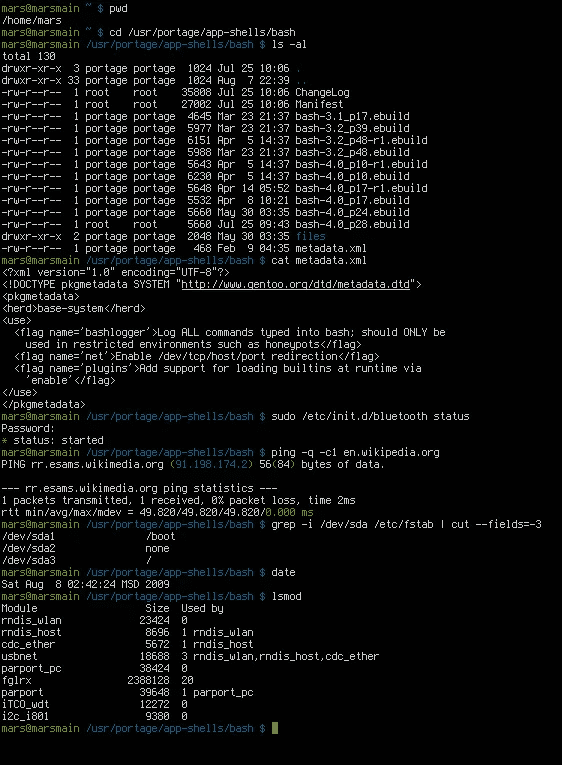

# 面向傻瓜的 Bash 脚本

> 原文：<https://medium.com/geekculture/bash-scripting-for-dummies-5d855cbada66?source=collection_archive---------7----------------------->

在本文中，我将介绍 bash 脚本的基础知识，这样在文章结束时，您将会了解它的含义以及如何根据自己的需要使用它



**理解痛击**

因此，shell 是一个允许我们通过发布命令直接与内核交互的实用程序，它被认为是一个非常强大的工具，这个 shell 有多种“风格”，可以充当 ***环境***

这样来考虑一个环境，MS PowerPoint 是一个制作和显示演示幻灯片的环境，例如，你不能在另一个软件如计算器中查看这些幻灯片

从这个意义上说，shell 是一个直接运行命令的环境，而不是传统的 GUI 方式的点击和拖动，就像我说的，这对于自动化和生产力来说是一个巨大的优势

其他外壳包括:-

*   python:是的编程语言，它也有一个 ***交互式 python shell*** 这意味着它只运行 Python 命令
*   zsh:也是许多 Linux 发行版中的另一个 shell 环境
*   Powershell:基于 Windows 的 shell 环境

**痛击还是不痛击**

因此，一个非常常见的问题可能是“我什么时候使用 bash，为什么”，为了回答这个问题，让我们考虑一下这个真实的场景，你是一个有道德的黑客/ pentester，你的任务是扫描一个正在运行的特定服务的网络(比如 ssh ),并尝试使用默认凭证强行进入，你打算如何手动完成这个任务？？？？？

shell 脚本的强大之处就在这里，由于 linux 中强大的内置命令行工具的存在，这个任务可以通过一个简单的脚本非常容易地完成，可以节省您大量的时间

其他用途包括:-

*   使用`ssmtp`自动发送商务电子邮件
*   从 API 获取数据，通过电子邮件发送或保存到目录中
*   定期备份文件
*   与您安装的其他强大工具集成
*   这个名单还可以继续下去

**先决条件**

基本的 Linux 知识是必需的，因为我不会真的仔细检查每一个命令，所以要提高你的命令行技能，熟悉基本的命令

**够激动了吧？让我们开始抨击**

要开始编写脚本，首先需要定位 bash 的位置，为此只需运行`which bash`,它就会返回路径

在你最喜欢的文本编辑器中，在我的例子中，它只是 nano，因为我们做的不多，键入这个非常简单的 bash 脚本，并将其保存为`hello.sh`

```
#! /usr/bin/bashecho "hello world"
```

现在要运行这个脚本，我们首先需要使它可执行，所以`chmod +x hello.sh`，现在我们只需输入`./hello.sh`，应该会看到一个“hello world”打印到屏幕上

**BASH 中的变量**

要声明一个变量，只需给它命名并赋值，就像这样，为了引用它，我们在变量名前使用美元符号

```
#! /usr/bin/bash
name="mark"
echo $name 
```

**向我们的脚本传递参数**

如果您已经编写了足够长的程序并下载了工具，那么您可能已经熟悉了将参数传递给要使用的脚本，这是大多数命令行工具中的一个基本功能，因此我们来学习如何传递这些参数并将其回显，这只是为了进行演示

```
#! /usr/bin/bash
echo $1
echo $2
echo $3
# this is a comment btw
# another syntax is
for i in "$@"
do
  echo "$i"
done 
# more on this stuff later
```

**BASH 中的用户输入**

获取用户输入并将其直接赋给变量的最佳方式如下

```
#! /usr/bin/bashread -p "enter your age: " age
echo "you entered $age"
```

**逻辑运算符**

Bash 进行逻辑比较的方式有点复杂，所以请坚持使用这些注释

1.  使用双方括号或单方括号[[]]，因为它使您能够使用强大的运算符
2.  使用单双(( ))以便使用通常的=，！=，>，
3.  ALWAYSSSS leave a little space on both ends of square brackets and {}- for example

```
if [[ "$name" == "adam" ]]
then
   echo "hi adam we missed you"
else
   echo "welcome $name"
fi
```

Personally that advice saved me tons of time figuring out why is my script not running

4\. ALWAYSSSS use double quotes when comparing variables

```
[[ -e "$file" ]] # True if file exists
[[ -d "$file" ]] # True if file exists and is a directory
[[ -f "$file" ]] # True if file exists and is a regular file
[[ -z "$str" ]]  # True if string is of length zero
[[ -n "$str" ]]  # True is string is not of length zero

# Compare Strings
[[ "$str1" == "$str2" ]]
[[ "$str1" != "$str2" ]]

# Integer Comparisions
[[ "$int1" -eq "$int2" ]] # $int1 == $int2
[[ "$int1" -ne "$int2" ]] # $int1 != $int2
[[ "$int1" -gt "$int2" ]] # $int1 > $int2
[[ "$int1" -lt "$int2" ]] # $int1 < $int2
[[ "$int1" -ge "$int2" ]] # $int1 >= $int2
[[ "$int1" -le "$int2" ]] # $int1 <= $int2
```

Taken from this [惊人的来源](https://dev.to/godcrampy/the-missing-shell-scripting-crash-course-37mk)所以所有的功劳都归于他♥️

**条件和循环**

*   简单`for loop`

```
for (i=0; i<10; i++)
do
   echo "current number $i"
done
```

*   一个带有巧妙数组语法的`for in`循环👀

```
for i in {1..20}
do
  echo "current iteration $i"
done
```

*   `while`循环

```
i=10while [[ "$i" -ge 1 ]]
do
    echo "current iteration: $i"
done
```

*   `until`循环

```
i=1
until [[ "$i" -eq 10 ]]
do
  echo "unitl $i"
  ((i++))
done 
```

**BASH 中的数组**

编程中最常见的数据结构是数组，因为它们允许我们一次存储多个值，不像变量

让我们看看如何声明一个数组，以及如何迭代它

```
names=(jake mark john bob alice)
```

使用圆括号声明数组，不使用逗号分隔元素，甚至在字符串的情况下不使用双引号/单引号

**为了访问一个数组元素**，我们使用这样的元素索引“${colors[1]}”，因为@符号在 bash 中表示“所有”，所以**我们以这种方式迭代一个数组**

```
for i in "${colors[@]}"
do
    echo "$i"
done
```

**最后功能**

函数是您希望多次执行的代码块，因此您不必一遍又一遍地编写它，而是创建一个函数，并在需要时通过名称调用它

让我们创建一个快速的小函数来欢迎任何输入他们名字的人

**结论**

Bash 脚本是一种在 Linux 上自动化任务的强大方法，可以以无限的方式使用，并提高生产率。如果您打算成为一名有道德的黑客或系统管理员，或者只是想自动化单调乏味的任务，掌握它的基本知识是很重要的，我们希望在以后的博客中探索更多，并利用它构建有趣的工具

非常感谢你阅读♥️