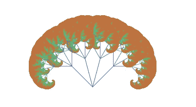

# 分形树的基本方面和生成它们的在线工具

> 原文：<https://medium.com/geekculture/basic-aspects-of-fractal-trees-and-an-online-tool-to-generate-them-1043899d5b07?source=collection_archive---------66----------------------->

在这篇文章中，我们详细地研究了所谓的分形树。此外，它还引入了一个小的在线应用程序，可以让你制作自己的分形树，并使用各种参数进行游戏。该应用程序本身也有一些兴趣，并展示了如何使用浏览器来创建计算应用程序。

## 什么是分形树？