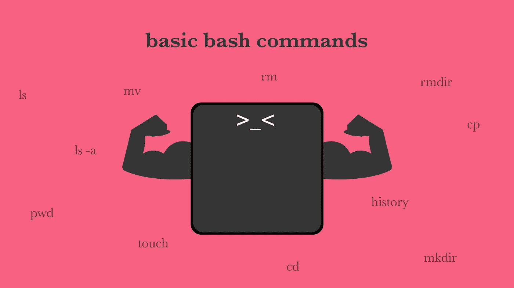

# 基本 Bash 命令

> 原文：<https://medium.com/geekculture/basic-bash-commands-c54933183c89?source=collection_archive---------8----------------------->

学会用终端而不是 GUI 导航

## 为什么使用终端？

使用图形用户界面，是图形用户界面的缩写，是大多数人使用计算机的方式。对于简单的任务，比如打开浏览器，它使用起来简单直观，但是对于更复杂的任务，它可能会令人沮丧。

终端是一种强大而快速的电脑导航方式。您甚至可能会更喜欢使用它而不是 GUI。

## 打开终端

当您打开终端时，它会告诉您当前使用电脑的用户、您给电脑指定的名称以及您现在所在的目录，这是个人目录，由波浪符号(~)表示。

> user@computer-name ~ %

## ls(列表)

首先，您可以通过键入“ls”列出当前目录中的文件和文件夹。如果您想显示所有文件，包括隐藏的文件，您可以键入“ls -a”。这让你知道你目前在电脑上的位置，以及下一步该做什么。

## 光盘(更改目录)

如果您想要导航到不同的目录，您可以使用“cd”命令，后跟您想要前往的目录。所以，如果你想把你当前的目录改成“Documents”文件夹，你必须键入“cd Documents”。要返回上一个目录，您可以键入“cd”后跟两个点(“cd ..”).圆点代表父目录。您也可以通过键入“返回两个目录../.."。只需输入“cd ”,你就会进入主目录。

## 打印工作目录

要查看当前目录所在的路径，请键入“pwd ”,它代表打印工作目录。

## 触摸(创建文件)

创建新文件是使用“触摸”命令，然后是你想给你的文件的名称，以及扩展名。比如:“newfile.txt”，来新建一个名为“newfile”的文本文件。如果您现在键入“ls”，该文件将显示在您的列表中。

## 创建目录

要创建一个新目录，请使用“mkdir”命令，后跟您想要给目录起的名字。按 enter 键后，您现在在当前目录中有了一个新文件夹。

## mv(移动)

使用“mv”命令，您可以将文件从一个地方移动到另一个地方。键入“mv ”,后跟文件名和要将其移动到的目录的路径。

> mv filename.txt 文档

…会将 filename.txt 文件移动到 Documents 文件夹中。

## cp(副本)

要复制文件或目录，请键入“cp ”,后跟文件的路径和要将文件复制到的目录的路径。

> cp 文档/filename.txt 下载

…会将 filename.txt 文件从 Documents 文件夹复制到 Downloads 文件夹。

## 空间

要删除文件，您可以使用 rm 命令后跟文件名。

## rmdir(删除目录)

要删除目录，请键入“rmdir”命令，后跟目录的名称。

## 历史记录(显示以前的命令)

如果你想看看你以前用过什么命令，你可以简单地输入“历史”，它会给你一个你以前用过的命令的列表。

现在轮到您尝试所有这些命令了。浏览你的电脑，创建文件，删除它们，等等，真正掌握它的窍门。

如果你喜欢看而不是读，这个视频也有视频版本: