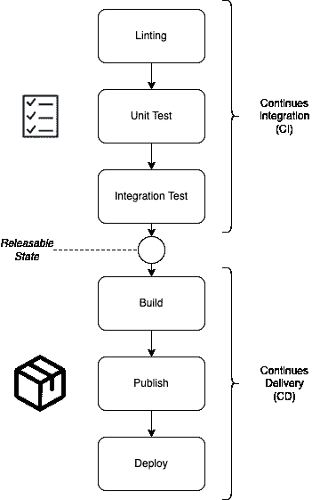

# 你应该知道的基本 CI/CD 术语！

> 原文：<https://medium.com/geekculture/basic-ci-cd-terminologies-you-should-know-f44e7c067e51?source=collection_archive---------10----------------------->

关于 CI/CD 的新手入门

Photo by [Andrik Langfield](https://unsplash.com/@andriklangfield?utm_source=medium&utm_medium=referral) on [Unsplash](https://unsplash.com?utm_source=medium&utm_medium=referral)

你认识你自己吗？你刚刚获得计算机科学(或其他)的大学学位，开始在一家科技公司工作。很快你就会意识到，尽管有理论知识和很少的小组项目，你甚至不知道专业软件开发的基本工具和工作流程。有点像放学后的情况，自己还不知道怎么报税。

我不得不在我的第一份工作中作为一个初学者来创造这种体验。当我开始的时候，我从来没有听说过任何关于 CI/CD 的东西，或者直到现在我才真正完全理解它。当然，在你的研究中，你已经了解了一些关于软件测试和质量的知识，你也听说了这个软件是如何发布的，但是这对于现实世界来说还不够。现在到了第一份工作，我遇到了术语 *webhooks、runners、pipeline、stages、build processes、release* 等等。，并不知道如何处理它们。所有这些术语都可以在 GitHub 或 Gitlab 等知名代码托管平台上找到。对于你的职业生涯来说，我认为了解这些术语和概念之间的关系是很重要的。这些术语中的一些甚至在意思上完全相同，然而你认为它们是不同的。在下面，我想帮助你更好地理解这些术语。

**这篇文章仅仅是关于 CI/CD 的概念和相关术语，后续的文章将会介绍 CI/CD 的自动化。**

先从 CI/CD 的概念说起。这是什么鬼东西？

CI/CD 代表 ***继续集成******继续交付*** 。这实际上是两个紧密耦合的工作流，用于发布或部署软件。除了继续交付，甚至还有另一个“CD”代表 ***继续部署*** (但首先我们坚持交付)。在 CI/CD 中，我们希望实现两个目标:

1.  一个人可以在任何时候无错误地交付对软件的变更
2.  变化的交付是*完全* *自动化*。(下一篇文章)

在这里，您可以直接分配 CI 和 CD 两个工作流。CI 负责测试源代码，CD 负责测试后源代码的相应交付。现在我们来看看下图中一个 CI/CD **管道**的 CI 和 CD 中的 ***任务*** 。在一些平台中，任务也被称为*阶段*(就像在 Gitlab 中一样)。*免责声明:有些人可能会说“构建”是 CI 的一部分，但这是可以讨论的。我会坚持这个数字。*

CI/CD Pipeline (by author)

## 持续集成中的任务

CI 是关于必须集成到现有源代码中的源代码。源代码(变更)通过了它的步伐。你可以把这些任务想象成在机场的安全检查，你必须成功通过才能到达你的航班。因此 CI 验证您的代码变更的质量，确保交付它们是安全的。

*   *林挺*:我们在这里谈论的是源代码的静态分析。这意味着您没有执行源代码。它负责识别常见的编程和风格错误。
*   *单元测试和集成测试*:在这里，所有旧的测试和新的测试都被运行一遍，看看是否一切正常。(我假设你知道这些测试是什么……)

如果源代码仍然工作，并且没有报告测试错误，那么恭喜您，您的更改已经被集成了。在这些任务之后，源代码处于*可发布状态*。

## 继续交付中的任务(CD)

这里是关于发布源代码的新变化。现在不再是检查代码，而是将源代码转换成一种形式，以便可以发布。CD 与以下术语相关:

*   *构建*:所有源代码和其他工件(例如，图像、文本等。)被收集起来，放入特定的表格中。形式取决于进一步的使用。大多数情况下，这通常意味着将编程语言编写的代码编译成机器语言。
*   *发布*:您通过将更改后的应用程序(源代码)复制到软件存储库中来发布它。这是一个存储库，包含了所有已经测试并发布的版本。一个例子是将改变的应用的图像(例如，Docker 图像)上传到图像注册表(例如，Docker 注册表— [Docker Hub](https://hub.docker.com/) )。).
*   *发布*:这是您将您的更改提供给用户的部分。更改后的应用程序在此首次获得流量(例如，通过用新映像替换先前运行的映像)

我知道“*Publish”*和“*Release”*这两个词在语义上非常接近。我必须选择术语，以便您可以更好地理解注册中心的概念。

# 结论

今天就到这里吧。到目前为止，已经介绍了最基本的术语，这一定会帮助一些人更好地理解 CI/CD 的概念。有了这条管道，我们实现了开头介绍的两个目标中的第一个。下一次，让我们看看这个管道是如何自动化的。然后是网钩、滑道等术语。将被覆盖。