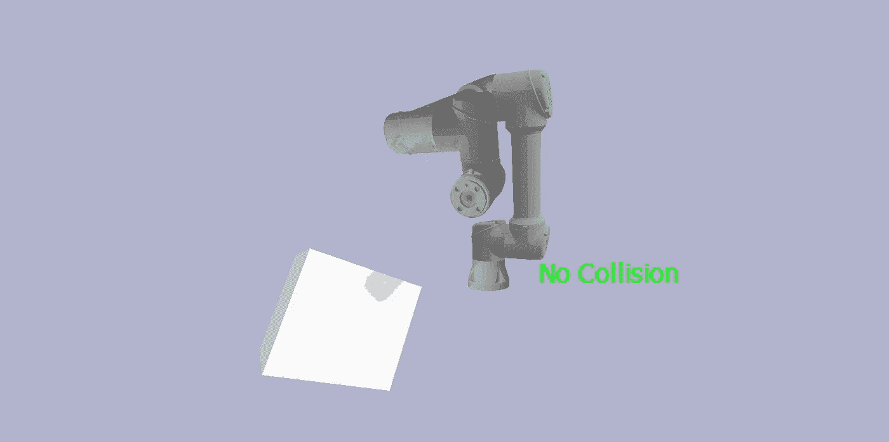
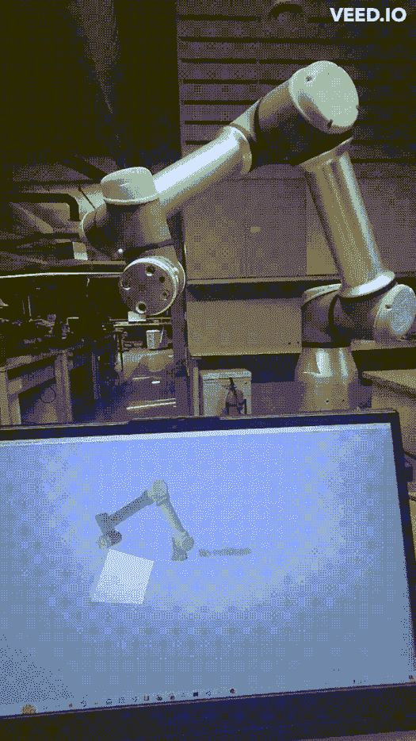

# 使用 PyBullet 进行碰撞计算的基本碰撞检测和建模

> 原文：<https://medium.com/geekculture/basic-collision-detection-and-modeling-with-impact-calculation-using-pybullet-ad164508e2d?source=collection_archive---------10----------------------->

当涉及到机器人运动规划时，碰撞检测和避免是一项复杂的任务，并且由于机器人手臂给系统带来的 kino-dynamic 约束，它变得更加复杂。我想讨论和阐述一种在子弹物理引擎中使用 UR5e 机器人的碰撞检测和撞击计算方法。

在这里，我阐述并实现了我对以下场景的影响计算的想法。我们有一个 Ur5e 机械臂，它有 6 个旋转关节，贡献了 6 个自由度。假设机器人的工作空间有一个静态障碍物，在规划和沿给定路径移动时，不断检查机器人与自身和障碍物的碰撞变得至关重要。我将它实现为一个实时碰撞检测模块，其中机器人的关节角度被连续读取并反馈给机器人模型，以便进行连续的碰撞查询来实时检查碰撞。

# 1)模拟环境:-

能够建模并跟踪机械臂及其环境以执行碰撞检测是非常非常重要的。环境的细节和设计直接关系到它的准确性和效率。建模越好，碰撞检测就越好。

## a)对机器人和碰撞进行建模

子弹引擎提供了强大的功能来设计和加载机器人和环境模型。它方便开发者将机器人的 URDF 文件直接加载到环境中。URDF 是一种文件格式，几乎所有现代机器人都以这种格式建模，用于许多模拟和可视化目的。后端的 URDF 文件可以利用其他基于光固化快速成型的文件格式，如。stl，。dae 等，以获得所表示的机器人的精确几何表示。

在子弹引擎中引入和加载 URDF 文件是非常非常容易的。

```
#Code example to load a URDF file 
Robot = p.loadURDF("<Path-to-URDF file>", [0, 0, 0], useFixedBase=True,flags=p.URDF_USE_SELF_COLLISION)
```

在这里，[0，0，0]表示模型必须加载的位置，useFixedBase 参数指定机器人模型是否必须固定到加载的点，将其设置为 false 将让模型对它处理的物理交互(包括重力和与其他碰撞对象的交互)做出反应和响应。为了检查机械臂与自身的碰撞，这里我启用了机器人自碰撞标志 by flags = p . URDF _ 使用 _ 自碰撞。

```
p.loadURDF("Support/Collsions_Objects/Collision1.urdf",pos,orient)
p.createConstraint(CollisionLoadList[count], -1, -1, -1, p.JOINT_FIXED, [0, 0, 0],parentFramePosition=[0,0,0],childFramePosition=pos,childFrameOrientation=orient)
```

同样，甚至其他碰撞对象也可以建模。但是在处理碰撞模型时要考虑的另一件事是它们在环境中必须固定的约束。PyBullet 中的约束在它们的官方文档中有详细说明[这里](https://docs.google.com/document/d/10sXEhzFRSnvFcl3XxNGhnD4N2SedqwdAvK3dsihxVUA/edit#heading=h.fq749wu22x4c)。如下图所示，我已经使用了固定约束来使碰撞物体粘在空间中的特定点上。



The Modeled environment in PyBullet (Photo by author)

## b)对机器人运动建模

如前所述，我已经在实时设置中实现了这个模块，以便为碰撞检测进行重复的接触和影响查询。因此，在物理引擎的环境中无缝复制机器人的运动变得至关重要，这样就不会有太多的运动差异和延迟空间。不管系统是实时的还是先发制人的验证等等。可以使用 setJointMotorControlArray API 在 PyBullet 中模拟机器人 URDF 的运动，如下所示

```
p.setJointMotorControlArray(bodyIndex=Robot,
                                            controlMode=p.POSITION_CONTROL,
                                            targetPositions=Pose,
                                            jointIndices= list(range(1,7,1)),positionGains=[.1,.1,.1,.1,.1,.1])
```

正确指定关节指数将确保完全避免真实机器人和模拟机器人之间的运动差异。为此，人们必须对真实世界中机器人的链接和关节与 URDF 之间的对应关系有一个完整的概念。也许这里的[提到的 getNumJoints 和 getJointInfo APIs】可能会有很大用处。](https://docs.google.com/document/d/10sXEhzFRSnvFcl3XxNGhnD4N2SedqwdAvK3dsihxVUA/edit#heading=h.la294ocbo43o)



Demonstration of impact and contact calculation.

# 2)碰撞检测

在这个场景中，我们有两种类型的冲突

1.  机器人自碰撞:-当两个连杆与自身接触时，机械臂会与自身发生碰撞。
2.  机器人-物体碰撞:-顾名思义，这是机器人和模拟障碍物接触的时候。

如前所述，在加载机器人 URDF 时，设置 URDF _ 使用 _ 自我 _ 碰撞并适当应用碰撞过滤器遮罩很重要，这样彼此连接的后续链接就不会被检测为碰撞。下面是一个应用碰撞过滤器遮罩的示例，我们只考虑可能发生碰撞的链接之间的碰撞，并禁用所有其他不会发生碰撞的链接。通过这样做，我们消除了两个后续链路被检测为自冲突的机会。

```
def Init_SelfCollision():
    collisionFilterGroup =0
    collisionFilterMask = 0
    p.setCollisionFilterGroupMask(Robot, 9, collisionFilterGroup, collisionFilterMask)
    p.setCollisionFilterGroupMask(Robot, 8, collisionFilterGroup, collisionFilterMask)
    p.setCollisionFilterGroupMask(Robot, 7, collisionFilterGroup, collisionFilterMask)
    p.setCollisionFilterGroupMask(Robot, 6, collisionFilterGroup, collisionFilterMask)
    #p.setCollisionFilterGroupMask(robotID, 5, collisionFilterGroup, collisionFilterMask)
    #p.setCollisionFilterGroupMask(robotID, 4, collisionFilterGroup, collisionFilterMask)
    #p.setCollisionFilterGroupMask(robotID, 3, collisionFilterGroup, collisionFilterMask)
    #p.setCollisionFilterGroupMask(robotID, 2, collisionFilterGroup, collisionFilterMask)
    #p.setCollisionFilterGroupMask(robotID, 1, collisionFilterGroup, collisionFilterMask)
    #p.setCollisionFilterGroupMask(robotID, 0, collisionFilterGroup, collisionFilterMask)
```

一旦细节完善，我们就可以继续在 PyBullet 中进行碰撞检测查询。下面给出了一个示例代码，

```
cont_pts1 =p.getContactPoints(Robot,Robot)

 if(len(cont_pts1) > 0):
      self_col_flag = 1
      print("Self-Collision")
 else:
  #   print("no Self-collision")
    self_col_flag = 0
```

我们使用 getContactPoints() API 来获取正好在碰撞位置发生碰撞的所有点的列表。在这里，因为我们正在检查自碰撞，所以两个碰撞的物体都是机器人。并且这些查询与先前设置的碰撞过滤器掩码一致。

```
 for count in range(0,len(CollisionLoadList),1):
       cont_pts =p.getContactPoints(Robot,CollisionLoadList[count])

       if(len(cont_pts) > 0):
        #    print("Collision")
           col_flag = 1
           curr_pos = p.getBasePositionAndOrientation(CollisionLoadList[count])
           act_pos = CollisionList_init[count]
           print(math.dist(curr_pos[0],act_pos[0:3]))
           if(math.dist(curr_pos[0],act_pos[0:3]) > 0.02):
               print("High Impact")
               impact_flag = 1
       else:
           print("no collision")
           col_flag = 0
```

相同的 API 以不同的方式实现，适用于多个不同的碰撞对象。所有的碰撞对象都被定义、加载并存储在一个列表中，以后在进行碰撞查询时可以检索和使用它。因此，通过使用这些 API，我们可以判断是否发生了碰撞。

# 3)影响计算:-

我刚才用了一个很基本的概念，计算两个物体之间的位移，来计算碰撞造成的冲击。由于碰撞对象粘在空间中定义的点上，与其他模型的碰撞将导致它们从原始位置移动到另一个位置。这里测量这两个位置之间的欧几里德距离，如果它超过某个阈值(比如 5 厘米)，我们将其归类为具有高冲击力的碰撞。否则我们就说这是碰撞。甚至有可能将时间因素考虑在内，并将其等同于引起的位移，以获得施加在物体上的力，并基于此做出撞击决定。但是到目前为止，我已经实现了以下代码

```
curr_pos = p.getBasePositionAndOrientation(CollisionLoadList[count])
act_pos = CollisionList_init[count]
print(math.dist(curr_pos[0],act_pos[0:3]))
if(math.dist(curr_pos[0],act_pos[0:3]) > 0.02):
   print("High Impact")
   impact_flag = 1
```

将所有这些事情放在一起，我们可以提出一个实时模块来进行碰撞查询，并检查建模环境中不同对象之间的交互和碰撞。这是完整的代码，

```
import pybullet as p

from Utils.Ur5e_Robot_State import *

import pybullet_data
import numpy as np
import math
import pybullet_utils.bullet_client as bc

p.connect(p.GUI)
p.setAdditionalSearchPath(pybullet_data.getDataPath())
# p.loadURDF("plane.urdf", [0, 0, 0], useFixedBase=True)
Robot = p.loadURDF("Support/Ur5e_Urdf/urdf/UR_SSR.urdf", [0, 0, 0.5], useFixedBase=True,flags=p.URDF_USE_SELF_COLLISION)
p.resetBasePositionAndOrientation(Robot, [0, 0, 0], [0, 0, 0, 1])

CollisionList_init = [[0.370,0.05,0,1.5,3.5,1,0]] #,[0.600,0,0,1.5,3.5,1,0],[0.700,0,0,1.5,3.5,1,0]]

ConstraintLoadList = []
CollisionLoadList = []

# for i in range(p.getNumJoints(Robot)):
#     jointInfo = p.getJointInfo(Robot, i)
#     # print(jointInfo,list(range(1,7,1)))

def Init_SelfCollision():
    collisionFilterGroup =0
    collisionFilterMask = 0
    p.setCollisionFilterGroupMask(Robot, 9, collisionFilterGroup, collisionFilterMask)
    p.setCollisionFilterGroupMask(Robot, 8, collisionFilterGroup, collisionFilterMask)
    p.setCollisionFilterGroupMask(Robot, 7, collisionFilterGroup, collisionFilterMask)
    p.setCollisionFilterGroupMask(Robot, 6, collisionFilterGroup, collisionFilterMask)
    #p.setCollisionFilterGroupMask(robotID, 5, collisionFilterGroup, collisionFilterMask)
    #p.setCollisionFilterGroupMask(robotID, 4, collisionFilterGroup, collisionFilterMask)
    #p.setCollisionFilterGroupMask(robotID, 3, collisionFilterGroup, collisionFilterMask)
    #p.setCollisionFilterGroupMask(robotID, 2, collisionFilterGroup, collisionFilterMask)
    #p.setCollisionFilterGroupMask(robotID, 1, collisionFilterGroup, collisionFilterMask)
    #p.setCollisionFilterGroupMask(robotID, 0, collisionFilterGroup, collisionFilterMask)

def init_collision(CollisionList):
    for count in range(0,len(CollisionList),1):
        temp_CollisionList = CollisionList[count]
        pos = temp_CollisionList[0:3]
        orient = temp_CollisionList[3:7]

        CollisionLoadList.append(p.loadURDF("Support/Collsions_Objects/Collision1.urdf",pos,orient))
        ConstraintLoadList.append(p.createConstraint(CollisionLoadList[count], -1, -1, -1, p.JOINT_FIXED, [0, 0, 0],parentFramePosition=[0,0,0],childFramePosition=pos,childFrameOrientation=orient))

init_collision(CollisionList_init)
Init_SelfCollision()

while 1:
    Pose = get_joint_vals()
    p.stepSimulation()

    # Pose = [0,np.deg2rad(-90),np.deg2rad(190),0,0,0]
    impact_flag = 0
    p.setJointMotorControlArray(bodyIndex=Robot,
                                            controlMode=p.POSITION_CONTROL,
                                            targetPositions=Pose,
                                            jointIndices= list(range(1,7,1)),positionGains=[.1,.1,.1,.1,.1,.1])

    for count in range(0,len(CollisionLoadList),1):
       cont_pts =p.getContactPoints(Robot,CollisionLoadList[count])

       if(len(cont_pts) > 0):
        #    print("Collision")
           col_flag = 1
           curr_pos = p.getBasePositionAndOrientation(CollisionLoadList[count])
           act_pos = CollisionList_init[count]
           print(math.dist(curr_pos[0],act_pos[0:3]))
           if(math.dist(curr_pos[0],act_pos[0:3]) > 0.02):
               print("High Impact")
               impact_flag = 1
       else:
           print("no collision")
           col_flag = 0

       cont_pts1 =p.getContactPoints(Robot,Robot)

       if(len(cont_pts1) > 0):
            self_col_flag = 1
            print("Self-Collision")
       else:
          print("no Self-collision")
          self_col_flag = 0

    if(col_flag == 1 or self_col_flag == 1):
        if(impact_flag == 1):
            p.addUserDebugText("        Collision with high impact",[0.0,0.05,0],[1,0,0],3,0.1)
        else:
            p.addUserDebugText("        Collision",[0.0,0.05,0],[1,0,0],3,0.1)

    elif(col_flag == 0 and self_col_flag == 0):
        p.addUserDebugText("       No Collision",[0.0,0.05,0],[0,1,0],3,0.1)
```

如果你正在寻找一个完整的实现，请随时检查，并在 GitHub 上留下我的回购问题。希望这篇文章对你有用。

参考资料:-

1.  [https://docs . Google . com/document/d/10sxehzfrsnvfcl 3 xxngnd 4 N2 sed qwdavk 3 dsihxvua/edit # heading = h . la 294 ocbo 43 o](https://docs.google.com/document/d/10sXEhzFRSnvFcl3XxNGhnD4N2SedqwdAvK3dsihxVUA/edit#heading=h.la294ocbo43o)

2.【https://github.com/bulletphysics/bullet3 

3.[https://github . com/aswathgovind/py bullet _ Contact _ Impact _ calculator . git](https://github.com/aswathgovind/PyBullet_Contact_Impact_Calculator.git)