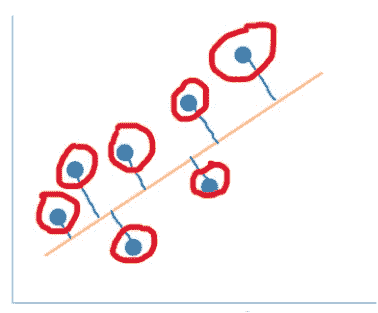
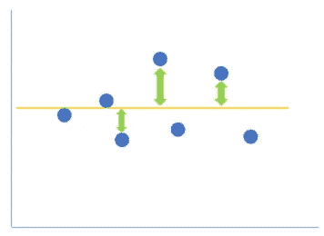
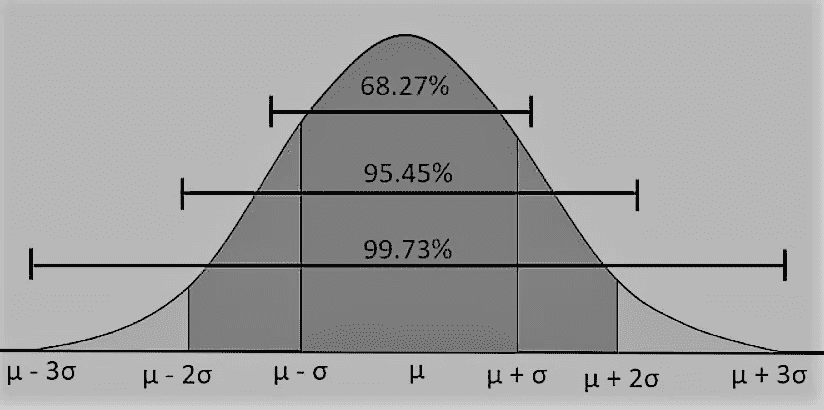
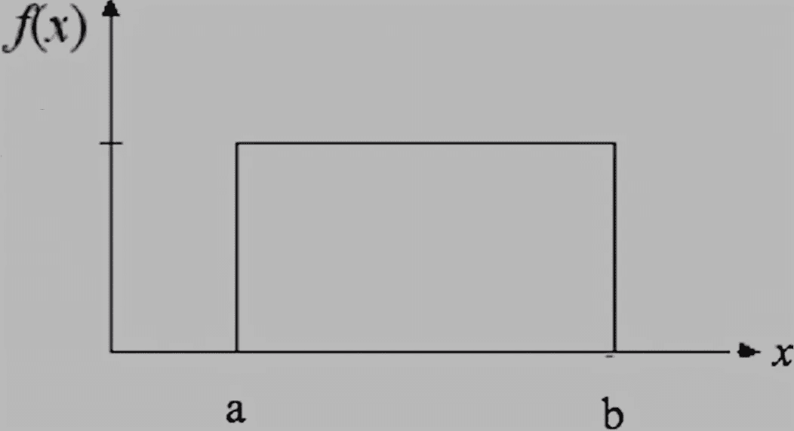
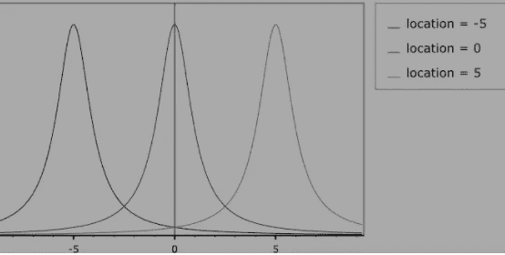
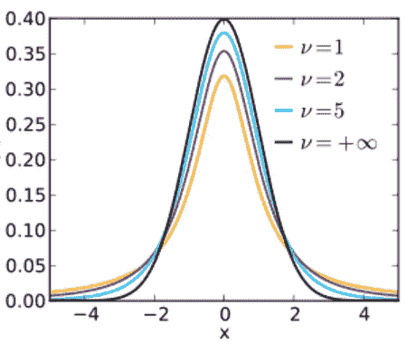
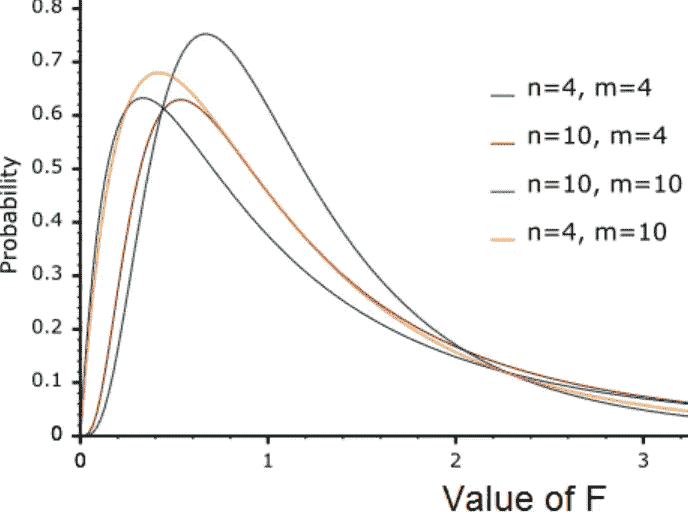
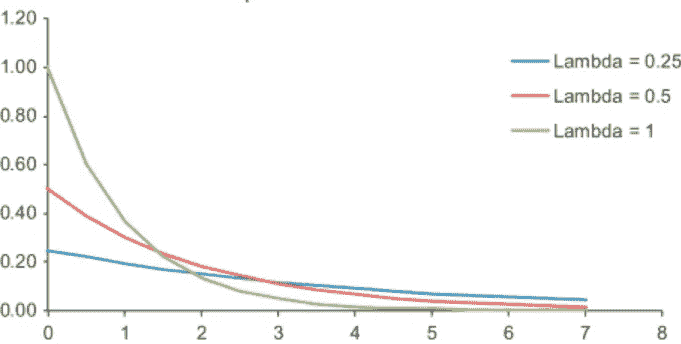
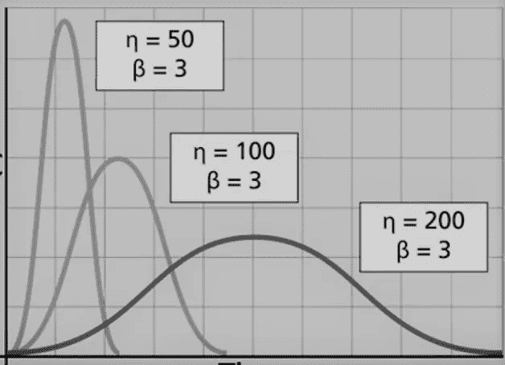

# 数据科学工作所需的基本概念—第 2 部分

> 原文：<https://medium.com/geekculture/basic-concepts-needed-for-data-science-work-part-2-6a9ebcdf27a4?source=collection_archive---------53----------------------->

Photo by [Franki Chamaki](https://unsplash.com/@franki?utm_source=medium&utm_medium=referral) on [Unsplash](https://unsplash.com?utm_source=medium&utm_medium=referral)

这是我上一篇文章的延续。在今天的文章中，我将解释一些您在日常数据科学工作中需要的基本概念。如果您尚未阅读我的上一篇文章([数据科学工作所需的基本概念—第 1 部分](/geekculture/basic-concepts-needed-for-data-science-work-part-1-fc4f1a71b4a5?source=friends_link&sk=c82b0f86e33228f69b5ffd48c299eb45))，请在继续阅读本文之前花点时间阅读一下。

在本文中，我将解释以下概念:

*   **R 广场 vs 调整后的 R 广场:**
*   **常见的数据分布，它们的形状和参数**

**R 平方与调整后的 R 平方:**

R 平方和调整的 R 平方是评估回归模型准确性的技术。让我们首先从理解 R 平方开始，然后我们将理解在 R 平方之上调整 R 平方的需要。

**R Square = 1 —(残差平方和)/(总残差平方和)**

**残差平方和=** 无法解释的变化

**平方和 w.r.t total =** 解释的变化

让我们明白什么是剩余。残差(也称为误差)基本上是我的预测值和实际值之间的差异。在下图中，如果您将红色圈起来的点视为实际值，将橙色线上的点视为预测值，那么绿线代表残差。这些差的平方和构成了上面 R 平方公式的分子。

Explaining **Sum of Squares w.r.t residuals**

另一方面，如果我们考虑实际值与平均值之间的差值，那么这些差值的平方和就是上式的分母。参考下图，绿线代表了这些差异

R 平方的值(也称为**决定系数**)在 0 到 1 之间。R 平方的值越接近 1，则认为模型的精度越高。值为 0 表示模型没有预测能力。

然而，R 平方的问题是，如果模型中包含新的独立变量，R 平方的值永远不会减少。它要么保持不变，要么增加，这取决于因变量和自变量之间的相关程度。因此，如果变量不相关，R 平方不会惩罚变量。为了应对这一挑战，使用了调整后的 R 平方。

经过数学调整的 R 平方表示为

**1—[(1-R 平方)*(N-1))/(N-k-1)]**

**N** =总样本量

**k** =自变量数量

在这种情况下，如果添加一个与因变量无关的新自变量，那么 R 平方不会增加太多。由于分母 **( N-k-1)** 变为较小值，而分子变化不大，因此分子&分母的比值变为较高值，因此调整后的 R 平方值减小。

另一方面，如果增加一个与因变量相关性更高的新自变量，那么 R 平方显著增加。由于分子变成较小的值，因此分子和分母的比值变成较小的值，因此调整后的 R 平方值增加。

**常见的数据分布，它们的形状和参数**

当我们思考或谈论数据分布时，我们会想到不同类型的数据分布。它们的参数是什么？它们看起来如何等等。等等。

在高层次上，下面是不同类型的分布。在本文中，我们将介绍下面用斜体标记的前 7 个发行版:

**连续数据:**

*正态分布*

*均匀分布*

*柯西分布*

*t 分布*

*F 分布*

*指数分布*

*威布尔分布*

对数常态分布

伯布姆·桑德斯分布

γ分布

双指数分布

幂正态分布

幂对数正态分布

图基λ分布

极值 I 型分布

贝塔分布

**离散分布**

二项分布

泊松分布

**分类数据**

分布

**正态分布**

正态分布参数为**均值**和**标准差**。在下图中 **Mu** 代表平均值，**适马**代表变化/扩散

Normal Distribution

**均匀分布**

均匀分布的参数是最小**值**和最大**值**。如果 **a** 是最小值而 **b** 是最大值，那么 **0 < =a < b** 和 **a < b <无穷大**

Uniform Distribution

**柯西分布**:

柯西分布的参数是**比例**和**位置**。**位置** = 0、**比例** = 1 的场景称为标准柯西分布

Cauchy Distribution

**t 分布**

这种分布类似于正态分布，但用于总体方差未知和/或样本量较少的情况。t 分布主要由其自由度决定。 *自由度=一个数据集中的观察次数— 1。*自由度越低，尾部越重。当自由度非常高时，它几乎类似于均值= 0、标准差= 1 的标准正态分布

t Distribution

**F 分布**

f 分布用于检验两个正态总体之间方差相等的情况。f 分布的参数是 v1 和 v2，它们是在 f 统计计算中用作分子和分母的自由度

f Distribution

**指数分布**

指数分布的参数是用 ***λ*** *，*表示的**速率参数**，其中λ > 0。有时用比例参数来参数化，比例参数用 ***β*** *，*表示，其中 *β=1/λ。*指数分布的一般应用是在产品可靠性的计算中。

Exponential Distribution

**威布尔分布**

通常威布尔有 3 个参数:形状(β)、尺度(η)和位置(γ)，但是没有使用位置。[ β > 0, η >0 ].威布尔主要用于分析产品寿命数据和确定可靠性。

Weibull Distribution

希望这篇文章能帮助你加强对上述主题的概念性理解。请关注本文的第 3 部分，我将为您带来关于一组新主题的类似的清晰的概念，并继续讨论其余的数据分布类型

访问我的**facebook.com/FBTrainBrain/页面** @ [脸书](https://www.facebook.com/FBTrainBrain/)