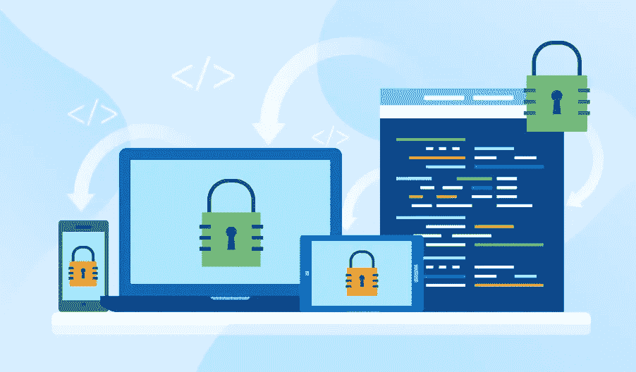
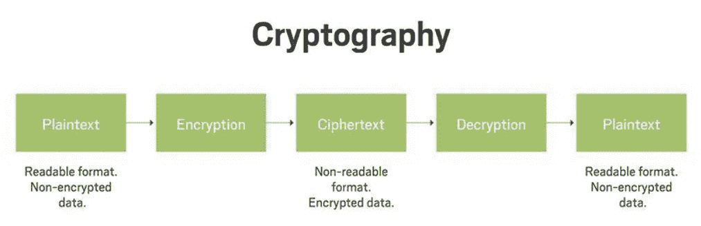
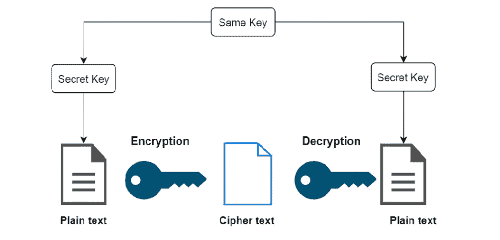
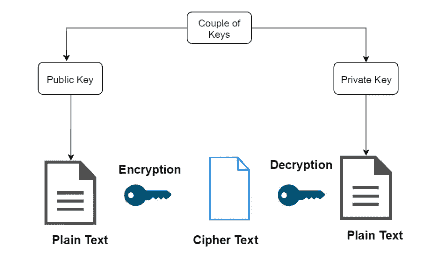
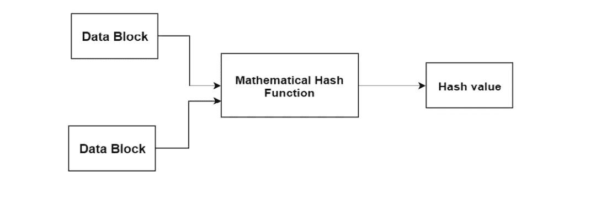

# 基本密码学概念和软件中的安全弱点

> 原文：<https://medium.com/geekculture/basic-cryptography-concepts-and-security-weakness-in-software-af99a34c440a?source=collection_archive---------17----------------------->

如果你是一名软件工程师，你必须具备软件安全方面的知识。但是问题是，在软件开发生命周期的竞争和快节奏的环境中，您可能会在巨大的压力下交付业务需求，而不太注意软件的安全漏洞。但是如果你在软件安全方面有适当的知识，你显然知道如何开发没有任何安全弱点的软件，如果有任何安全弱点，你将知道如何处理它们。

因此，在本文的第一部分，我将解释一些作为软件工程师应该了解的常见软件安全弱点。

## 疯狂的

我知道将要阅读这篇文章的每个人都已经熟悉了 bug，并且您可能已经猜到它将作为一个安全弱点包含在本文中。bug 是软件安全缺陷的一个非常常见的来源。不幸的是，大多数软件都含有某种形式的缺陷。这些可能是一些小错误，为错误的字段显示了错误的标签，或者这些可能是非常严重的错误，影响用户的登录能力，甚至导致整个系统故障。

此外，您的软件可能有一些代表安全漏洞的错误，这些漏洞可能会导致信息泄漏或未经授权的访问。因此，黑客可以很容易地利用这些类型的错误来损害您的软件。

## 身份验证被破坏

认证基本上是一个识别某人身份的过程。用户和会话身份验证配置不正确的软件会造成很大的漏洞。例如，当与认证过程相关的功能不能正确地进行验证时，就会出现安全问题。因此，黑客可以利用被破坏的身份验证来获取用户的密码或会话令牌，甚至接管用户的帐户来冒充他们的身份。

## 敏感数据暴露

包括 web 和移动应用程序在内的一些软件没有为敏感数据(如财务信息、健康信息以及密码和用户名等其他关键数据)提供必要的保护。因此，黑客可以获得这些信息。现在，他们可以利用这些信息进行诈骗、窃取他人的身份以及实施其他犯罪。这些敏感数据需要额外的保护，如加密，以防止黑客和未经授权的访问。

## 注射

当不可信的数据作为命令发送给解释器时，会出现几个注入漏洞，如 SQL、OS 和 LDAP。这些不可信的数据欺骗解释器在没有正确授权的情况下访问数据或执行非预期的命令。其中，SQL 注入是攻击者使用最多的网络黑客技术之一。SQL 注入使恶意 SQL 语句得以执行，目的是利用数据库中的信息。因此，黑客可以访问存储在数据库中的敏感数据。

## 中断的访问控制

您能想象如果所有经过身份验证的用户都能访问系统中的所有信息会发生什么吗？他们可以更新数据、删除数据、访问其他用户的帐户以及查看敏感数据。此外，用户在访问授权的敏感数据时，可以根据自己的需要进行修改。

当一个软件缺乏适当的配置或者缺少对用户可以访问什么和不可以访问什么的限制时，就会发生这些事情。最重要的是，黑客总是瞄准这些漏洞来访问系统中的信息，同时修改访问权限和用户数据。

# 密码系统

如今，数百万人与应用程序和计算系统密切相关，以完成他们的日常任务。因此，如果我们开发软件，我们应该负责保护使用该软件的用户的所有信息和数据。这就是密码学拯救世界的地方。密码术是一种通过少量代码传输安全数据和通信的方法，因此只有指定的人知道所传输的实际信息。这种形式的过程阻止了对数据的未经授权的访问。

密码术中的信息编码遵循称为算法的数学理论和计算。传输编码数据是因为它使得很难找到原始数据。这些规则集被用在数字签名、验证以保护数据以及保护所有金融交易的过程中。密码学有 4 个核心目标:

*   **隐私** —传输的数据不应被除预定个人之外的外部方知晓。
*   **可靠性** —数据在存储或发送方与目的接收方之间传输时不能被修改。
*   **不可否认性**——一旦数据被传输，发送者就没有机会否认。
*   **认证** —发送者和接收者都需要验证他们所声称的身份。

在密码学中，信息的加密可以分为三种类型。

**1)对称密钥加密**

这也被称为**私有或秘密密钥密码术**。这里，信息接收者和发送者都使用一个密钥来加密和解密消息。这种方法中常用的加密技术是 **AES(高级加密系统)**。通过这种类型实现的方法要快得多。对称密钥加密的几种类型是:

*   街区
*   分组密码
*   数据加密系统
*   RC2
*   想法
*   河豚
*   流密码

**2)非对称密钥加密**

这也被称为**公钥加密**。它遵循一种多样化的和受保护的信息传输方法。通过使用几个密钥，发送方和接收方都可以进行加密和解密过程。每个人都有一个私钥，公钥在网络上共享，这样就可以通过公钥传输消息。这种方法中常用的加密技术是 **RSA** 。

> 公钥方法比私钥方法更安全。

非对称密钥加密的几种类型有:

*   南非共和国(Republic of South Africa)
*   目录系统代理(Directory System Agent)
*   PKCs
*   椭圆曲线技术

**3)哈希函数**

将消息的随机长度作为输入，并传递固定长度的输出，这是哈希函数所遵循的算法。它也称为数学方程，以数值作为输入并产生散列消息。该方法不需要任何类型的密钥，因为它在单向场景中起作用。

哈希操作有多轮，每轮都将输入视为最近块的数组，并生成最后一轮活动作为输出。散列的一些功能是:

*   消息摘要 5 (MD5)
*   RIPEMD
*   漩涡
*   安全散列算法

# 加密工具

加密工具在签名确认、代码签名和执行其他加密活动的情况下非常有用。因此，在这一章中，我将解释最常用的加密工具。

## 安全令牌

该令牌用于验证用户。安全令牌应该被加密以执行受保护的信息交换。此外，它为 HTTP 协议提供了完整的状态完整性。因此，浏览器利用服务器端的公式化令牌来继续状态。基本上，它是与远程身份验证一起移动的方法。

## 联合鉴定委员会(Joint Commission on Accreditation)

这是用于授权加密过程的工具。这个工具也被称为 **Java 加密库**。这些 Java 库包含在预定义的活动中，这些活动需要在实现之前导入。

## 码头工人

docker 中维护的信息完全是加密格式的。在这种情况下，必须严格遵循加密技术来进行数据加密。此外，文件和信息都是加密的，因此不允许任何人访问没有准确访问密钥的内容。Docker 也被称为云存储，允许用户在专用或共享服务器上管理信息。

## SignTool.exe

这个工具主要被微软用来签署文件。向任何类型的文件添加签名和时间戳是该工具支持的最重要的功能。有了文件中的时间戳，它就有能力对文件进行身份验证。SignTool.exe 的全部功能确保了文件可靠性的增强。

## 参考

 [## 10 个常见的软件安全弱点- Kiuwan

### 由经验丰富的开发人员、网络安全专家、ALM 顾问撰写的 KIUWAN 团队于 2019 年 6 月 27 日发布…

www.kiuwan.com](https://www.kiuwan.com/10-common-software-security-weaknesses/)  [## 什么是密码学？-WhatIs.com 的定义

### 密码术是一种通过使用代码来保护信息和通信的方法，因此只有那些…

searchsecurity.techtarget.com](https://searchsecurity.techtarget.com/definition/cryptography)  [## 加密、散列和加盐之间的区别

### 快说，你知道加密和哈希的区别吗？你知道什么是盐吗？你认为盐腌…

www.thesslstore.com](https://www.thesslstore.com/blog/difference-encryption-hashing-salting/)