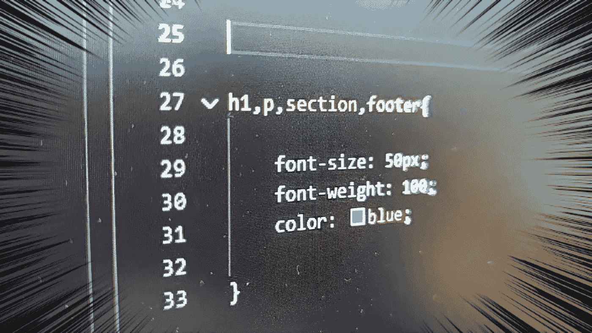

# 基本 CSS:多重选择器

> 原文：<https://medium.com/geekculture/basic-css-multiple-selector-5fc9e437aee4?source=collection_archive---------20----------------------->

## 选择多个元素以添加样式

在本文中，我们将引入多重选择器来选择多个元素。然后，我们对所有这些元素应用相同的 CSS 规则。

源代码:

[https://www.udemy.com/course/a-complete-css-course/?coupon code = afce 661 D3 f 23d 529 febc](https://www.udemy.com/course/a-complete-css-course/?couponCode=AFCE661D3F23D529FEBC)

