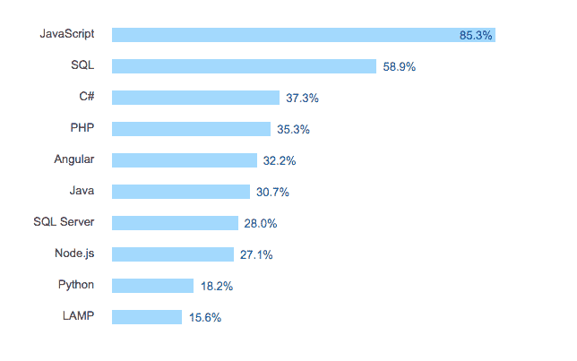
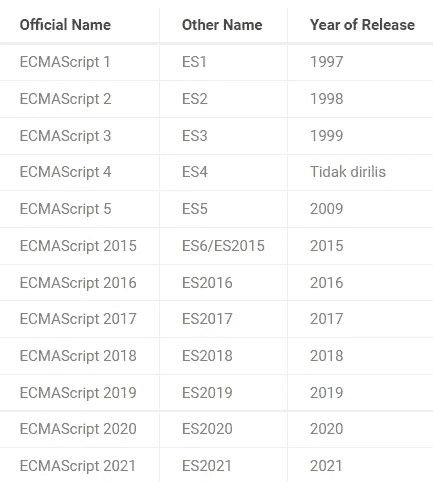

# 基础 JavaScript 第 1 部分:什么是 JavaScript？

> 原文：<https://medium.com/geekculture/basic-javascript-part-1-what-is-javascript-6e49a7c2e2fe?source=collection_archive---------21----------------------->


你好，你们都好吗，我希望你们都永远健康和成功。这次我们将学习基本的 JavaScript。因为目前 javascript 发展非常迅速。



source: wanderland.ae

JavaScript 语言仍然是开发者使用最多的编程语言中的第一种。

JavaScript 是一种你必须掌握的建立网站的编程语言。JavaScript 不仅可以在客户端构建，而且目前也可以在服务器端构建。

本教程涵盖:

*   什么是 JavaScript
*   JavaScript 历史
*   JavaScript 函数
*   JavaScript 的优势
*   为什么是 JavaScript

您可以在此了解更多教程:

[REST API 登录并用 JWT 注册 Node.js】](https://temanngoding.com/rest-api-login-dan-register-node-js-dengan-jwt/)

[带 JavaScript 的自动数字格式所有国家](https://temanngoding.com/format-number-otomatis-dengan-javascript-semua-negara/)

[Javascript 中的日期方法](https://temanngoding.com/method-date-pada-javascript/)

# 什么是 JavaScript

JavaScript 是一种高级编程语言，最初的开发目的是让网站更“活”。与 HTML 和 CSS 一样，JavaScript 是开发基于 web 的应用程序最流行的编程语言。这种语言能够将*逻辑*提供到网站中，使网站具有额外的功能，并且更具交互性。

JavaScript 在其开发之初，旨在使网站在客户端更具交互性。因此，客户在使用网站时不会感到厌烦，并使网站更容易使用。目前，JavaScript 不仅可以在客户端使用，还可以在服务器端使用，比如使用 Node.JS。

JavaScript 是一种编程语言，包含在*脚本*语言中。脚本是运行时不需要编译的编程代码。脚本语言使用*解释器*来翻译我们编写的代码或命令，以便机器能够理解。

因此 JavaScript 代码不需要很多代码来运行它，只需要一行代码就可以运行。例子如下。

```
console.log("Hello, World!");
```

# JavaScript 历史

JavaScript 是由 Brendan Eich 在 1995 年发明的，他是网景公司的一名程序员。在其制造之初，这种编程语言被命名为“Mocha ”,然后改为“LiveScript”。那时最流行的编程语言是 Java。为了利用编程语言的流行，它被改为“JavaScript”语言。JavaScript 和 Java 之间，只有名字相似。然而，从程序上来说，这是非常不同的。

最后，JavaScript 在 1996 年向 Ecma International 提交了它的标准化 ECMA-262。所以 JavaScript 有一个标准叫做 ECMAScript 或 ES。以下是 ECMAScript 版本列表:



Source : [https://www.ecma-international.org/publications-and-standards/standards/ecma-262/](https://www.ecma-international.org/publications-and-standards/standards/ecma-262/)

# JavaScript 函数

JavaScript 功能使网站在用户使用时更具互动性。并且网站变得更快。因此您不必等待服务器进程完成。

例如，当我们在制作网站时不使用 JavaScript。我们在服务器直接处理的网站上进行验证，当网站收到服务器发送的验证时会变慢。如果我们使用 JavaScript，它将缩短时间，使网站更快。

JavaScript 不仅用于表单验证，而且目前 JavaScript 广泛用于美化网站，例如提供动画、更多交互式聊天功能等。

为了更容易在客户端工作，JavaScript 开发了几个框架，包括 Angular、React、Vue 等。这个框架使得构建 Web 和应用程序变得容易。通过使用这个框架，所有的处理器都可以从前端获得，而不需要重新加载。JavaScript 现在也像 React 原生框架一样是一种多平台语言。

# JavaScript 的优势

JavaScript 有几个优点，包括:

*   **速度**

由于 JavaScript 在浏览器或每个客户端上运行，它不需要任何其他资源。当有来自后端服务器的调用时，JavaScript 不会变慢。并且不需要编译。

*   **人气**

Javascript 可以在任何地方运行，多平台。并且可以在前端和后端使用。有很多可以学习的资源。

*   **非常轻便小巧**

JavaScript 的第二个优点是它只需要少量的内存。这种编程语言非常轻便，因为页面上运行的所有进程都将被客户端访问。服务器只需要管理 HTTP 请求。

*   **美化外观**

。无论是在访问网页、访问应用程序还是操作软件时，显示器都是让用户感到舒适的一个重要因素。JavaScript 将有助于使界面更具吸引力。

# 为什么是 JavaScript

为什么要学习 JavaScript，因为 JavaScript 是一门很棒的编程语言。因为 JavaScript 在前端和后端都可以使用。

以下是 JavaScript 的一些优势:

*   **通用语言 JavaScript**

JavaScript 可以在浏览器、服务器、桌面和移动环境中运行。如果你掌握了这种编程语言，那么你将很容易被安置在任何地方。

*   **简单易学**

JavaScript 是一种非常容易学习的编程语言。JavaScript 不需要额外的软件。你只用你的浏览器，你就可以运行它。

*   **职业潜力**

JavaScript 是业内最受欢迎的技能之一。因为 JavaScript 编程是多平台的，所以很多公司都用 JavaScript 来搭建网站和应用。

因此，我能传达的这个指南可能是有用的。

谢了。

来源:https://www.javascript.com/