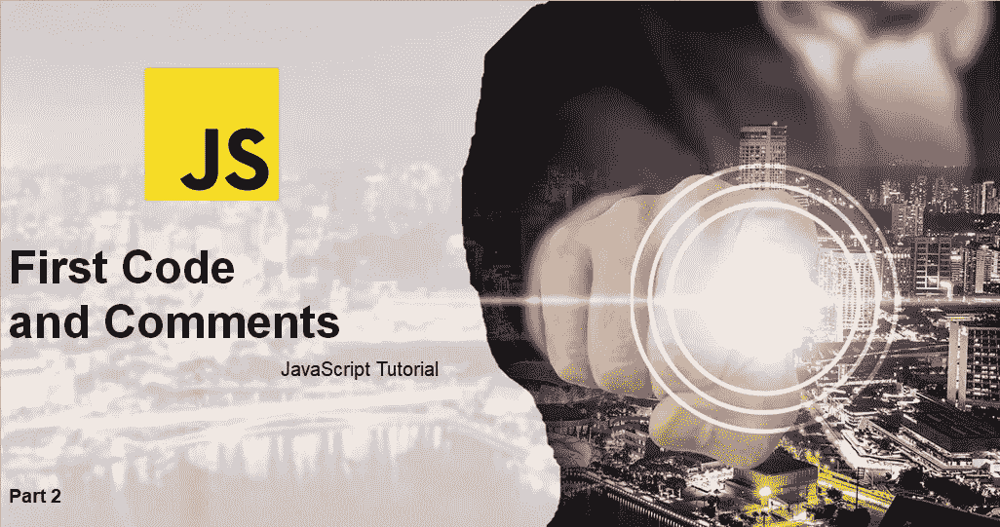
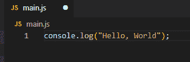
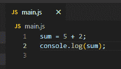
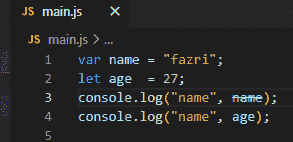

# 基础 JavaScript 第 2 部分:第一段代码和注释

> 原文：<https://medium.com/geekculture/basic-javascript-part-2-first-code-and-comments-90854c700c74?source=collection_archive---------25----------------------->



你好，你们都好吗，我希望你们都永远健康和成功。这次我们将再次讨论 JavaScript 教程。

在本教程中，我们将介绍 JavaScript 编程的第一个代码和注释。我们将详细讨论基础知识。

我们将用 JavaScript 编程编写我们的第一段代码。在继续之前，你可以学习[教程第一部分](https://temanngoding.com/javascript-basic-part-1-apa-itu-javascript/)。程序代码通常包含由计算机执行的指令或命令。下面的代码是 JavaScript 使用的基本指令，可以从终端或控制台运行到*日志*句子:Hello，World”。

```
console.log("Hello, World");
```

console.log 是 JavaScript 中的默认代码，用于从终端向 web 控制台或控制台显示消息。



我们将详细讨论代码。

console.log 代码是输出处理结果的代码。括号中的代码就是将要显示的代码，为什么要用引号( " " )，那是因为代码有字符串或文本数据类型。要执行的代码的每一端都使用分号(；).

# 输入代码

JavaScript 分为两种，即表达式和语句。

**表情**

表达式是一个代码单元，可以计算出一个值。请注意下面的代码:



**声明**

语句是执行某个动作的指令。这些动作采用变量的形式，执行循环和条件检查等。看看下面的代码。



我们将在下一个教程中讨论表达式和语句。

*   表达式是返回值的代码。
*   该声明显示了所采取的行动。

# 评论

注释是您必须学习的重要说明之一。注释函数来忽略我们在程序运行时编写的命令。

应用程序在编译器里的时候不会执行注释，所以不影响我们写的程序流程。还可以对文档进行注释。

写评论有两种方法。

1.  **单行注释**
2.  **多行注释**

# 单行注释

这是一条只注释一行代码的指令。在代码行的开头使用两个斜杠(//)的代码。下面我举个例子。

```
// Change heading:
document.getElementById("myH").innerHTML = "My First Page";// Change paragraph:
document.getElementById("myP").innerHTML = "My first paragraph.";
```

# 多行注释

这是注释掉几行代码的指令。用的代码是这样的(`/*` `dan */`)。下面我举一个例子:

```
/*
The code below will change
the heading with id = "myH"
and the paragraph with id = "myP"
in my web page:
*/
document.getElementById("myH").innerHTML = "My First Page";
document.getElementById("myP").innerHTML = "My first paragraph.";
```

当您使用 JavaScript 创建程序时，这两个代码的注释将非常有用。

这就是我这次能传达的教程。

***感谢。***