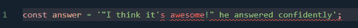
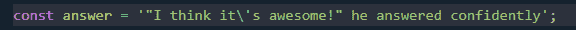

# 基础 JavaScript 第 4 部分:JavaScript 数据类型

> 原文：<https://medium.com/geekculture/basic-javascript-part-4-javascript-data-types-abe22d83a241?source=collection_archive---------20----------------------->


你好，朋友们你们好吗，希望你们永远健康成功。之前我们讨论了存储值的变量。当我们有一个变量时，它必须有一个数据类型。数据类型是基于数据类型的数据分组。它的作用是根据值类型来区分值类型。

在继续学习本教程之前，您应该学习前面的教程:

[基础 JavaScript 第 1 部分:什么是 JavaScript？](https://temanngoding.com/en/basic-javascript-part-1-what-is-javascript/)

[基础 JavaScript 第二部分:第一段代码和注释](https://temanngoding.com/en/basic-javascript-part-2-first-code-and-comments/)

[基础 JavaScript 第三部分:变量](https://temanngoding.com/en/basic-javascript-part-3-variables/)

下面是我们这次将讨论的一些数据类型:

1.  不明确的
2.  空
3.  数字
4.  BigInt
5.  线
6.  布尔代数学体系的
7.  标志
8.  圆盘烤饼
9.  排列
10.  目标

# 不明确的

当我们得到一个没有值的变量时，就知道这个数据类型了。当我们在没有初始化值的情况下声明时，变量会得到 *undefined* 。下面我举一个例子:

```
let x;
console.log(typeof(x));/* output: undefined */
```

在上面的代码示例中，我们声明了变量 x，但我们被赋予了任何值。我们使用 typeof()函数进行检查。是将得到未定义的输出。

> Typeof()用于通过以文本形式返回数据类型来确认变量中的数据类型。

# 空

Null 是一种没有值的数据类型。Null 类似于 undefined，只是 null 需要初始化为变量。Null 通常用于变量中的临时值。

在正常情况下将获得 Null，并且从处理错误中未定义，然后将生成输出。Null 将被另一个值替换，但 undefined 将被正确的过程替换。例子如下:

```
let someLaterData = null;
console.log(someLaterData);/* output:
null
*/
```

# 数字

数字数据类型是一种具有数字值的数据类型。下面我举一个例子:

```
let x = 10;
let y = 10.5;console.log(typeof(x))
console.log(typeof(y))/* output: 
number 
number
*/
```

我们有两个变量，分别是整数和小数。number 中的数据类型有整数和小数。当我们得到 decimal 数据类型时，我们给数字的分数加上一个句点。

数字数据类型还可以执行算术运算，如加、减、乘、除等。以下是数字数据类型的数学运算符:


这里我举个例子:

```
let a = 16;
let b = 9;console.log(a + b)
console.log(a - b)
console.log(a * b)
console.log(a / b)
console.log(a % b)/*
25
7
144
1.7777777777777777
7
*/
```

到目前为止，也许你已经理解了如何使用 number 数据类型，我们继续理解 number 数据类型中的其他运算符，即*递增*运算符(++)，它是对变量值加 1 和递减(—)减 1。该运算符可以写在变量之前或之后。以下是条件:

*   如果写在变量(x++)之后，*表达式*将在增加变量值之前返回变量值。
*   如果写在变量(++x)之前，*表达式*将返回该变量增加值后的值。

下面我举一个例子:

```
let postfix = 10;console.log(postfix++);console.log(postfix);/* 
10
11
*/
```

在上面的代码示例中，我们将获得值 10 和 11。我们加上*增量*运算符后得到的数字 11。

# BigInt

我们以前知道数字数据类型以数字的形式提供一个值。但是，数字数据类型有一个限制，即它只包括-(253–1)到(253–1)之间的值。因为这个值实际上已经足够用了。但是，您希望更大或某些需求的值来创建您需要的变量。

区分 Number 和 BigInt 数据类型非常容易使用。你只需在数字的末尾加上字母 n。下面我举一个例子:

```
const bigNumber = 1234567890123456789012345678901234567890n;
const myInt = 1234567890123456789012345678901234567890;console.log(bigNumber);
console.log(myInt);/*
1234567890123456789012345678901234567890n
1.2345678901234568e+39
*/
```

BigInt 不仅用于大值。然而，我们可以将它用于较小的值。我们也可以用它来计算数学运算符。下面我举个例子:

```
let a = 16n;
let b = 9n;console.log(a + b)
console.log(a - b)
console.log(a * b)
console.log(a / b)
console.log(a % b)/*
25n
7n
144n
1n
7n
*/
```

# 线

在我们理解了数字数据类型之后。现在我们继续找出*字符串*的数据类型。字符串是一个文本。要使用 *string* 数据类型，您只需要在文本之间添加一个( ' )或两个( " )引号。以下示例:

```
var x = "Hallo";
console.log(typeof(x))/* 
string
*/
```

当你用引号一和引号二的时候没有区别。您可以像下面的例子一样使用它:

```
const question = '"What do you think of JavaScript?" I asked';
console.log(question)/* output: "What do you think of JavaScript?" I asked */
```

那你怎么会有下面这种情况:



您将得到一个错误。解决方案是使用一个*反斜杠* h (\)代码来减少引号中的歧义。这个代码可以被称为转义字符串。在我们提供了*齿隙*代码后。



当我们使用字符串并且在代码中有歧义时，反冲是非常有用的。

使用字符串时，可以使用加号运算符(+)。string 数据类型中的加号运算符用于将两段单独的文本连接成一段文本。例子如下:

```
let greet = "Hello";
let moreGreet = greet + greet;
console.log(moreGreet);/* output: HelloHello */
```

在一个字符串中，我们可以将变量连接成一个字符串。比如下面的例子:

```
const name = "fazri";console.log(`Hello, my name is ${name}.`);/* output: Hello, my name is fazri. */
```

在上面的代码中，我们将变量连接到文本中。当我们使用变量时，我们必须使用反勾号(')。

在继续之前，我们刚刚开始了解字符串数据类型。可以先喝咖啡…


# 布尔代数学体系的

Boolean 是一种只有 true 和 false 值的数据类型。例如，我们将选择真或假的值，是或否，等等。然而，布尔是一个编程逻辑的决定因素。要为变量指定布尔值，请使用 true 或 false。通常这种数据类型在我们做 if/else 语句的时候非常有用。我举个例子如下:

```
let x = true;
let y = false;
console.log(typeof(x))
console.log(typeof(y))/* 
boolean 
boolean
*/
```

Kode di atas 可以输出布尔值。我们继续讨论如何在布尔值上使用操作符，即大于( > )或小于( < )的比较操作符。例子如下:

```
const x = 20;
const y = 10;let isGreater = x > y;
let isLess = x < y;console.log(isGreater);
console.log(isLess);/* 
true 
false
*/
```

# 标志

符号是 ECMAScript 6 (ES6)出现后的一种新类型。此数据类型用作对象特性的标识符，或者可用于表示单位标识符。创建符号时，我们可以提供符号的描述或名称，如下所示:

```
const id = Symbol("id");
console.log(id);/* Symbol(id) */
```

Tipe 数据符号识别符。我们需要两种不同的象征，它们都是可以理解的。例子如下:

```
const id1 = Symbol("id");
const id2 = Symbol("id");console.log(id1 == id2);/* false */
```

上面的代码将输出 false。因为即使符号相同，这些变量也有不同的值。

# 圆盘烤饼

NaN(非数字)数据类型是一种表示计算错误的数据类型。该错误将在计算字符串和数字的过程之后出现。例子如下:

```
var x = 'a'/5;console.log(x);/*
NaN
*/
```

# 排列

数组是一种单位数据类型。数组数据类型可以包含几种数据类型。因此，在创建应用程序时经常使用这种数组数据类型，因为它在创建变量时效率更高。我们可以在其中创建一个变量，但它有许多数据类型，下面我将举一个例子:

```
var x = [5, 'ini string'];
```

# 目标

对象数据类型是具有一组属性的数据类型，该属性具有键和值。对象数据类型通常显示为完整的数据。例子如下:

```
var x = {
	nama: 'temanngoding.com',
	age: '30'
};console.log(x.age);/* 30 */
```

我们已经学习了 JavaScript 中的数据类型，希望对所有刚开始学习 JavaScript 的人有用。

谢了。