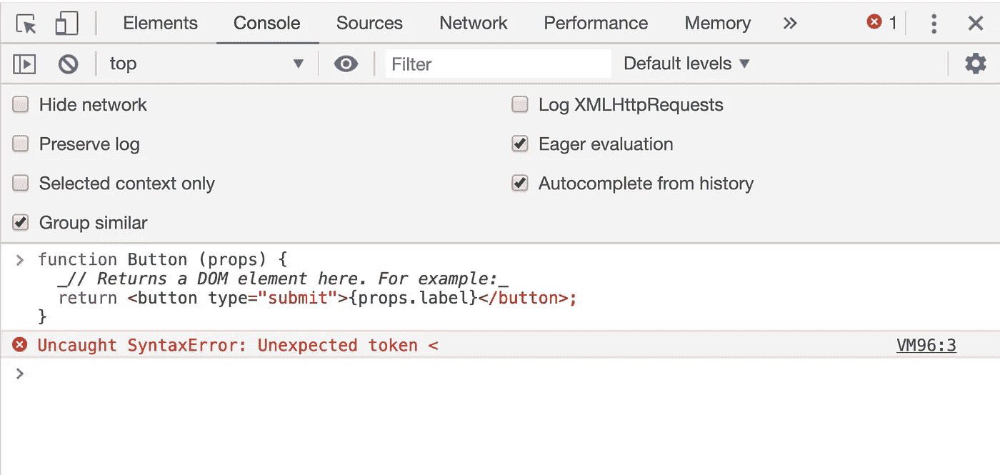

# JavaScript 的基本反应——第 1 部分

> 原文：<https://medium.com/geekculture/basic-react-with-javascript-part-1-5a340501e407?source=collection_archive---------34----------------------->


Photo by [Artem Sapegin](https://unsplash.com/@sapegin?utm_source=medium&utm_medium=referral) on [Unsplash](https://unsplash.com?utm_source=medium&utm_medium=referral)

# 用 React 开始写

您可以使用 DOM API 直接创建元素。为此，您需要获取根元素并设置内部 HTML，仅此而已。请参见下面的示例。

```
document.getElementById('root').innerHTML = `
  <div>
    Hello World!
  </div>
`;
```

或者，你可以使用 React 的 API。我们将在本文中遵循这个系统。

为此，您需要添加一个 React DOM 呈现器。在这里面，你必须添加两个参数。其中一个是 React Create 元素，另一个是 HTML 根元素。遵循下面的代码。

```
ReactDOM.render(
  React.createElement(),
  document.getElementById(),
);
```

在 React Create 元素中，您必须插入三个参数。第一个参数是 HTML 标记名或元素名。第二个参数是 CSS 样式参数。第三个参数是主要内容参数。

```
ReactDOM.render(
  React.createElement(
    'tagname',
    'style',
    'Insert, what do you want to see in the output!',
  ),
  document.getElementById(),
);
```

在 Create Element 方法中添加了所有参数之后，您需要添加一个特定的元素 ID 名称，比如 root。让我们看看下面的例子。

```
ReactDOM.render(
  React.createElement(
    'div',
    null,
    'Hello World!',
  ),
  document.getElementById('root'),
);
```

嗯，看起来不错。让我们试试这个。在[密码栏](https://codepen.io/asif-ae/pen/JjWoOvx)中查看结果。

这里有一个替代方法。您可以直接插入 HTML，而不是“React.createElement”。让我们看看下面的例子。如果你感兴趣，那么你可以在[码盘](https://codepen.io/asif-ae/pen/GRWgObq)中看到输出。

```
ReactDOM.render(
  <div>Hello World!</div>,
  document.getElementById('root'),
);
```

React DOM Renderer 方法是 React 应用程序中的核心 API 方法。

# 让我们嵌套 React 元素！

让我们在 React Create 元素中插入一个嵌套元素。在第一个创建元素中，您可以插入另一个元素进行嵌套。不明白吗？让我想想…

```
ReactDOM.render(
  React.createElement(
    'div',
    null,
    'Hello World!',
    React.createElement(
      'pre',
      null,
      new Date().toLocaleTimeString(),
    ),
  ),
  document.getElementById('root'),
);
```

第二个创建元素将添加一个静态时间。你可以通过每秒更新来运行它。为此，您必须添加一个`setInterval` Web 定时器 API。在此之前，您需要创建一个函数。之后，您必须在功能上设置间隔计时器。下面我们来看一个例子。或者，如果您感兴趣，您可以在[代码盘](https://codepen.io/asif-ae/pen/dyvPJmp)中看到输出。

```
const time = () => {
  ReactDOM.render(
    React.createElement(
      'div',
      null,
      'Hello World!',
      React.createElement(
        'pre',
        null,
        new Date().toLocaleTimeString(),
      ),
    ),
    document.getElementById('root'),
  );
}
setInterval(time, 1000);
```

哇！你创造了一个时钟⏰使用 React.js！万岁！！！

# JSX

```
const element = <h1>Hello, world!</h1>;
```

这听起来可能很好笑。但是 React 确实有 JSX 标签语法，它不是字符串或 HTML 标签。JSX 看起来像 HTML，但它不能被浏览器理解。如果你在一个 HTML 文档中写 JSX，它可能会显示一些错误。看看下面的例子。



JSX inside an HTML document

您可能会注意到，HTML5 在某些情况下不需要结束标记。(即、
、

* * *

等。)但是 JSX 必须有结束标签。(即、
、

* * *

等)。)否则，您可能会面临一些错误。

# 使用类创建组件

您可以使用 JavaScript 类语法创建任何 React 组件。为此，请遵循下面给出的简单步骤。

*   首先，您必须定义一个扩展 React.Component 的类。

```
class Button extends React.Component {}
```

*   您还在自己定义的类中定义了至少一个名为`render`的实例方法。它将返回表示输出的元素。

```
class Header extends React.Component {
  // The 'render' method
  render() {
    return (
      <h1>I am learning React!</h1>
    );
  }
}
```

*   最后，我们必须声明 React DOM Renderer 方法，它将连接到我们的根元素

```
ReactDOM.render(
  <Header />,
  document.getElementById('root'),
);
```

让我们在[代码笔](https://codepen.io/asif-ae/pen/XWMXdZr)中看看完整的最终代码示例。

# 使用函数创建组件

您也可以使用 React 创建功能组件。您可以创建法线和箭头功能组件。这完全取决于你。

**支持 ES6 / ES2015 或更高版本本:**

```
const Header = () => {
  return (
    <h1>I am learning React!</h1>
  );
}ReactDOM.render(
  <Header />,
  document.getElementById('root'),
);
```

**对于较旧的浏览器:**

```
function Header() {
  return (
    <h1>I am learning React!</h1>
  );
}ReactDOM.render(
  <Header />,
  document.getElementById('root'),
);
```

# React 不是一个框架

有人认为 React 是一个框架，这是完全错误的。React 只是 JavaScript 中的一个小库。另一方面，Angular 是一个已经为用户做出许多决定的框架，而 React 开发人员必须做出他们的决定。

# 你不再需要通量了

如果您正在学习反应，或者您的应用程序很小，并且您不需要全局状态，或者您在跟踪应用程序中的状态变化方面没有任何问题，那么不要使用 Redux 或其他一些 Flux 实现，这些会使您的应用程序更加复杂。

# 饭桶

Git 对于每个开发人员在解决方案上存储项目的工具包来说都是必不可少的。比如 GitHub，Bitbucket，GitLab。更多应该成为你日常生活一部分的技能包括:

*   通过添加、提交、推送和拉取来跟踪更改
*   分支和合并策略
*   处理合并冲突

# 节点+ npm

node.js 可能会让许多人感到惊讶。作为一名客户端 React 开发人员，您为什么需要知道如何使用 Node？虽然您可以将 React 放入任何 HTML 文件，但是还有许多其他的包允许您扩展 React 库。好吧，React 开发人员需要对 npm 注册中心有一个坚实的理解。这是软件开发人员可以获得软件来帮助他们构建软件的地方。听起来很有趣，但事实上，npm 就是我们称之为依赖的包的云存储。

# 需要良好的 JS 知识

在学习 React 之前，你首先需要知道的是 JavaScript。的确，React 的伟大之处在于它只是一个 JavaScript 库。因此，你对 JavaScript 了解得越多，你就越能更好地用 React 编写应用程序。你必须掌握并熟悉 JavaScript 基础知识。使用 React，您会更有效率。