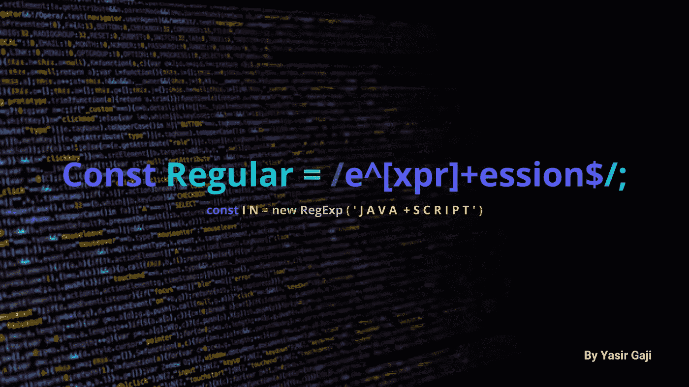
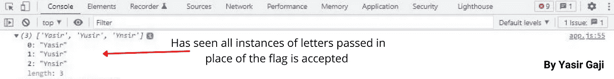
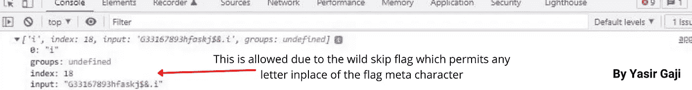
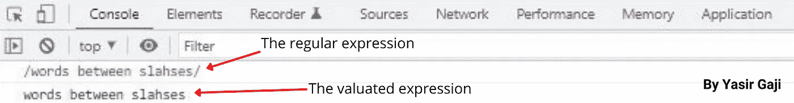
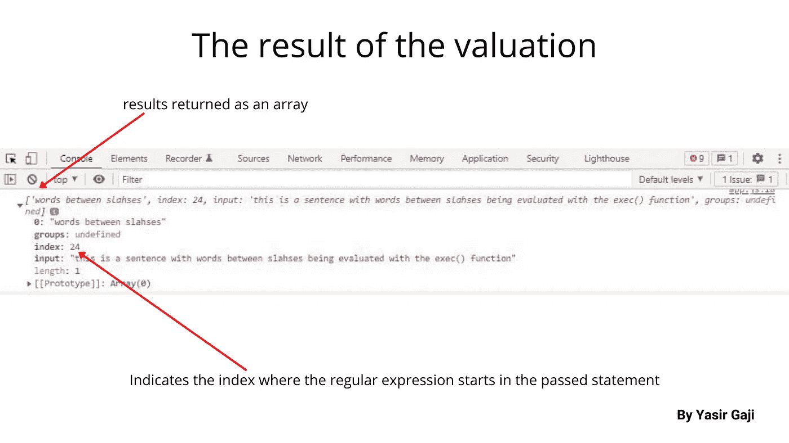

# Javascript 中的基本正则表达式

> 原文：<https://medium.com/geekculture/basic-regular-expressions-in-javascript-9765bb5c880?source=collection_archive---------11----------------------->

Regular Expression Image By [Yasir Gaji](https://yasirgaji.com/)

正则表达式是用于匹配字符串中的字符组合的字符模式或序列，它也可以形成搜索模式并用作文本替换操作。

它们存在于几乎所有的编程语言中，并且它们都有相似的语法，它们可以通过两种方法来构造，要么使用斜杠之间的单词的正则表达式，要么调用`RegExp`对象的构造函数。
参见下面的演示和实例。

Demonstration of the first way to construct a regular expression by [**Yasir Gaji**](https://yasirgaji.dev)

Demonstration of the second way to construct a regular expression by [Yasir Gaji](https://yasirgaji.com/)

# 旗帜

正则表达式中有各种文字字符和元字符符号，用于为声明的表达式设置规则或限制，下面的演示使用了构造正则表达式的第一种方法:

## 不区分大小写标志

该标志用字母`i`表示，以确保在执行时忽略声明的正则表达式的大小写，并在使用时将其插入正则表达式的末尾。外延:`const disregardCase = /match/i`。

## 必须以标志开头

这个标志用脱字符号`^`表示，它确保在评估声明的正则表达式时传递的语句必须以声明的正则表达式开始。外延:`const mustStartWith= /^match/`。

## 必须以标志结尾

这个标志用美元符号`$`表示，它确保在对声明的正则表达式求值时传递的语句必须以声明的正则表达式结束。外延:`const mustEndWith= /match$/`。

## 跳过字符标志

该标志用项目符号`.`表示，它意味着单个字符的“跳过”,例如当声明一个正则表达式时，然后在正则表达式之间输入该标志。当评估声明的正则表达式时，它将允许任何单个字符代替该标志传递。请参见下面的代码演示。

Code representation of how the skip flag works by [Yasir Gaji](https://yasirgaji.com/)

Console image of the above code representation by [Yasir Gaji](https://yasirgaji.com/)

## 全球旗帜

这个标志用字母`g`表示，以确保在赋值时在传递的语句中的每个实例处跟踪声明的正则表达式，就像在上面的跳过字符标志演示中使用的一样。外延:`const trackAtEveryInstance = /match/g`。

## 通配符标志

该标志用星号`*`表示，它意味着多个字符的“跳过”,例如当声明一个正则表达式时，然后在正则表达式之间输入该标志。当评估声明的正则表达式时，它将允许任何字符代替该标志传递。请参见下面的代码演示。

Code representation of how the wild skip flag works by [Yasir Gaji](https://yasirgaji.com/)

Console image of the above code representation by [Yasir Gaji](https://yasirgaji.com/)

## 可选标志

这个标志用问号`?`符号表示，用于在声明正则表达式时设置可选的字符大小写。
外延:`const optionalCharacterCase = /advic?s?e/`。
由于赋值时字母`c`或`s`的可选标志，这将允许`advice`或`advise`作为通过的语句，但如果我们通过`advie`，它仍将被允许，因为`c`和`s`是可选的。

## 逃生旗

该标志用反斜杠`\`符号表示，以确保下一个字符被视为文字而不是标志。
外延:`const escapedCharacterCase = /advice\?/`。
这将把声明的正则表达式作为普通文字传递，而忽略问号作为标志。

## 一个或多个标志

这个标志用附加符号`+`表示，它暗示了声明的正则表达式中的下一个字符和更多字符。
外延:`const escapedCharacterCase = /share this article+/`。

# 用于计算正则表达式的方法

## `.source"`方法

使用构造正则表达式的第一种方法，我们可以使用`.source`对象方法对表达式中的任何语句进行赋值，这将忽略斜杠并返回实际的表达式语句。参见下面的演示。

Code representation of how to valuate a regular expression using the “.source” method by [Yasir Gaji](https://yasirgaji.com/)

Console image of the above code representation by [Yasir Gaji](https://yasirgaji.com/)

## 函数方法

我们也可以使用特定的函数来计算正则表达式，第一个是:

**match()函数
参见下面的演示。**

Code representation of how to valuate a regular expression using the “match()” function by [Yasir Gaji](https://yasirgaji.com/)

Console image of the above code representation by [Yasir Gaji](https://yasirgaji.com/)

我们可以得到不同的数组属性，就像其他数组一样。

**exec()函数** 该函数为声明的正则表达式整理出一个传递的语句，然后如果该语句包含匹配项，则返回数组中的表达式，如果不包含匹配项，则像`match()`函数一样返回 null，但方法不同。参见下面的演示。

Code representation of how to evaluate a regular expression using the “exec()” function by [Yasir Gaji](https://yasirgaji.com/)

**test()函数** This 如果传递的语句和声明的正则表达式中有匹配，就像布尔格一样，返回 true 或 false。请参见下面的代码表示。

Code representation of how to valuate a regular expression using the “test()” function by [Yasir Gaji](https://yasirgaji.com/)

您猜对了，这将返回一个 false，因为在传递的语句中缺少声明的正则表达式的第一个单词。

**search()函数** 这将返回所传递语句中声明的正则表达式的第一个匹配的索引，如果没有找到，将返回一个`-1`响应，就像`indexOf`方法一样。请参见下面的代码表示。

Code representation of how to valuate a regular expression using the “search()” function by [Yasir Gaji](https://yasirgaji.com/)

**replace()函数

见下面的代码表示。**

Code representation of how to valuate a regular expression using the “replace()” function by [Yasir Gaji](https://yasirgaji.com/)

# 字符集和量词

## 字符集

这些是在声明的正则表达式中设置的方括号`[ ]`中的可选字符。
外延:`const optionalCharacterCaseSet = /advi[sc]e/`。建议用这个方法代替**可选标志**，它更好，因为它确保集合中至少有一个字符被传递，否则它将返回`null`。

我们也可以在字符集中使用标志，但在大多数情况下会改变标志功能，例如，如果我们插入**"必须以"** `^`开始"标志，它的功能会改变为豁免，这意味着除了大小写中的字符，任何字符都可以被接受。

字符集也可以接受一定范围的字符，包括字母或数字。参见下面的实例。
`const alphabetCharacterRangeSet = /advi[a-z]e/i`。
T7。

## 量词

这些是声明的正则表达式中花括号`{ }`中的数字，用于在赋值时量化表达式中它前面的字符的数量。
外延:`const quantifiedCharacterCase = /subscribe and share this article!{6}/`。这将确保感叹号是六个，否则将返回空值。

就像字符集一样，我们可以使用量词来确定数量的范围。
外延:`const quantifiedCharacterCase = /subscribe and share this article!{3,6}/`。这将确保感叹号的数量在 3 到 6 之间。

此外，我们可以使用限定数字后用逗号表示的量词来发布“至少”条件。参见下面的演示。
T11。这将确保感叹号至少出现三次或更多次。

# 正则表达式速记字符

这些是正则表达式中的缩写和符号类，用于简短快速的声明。举几个例子，我们有:

`/\w/` —这意味着传递的字符可以是单词、下划线`_`或字母数字字符，并用反斜杠`\`和小写字母“w”表示。

`/\W/` —这意味着传递的字符既不能是单词、下划线`_`，也不能是数字字符，它用反斜杠`\`和大写字母“W”表示。

`/\d/` —这意味着传递的字符只能是数字字符，并用反斜杠`\`和小写字母“d”表示。

`/\D/` —这意味着传递字符不能是数字字符，用反斜杠`\`和大写字母“D”表示。

`/\s/` —这意味着在计算时，传递的字符用空格代替速记字符，并用反斜杠`\`和小写字母“s”表示。

`/\S/` —这意味着在求值时，传递的字符不能有空格来代替速记字符，它用反斜杠`\`和大写字母“S”来表示。

还有更多正则表达式的速记字符，论文只是几个必不可少的实例，广泛了解正则表达式 [***这里***](https://developer.mozilla.org/en-US/docs/Web/JavaScript/Guide/Regular_Expressions) 和 [***这里***](https://www.w3schools.com/jsref/jsref_obj_regexp.asp)

# 结论

允许多个字符集，但不建议在一个声明的正则解释中使用。我们可以用括号将正则表达式分组。

一定要问问题来澄清，并提出纠正和建议，我希望他们这样做。