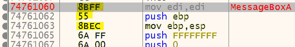
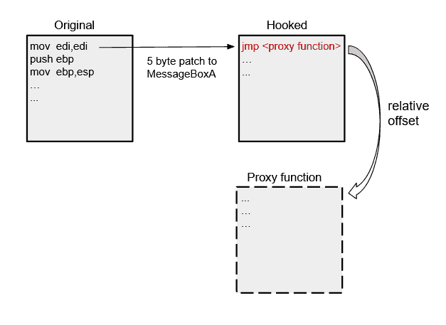
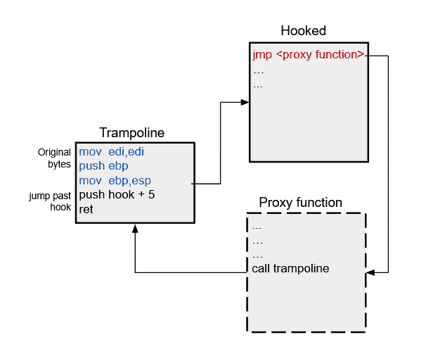

# 基本 Windows API 挂钩

> 原文：<https://medium.com/geekculture/basic-windows-api-hooking-acb8d275e9b8?source=collection_archive---------4----------------------->

API 挂钩在过去的十年里已经被详尽地讨论过了，所以这是我为读者准备的一个逻辑教程，目的是让我自己更好地理解它。这是恶意软件、逆向工程和任何涉及操作系统内存的领域中的一个重要话题。当与进程注入结合使用时，挂钩可以洞察可执行文件试图做什么，或者恶意拦截和更改对 WinAPI 的任何调用。

## 背景

我将介绍流行的在线挂钩技术。此方法只是尝试替换目标可执行文件/进程加载和使用的 DLL 中导出函数的开头几个字节。覆盖将以某种方式跳转到您控制的进程中的某个内存位置。从那时起，由您决定如何处理被拦截的呼叫。例如，你可以钩子创建一个文件，一旦一个调用被截获，就丢弃它，不成功地返回。本例中的效果是拒绝对创建文件的访问，或者如果更有针对性的话，只拒绝对某些文件的访问。

很容易想象这种强大技术的用途。使用各种挂钩方法进行了大量开发，包括游戏作弊、反病毒/EDR 和恶意软件。本指南面向用户域挂钩，并试图通过一个简单的例子向您提供对其工作原理的核心理解。

## 经典的 5 字节挂钩

我们将通过用一个对我们自己函数的`jmp`指令替换 MessageBoxA 函数的前 5 个字节来挂接它。MessageBoxA 函数只显示一个带有标题和对话框的弹出文本框。通过挂钩它，我们将能够拦截调用并改变参数。



这里我已经反汇编了`user32.dll`，找到了我们想要挂钩的函数。突出显示的 5 个字节对应于右边的汇编指令。这组指令是许多 API 函数中相当典型的序言。

通过用`jmp`指令覆盖这前 5 个字节，我们将执行重定向到我们自己定义的函数。我们将保存原始字节，以便在以后我们想要将执行传递回挂钩的函数时可以引用它们。

`jmp`指令是从下一条指令的地址开始到偏移的相对跳转。对应的`jmp`操作码是`E9`，它需要一个我们需要计算的 4 字节偏移量。



让我们首先获取 MessageBoxA 在内存中的地址。

```
// 1\. get memory address of the MessageBoxA function from user32.dll 
hinstLib= LoadLibraryA(TEXT("user32.dll"));
function_address= GetProcAddress(hinstLib, "MessageBoxA");
```

我们正在使用一种叫做动态链接的技术，我们使用 [LoadLibraryA](https://docs.microsoft.com/en-us/windows/win32/api/libloaderapi/nf-libloaderapi-loadlibrarya) 加载包含我们想要的函数的 DLL。然后 [GetProcAddress](https://docs.microsoft.com/en-us/windows/win32/api/libloaderapi/nf-libloaderapi-getprocaddress) 会给我们函数在内存中的地址。我们现在可以使用 [ReadProcessMemory](https://docs.microsoft.com/en-us/windows/win32/api/memoryapi/nf-memoryapi-readprocessmemory) 将找到的地址的前 5 个字节保存到缓冲区中。

```
// 2\. save the first 5 bytes into saved_buffer
ReadProcessMemory(GetCurrentProcess(), function_address, saved_buffer, 5, NULL);
```

在我们编写补丁之前，我们需要计算 MessageBoxA 到一个代理函数的偏移量(距离),我们将在一秒钟内编写这个函数。`jmp <offset>`指令将指令指针(EIP)移动到当前指令(5 字节)之后，然后加上偏移量:`eip = eip + 5 + offset`

找到偏移量:`offset = <destination address> - (<source address> + 5)`

```
proxy_address= &proxy_function;
src= (DWORD)function_address + 5; 
dst= (DWORD)proxy_address;
relative_offset= (DWORD *)(dst-src);
```

下面是完整的实现，然后将补丁写入内存中的 MessageBoxA。

**快速提示:WriteProcessMemory 和 ReadProcessMemory 查询它们正在访问的内存的保护，并相应地更改它们。他们真的希望你成功:)*

我们将执行重定向到的代理函数需要接受相同的参数，具有相同的调用约定，并返回与 MessageBoxA 相同的类型。

现在我们可以打印出 MessageBoxA 的参数，修改它们，然后继续真正的 MessageBoxA。如果我们只是调用 MessageBoxA，我们将再次陷入钩子，导致无限递归和堆栈溢出。为了防止这种情况，我们将首先用先前保存在缓冲区中的原始字节替换我们覆盖的字节。

这个钩子只会影响同一个程序中对 MessageBoxA 的调用。从导入的 dll 中篡改另一个进程函数需要注入，这将在另一篇文章中讨论。在 [github](https://github.com/jayo78/basic-hooking/blob/master/hook_v1.cpp) 上查看这个例子。

因为代理函数重写了原来的字节，这就解除了函数的挂钩，所以我们需要不断地挂钩 MessageBoxA 来拦截后续调用。让我们谈谈蹦床。

## 蹦床

我们可以使用一个蹦床函数来保持钩子的完整性，同时不会导致无限递归。trampoline 的工作是执行我们挂钩的函数的原始字节，然后跳过安装的挂钩。我们可以从代理函数中调用它。



通过跳过原始函数地址的 5 个字节，我们没有通过传递安装的钩子来执行相对于代理函数的`jmp`。

我们正在推送挂钩函数+ 5 的地址，然后使用`ret`跳转到该地址。这两条指令使用 4 个字节的地址，总共 6 个字节。我们的蹦床将是 11 字节。让我们通过添加已经编写的`install_hook()`函数来构建蹦床。

我们首先调用 [VirtualAlloc](https://docs.microsoft.com/en-us/windows/win32/api/memoryapi/nf-memoryapi-virtualalloc) 来分配 11 字节的内存。我们需要将这个内存位置的保护指定为可执行、可读和可写。这将允许我们编辑分配的字节，然后稍后执行它们。将蹦床写入内存后，我们可以从代理函数中调用它。

在 [github](https://github.com/jayo78/basic-hooking/blob/master/hook_v2.cpp) 上查看完整示例。更多挂钩示例请参见[这里的](http://jbremer.org/x86-api-hooking-demystified/)。