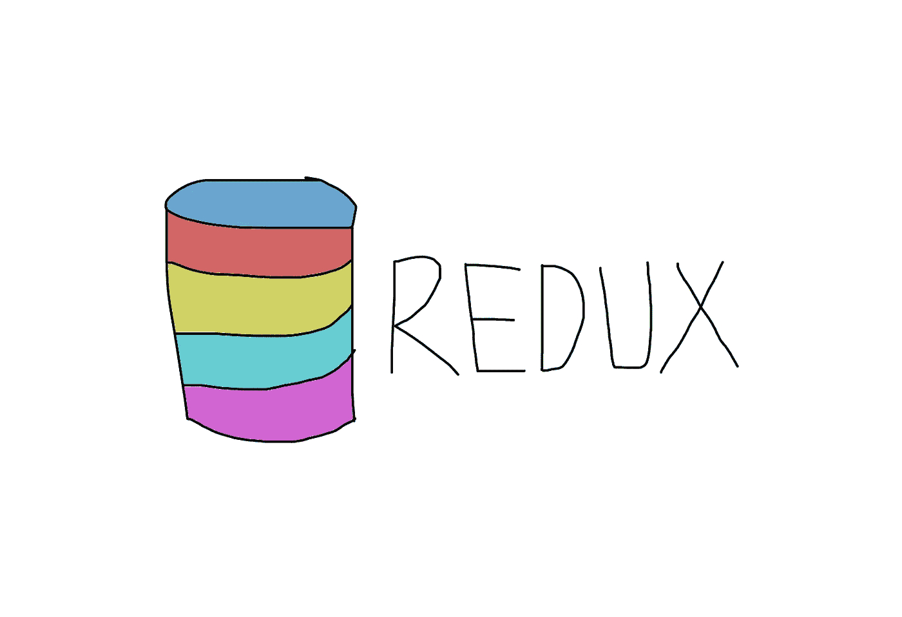
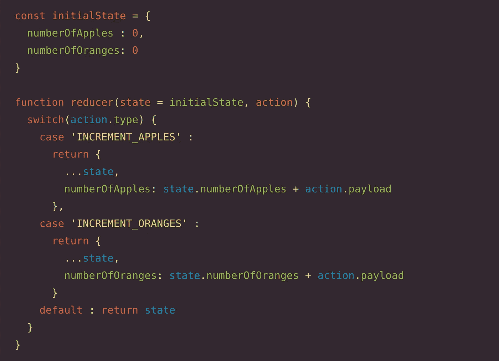
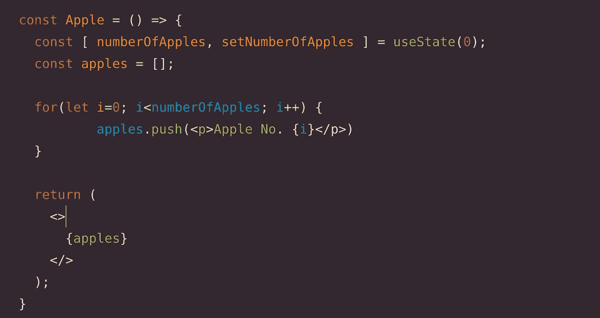
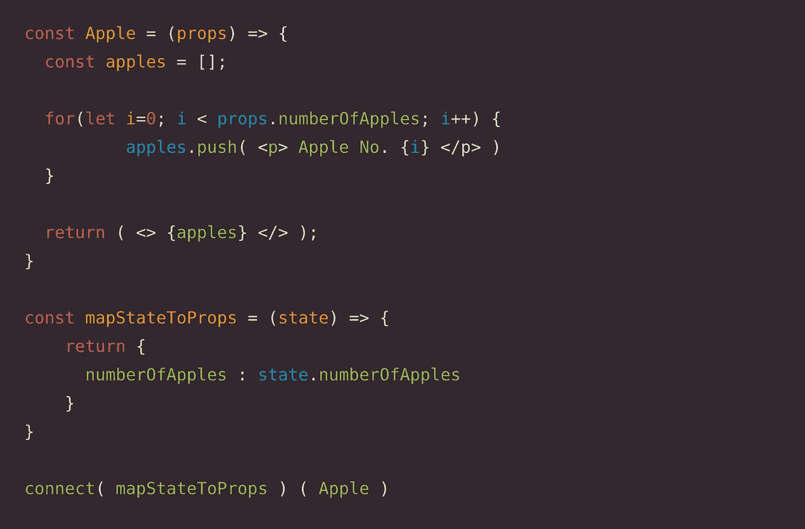
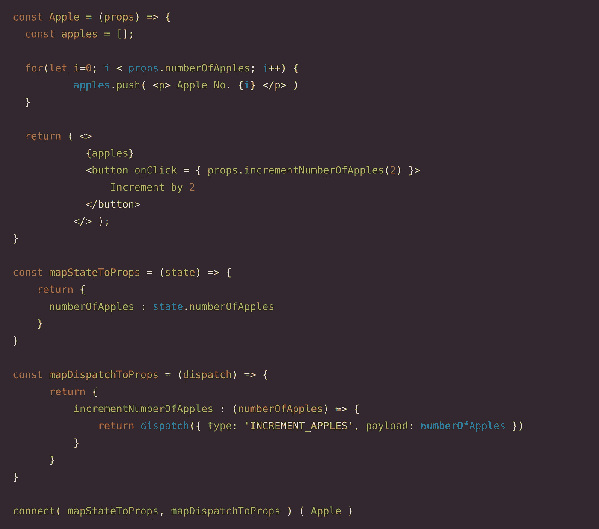

# 基本上是储存在反应堆里

> 原文：<https://medium.com/geekculture/basically-redux-store-in-react-5242f0d3068?source=collection_archive---------14----------------------->

Redux 是 React 中使用的状态管理工具。当我们想在整个应用程序中保持某个状态时，这非常方便。我以前在我的一些个人项目中使用过 redux，并且有一些关于如何将 Redux 商店与 React 应用程序集成的知识。

但是最近我有一次经历，我的一个同事不知道 redux，他问我整个事情是如何工作的，我无法让他明白。所以我决定写这篇博客，以更简单的方式解释 redux 商店。

## 商店-

商店是存储所有数据的地方。在 redux 文献中，该数据也被称为**【状态】**。应用程序的整个状态都存储在存储中。

***我们如何创建一个商店？***

> redux 库提供了一个名为' **createStore'** 的函数。
> 
> 我们将一个**‘Reducer’**作为参数传递给商店。
> 
> * const store = createStore(reducer)
> 
> 这就是我们在 redux 创建商店的方式。

***我们如何在我们的 app 和商店之间建立链接？***

> react-redux 库提供了一个名为“**<Provider>”**的组件。
> 
> 该组件接受一个名为“store”的输入，我们可以在其中传递生成的存储。
> 
> 通过使用该组件，我们可以在应用程序和商店之间建立联系。
> 
> ::
> 
> 现在整个 app 都可以访问 redux 商店了。

## **减速器-**

缩减器基本上是一个接受两个参数**【状态】**和**【动作】**并返回更新状态的函数。
无论我们从 reducer **返回什么状态，都会存储在 redux store** 中。

通常，我们将 initialState 作为默认状态传递给 reducer，它有一个 redux 存储应该是什么样子的模式。

***我们传递给减速器的论点动作是什么？***

> “action”是一个对象，通常包含两个键' **type'** 和 **'payload'**
> 
> * const action = { type:' INCREMENT _ apple '，有效负载:3 }
> 
> 类型键是必须的，而有效载荷键不是强制的。
> 
> 基于这个动作，减速器执行相应的状态改变。

假设我们的应用程序中有两个组件 Apple 和 Orange，如下所示:

橙色成分与苹果成分相同。

***一个组件如何与 redux store 通信？***

> 为了在组件和 redux 存储之间建立连接，我们需要利用' react-redux '库提供的 **'connect'** 函数。
> 
> 这个“连接”函数接受两个参数，通常命名为**'*mapStateToProps '***和**'*mapdispatctoprops '***，并返回另一个函数。
> 
> 这两个参数都是函数。
> 
> “connect”函数返回的函数接受一个参数，即我们希望 redux 存储连接到的**组件**。
> 
> *连接(mapStateToProps，mapDispatchToProps)(苹果公司)

***组件如何从 redux store 中检索/访问状态？***

我们希望摆脱组件中的本地状态，并希望根据 redux 存储中存储的状态来呈现组件。

要从存储中访问状态，我们需要将***‘mapStateToProps’***函数传递给 connect 函数。

mapStateToProps 接受**‘state’**作为参数，该参数由连接函数**自动传递给**，并返回组件所需的状态。

这个“状态”是来自 redux 商店的应用程序的**整体状态**，在我们的例子中是:
{ number of apples:*XXX*，number of ranges:*XXX*}

mapStateToProps 返回的状态现在可以作为组件的**‘props’**。

因此，我们可以使用 props.numberOfApples 从商店访问 numberOfApples。

**我们如何使用*“动作”*改变 redux 商店中的状态？**

为了执行**状态改变**，我们需要传递一个‘动作’给减速器。

为了将这个**‘action’**参数传递给 reducer，react-redux 提供了一种方法来调度这些动作。

为此，首先我们需要将**‘mapDispatchToProps’**函数传递给 connect 函数。

现在，mapDispatchToProps 通过连接函数 *提供了一个名为***‘dispatch’的参数。****

这个“dispatch”参数基本上是一个函数，**调度提供给它的任何动作对象**。

> const ACTION object = { type:' ACTION '，payload:" some payload " }；
> 
> dispatch(actionObject)；→ results in → reducer(状态，action object)；

“mapDispatchToProps”返回一个对象，该对象包含调度某个操作的函数。

因此，我们可以使用“props.incrementNumberOfApples”来访问 incrementNumberOfApples 函数，并直接更改 redux 存储中的状态。

因此，我们可以使用分派功能来执行状态改变操作。