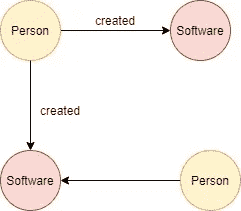
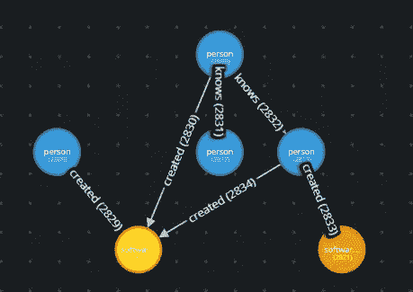

# 图形数据库和 Gremlin 的基础知识

> 原文：<https://medium.com/geekculture/basics-about-graph-database-and-gremlin-5a26c3b51377?source=collection_archive---------10----------------------->


All about a better-connected world

为您的应用程序选择一个数据库有它自己的需要匹配的检查点列表。是的，现在存在某些类型的数据库，如关系数据库、NoSQL 数据库、键值数据库、文档数据库、时间序列数据库和图形数据库。今天，本文将深入探讨图形数据库及其模型。关系是任何后台数据库系统存在的核心来源。在关系数据库中，这种关系是通过使用主表中被引用表的外键并利用连接来提取和构建所需格式的数据来建立的。因此，行和列数据被转换成关系，并以一种非常简单的格式存储。如果关系存储为关系，数据存储为实体本身，关系数据库中的行在代码级别转换为实体，并在保存回数据库时还原为行，并且随着关系保持在不断增长的连接上将使提取数据变得更加复杂，并且还会使维护复杂的关系查询变得令人头痛。通过使用图形数据库，这些问题在非常核心的层面上得到了解决。

图形数据库建立在一等公民关系的基本原则上，可以被标记、引导和赋予属性。行变成了节点，关系变成了边。图形数据库基于图论，由一组对象组成。

1.  **节点**:节点代表实体，可以是任何人、学生、老师、用户或任何其他对象。它们类似于关系数据库中的行条目或文档数据库中的文档。
2.  **边:**边表示数据库中一个节点与其他节点的关系。边被表示为将一个节点连接到另一个节点的线，并且边是在节点之间建立有意义的关系的关键概念。
3.  **属性:**属性类似于关系数据库中的列。它附加了一些用节点表示的标签，并定义为节点属性。属性附加到节点以扩展其信息。

让我们举一个例子，构建一个包含人和软件实体的简单图形表示。



Simple Person graph model

人和软件之间的关系以*创建*边的形式存在。一个开发软件的人拥有超越软件的优势。软件可以由一组人来创建，所以我们也可以从人到软件有多种优势



Simple Person graph model

现在，由于定义了节点和边，可以使用 gremlin 查询语言来查询图形数据。 *Gremlin* 是 Apache thinkerpop 开发的一种图遍历语言。Apache TinkerPop 和 Gremlin 之于[图形数据库](https://en.wikipedia.org/wiki/Graph_databases)，就像 [JDBC](https://en.wikipedia.org/wiki/Java_Database_Connectivity) 和 [SQL](https://en.wikipedia.org/wiki/SQL) 之于[关系数据库](https://en.wikipedia.org/wiki/RDBMS)一样。

我们可以使用 Gremlin 简单地遍历图形:

1.  获取按标签分组的所有节点计数:

```
g.V().label().groupCount()
=> [person:4, software:2]
```

2.获取由 ID 为 1 的人创建的所有软件

```
g.V("1").out("created").elementMap()
=> [label=>software name=>CMS createdAt=> 26/05/2012]
```

3.获取所有创建了 ID 为 1 的软件的人

```
g.V("1").in("created").elementMap()
=> [label=>person name=>John]
=> [label=>person name=>Rohan]
=> [label=>person name=>Scott]
```

4.获取名为约翰的人

```
g.V().has("person","name","john").elementMap()
=> [label=>person name=>John]
```

Gremlin 查询语言提供了许多不同的操作，可以执行这些操作来格式化和聚合数据。如果你想了解更多关于 Gremlin 查询的细节，点击链接到[电子书](http://kelvinlawrence.net/book/Gremlin-Graph-Guide.pdf)。另外，我推荐你去[小妖精游乐场](https://gremlify.com/)快速上手。

有任何疑问吗？让我们马上在评论区联系或分享吧。

Linkedin: [Ankit Garg](https://www.linkedin.com/in/%F0%9F%91%A8%E2%80%8D%F0%9F%92%BB-ankit-garg-390056116/)