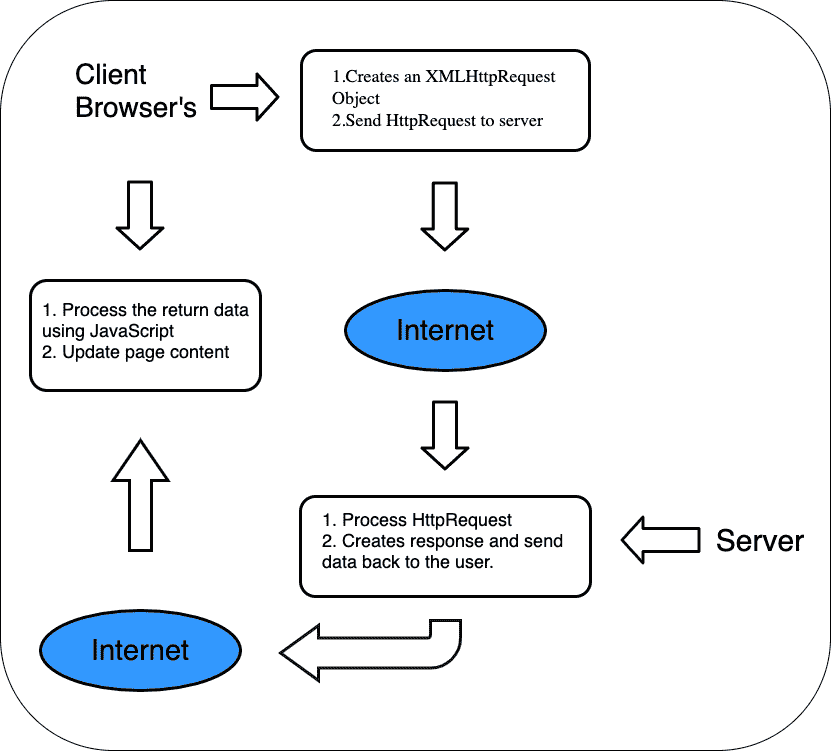

# ASP.NET 核心 Ajax 控件工具包基础

> 原文：<https://medium.com/geekculture/basics-of-asp-net-core-ajax-control-toolkit-2d40df72b463?source=collection_archive---------68----------------------->

在应用程序开发领域，各种技术都随着时间的推移而发展。尽管如此，开发人员仍在努力使应用程序更快、更可靠、响应更快、更友好。

Ajax Control Toolkit 是为应用程序开发人员开发可靠和更快的应用程序的解决方案。我们已经可以在谷歌地图、YouTube、脸书、Gmail 等应用中看到它的用处。在这篇博客中，让我们了解什么是 ASP.NET 核心中的 Ajax 控制工具包，以及它是如何有用的。

**目录**

*   背景
*   什么是 Ajax？
*   什么是 ASP.NET 核心 Ajax 控制工具包？
*   ASP.NET 核心 Ajax 控件工具包有多强大？
*   基于 Ajax 的应用程序的优势
*   结论

# 背景

我们经常在传统网站中看到与性能相关的问题，因为它们无法处理服务器上的巨大流量。以下是他们面临的一些共同问题-

*   网页渲染速度较慢。
*   服务器资源消耗增加。
*   应用程序的响应时间较慢。
*   数据呈现是静态的。
*   只有点击刷新按钮，数据才会更新。
*   到服务器的多次往返。

# 什么是 Ajax？

异步 JavaScript 和 XML (Ajax)是 HTML、JavaScript、CSS 和 DOM 等不同技术的结合。通过在后台修改服务器中的少量数据，Ajax 允许网页异步更新。这意味着无需重新加载整个网页，就可以根据用户的要求更新网页的一部分。

它是一种独立于平台的技术，可以在各种操作系统上使用。Ajax 也支持其他技术的开源实现。它用于开发更快、更好、更具交互性的 web 应用程序。

Ajax 也可以定义为一种客户端技术，它有助于 web 服务器和用户界面之间的异步通信，从而有助于呈现部分页面而不是完整页面。

以下是 Ajax 的工作原理:

# 什么是 ASP.NET 核心 Ajax 控制工具包？

Ajax Control Toolkit 是一个 web 开发工具，是一个开源库。这是 ASP.NET Ajax 社区和微软的共同努力，为编写可定制、可重用和可扩展的 ASP.NET Ajax 扩展程序和控件提供了一个非常强大的基础设施。

为了 Ajax 应用程序中更多的客户端功能，使用了扩展器，这些扩展器是与现有服务器耦合的服务器。例如，想象一个删除按钮。删除前通常会向用户发送一条警告消息。这通常是 JavaScript 的工作。但是在这里，开发人员可以使用工具箱中的 ConformButtonExtender 控件。

为了提高工作效率，该工具包包含 40 多个易于使用的现成控件。开发人员只需简单地拖放 Visual Studio 工具箱中可用的控件，就可以将它们与正在开发的 web 应用程序集成在一起。可用的控件有日历、水印、颜色选择器、自动完成、幻灯片扩展、模式弹出扩展等。

DevExpress 团队维护着 ASP.NET Ajax 控件工具包。该工具包的最新版本是 ajaxcontroltoolkit . installer . 20 . 1 . 0。为了修复控件中的错误，最新版本中提供了许多增强功能。

# ASP.NET 核心 Ajax 控件工具包有多强大？

从 ASP.NET 2.0 开始，客户端脚本库已经被 Ajax 和 ASP.NET 集成在一起。这种 web 开发技术提供了 Ajax 的好处，Ajax 是一种带有编程模型的交互式用户界面。这使得向您正在开发的应用程序中添加 Ajax 变得非常简单，从而确保开发变得更加容易

您可以使用 HTML 和 Javascript 来立即更新您的 UI，并向服务器生成一个异步请求。这有助于通过简单的点击按钮获取结果。

在使用 JavaScript 和 CSS 生成响应时，您可以更新 UI，而无需完全刷新网页。在执行此过程时，用户可见的窗体不会闪烁、消失、闪烁或停止。

您获得了与服务器异步通信的能力，而不需要使用 XMLHttpRequest 刷新浏览器。这就是 Ajax 的真正威力所在。JavaScript 技术和 XMLHttpRequest 对象通过 Ajax 放在服务器和 webform 之间。所有这一切都发生在后台，只有最少的响应和请求周期，用户对此一无所知。

# 基于 Ajax 的应用程序的优势

*   快速和光滑的用户界面，没有页面闪烁。
*   消除了传统网页中经常出现的页面刷新。
*   通过减少从服务器下载的数据量来提高应用程序的性能。
*   适用于各种网络浏览器。
*   数据的动态呈现。
*   有了 Ajax 实现，实现就很容易了。
*   更少的服务器资源消耗。
*   更快的应用程序响应时间。

# 结论

不管实现的复杂性如何，Ajax 无疑是 web 应用程序开发的未来。通过适当的应用程序设计和必要的网络架构，Web 应用程序可以从批处理方式转移到接近桌面的交互性。

*原载于*[*https://www . partech . nl*](https://www.partech.nl/nl/publicaties/2021/05/basics-of-asp-net-core-ajax-control-toolkit)*。*