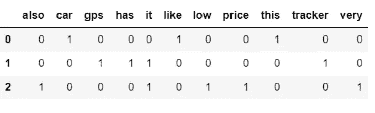
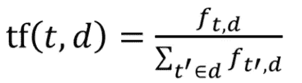
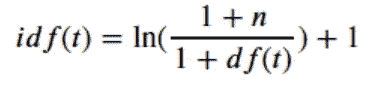
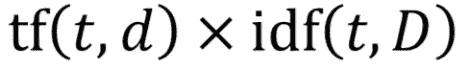
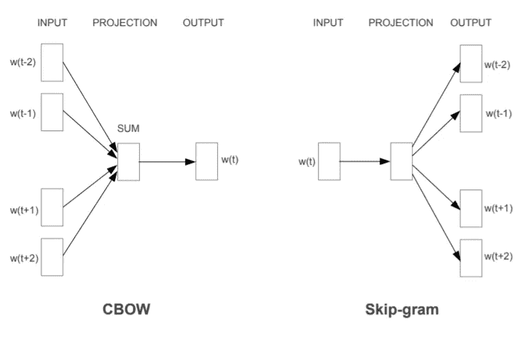
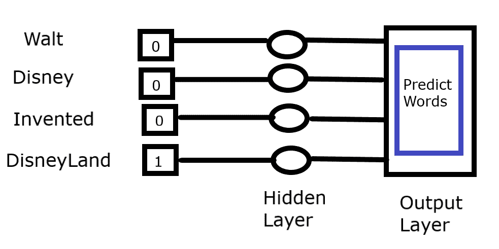
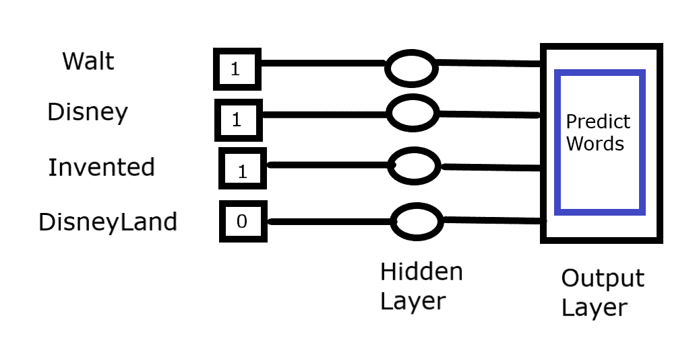
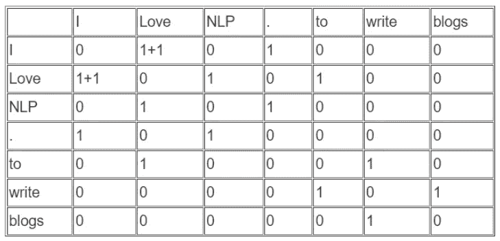
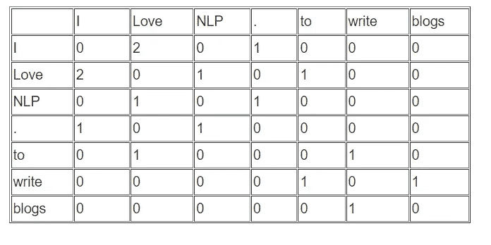

# 初学者自然语言处理基础

> 原文：<https://medium.com/geekculture/basics-of-natural-language-processing-for-beginners-d86351df9d09?source=collection_archive---------3----------------------->

自然语言处理(NLP)是人工智能(AI)的一部分，处理人类语言的理解和处理。实际上，大部分数据以非结构化的形式存在，如文本、视频、图像等。非结构化类别中的大量数据将以文本形式出现。为了用机器学习算法处理这些文本数据，NLP 开始发挥作用。

NLP 用例有语言翻译、语音识别、雇佣和招聘、聊天机器人、情感分析等等。

## **例子:**

1.  **感伤分析**

情感分析预测评论是正面还是负面。

*正面评论:*

*   “爱手机。这款手机时尚、流畅、漂亮，我强烈推荐这款手机，你不会后悔买了这款手机。”

*差评:*

*   “电话耳机质量很差，你打电话时没听懂戎语，听起来很糟糕，不推荐这篇文章。我想把它还回去，但是从委内瑞拉还回来很困难，而且很贵，因为在我的国家美元很少，而且会比…

**2。命名实体识别**

它的任务是从文本中识别和分类实体。

*输入:*

多尼是印度队著名的板球运动员之一。

*输出:*

Dhoni |人

印度|国家

# **NLP 中使用的术语**

*   **文集**指文档或文本文件的集合。来自 twitter 的 tweet 数据是一个语料库。
*   定义为**的文本样本文档**。每条推文都是一个文档。
*   文件由**句**组成。每条推文都有一个或多个句子。
*   一个文本被分成更小的单元，称为**记号**。每个 tweet 句子都有一个或多个标记。

# **文本的自然语言处理技术**

自然语言工具包(NLTK)是构建 Python 程序来处理人类语言数据的领先平台。它为分类、标记化、词干提取、标记和解析提供了预定义的功能。

这里探讨一下**[**https://www.nltk.org/**](https://www.nltk.org/)**

# ****标记化****

**记号化是将文本分割成称为记号的更小单元的过程。这个记号包括句子、单词、符号、数字等。,**

**有不同类型记号赋予器，例如空白记号赋予器、Tweet 记号赋予器、Regex 记号赋予器、单词记号赋予器、句子记号赋予器。**

**空白标记器是常用的一种，但它取决于使用案例。**

****记号赋予器的例子:****

**让我们导入 nltk 和不同形式的记号赋予器。sent_tokenizer 函数应用句子级标记化，word_tokenizer 函数应用单词级标记化，TweetTokenizer 函数应用 twitter 数据的标记化，如下面的代码示例所示。**

**对于 Sent_tokenizer 输出，输入被分成两个单独的句子。在 Word_tokenizer 输出中，输入被分成四个单词。在 TweetTokenizer 输出中，输入被分成十个单词、符号等。,**

# ****归一化****

> **规范化是从单词中去除屈折变化的过程。**

**文档可能包含提供有意义信息的语法，但这些单词不会影响文本处理。为了消除它，让我们使用诸如词干化和变元化之类的技术来消除音调变化。**

**示例:**

*   **麻烦，麻烦，麻烦= >麻烦**
*   **是，是，是= >是**

> ***词干化*指的是砍掉词尾的过程，希望在大多数时候都能正确实现这一目标，通常还包括去除派生词缀。**
> 
> ***引理化*指的是通过使用词汇和单词的形态学分析来正确地做事情，通常旨在仅移除屈折词尾，并返回单词的基本形式或词典形式，这被称为*引理。***

****词干对比词汇化****

**词干化和词汇化都消除了单词的词形变化。然而，词干化会产生字典中没有的单词，因为它不使用任何词性标记、词汇和与单词的语法关系，而词汇化则一步一步地使用上述所有过程并产生所需的单词。**

**下面的代码说明了词干化和词汇化。**

# ****停止字****

**停用词是对文章没有多大意义的常用词。这些词需要在文本预处理阶段去除，否则会在处理文本时产生噪声。**

****示例:****

*   **连词:for，and，nor，but，or，yet，so**
*   **文章:一个，一个，的**

****从 nltk.corpus 导入停用词**允许导入停用词模块。NLTK 有预定义的英语停用词，可以通过**停用词.单词('英语')导入。****

**Tokenizer 用于从文本中获取标记，使用这些标记，停用词被移除并放置在 text_without_stopwords 中。**

**代码示例:**

## ****鞠躬(包话)****

**如前所述，NLP 使用机器学习算法处理文本数据。文本不能作为 ML 算法的输入，文本需要转换成向量。这个过程也称为从文本中提取特征。对于这种转换，可用的技术是 BOW(单词包)和单词嵌入。**

**单词包表示单词在文档中的出现。通过实现标记化、忽略停用词、应用规范化和应用进一步的预处理步骤，我们跟踪并收集词。在这里，模型关注的是这个词是否存在于文档中，是否有唯一的集合。这种方法是从文档中提取特征的一种简单而灵活的方式。**

****制作蝴蝶结的步骤****

*   **导入必要的库并加载文本。**
*   **文本预处理和词汇收集。**
*   **实现矢量器。**

**让我们从 NLTK 导入所有必要的库来执行前面讨论过的预处理技术，比如标记化、规范化、忽略停用词。此外，在下面的代码中，在执行词汇化时，特殊字符被删除，文本大小写改为小写，以便对所有文本执行相同的大小写。**

****导入必要的库&加载文本****

****文本预处理&词汇采集****

**词汇收集可以通过两种方式来完成。简单的实现方法是使用 Scikit-learn 的计数矢量化工具，或者按照所有预处理步骤进行矢量化。**

*   ****不带计数矢量器的词汇集合:****

**输出:**

*   ****使用计数矢量器收集词汇:****

**接下来，我们需要将文本转换成矢量。最简单的方法是用 1 表示有单词，用 0 表示没有单词。为此，我们需要实现[计数矢量器。](https://scikit-learn.org/stable/modules/generated/sklearn.feature_extraction.text.CountVectorizer.html)**

**输出:**

****矢量器****

*   ****无计数矢量器:****

**检查文档中是否有单词，如果有，则追加 1，否则追加 0。**

*   ****带计数矢量器:****

**输出:**

**更好地理解:**

**让我们考虑第一句话“我喜欢这辆车”。现在观察 count vectorizer 给出的向量，句子中的单词(即‘I’，‘like’，‘this’，‘car’)除了标记为 0 之外，还标记为 1。**

****

# **单词嵌入**

> **为什么要嵌入单词？**
> 
> **如果新句子包含新单词，那么我们的词汇量将增加，因此，向量的长度也将增加，向量表示将有许多零，这被称为**稀疏向量**。这些向量在单词之间没有相邻或方向关系**

**单词嵌入技术有 TF-IDF(词频—逆文档频率)、Word2vec、Glove(全局向量)。**

## **1.TF-IDF**

> **词频定义为一个词在文档中出现的次数除以文档中的总字数。一般在某种意义上称为规范化。**

****

**Term Frequency**

> **逆数据频率定义为文档总数除以包含该单词的文档数的对数。在下面的公式 1 中，可能包括也可能不包括，这取决于你的意愿。这只是为了标准化。**

****

**Inverse Document Frequency**

**TF-IDF 定义如下**

****

## ****TF _ IDF 计算示例:****

*   **让我们假设单词“system”在 10000 单词的文档中出现 6 次。计算 TF？**

**TF=的数量。单词出现次数/总字数**

**TF= 6/10000=>0.006**

## ****TF=0.006****

*   **让我们假设“系统”这个词在 10000 个文档中出现 60 次。计算 IDF？**

**IDF =日志(编号。文件总数/件数。包含该单词的文档)**

**IDF=log(10000/6)=>3.21**

## ****IDF=3.21****

**TF-IDF=0.006 * 3.21**

## ****TF-IDF=0.01926****

**Scikit-learn 的 TfidfVectorizer 允许应用 TF-IDF 单词嵌入技术。**

****代码示例:****

**输出:**

****

**从上面的输出中，让我们尝试手动输入第一句话“我喜欢这辆车”。考虑 TF-IDF 计算文本中的“汽车”一词。**

****计算:****

**总字数= 11**

**TF=1/4=>0.25**

**IDF=log(3+1/1+1)=>1.308**

**TF-IDF=0.25 * 1.308=>0.327**

**Scikit-learn 实现在 TF 和 IDF 之间的产品上应用标准化**

**“车”字的归一化=平方根(0.327) => **0.57****

## **2. **Word2vec****

**2013 年发明的 Word2vec。它仅通过考虑预测单词的局部共现来预测向量。通过查看窗口大小的范围来进行单词预测。**

**Word2vec 结合了两种架构，如 CBOW 和 Skip-Gram。在 CBOW(连续单词包)中，我们试图通过循环许多单词来预测单词，而在 Skip-Gram 中，我们试图通过给定的特定单词来模拟上下文单词。下面的架构说明了同样的情况。**

****

**[https://arxiv.org/pdf/1309.4168v1.pdf](https://arxiv.org/pdf/1309.4168v1.pdf)**

**在 Word2Vec 中，相似的单词一起位于向量空间中，并且对单词向量的算术运算可以提出语义关系。**

**比如:“国王”——“男人”+“女人”= >“女王”**

****跳格示例:****

**问:华特·迪士尼发明了迪士尼乐园。在这个句子中，让我们预测迪斯尼乐园这个词。**

**Word2vec 是由神经网络构建的。众所周知，我们不能将文本作为输入传递给模型，所以我们需要通过将预测单词标记为 1 而将其他单词标记为 0 来将单词转换为向量。为了预测“迪斯尼乐园”这个词，赋予它很高的权重。因此，输出层(软最大值)准确地预测具有高权重的单词..**

****

****Skip-Gram Example Architectur**e**

****CBOW 的例子****

**问:华特·迪士尼发明了迪士尼乐园。在这个句子中，让我们预测除了迪斯尼乐园以外的所有单词。**

**这里，我们需要通过 skip-gram 模型的逆过程，通过对除“迪士尼乐园”之外的所有单词赋予高权重来预测单词**

****

****CBOW Example Architecture****

****代码示例:****

**在查看代码示例之前，我建议先了解一下 [Gensimword2vec](https://radimrehurek.com/gensim/models/word2vec.html)**

## **3.手套(全局向量)**

**[手套](https://nlp.stanford.edu/projects/glove/)发明于 2014 年。这是一种无监督的学习算法，通过向量来表示单词。与 word2vec 相比，它可以更好地捕捉整个语料库中的单词-单词共现。换句话说，它通过估计语料库中其他词的概率来创建全局共现矩阵。**

> **为什么 Glove 比 Word2vec 好？**
> 
> **这两个模型本质上是相同的，它们从共现中学习向量。然而，Word2vec 是**预测**模型，而 GloVe 是**基于计数的**模型。该预测模型学习向量以提高预测精度，但是基于模型整体统计的计数是共现的。在手套中，比 word2vec 更容易训练更多的数据。**

****手套示例:****

**让我们考虑文本为“我爱 NLP。我喜欢写博客”。首先，从文本中找出所有唯一的单词，包括任何存在的特殊字符。接下来找出每个单词的共现。**

**例如，考虑单词“I”并找到“I”的左右单词(即，单词的同现)。所有同现词标记为 1，其他标记为 0。**

****

**上表汇总。**

****

**Glove Vectors Representation**

# **资源**

1.  **[https://nlp.stanford.edu/pubs/glove.pdf](https://nlp.stanford.edu/pubs/glove.pdf)**
2.  **[https://www.nltk.org/](https://www.nltk.org/)**
3.  **[https://radimrehurek.com/gensim/](https://radimrehurek.com/gensim/)**
4.  **[https://sci kit-learn . org/stable/modules/generated/sk learn . feature _ extraction . text . count vectorizer . html](https://scikit-learn.org/stable/modules/generated/sklearn.feature_extraction.text.CountVectorizer.html)**
5.  **[https://sci kit-learn . org/stable/modules/feature _ extraction . html](https://scikit-learn.org/stable/modules/feature_extraction.html)**
6.  **[https://sci kit-learn . org/stable/modules/generated/sk learn . feature _ extraction . text . tfidftransformer . html](https://scikit-learn.org/stable/modules/generated/sklearn.feature_extraction.text.TfidfTransformer.html)**

**我很想听到一些反馈。感谢您的宝贵时间！**