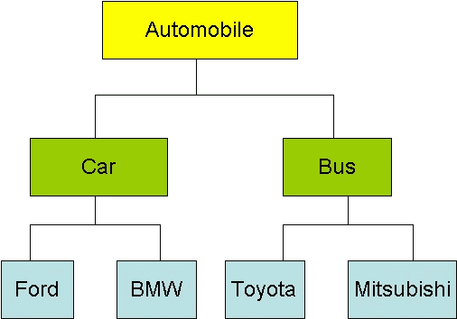
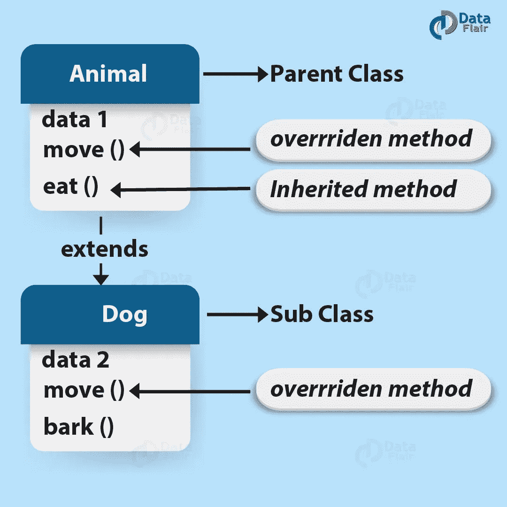
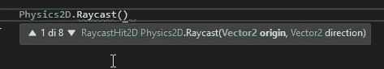

# 从游戏开发的角度看 OOP 的基础

> 原文：<https://medium.com/geekculture/basics-of-oop-from-a-game-development-point-of-view-de87c894f65?source=collection_archive---------9----------------------->

**目标**:通过与常见的游戏概念进行清晰的类比来理解 OOP 基础

当我第一次学习 **OOP** ( **面向对象编程**)时，我试图找到一个关于**类**和**子类**概念的实用解释。

你肯定听说过

> 类是对象的蓝图

嗯，没错。但既然是游戏开发，那就找个更好的类比吧。我能得到的最好的结果是一个对象的*类*和一个 RPG 角色的*类*之间的比较。

Image from [Class Inheritance in C# | C# tutorial by Wideskills | Inheritance, Class, Understanding (pinterest.it)](https://www.pinterest.it/pin/712272497290599853/)

> **玩家**是它自己的一个职业，但是它可以是一个**战士**或者**游侠**或者其他什么。它们都有一些共同的**属性**和**方法**，比如**生命值**或**耐力**和**移动**或**攻击**，来自**父类**。此外，他们都有独特的和个人的属性和方法，特别的。
> 
> 以此类推，战士和游侠**从玩家那里继承**。

在 OOP 中，在这种情况下不需要复制代码:扩展一个基类允许**继承字段和方法**而不需要在子类中重写它们。

> 而且攻击方式在战士和游侠中可能会有**不同的实现**。例如，Warrior 可以使用基本实现加上一些逻辑，而 Ranger 可以有一个不同的新实现。

Image from [Method Overriding in Java with Rules and Real-time Examples — DataFlair (data-flair.training)](https://data-flair.training/blogs/method-overriding-in-java/)

在 OOP 中，**多态**就是我们所说的:提供一个**单个*****接口******用于多种用途**的可能性。特别是，上面的例子被称为**覆盖**:重写继承方法的逻辑的行为，因此它不同于父方法。

> *这里我所说的 ***接口*** 是指消费者和可消费实体之间的层，例如位于调用者和方法内部逻辑之间的方法签名。

Unity RaycastHit2D method has 8 overloads: 8 different signatures, 8 different argument lists each of them leads to a specific logic.

多态性是一个相当复杂的概念，可以通过许多其他方式实现。除了覆盖之外，还有**重载**的概念:在一个类中，同一个方法可能有许多不同的实现，它们中的每一个都在**签名**中有所不同:作为参数接受的参数的类型和/或数量。

> 我们可以有一个**施放**的方法，来施放一个法术，和**两个过载**:一个带**无参数**，另一个带**武器参数**，在徒手或使用法师杖施放法术时有不同的行为。

但这还不是全部！另一种有趣的多态形式是涉及**接口**的多态。**接口**不参与类扩展，而是参与**接口实现**。它们与类的区别在于它们的内容:它们不携带字段和方法，而**只是方法的签名**——所以没有逻辑。

Image from [OOP Inheritance & Polymorphism — Java Programming Tutorial (ntu.edu.sg)](https://www3.ntu.edu.sg/home/ehchua/programming/java/J3b_OOPInheritancePolymorphism.html)

当一个类实现一个接口时，它同意**一种契约**，其中它必须实现接口中列出的所有方法的逻辑——作为签名。

> 玩家、容器、障碍和敌人类实现了**id imageable**接口，该接口迫使他们实现了**伤害**方法的逻辑。这是可以理解的，因为这些类的所有对象都可能被损坏，可能以不同的方式造成不同的后果。

接口也可以作为方法接受的参数的**类型。这意味着该方法将接受*任何*对象，或*任何*类实现该接口！**

> 玩家攻击方法将接受一个**id imageable 作为参数**，原因是玩家攻击应该指向游戏世界中任何可损坏的东西——容器、障碍物、敌人——这样**我们就不需要编写 N 个不同的重载了！**(N 是实现接口的类的数量)。实现 IDamageable 的不同类之间的唯一共同点是存在损害方法，因此玩家攻击将在该方法的调用内部，这将为每个类提供不同的实现！

Robert (Uncle Bob) C. Martin, creator of the SOLID principles. Image from [Wikipedia](https://en.wikipedia.org/wiki/Robert_C._Martin)

我要留给你一些更高级的东西。OOP 的坚实原则，以及对每个原则的简要解释。实心代表:

1.  **单一责任原则**(SRP)
    *】:全方位的“神课”是不好的做法。*
2.  ***打开/关闭原则**
    “类*应该对扩展开放，但对修改*关闭”，你应该能够扩展一个类的行为而不修改它。这意味着类应该设计有一个强大的基本核心，在需要时可以很容易地用子类扩展，而不是更新现有的代码。*
3.  ***利斯科夫的替代原理** (LSP)
    这很酷。子类必须可以替换它们的基类或父类。这意味着子类必须以这样一种方式设计，即允许它们替换父类而没有意外的行为。比如长方形延伸形状可以，延伸汽车不行。或者更好，正方形延伸矩形延伸形状。正方形可以很容易地(并且正确地)用来代替长方形。*
4.  ***接口分离原则** (ISP)
    *“永远不要强迫客户端实现它不使用的接口，或者不要强迫客户端依赖它们不使用的方法。”这很容易理解:不要用不需要的方法来淹没类，实现无用的接口:一个灯泡可以实现 ITurnable(打开或关闭),但不能实现 IShift，后者更适合移动的车辆！**
5.  ***依赖倒置原则** (DIP)
    *“类要靠抽象，不能靠具体化”。*最后一个原则意味着高级实体和低级实体应该使用抽象松散耦合。已经提供了一个简单的例子:当玩家攻击时，它不依赖于特定的目标——一个容器、一个敌人或一个障碍物——接口的使用将玩家与目标松散耦合(几乎完全没有耦合)。如果我们不这样做，例如编写 3 个重载，我们可能会发现自己需要修改玩家类代码来包含第四种目标！*

*如果你喜欢这篇文章，请鼓掌并分享！
也看看我的其他游戏或者我的支持页面吧！*

****