# Python 基础—第一部分

> 原文：<https://medium.com/geekculture/basics-of-python-part-i-9052496f69ca?source=collection_archive---------8----------------------->

# 变量

编程中的一个主要概念是**变量。他们是你最好的朋友。你会一直和他们打交道。您将使用它们来存储信息。它们将代表您的数据输入。**

假设你想让变量 *x* 等于 5 的值，然后让计算机告诉你这个变量的值。类型 x 等于 5。

写 x 然后执行。这是结果——5。

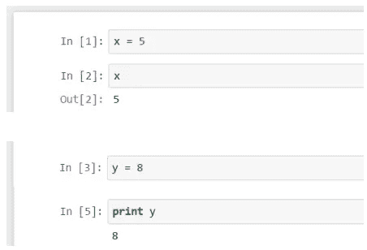

执行将提供我们分配给 *y* 的值的指令的另一种方法是使用 *print* 命令。

如果我们说 *print(y)* ，机器将简单地执行该命令，并提供 *y* 的值作为*语句。*

# 数字和布尔值

在编程时，不仅仅是在 Python 中，如果你说一个变量有一个数值，你就是在模棱两可。原因是数字可以是**整数**或**浮点**，也称为**浮点，例如**。

*整数—* 不带小数点的正数或负数。[例如 5，10，-3，-1]

*浮点(float)——*实数。因此，他们有一个小数点。[例如 5.222，6.3132，34.312]。

*布尔值—* 一个真或假，对应机器理解 1 和 0 的逻辑，开或关，对或错，真或假。

# 用线串

字符串是由一系列字符组成的文本值。

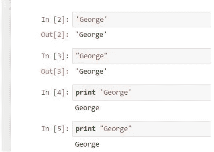

在名字 George 周围键入单引号或双引号。如果不使用 print 命令，Python 会显示“George”。如果您使用 print，输出将显示为不带引号——您将能够看到纯文本。

要输入“我很好”,你需要英语语法中的撇号，而不是 Pythonic 式的。

在这种情况下，您可以区分这两个符号——将文本放在双引号内并保留撇号，这在技术上与 *I* 和 *M* 之间的单引号一致。

另一种方法是将引号放在两边，并在短语中的省略号前加一个反斜杠。这个反斜杠被称为**转义字符，**，因为它改变了紧随其后的字符的解释。

要声明“按 Enter”，外部符号必须不同于内部符号。在两边加上单引号。

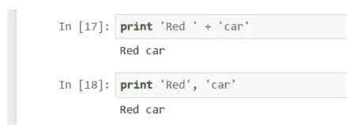

比方说，你希望在同一行上打印“红色汽车”。通过在两个字符串之间键入加号，将其中一个字符串“添加”到另一个字符串中。在第一个单词的第二个撇号前放一个空格。

键入“print 'Red '”，然后放一个逗号，这个逗号被称为一个**尾随逗号，**Python 将在同一行打印下一个单词‘car’，用空格分隔两个单词。

# 算术运算符

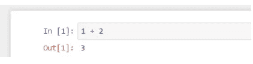

在你这里看到的等式中，1 和 2 被称为**操作数，**加号和减号被称为**运算符，**如果它们也表示算术运算，它们可以被称为**算术运算符。**

*   + =加法
*   — =减法
*   * =乘法
*   ** =功率
*   / =除
*   % =余数

# 双重等号

当编程表示“分配”或“绑定”时，*等于*符号。比如“给变量 y 赋值 5 的 3 次方”；“将 5 的 3 次方绑定到 y”。从那时起，对计算机来说，y 将等于 125。

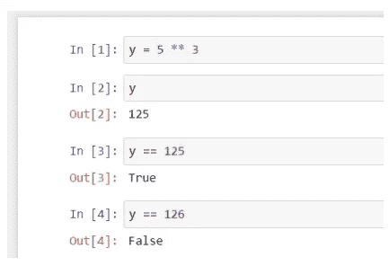

当你指的是值之间的相等而不是 Python 中的赋值时，你将需要**双等号。任何时候你使用它，你都会得到两种可能的结果——“真”或“假”。**

# 重新分配值

如果将值 1 赋给变量 z，执行 z 后的输出将是 1。之后，如果你给同一个变量 z 赋值 3，z 就等于 3，不再是 1 了。

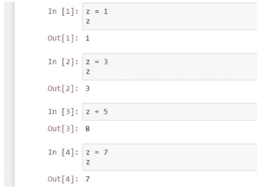

Python **将**的值重新分配给它的对象。因此，请记住最后一个命令是有效的，旧的命令将被覆盖。

# 添加评论

**注释**是计算机没有执行的句子；它不会把它们当成指令来读。诀窍是在您想要插入作为注释的每一行的开头放置一个*散列(#)* 符号。

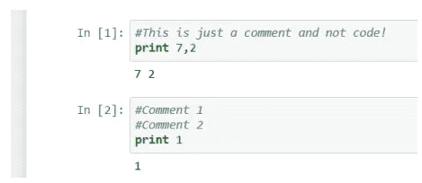

如果你想在两行上留下注释，不要忘记在每行的开头加上散列符号。

# 行延续

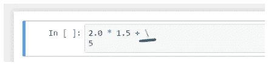

您可能更喜欢将部分代码发送到下一行。所以，2.0 乘以 1.5 加 5 可以写成两行，而机器仍然可以把它当作一个命令来读。这可以通过在你希望第一行结束的地方加一个反斜杠来实现。它表示您将在新的一行上继续执行相同的命令。

# 索引元素

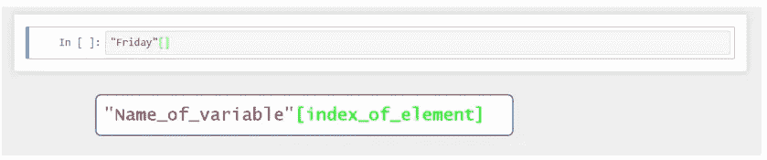

有可能提取字母“d”吗？

是的，你可以通过使用方括号[] 来实现*。在它们里面，你应该指定你想要提取的字母的位置。*

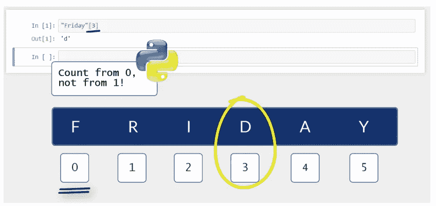

你要记住的一个很重要的事情是，**在 Python 中，我们是从 0 开始计数，而不是从 1 开始计数！** 0，1，2，3，4 等等。这就是为什么我要第四个字母 d，在这里写 3。

# 用缩进来构造你的代码

你在实践中使用苹果**压痕**的方式很重要，因为这将是你将想法正确传达给机器的唯一方式。

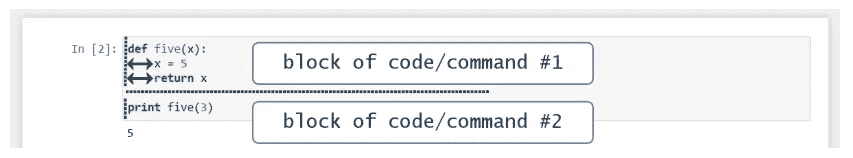

*Def* 和 *Print* 形成两个独立的、以这种方式书写的、清晰可辨的**代码块**或**命令块。**

所有与函数相关的内容都是用一个缩进写的。一旦你决定写别的代码，就从新的一行开始，不要缩进。代码块更加清晰可见，这澄清了您用来解决问题的逻辑。

# 比较运算符

*   **== :** 验证等式的左右两边是否相等。
*   ！=:验证等式的左侧和右侧不相等。
*   > :大于
*   < : Less than
*   > =:大于或等于
*   <= : Less than or Equal to

# LOGICAL OPERATORS

Briefly, the **逻辑运算符** Python 就是单词**“非”、“与”、“T6”和**“或”。**它们比较一定数量的语句并返回布尔值——“真”或“假”——因此它们的第二个名字是**布尔运算符。****

“Not”=引出所给陈述的反义词。

“And”=检查它周围的两个语句是否为“True”。

“Or”=检查是否至少有一个语句为“真”。

你必须尊重这三个操作符的重要性顺序。就是:先有“不是”，再有“和”，最后是“或者”。

# 标识运算符

**标识运算符**为单词**“是”**、**“不是”**。它们的功能类似于我们前面看到的双等号、感叹号和等号。

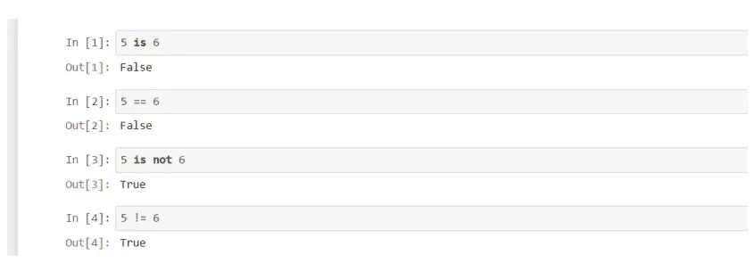