# Python 基础—第二部分

> 原文：<https://medium.com/geekculture/basics-of-python-part-ii-77d814f440c0?source=collection_archive---------5----------------------->

# IF 语句简介

Python 中**条件语句**的一个突出例子是**“if”语句。**你能用它做什么很直观，但是学习语法很重要。

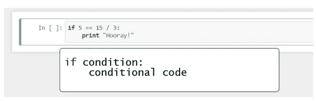

这个图表可以帮助你想象条件句的过程。在显示操作结果之前，机器遵循以下逻辑步骤。如果条件代码因为 if-condition 不为真而不被执行，程序将直接把你引向一些其他的输出，或者，就像在这个例子中一样，什么都没有。在这两种情况中的任何一种之后，机器将进入下一个黑点，并从那里继续前进。

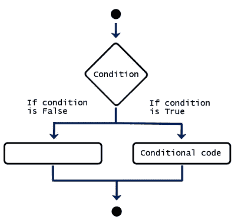

## 添加 ELSE 语句

**“Else”**将告诉计算机在所有其他情况下执行连续命令。

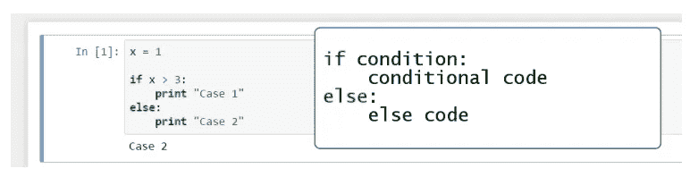

如果条件为假，我们将得到一个 else 代码，而不是导致没有输出。不管初始条件是否满足，我们都会到达终点，所以计算机已经完成了整个运算，并准备执行新的运算。

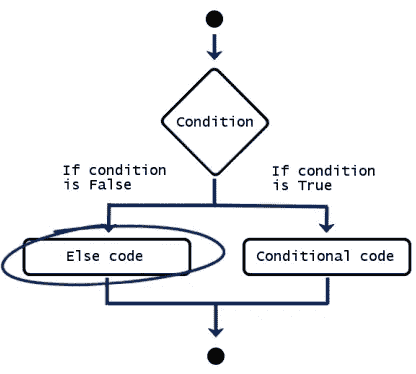

## ELSE IF，简称 ELIF

如果 y 不大于 5，计算机会想:“else if y 小于 5”，写成“ **elif** y 小于 5”，那么我就打印出“小于”。

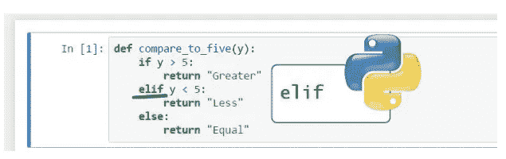

要知道，您可以根据需要添加任意多的 elif 语句。

你应该记住的一个非常重要的细节是，计算机总是从上到下读取你的命令。不管它的工作速度如何，它一次只执行一个命令。科学地说，我们给机器的指令是控制流程的一部分。这有点像计算机的逻辑思维流程，即计算机的思维方式——一步一步，按照严格的顺序执行步骤。

当它与条件语句一起工作时，一旦某个条件得到满足，计算机的任务将是执行特定的命令。它会从顶部的 if 语句开始，通过中间的 elif 语句，一直读到最后的 else 语句。当机器找到一个满足的条件时，它会打印相应的输出，并且不会执行该条件代码的其他部分。

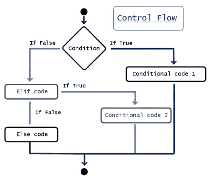

## 关于布尔值的一个注记

从某种角度来看，计算机系统中的一切都是布尔型的，由 0 和 1、“假”和“真”的序列组成。这就是我们关注布尔值的原因。它帮助我们理解一般的计算逻辑和 Python 中条件的工作方式。

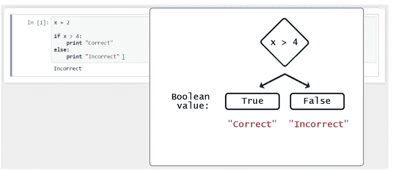

基本上，在你插入 if 语句后，计算机会给它附加一个布尔值。根据其结果的值，“真”或“假”，它将产生一个建议的输出，“正确”或“不正确”。

# 在 PYTHON 中定义函数

Python 的**函数**对于程序员来说是一个无价的工具。

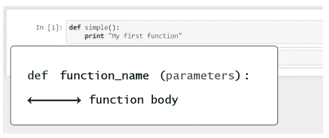

要告诉计算机你将要创建一个函数，只需在行首写上***【def】***。Def 既不是命令，也不是函数。这是一个**关键词。为了表明这一点，Jupyter 会自动将其字体颜色更改为绿色。然后，您可以键入您将使用的函数**的**名称。然后可以加一对**括号。从技术上讲，在这些括号内，如果需要的话，你可以放置函数的参数。拥有一个零参数的函数是没有问题的。****

要继续，不要忘记在函数名后面加一个冒号**。**

由于当函数变得更长时，在同一行上继续是不方便的，所以最好养成将指令放在新行上的习惯，再次用**缩进**。良好的易读性对良好的编码风格很重要！

## 创建带参数的函数

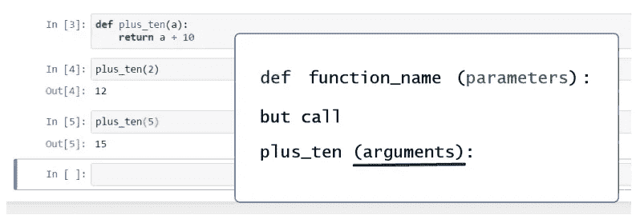

不要忘记**从函数中“返回”一个值。我们将需要 *plus_ten(a)* 为我们做一个具体的计算，而不仅仅是打印一些东西。**

**请注意以下几点。当我们定义一个函数时，我们在括号中指定一个**参数。**在 *plus_ten()* 函数中，“a”是一个参数。稍后，当我们调用这个函数时，正确的说法是我们提供了一个**实参，**不是一个参数。所以我们可以说“调用 *plus_ten()* 参数为 2，调用 *plus_ten()* 参数为 5”。**

**在编程中，**返回**视 y 的值；它只是对机器说“在函数 f 执行完操作后，把 y 的值返回给我”。“返回”在流程的第二步和第三步之间起着连接作用。换句话说，*函数可以接受一个或多个变量的输入，并返回一个由一个或多个值组成的* ***单个*** *输出。*这就是为什么“return”在一个函数中只能用一次。**

## **在另一个函数中使用函数**

**我们可以在函数中包含一个函数，这不是秘密。**

**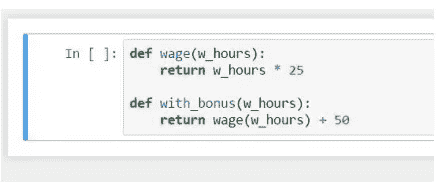**

**在*with _ bonus(w _ hours)*中，您可以直接返回以工作时间为输出的工资，这将是运行工资函数后获得的值加上 50。**

## **创建包含几个参数的函数**

**您可以在一个函数中使用多个参数。在 Python 中，实现这一点的方法是将所有参数放在括号中，用逗号分隔。**

**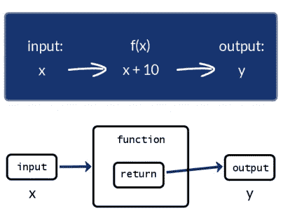****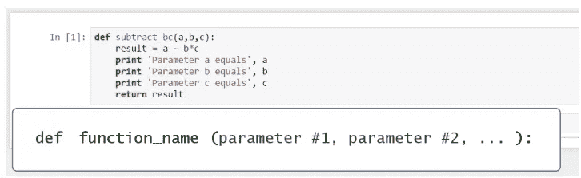**

**你可以调用 10，3，2 的函数。你会得到 4 英镑。**

**只是要小心陈述值的*顺序*。在这种情况下，我们将 10 赋给变量 a，3 赋给 b，2 赋给 c。**

**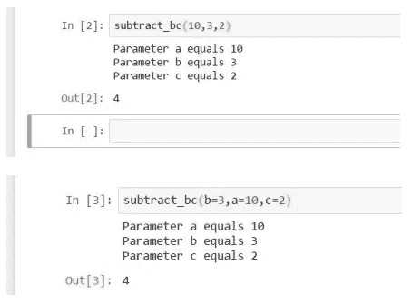**

**否则，当且仅当您在括号内指定变量的名称时，顺序就无关紧要了。**

## **PYTHON 中值得注意的内置函数**

**当你在电脑上安装 Python 的时候，你也在安装它的一些**内置函数。**这意味着您不必每次使用它们时都键入代码，这些功能已经在您的电脑上，可以直接应用。**

**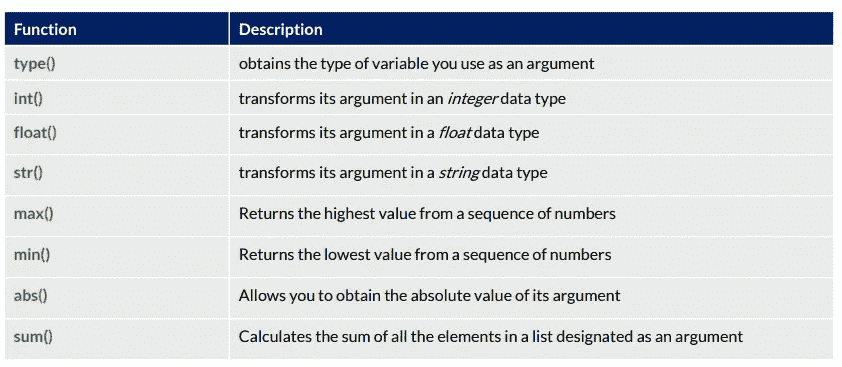**