# Python 基础—第三部分

> 原文：<https://medium.com/geekculture/basics-of-python-part-iii-ca344e86c2c4?source=collection_archive---------10----------------------->

# 列表

一个**列表**是一种数据点序列，比如浮点数、整数或字符串。

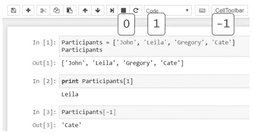

您可以通过索引值 1 来访问*参与者*列表。这意味着您已经提取了列表变量['Leila']中的第二个元素。

此外，还有一种方法可以到达列表中的最后一个元素——从末尾开始向开头计数。然后，你需要在数字前加上减号，不要陷入我们又要从 0 开始计数的思维陷阱！要获得“关心”，你得写-1。

## 用方法帮助你自己

下面是允许您调用现成的**内置方法**的语法，您不必自己创建这些方法，可以直接在 Python 中使用。

在**对象的名称之后，**在本例中是“参与者”列表，您必须加上一个点，称为**点操作符。**点运算符允许您**调用** on 或者**调用**某个方法。要调用“append”方法，说明其名称，后跟**括号。**

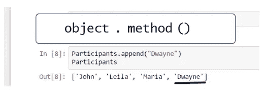

要在我们的列表中插入名称“Dwayne ”,必须将字符串“Dwayne”放在括号之间的引号中。

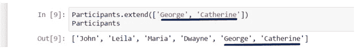

或者，使用“扩展”方法也可以获得相同的结果。这一次，在括号内，您必须添加括号，因为您将通过添加在这些括号中精确指定的列表来扩展“参与者”列表。

## 列表切片

许多必须解决的问题只涉及一小部分数据，在这种情况下，您可以应用切片。

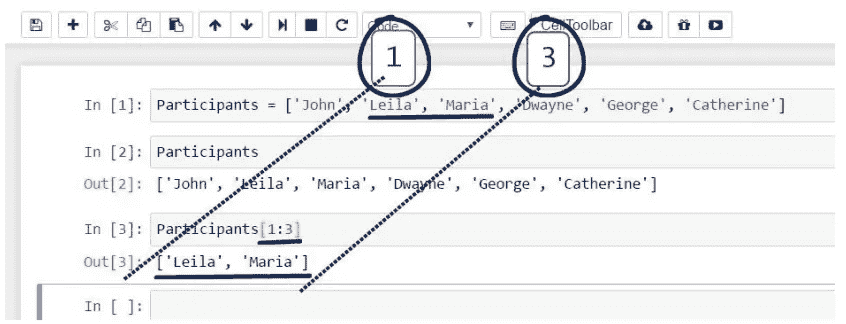

假设您想使用“参与者”列表获得第二个更小的列表，其中只包含两个名字— Leila 和 Maria。在 Pythonic 中，这意味着从第一个和第二个位置提取元素。为了访问这些元素，我们将打开方括号，就像我们对索引所做的那样，并编写 1 冒号 3。第一个数字精确地对应于第一个感兴趣的位置，而第二个数字比我们需要的最后一个位置高一个位置。

# 元组

**元组**是另一种类型的数据序列，但不同于列表，它们**是不可变的。**元组不能改变或修改；您不能追加或删除元素。

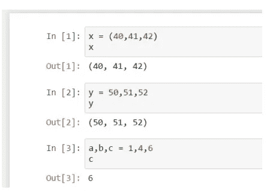

表明您有一个元组而不是一个列表的语法是，元组的元素放在圆括号内，而不是方括号内。

tuple 是 Python 中的默认序列类型，因此如果您在这里登记三个值，计算机会将新变量视为 tuple。我们也可以说这三个值将被**打包**成一个元组。

出于同样的原因，您可以将多个值赋给相同数量的变量。在等号的左边，添加一个变量元组，在右边，添加一个值元组。这就是为什么这个活动的相关技术术语是**元组赋值。**

# 字典

**字典**代表了存储数据的另一种方式。

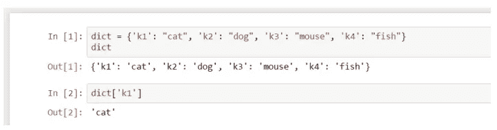

每个值都与某个**键相关联。**更准确地说，一个键和它各自的值组成了一个 ***键-值对。*** 某个字典创建后，一个值可以通过它的键来访问，而不是通过它的索引！

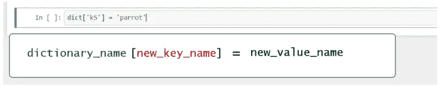

类似地，正如我们可以对列表所做的那样，我们可以通过以下方式向字典添加一个新值:这里应用的结构是字典名、括号内的新键名、等号和新值的名称。

# FOR 循环

**迭代**是所有程序的基本构建模块。就是反复执行某个代码的能力。

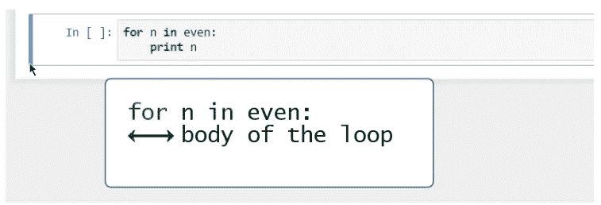

列表“偶数”包含从 0 到 20 的所有偶数。“对于偶数中的 n”，冒号，这将意味着对于列表“偶数”中的每个元素 n**，执行以下操作:打印该元素。**

*循环体中的命令对*偶数*列表中的每个元素执行一次*。**

# *WHILE 循环*

*在使用 while 循环而不是 for 循环后，可以获得与上一课相同的输出。然而，我们将使用的结构会略有不同。*

*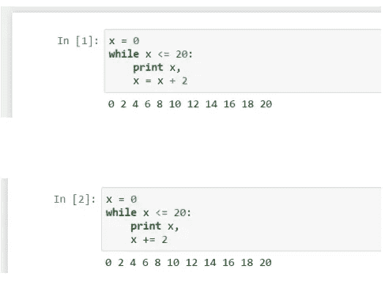*

*最初，我们将变量 x 设置为零。而我们会说:**而**这个值小于等于 20，打印 x*

*我们想把循环进行到底。应该成功的是,“while”块中的循环体是一行代码，它指定了 x 中的一个变化，或者在它被打印出来之后 x 会发生什么。在我们的例子中，我们将告诉计算机将 x 绑定到一个等于 x + 2 的值。*

*用编程术语来说，在一个循环中，在一个现有变量的顶部添加相同的数字称为**递增。**逐渐增加的量称为**增量。在我们的例子中，我们的增量是 2。***

*Pythonic 语法提供了一种特殊的方式来表示增量:x += 2*

# *具有范围功能的列表*

*当需要随机化数据点和带有数据点的列表时，可以使用 Python 内置的 range 函数。*

*该函数的语法如下:—*

*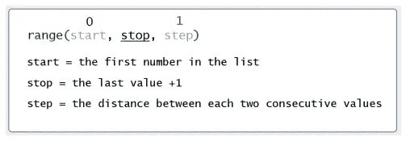*

*停止值是必需的输入，而起始值和步长值是可选的。如果未提供，起始值将自动替换为 0，并且步长值将被假定为等于 1。*

*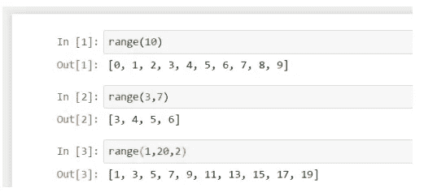*

**range(10)* 将提供一个包含 10 个元素的列表，从 0 开始，隐含在未指明起始值之后，到第十个连续数字— 9 结束。*

# *条件语句和循环*

*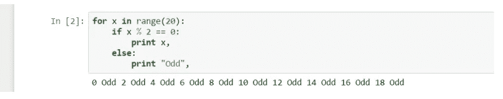*

*您创建了一个在循环体中包含条件的迭代。你可以告诉计算机打印 0 到 19 之间的所有偶数，并在我们有奇数的地方注明“奇数”。*

*让我们把这转化为计算步骤。*

*如果 x 除以 2 的余数为 0，这与说“如果 x 是偶数”是一样的，那么在同一行打印 x。“Else”，意思是除非 x 是偶数，或者 x 是奇数，打印“奇数”。*