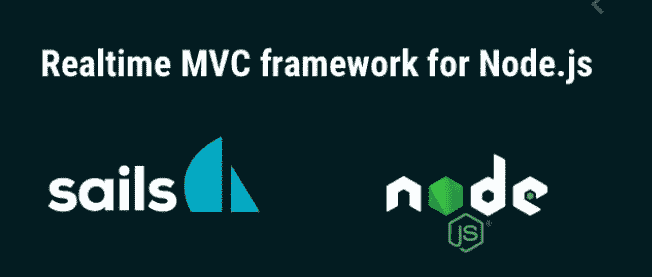

# Sails Js 基础——节点 Js MVC 框架

> 原文：<https://medium.com/geekculture/basics-of-sails-js-node-js-mvc-framework-418bdbeaf3cd?source=collection_archive---------17----------------------->



让我们从理解什么是 MVC 开始

***【M-Model】(涉及数据库和规则)***

***V - View(它是设计和视觉方面)***

***C 控制器(通过逻辑连接模型和视图)***

MVC 是一种软件设计模式，它帮助我们将代码组织成模型、控制器和视图，从而改进代码结构和可读性。

Sails JS 是 NodeJS 的 MVC 框架，它建立在 node js 和 express Js 之上，因此 nodeJS 和 express 中所有适用的内容都将与 sails JS 一起工作。

*【*[*这里是帆 js*](https://vinita2000.medium.com/getting-started-with-sails-js-installation-e16eca967db)*的安装指南*

*以下是 sails 项目的结构*

# ***app.js***

*它位于文件夹的根目录，是启动整个应用程序的主文件*

# ***API***

*这个目录包含了应用程序的 MVC 结构*

```
**api* *→controllers* *→ helpers* *→ models* *→ policies**
```

# ***控制器***

*在控制器内部，我们编写连接模型和视图的逻辑。*

*以下是在 sails js 中创建控制器的三种方法*

***1。***

```
 *sails generate controller test*
```

*这将在控制器目录中创建一个 testController.js 文件，您可以在其中编写函数，如下所示*

*如果你有一个复杂的项目，建议为每个功能创建独立的文件，而不是将它们组合在一起，接下来我们将看到如何创建独立的控制器*

***2。***

```
*sails generate action test/create*
```

*这将创建一个文件 controller/test/create.js。该函数由多个字段初始化，如输入、退出和 fn。你可以在里面写你创造的逻辑*

***3。***

```
*sails generate action test/create — no-actions2*
```

*这个方法将创建一个独立的文件，类似于步骤 2，但是使用标准的节点 js 函数来访问 req 和 res 对象。*

# *模型*

*下面是我们如何创建一个模型*

```
*sails generate model test*
```

*在这里，您可以定义您的数据库模式，api/models/Test.js，测试模式现在可以在您的应用程序中全局访问，您不需要每次与数据库交互时都需要它。*

# *助手*

*帮助器包含全局可访问的文件，您帮助器创建多个控制器所需的文件/函数。*

```
*sails generate helper test*
```

*现在可以从任何地方使用*

```
*await sails.helpers.test(…, …);*
```

# *政策*

*策略基本上类似于快速中间件，您可以在其中编写授权和身份验证代码。在 api/policies 中创建一个名为 test.js 的文件，并将以下代码粘贴到其中*

*现在，您可以在 create.js 中应用这个中间件(策略)*

*转到 config/policies.js 并添加以下代码行*

# *配置/路由. js*

*现在是测试我们刚刚创建所有这些 api 的时候了*

*在配置目录中，转到 routes.js*

```
*config/routes.js*
```

*将以下代码粘贴到查看路线下方*

*现在，您可以根据这个请求从 postman 测试您的路线*

```
*localhost:1337/test/create*
```

*您应该会看到“已创建”的消息！！在控制台中，您应该从 policies/test.js*

> *内部测试政策*

*这应该足以让你开始使用 sails js 应用程序。*

*下次见[[sails js crud app](https://vinita2000.medium.com/crud-application-using-sails-js-and-mongodb-part-i-b0388afd128e)*

*谢谢:)*