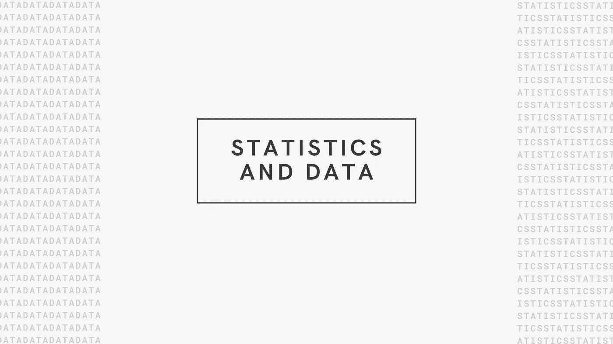
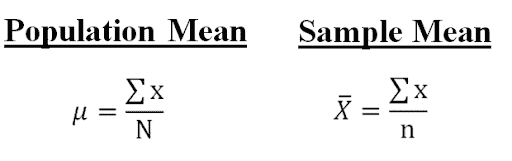
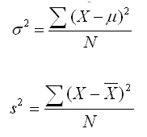
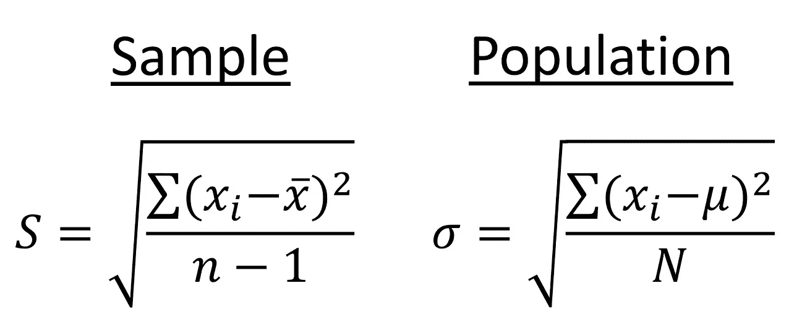

# 统计学基础…

> 原文：<https://medium.com/geekculture/basics-of-statistics-826592a8d4ed?source=collection_archive---------13----------------------->

Google

主要有两种类型的统计，

1.  **描述性统计**
2.  **推断统计**

描述性统计是用数字和图表来组织和总结数据。我们有一个中心趋势(均值，中位数，众数)，标准差，变异。

在推断统计中，我们有总体数据和样本数据。通过获取样本数据，我们可以预测总体数据。例如，通过使用样本均值，我们可以对总体均值进行说明。

在统计学中，我们可以有两种类型的值，

1.  **分类值**
2.  **数值**

范畴值只不过是一组值。举个例子，

*   人的性别:男性或女性
*   考试结果:通过或失败
*   人的血型:A 型、B 型、AB 型或 o 型。
*   六面骰子:可能的结果是 1、2、3、4、5 或 6。

数值又分为两种，即**离散**和**连续**。

离散值意味着，

*   你有多少辆汽车？(1, 2, 3 …)
*   你有几个孩子？(1, 2, 3)
*   你有多少银行账户？(1, 2)

在上述所有例子中，答案或值将是固定的或整数。我们不能说我有 2.5 辆车或 1.5 个孩子或 3.2 个银行账户。

连续值意味着，

*   人的身高(5.6，5.67，5.678 …)
*   人的体重(70，71.2，69.567 …)
*   时间(小时、分钟、秒、毫秒……)

在上面的例子中，答案或值将是连续的。人的身高会逐点变化，同样人的体重也在变化，时间也在变化…

> **集中趋势**

集中趋势是一种统计度量，它将单个值识别/描述为整个分布/数据的代表。

有三个集中趋势的量度，

> **表示**

平均值是所有值的总和，除以数据集中的观察次数。简单来说，就是数据集的平均值。

例如，我们有像 1，2，6，5，3，4，3，5，5 这样的数据

值的总和= 1+2+6+5+3+4+3+5+5 = 34

值的总数= 9

平均值=(值的总和)÷(值的总数)

平均值= 34 ÷ 9

平均值= 3.78

> **中位数**

Median 是数据集中最中间的值。

例如，我们有与 1、2、6、5、3、4、3、5、5 相同的数据

为了找到中间值，首先，我们必须将值按升序排序，然后中间值就是我们的中间值。

排序数据集:1，2，3，3，4，5，5，5，6

Median =排序数据集的中间值

中位数= 4

> **模式**

Mode 是数据集中出现频率最高的值。

例如，我们有与 1、2、6、5、3、4、3、5、5 相同的数据

模式=数据集中最常见的值

模式= 5

> **人口&样本**

总体是整个群体，样本是总体的子集。样本的大小总是小于总体的总大小。

举个例子，

*   班里所有的学生都是总体，而班里前 5 名的学生是样本。
*   假设你想知道印度马哈拉施特拉邦人的平均工资。在马哈拉施特拉邦，所有有工资的人都是人口。现在我们的主要任务是找到平均工资。不可能去马哈拉施特拉邦的每个地方，问每个人，你的工资是多少？所以在这种情况下，我们从每个地区随机抽取一些人，问他们你的工资是多少？并做了记录。那些随机的人只不过是我们的样本。我们从整个人口中抽取样本，而且随机样本的规模总是小于人口。

> **总体均值&样本均值**

取自总体的平均值称为总体平均值，取自样本的平均值称为样本平均值。

总体平均值用 **μ** 表示，样本平均值用 **x̄** 表示，公式为:

> **总体方差&样本方差**

方差是离差的度量，即所有平方偏差的平均值。简单来说，就是一组数字离它们的平均值有多远。

总体方差用 **σ2** (适马平方)表示，样本方差用 ***s2*** (s 平方)表示，公式为:

> **总体标准差&样本标准差**

总体标准差&样本标准差就是总体方差和样本方差的平方根。

总体标准差用 **σ** (适马)表示，样本标准差用***s***【s】**表示，公式为:**

****

> ****结论****

**在本文中，我们看到了两种类型的统计，描述性的和推断性的，然后是集中趋势的度量(均值、中值、众数)，最后，我们看到了总体和样本以及示例、方差、标准差。**

**希望你能理解。如果你对此有任何疑问，请在评论区告诉我，或者在 LinkedIn 上联系我，我很乐意帮助你:)**

**请随时留下你的评论、建议或任何错误。😊**

****帮我接通**[**LinkedIn**](https://www.linkedin.com/in/sagardhandare/)**|**[**GitHub**](https://github.com/SagarDhandare)**|**[**邮箱**](mailto:%20sagardhandare3@gmail.com)**

****快乐学习！！！^_^****