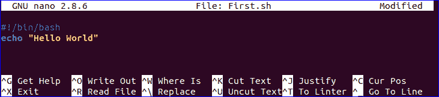
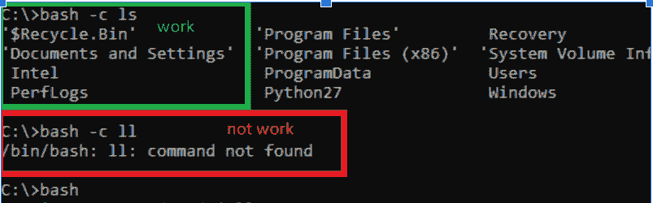
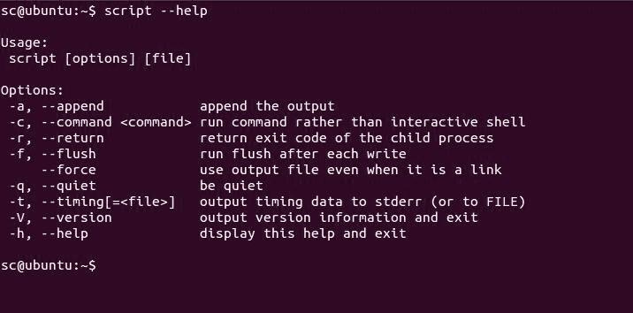
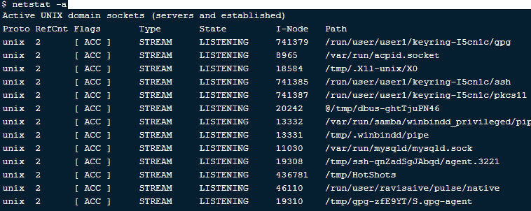
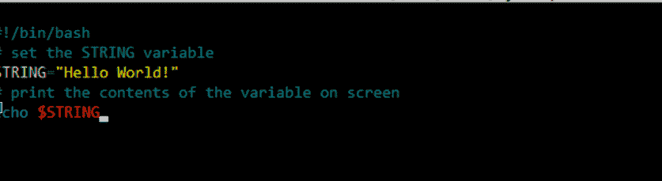
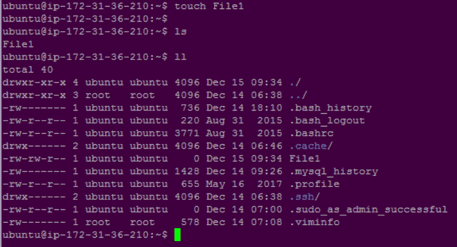
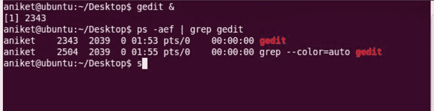
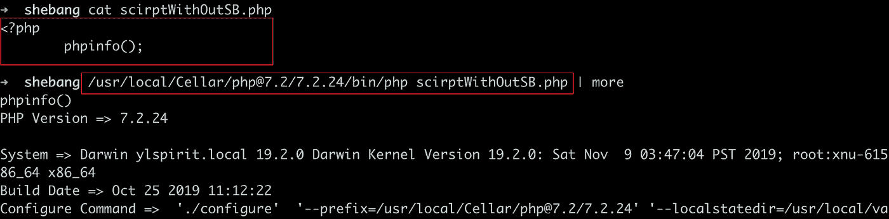
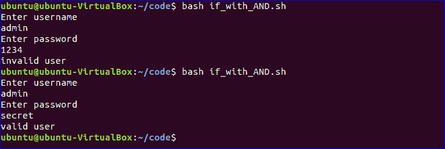

# 网络工程师 Bash 脚本基础

> 原文：<https://medium.com/geekculture/basics-to-bash-scripting-for-network-engineers-6ea252e0df6f?source=collection_archive---------2----------------------->

工程专业的趋势是相当古老的，然而，即使在今天，许多年轻人仍然希望成为工程师，无论是网络工程师还是软件工程师。由于视频游戏的出现和数字化改变了生活方式，许多人渴望学习代码。虽然编码并不像玩电子游戏那样简单。成为一名成功的工程师需要大量的努力、奉献、激情、知识和时间。因此，今天，我们将为网络工程师学习 bash 脚本的基础知识。

在学习 bash 脚本之前，让我们详细理解 Bash 和脚本这两个术语，以便正确地学习网络工程的基础知识。开始吧！

# **Bash 的定义**

这种语言的首字母缩略词是“Bourne-Again Shell”。Bash 是一个命令语言解释器。它可以在很多系统上使用，在 GNU/Linux 上，它充当默认的命令解释器。Bash 脚本是内部包含一组命令的文本文件。

C shell csh 和 Korn shell ksh 的几乎所有特性都集成到了 bash 中，而没有禁用它们。

# **脚本定义**

脚本是用于自动化过程和程序的适当运行时环境的一组指令。通常，脚本不需要编译步骤，而是被解释。复杂的系统可以用它引入的新功能粘在一起。编写脚本的唯一目的是集成其他编程或编码语言并与之通信。

# **什么是 Bash 脚本**

Bash 是操作系统的命令语言，用于系统管理、数据处理和开发的极限级别。例如，Linux 和 Unix 系统管理员、网络工程师、开发人员和科学家在工作中使用它。

Bash 脚本是一个简单的纯文本文件，它列出了可以在命令行中执行的命令集合。它们用于在 Linux 文件系统上执行重复的任务。它可以包含一个或多个命令，或者包含命令式编程结构，如循环、函数或条件。它实际上是一个用 Bash 语言编写的计算机程序，这取决于它的复杂性和用途。

# **如何制作和运行 Bash 脚本？**

首先，使用 cd 命令更改计划保存脚本的目录。一旦更改了目录，就在 gedit 这样的文本编辑器中键入 shell 命令。

通过使用 touch 命令，您可以创建零字节大小的脚本。

*按照以下步骤运行 Bash 脚本:-*

**触摸文件名**

键入以下命令，在文本编辑器(例如 gedit)中打开脚本:

**gedit file_name.sh**

的。sh 扩展为您提供了 shell 命令，您必须在新打开的文本框或文本编辑器中根据 bash shell 命令键入这些命令。在键入任何 bash shell 命令之前，首先检查 bash 脚本的基础。

基于 Linux 的 Bash 命令行的脚本以下面一行开始:

**舍邦(！)**

脚本 SheBang(！)以数字符号(#)和感叹号(！).

当一个类似 Unix 的操作系统以一个 shebang 作为程序运行一个脚本时，脚本的第一行被程序加载器解析为一个解释器指令。因此，SheBang 代表执行脚本行的解释器，它被称为执行各种脚本(如 Bash 和 Python)的路径指令。

对于 Bash 脚本，下面是正确的 SheBang 格式。

**#！/bin/bash**

正确格式化 SheBang 极其重要。格式不正确的 SheBang 会导致命令无法按预期运行。创建脚本时，您应该只考虑这两点，如下所示:

解释器的路径必须出现在脚本的开头；

路径(#)前的井号(#)和感叹号之间没有空格。).

**回声**

echo 是 Bash 中的一个内置命令，它显示标准输出，而不考虑参数。这是将字符串打印到屏幕上最广泛使用的命令。它在两个平台上的执行方式是相同的:shell 和 CLI。

# **结论**

无论你是一个熟练的网络工程师还是刚刚进入这个领域，都可以尝试上面提到的方法来学习 bash 脚本。我们已经详细阐述了 bash 的所有主要和次要方面，以方便所有网络工程师学习 Bash 编码。

更多科技博客请访问:[https://digibharata.com/](https://digibharata.com/)

主博客:[https://hacker noon . com/basics-to-bash-scripting-for-network-engineers](https://hackernoon.com/basics-to-bash-scripting-for-network-engineers)