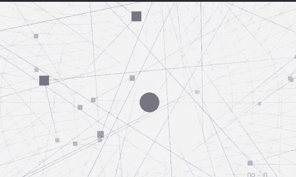

# 带有 Three.js 的低音可视化工具

> 原文：<https://medium.com/geekculture/bass-visualizer-with-three-js-3ade59d4497a?source=collection_archive---------58----------------------->

用 JavaScript 和 three.js 构建一个 bass 可视化工具

任何时候，我们在开发世界的前端看到任何东西，它似乎有点太复杂，超过 1 WTF/sec。很有可能网站正在使用一些专业级的动画库，因为使用 CSS 的可能性非常有限，尽管有很多令人惊叹的预处理程序，如 sass 等，但使用 CSS 制作 DOM 的交互性是有限的。

在 UI 上工作，我强烈推荐浏览 GSAP、Three.js P5.js，这些是一些允许你在画布上互动和绘画的库，在那里可能性是无限的，基于时间和努力，你可以让你的 web 应用程序变得非常漂亮。

# 我们的声音可视化工具是如何工作的？

我们的应用程序非常简单，对于初学者来说很容易上手，three.js 是一个使用 WebGL 创建 3D 图形的强大而直观的 API。WebGL 是 OpenGL 的精简版。对 three.js 的需求是为了隐藏 WEBGL 带来的潜在复杂性，它的语法类似于 C 语言，而且实现同样的事情所需的代码量通常也更多。

制作 3D 场景所涉及的组件。

## 渲染器

这是渲染器，将处理我们的画布容器的渲染。

## 照相机

three.js 提供了很多相机，但主要使用的是透视相机和正交相机。

对于本教程，我们将使用一个模拟更接近人眼的透视相机。

## 光

类似地，为了照亮我们的场景和看到物体，有几个不同的灯。平行光，环境光，点光等等，你可以同时使用一个或多个。

## 由材料和几何体组成的网格

以上 3 个部分或多或少是一个样板，你将有一个这 3 个由材料和几何形状组成的网格类的修改版本，这是应用程序之间最大的区别。我们有不同的几何图形来创建球体立方体、盒子以及将用于构建这些几何图形的材料。根据我们的需要，这些材料具有原始属性，如粗糙度深度。

我们使用非常简单的网格一些线，一些球和点的组合。

首先，我们加载我们选择的音频，你也可以为它提供一个输入文件。我们将频率作为数据点来绘制我们的形状。使用这些数据点，我们可以获得标准偏差，这有助于我们创建音箱效果，我们可以根据这些统计数据来控制这些形状的大小。我使用了一个包含所有这些由 three 提供的网格的组，在每个 tick 上，我们根据最新的音频数据点更新这些网格。

## 在我们的主类中集合所有的片段

它将我们的音乐纹理添加到我们的场景中，我们得到了类似于图片的视觉效果，贝斯手值给了我们更多的标准偏差。

three.js 的力量要大得多，我们可以创建高质量的游戏和动画，但与简单的 flex 框和网格相比，实际例子的数量有点低，这没什么，但要将 aww 因素添加到您的网站，我们还应该精通 JavaScript 60fps 动画。

只要合适，我们都可以在我们的项目创意中尝试这些动画，并与人们分享我们的学习。因为当你分享时，你会学到两次。

编码和平快乐！！