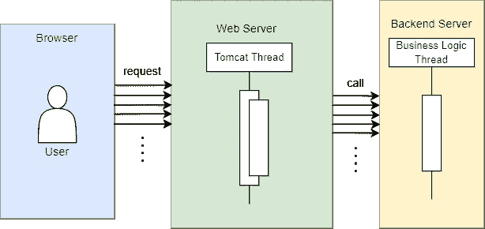

# 高并发场景下使用 CompletableFuture 和阻塞队列的批处理

> 原文：<https://medium.com/geekculture/batch-processing-using-completablefuture-and-blocking-queue-under-high-concurrency-scenario-3a1f8478588a?source=collection_archive---------0----------------------->

您的 web 服务器只配置了 1000 个线程的限制，而主要处理业务逻辑的后端服务器只有 400 个线程的限制。在高并发情况下，对 web 服务器的大量请求可能会导致后端服务器崩溃。

