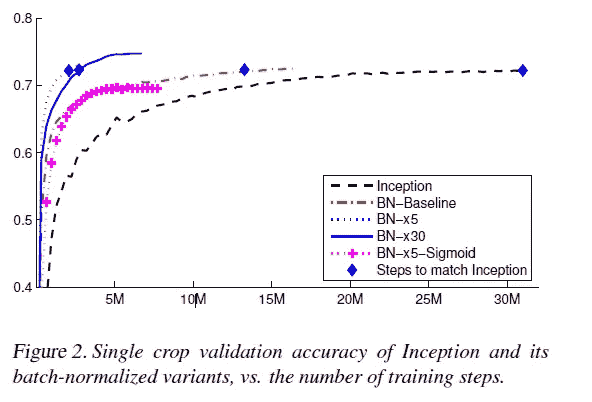
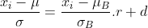
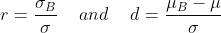
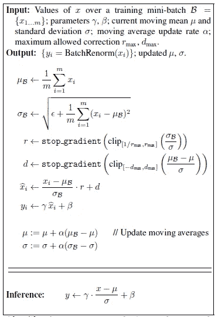
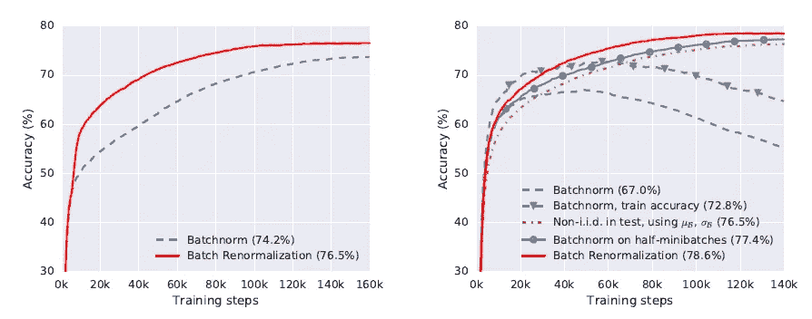

# 批量重整化-为什么和如何？

> 原文：<https://medium.com/geekculture/batch-renormalization-why-and-how-46ebbdb2ae96?source=collection_archive---------8----------------------->

名为[批次重整化:减少批次标准化模型中的小批次依赖性](https://arxiv.org/abs/1702.03275)的论文摘要。

在继续讨论批处理重整化时，我假设您非常熟悉批处理规范化(BN)。它如何帮助更快地收敛到手头问题的最优解？如果没有，请阅读[批量标准化——一种增强培训的技术](/geekculture/batchnormalization-a-technique-that-enhances-training-5d44966c22c0)。

我们简单总结一下 BN:

*   它有助于减少内部协变量移位(ICS ),因此激活的输入分布保持更稳定。
*   BN 使我们对参数的规模及其初始化不那么小心。
*   它允许我们使用更高的学习率，帮助我们加快训练。

[Source](https://arxiv.org/abs/1502.03167)

正如我们在上面看到的，BN 在加速收敛到最优解的过程中是非常有用和有效的。但是，标准化激活的过程有什么缺点。我们将通过这篇文章来了解它。理解批量重整化如何帮助解决这个问题？

正如 Sergey Ioffe 在[批处理重整:减少批处理标准化模型中的小批处理依赖](https://arxiv.org/abs/1702.03275)中总结的那样，“它提供了改善任何使用批处理范式的模型的性能的承诺。”我们试图理解为什么会这样。

我们知道，BN 转换不能在每个训练示例中处理激活，因为 BN 对训练示例和小批量 中的其他示例都有 ***依赖性。虽然它让 BN 变得强大；也是其弊端的来源。***

因为，随着我们减小迷你批次的大小，我们用来归一化输入的平均值和方差每维度的任何层都变得不太准确。并且这些不准确性与深度相混合，这影响了模型的质量。并指出非 iid 小批量对批量模型有不良影响。

我想现在，我们明白了 BN 可能会失败的地方和原因。因此，为了解决这个问题，BN[论文的作者之一向我们介绍了批量重整化，它通过保留 BN 的优点(如对参数初始化不敏感和训练效率)来消除批量标准化的上述差异。](https://arxiv.org/abs/1502.03167)

**批量重正化和 BN 有什么不同？**

正如我们所知，在 BN 中，移动平均值是在训练期间对最后几个小批次进行计算的，并且仅用于推断。但是 Batch Renorm 在训练过程中使用这些移动平均值和方差进行校正。

批量重正化是网络的扩充，它包含批量规范化层，每维仿射变换应用于规范化激活。

假设我们有一个小批，并希望使用小批统计或它们的移动平均值来归一化特定的节点 x，那么两个归一化的结果通过仿射变换相关。

如同

在哪里

实际上，我们将参数 r 和 d 视为固定值。在训练阶段，我们通过保持 r = 1 和 d=0 单独开始 batchnorm 一定次数的迭代，然后在一定范围内逐渐改变这些参数。下面是批量重正化算法:

Batch-Renormalization Algorithm

我们说过，当我们减小小批的尺寸时，批量重正化比使用 BN 的网络更能提高网络的精度。此外，该论文还指出，当 Minibatch 中的样本不是相同且独立地采样(iid)时，BN 可能表现不佳。

Right Side Image: Shows validation accuracy of InceptionV3 model on ImageNet dataset as we reduce the size of minibatches, Left side: shows validation accuracy for non-iid samples

## 总结:

*   批量重正化降低了小批量中每个示例的处理激活对其他示例的依赖性，并保留了 BN 的优点。
*   在使用迷你电池时，它的效果非常好。
*   它为 BN 上的非 iid 例子提供了重要的结果。

我希望这能帮助你理解 BN 什么时候会倒闭？批量重正化什么时候会有帮助？

请随时告诉我任何概念的错误或误解。这对我帮助很大。如果你认为这会帮助你的朋友理解这个概念；请与他们分享。

快乐学习！