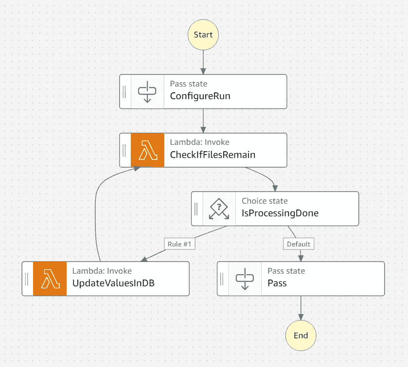
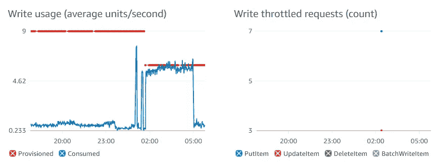

# 使用调配的容量批量更新 DynamoDB

> 原文：<https://medium.com/geekculture/batch-update-dynamodb-with-provisioned-capacity-f950f5d73497?source=collection_archive---------7----------------------->

## 数据处理

## 使用阶跃函数保持在写入限制范围内，从而节省成本

如果你能坚持使用 DynamoDB 的 *provisioned capacity* 特性，它可以成为 AWS 上一个非常经济的 NoSQL 数据库平台。如果使用模式一致，使用调配容量比使用*按需*容量估计要便宜七倍。另一个好处是 DynamoDB 空闲层也仅适用于调配的容量。然而，在管理您的数据时，供应容量带来了一个主要挑战:**您如何在不超出供应容量的情况下批量更新数千或数百万个 DynamoDB 项目？**

解决这个问题的一个选择是使用 AWS 阶跃函数。AWS 将其描述为“用于编排 AWS 服务的低代码可视化工作流服务”,非常适合处理来自 S3 的一系列源文件，并以可靠和可控的方式更新 DynamoDB。

> 阶跃函数允许您处理大量的源 S3 数据，并降低写入 DynamoDB 的速率，这意味着您可以使用调配的容量并节省资金。

注意，单独使用 Lambda 函数在这里是行不通的，因为它需要支持长时间的执行，而 Lambda 的执行时间被限制在 15 分钟。

## 了解写容量单位

当使用调配的容量时，在每个 DynamoDB 表上定义了一个设置限制*写容量单位(WCU)* 。对于最大 1 KB 的项目，每个 WCU 代表每秒一次写入。将较大的项目写入 DynamoDB 将消耗多个 WCU。

对写入吞吐量的这些限制意味着批量更新需要限制到比配置的 WCU 允许的更低的写入速率。超过表中配置的 WCU 会导致 DynamoDB 强制限制写入，并有作业失败和数据丢失的风险。

与其让 DynamoDB 在批量编写时强制节流，不如在代码中实现抑制项目写入速率的逻辑。

## AWS 步进功能状态机

问题的关键是:我们如何将写入速率降低到足够低，以避免超过所提供的 DynamoDB 写入容量？为了解决这个问题，我在 AWS Step 函数中构建了一个状态机来协调读取源文件和写入 DynamoDB 的逻辑。

> 状态机为每个文件调用一个 Lambda 函数，在处理完每个 CSV 行后，函数内会暂停一次，以便降低 DynamoDB 的写入速率

状态机遍历源 S3 位置中的多个 CSV 文件，然后根据 CSV 中每一行的值更新 DynamoDB。CSV 文件是 Spark ETL 作业产生的分区输出，这就是为什么有多个文件的原因。状态机为每个文件调用一个 Lambda 函数，在处理完每个 CSV 行后，函数中会有一个暂停，以便降低 DynamoDB 的写入速率。状态机的总体设计如下所示，其迭代模式非常清晰。我使用 Workflow Studio，因为它为配置状态机提供了一个稍微简单的 UI。



Step Functions state machine for batch updating provisioned capacity DynamoDB table (image by author)

## 配置运行通过状态

这是一个*通过*状态，其目的是在状态机上设置初始变量。下面显示了亚马逊州的语言片段。*结果*下的键值将在状态机的下一步传递给 Lambda 函数。

```
"ConfigureRun": {
  "Type": "Pass",
  "Result": {
    "s3Bucket": "bucket-name-here",
    "s3KeyBase": "source-key-location/",
    "s3KeyBaseProcessed": "processed-output-file-location/",
    "functionTimeLimitSeconds": "870"
  },
  "ResultPath": "$.Payload",
  "Next": "CheckIfFilesRemain"
}
```

## 检查是否保留 Lambda 函数

这是一个 Lambda 函数，它接受 ConfigureRun 中定义的参数或在 UpdateValuesInDB 之后运行，并确定在定义的 S3 位置中是否有任何对象。如果 S3 位置为空，响应变量 *noFilesFound* 将为真，如果有对象，则为假。注意，函数也返回最初提供的参数，以便在状态机的下一步中轻松使用它们。

本质上，这个函数的目的是确定状态机是否应该继续迭代和处理下一个剩余的文件。

Lambda 函数的 Node.js 代码如下。

```
const aws = require('aws-sdk');
const s3 = new aws.S3({ apiVersion: '2006-03-01' });exports.handler = async function iterator (event, context, callback) {
  // Get values defined in ConfigureRun pass state
  let s3Bucket = event.Payload.s3Bucket
  let s3KeyBase = event.Payload.s3KeyBase
  let s3KeyBaseProcessed = event.Payload.s3KeyBaseProcessed
  let functionTimeLimitSeconds = event.Payload.functionTimeLimitSeconds

  let d = new Date();
  let s3UriSuffix = 'year=' + d.getUTCFullYear().toString() + '/month=' + (d.getUTCMonth()+1).toString() + '/day=' + d.getUTCDate().toString() + '/'
  let s3UriFull = 's3://' + s3Bucket + '/' + s3KeyBase + s3UriSuffix const s3params = {
      Bucket: s3Bucket,
      Delimiter: '/',
      Prefix: s3KeyBase + s3UriSuffix
  };const s3ListResponse = await getS3ListObjects(s3params)

  if (s3ListResponse.Contents == undefined) {
    callback(null, {
      s3Bucket,
      s3KeyBase,
      s3KeyBaseProcessed,
      s3UriFull,
      noFilesFound: true,
      fileCount: 0,
      functionTimeLimitSeconds
    })      
  } else {
    if (s3ListResponse.Contents.length > 0) { // there are files
      callback(null, {
        s3Bucket,
        s3KeyBase,
        s3KeyBaseProcessed,
        s3UriFull,
        noFilesFound: false,
        fileCount: s3ListResponse.Contents.length,
        functionTimeLimitSeconds
      })            
    } else { // there are no files - this may mean the key prefix is invalid i.e. there is no data for the data that this has run
      console.warn('No data for S3 URL ' + s3UriFull)
      callback(null, {
        s3Bucket,
        s3KeyBase,
        s3KeyBaseProcessed,
        s3UriFull,
        noFilesFound: true,
        fileCount: 0,
        functionTimeLimitSeconds
      })         
    }
  }
}async function getS3ListObjects(s3params) {
    const resp = await s3.listObjects(s3params).promise();
    return resp
}
```

## 正在处理一个选择状态

如果由先前的 *CheckIfFilesRemain* 状态提供的 *noFilesFound* 值为假，那么这将调用*规则#1* ，并转换到 *UpdateValuesInDB* 状态。换句话说，如果在 S3 位置有对象，我们将继续处理第一个对象。

如果 *noFilesFound* 为真，那么默认规则将触发，状态机的执行将结束。下面显示了该州的亚马逊州语言片段。

```
"IsProcessingDone": {
  "Type": "Choice",
  "Choices": [
    {
      "Variable": "$.Payload.noFilesFound",
      "BooleanEquals": false,
      "Next": "UpdateValuesInDB"
    }
  ],
  "Default": "Pass"
}
```

## UpdateValuesInDB Lambda 函数

这是整个解决方案中最复杂也是最重要的部分。该组件处理来自 S3 的单个源 CSV 对象，并用其中包含的值更新 DynamoDB。它还包含“暂停”来降低写入 DynamoDB 的速度。有一些重要的注意事项需要记住:

1.  由于目标 DynamoDB 表上提供的 WCU 限制，必须限制对 DocumentClient API 进行更新和上传的调用速率。该速率必须低于所提供的容量支持的速率。
2.  应该通过估计正在写入的项目的大小来计算写入率，以确定每次写入使用的 WCU 量。例如，如果每个项目平均为 1.5 KB，则每次写入将使用 2 个 WCU(由于四舍五入)。如果该表的调配容量为 10 WCU，则每秒最多可以写入 5 个项目(或者每次写入后暂停 0.2 秒)。我使用代码*await new Promise(r =>setTimeout(r，pauseTimeMS))* 来实现 Node.js 中的暂停。
3.  尽管有暂停，Lambda 函数仍将运行，因此您将为此付出代价。但兰姆达斯很便宜，所以这应该不是什么大事。
4.  Lambda 函数最多只能执行 15 分钟，因此该函数必须在 15 分钟限制之前将任何未处理的行从 CSV 写回到源 S3 位置。因此，在*配置运行*上设置的*功能时间限制秒*值必须小于 900 秒。记住将 Lambda 超时设置为 15 分钟。
5.  您需要从原始 S3 位置删除已处理的文件(否则会有无限循环的风险)。您应该在阶跃函数状态机上设置一个超时值，以防止出现无限循环。
6.  同样在这个 Lambda 中，我写出了传递给这个函数的所有变量。AWS 阶跃函数包含用于过滤和合并参数的复杂逻辑。然而，我发现这种通过 Lambda 函数代理值的方法比纠结于阶跃函数 *ResultSelector* 、 *ResultPath* 和 *OutputPath* 逻辑要简单得多。

Lambda 的 Node.js 代码如下。

```
const aws = require('aws-sdk');
const s3 = new aws.S3({ apiVersion: '2006-03-01' });
const os = require("os");
const documentClient = new aws.DynamoDB.DocumentClient();const tableName = 'DynamoDB-table-name-here';/**
 * Summary: updates DynamoDB with a pause between rows processed
 * 
 * 1\. Gets a list of all objects in S3 's3KeyBase' location
 * 2\. If no objects, stop running
 * 3\. If there are objects, get the first object
 * 4\. Read the CSV text from the object and split into lines:
 *   5\. For each CSV line, split by comma character
 *   6\. Use CSV row to add a value to the table
 *   7\. If 'functionTimeLimitSeconds' lapses, stop processing
 * 9\. Unprocessed rows write to new file in original location
 * 10\. Processed rows write to 's3KeyBaseProcessed' location
 * 11\. Source object in S3 's3KeyBase' location will be deleted
 */ 
exports.handler = async (event, context) => {

    let s3Bucket = event.Payload.s3Bucket;
    let s3KeyBase = event.Payload.s3KeyBase;
    let s3KeyBaseProcessed = event.Payload.s3KeyBaseProcessed;
    let functionTimeLimitSeconds = event.Payload.functionTimeLimitSeconds;

    let pauseTimeMS = 200 // use WCU to calculate pause time let d = new Date();
    let s3UriSuffix = 'year=' + d.getUTCFullYear().toString() + '/month=' + (d.getUTCMonth()+1).toString() + '/day=' + d.getUTCDate().toString() + '/';
    let s3UriFull = 's3://' + s3Bucket + '/' + s3KeyBase + s3UriSuffix;
    let s3UriFullProcessed = 's3://' + s3Bucket + '/' + s3KeyBaseProcessed + s3UriSuffix;

    const s3params = {
      Bucket: s3Bucket,
      Delimiter: '/',
      Prefix: s3KeyBase + s3UriSuffix
    }; 

    /*
     * Get all objects in bucket with key prefix (i.e. in folder)
     */
    const s3ListResponse = await getS3ListObjects(s3params)

    if (s3ListResponse.Contents == undefined || s3ListResponse.Contents.length == 0) { // no files in location
        console.log("No files found in location " + s3UriFull)
        let response = {
            statusCode: 200,
            s3Bucket,
            s3KeyBase,
            s3KeyBaseProcessed,
            s3UriFull,
            s3UriFullProcessed,
            noFilesFound: true,
            fileCount: 0,
            functionTimeLimitSeconds
        };
        return response; 
    }    

    /*
     * Get the contents of the first file then process each line
     */

    // Grab the first file
    let fileKey = s3ListResponse.Contents[0].Key; 
    let fileKeyFilename = fileKey.substring(fileKey.lastIndexOf('/') + 1);

    const s3paramsObject = {
        Bucket: s3Bucket, 
        Key: fileKey,
    };

    // Read the CSV text from S3
    let fileText = await getS3ObjectBodyText(s3paramsObject);

    let timeExpired = false;
    let processedLines = 0;
    let unprocessedLines = 0;// Split the CSV by lines
    let textLineArray = fileText.split("\n");
    let fileTextUnprocessed = appendTextLine("", textLineArray[0]);
    let fileTextProcessed = appendTextLine("", textLineArray[0]);// Loop around each line
    for (let i=1; i<textLineArray.length; i++) {
        let dateLatest = new Date();
        const diffTime = Math.abs(dateLatest - d);
        const diffSecs = Math.ceil(diffTime / 1000); 
        if (diffSecs < functionTimeLimitSeconds) {
            let line = textLineArray[i];
            let lineValues = line.split(","); // split into columns

            let date = new Date(); // for object timestamp

            /*
             * Create the item for DynamoDB
             */        
            let partitionKey = lineValues[0]; // first CSV column

            let dbItem = {}
            dbItem.partitionKey = partitionKey;
            // set dbItem values here

            await singleInsertItem(dbItem);// This is the pause to throttle writes            
            await new Promise(r => setTimeout(r, pauseTimeMS));

            fileTextProcessed = appendTextLine(fileTextProcessed, textLineArray[i]);
            processedLines++; } else { // time has run out
            fileTextUnprocessed = appendTextLine(fileTextUnprocessed, textLineArray[i]);
            timeExpired = true;
            unprocessedLines++;
        }}

    /*
     * Write fileTextProcessed to processed folder
     */
    await writeTextToS3File(s3Bucket, s3KeyBaseProcessed + s3UriSuffix, context, fileTextProcessed, d, fileKeyFilename); if (timeExpired) { // time limit expired
        /*
         * Write fileTextUnprocessed to processed folder
         */    
        console.log("Ran out of time. Creating file for unprocessed rows in original location in S3");
        if (fileKeyFilename.includes("_unprocessed")) {
            fileKeyFilename = fileKeyFilename.split('_')[0]; // remove suffix previously generated for the file, if applicable
        }
        await writeTextToS3File(s3Bucket, s3KeyBase + s3UriSuffix, context, fileTextUnprocessed, d, fileKeyFilename + "_unprocessed");
    }

    /*
     * Delete original object from S3
     */
    await deleteProcessedFile(s3Bucket, fileKey);
    let response = {
        statusCode: 200,
        s3Bucket,
        s3KeyBase,
        s3KeyBaseProcessed,
        s3UriFull,
        s3UriFullProcessed,
        noFilesFound: false,
        fileCount: s3ListResponse.Contents.length,
        processedLines,
        unprocessedLines,
        functionTimeLimitSeconds
    };
    return response;
};/**
 * Appends a new line to text
 */
function appendTextLine(text, newLine) {
    if (newLine == null) return text;
    if (newLine.length == 0) return text;
    text = text + newLine + os.EOL;
    return text;
}/**
 * Inserts a single item into DynamoDB
 */
async function singleInsertItem(dbItem) {
    let dataItem = {};
    dataItem.TableName = tableName;
    dataItem.Item = dbItem;try {
        let dataResponse = documentClient.put(dataItem).promise();
        return dataResponse;
    } catch(err) {
        return err;
    }        
}async function getS3ListObjects(s3params) {
    const resp = await s3.listObjects(s3params).promise();
    return resp;
}async function getS3ObjectBodyText(s3params) {
    const { Body } = await s3.getObject(s3params).promise();
    let s3ObjectString = Body.toString('utf-8');
    return s3ObjectString;
}async function deleteProcessedFile(s3Bucket, s3Key) {
    let s3params = {
        Bucket: s3Bucket,
        Key: s3Key
    };     
    const resp = await s3.deleteObject(s3params).promise();
    return resp;  
}async function writeTextToS3File(s3Bucket, s3Key, context, textContent, partitionDate, filename) {
    let d = partitionDate;
    let fileTimestamp = new Date();
    fileTimestamp = fileTimestamp.toISOString();

    let key = s3Key + filename + '-' + fileTimestamp; let buff = Buffer.from(textContent, 'utf-8');const s3params = {
        Bucket: s3Bucket,
        Key: key,
        Body: buff,
        //ContentEncoding: 'base64',
        ContentType: 'text/csv',
    };const s3Resp = await s3.putObject(s3params).promise();

    return s3Resp;
}
```

## 结果

通过使用 AWS Step 函数，您可以在 DynamoDB 中批量插入或更新大量项目，同时保持在 WCU 提供的容量限制之内。

我使用 S3 的 Spark ETL 作业编写的 32 个 CSV 文件测试了这种方法，每个文件 700 行——这意味着 DynamoDB 中总共需要更新 22，400 个项目。每一行都需要一个 *put* 和一个 *update* ，该表有三个*全局二级索引(GSIs)* 。每个 GSI 都有自己的 WCU 供应。

*put* 、 *update* 和三个 GSI 的组合意味着实际上每个 CSV 行需要五次 DynamoDB 写入。

该表被配置为 WCU 为 6。GSI1 和 GSI2 的 WCU 为 4。GSI3 的排序键值在作业期间更新，其 WCU 为 7。



Provisioned vs consumed write capacity units for DynamoDB table (image by author)

上面是状态机执行期间表的 Cloudwatch 度量图。请注意，我在开始作业之前减少了调配的容量。我们可以从从凌晨 2 点到 5 点消耗的容量的增加中看到，更新 DynamoDB 中的 22，400 个条目需要大约 3 个小时。消耗的容量接近调配的容量，但通常执行顺利。右图显示了凌晨 2 点后不久 DynamoDB 抑制的两个写请求，这表明我应该将调配的容量增加 1，或者稍微增加暂停时间。


Provisioned vs consumed write capacity units for DynamoDB GSI2 (image by author)

GSI2 的 Cloudwatch 指标如上所示。在运行作业前不久，我将 GSI2 上的 WCU 增加到了 4。DynamoDB 没有限制对 GSI2 的任何写入，所以这看起来配置得很好。


Provisioned vs consumed write capacity units for DynamoDB GSI3 (image by author)

WCU 为 7 时，GSI3 比表和其他 GSI 具有更大的写入容量。但是，由于此 GSI 的*排序关键字*值在作业期间更新，每次写入都会消耗更多的 GSI 容量。我们可以看到，在整个 3 小时的工作中，消耗的容量非常接近调配的容量。尽管如此，在作业期间只发生了一次 DynamoDB 节流写入。然而，更安全的做法是进一步增加 GSI3 上的配置容量，或者稍微增加 *UpdateValuesInDB* Lambda 函数中的暂停时间。

通过使用 AWS 阶跃函数，我们有了一个健壮、可靠和可伸缩的批量更新 DynamoDB 的无服务器方法。错误处理内置于其工作流中，包括重试失败状态时的指数后退等功能。

在这项工作中，我们对每个源文件使用三种状态转换。以每 1，000 次状态转换 0.025 美元的价格，这里的阶跃函数成本可以忽略不计。同样，一个 128 MB 的功能运行 3 小时，Lambda 成本仅为 2-3 美分。总的来说，这种方法非常节省成本，并且提供了一种健壮的方法来对提供的 DynamoDB 表进行批量更新。

***附加阅读/参考文献***

1.  DynamoDB 按需容量与调配容量:哪个更好？ [*'*](https://searchcloudcomputing.techtarget.com/answer/DynamoDB-on-demand-vs-provisioned-capacity-Which-is-better) *虽然按需提供最适合的可扩展性，但其成本大约是调配容量的七倍'*[https://search cloud computing . techtarget . com/answer/DynamoDB-on-demand-vs-provisioned-capacity-哪个更好](https://searchcloudcomputing.techtarget.com/answer/DynamoDB-on-demand-vs-provisioned-capacity-Which-is-better)
2.  DynamoDB 上调配容量的写容量单位说明[https://docs . AWS . Amazon . com/Amazon DynamoDB/latest/developer guide/provisionedthroughput . html](https://docs.aws.amazon.com/amazondynamodb/latest/developerguide/ProvisionedThroughput.html)
3.  用于写入 DynamoDB 的 document client API[https://docs . AWS . Amazon . com/AWSJavaScriptSDK/latest/AWS/dynamo db/document client . html](https://docs.aws.amazon.com/AWSJavaScriptSDK/latest/AWS/DynamoDB/DocumentClient.html)