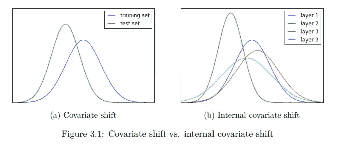
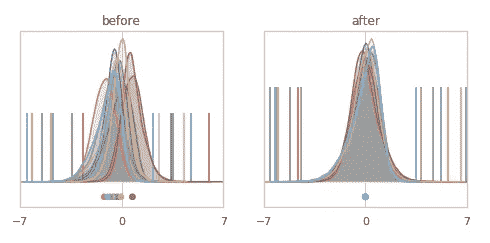
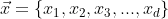
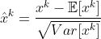
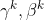
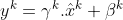

# 批量标准化——一种强化训练的技术

> 原文：<https://medium.com/geekculture/batchnormalization-a-technique-that-enhances-training-5d44966c22c0?source=collection_archive---------17----------------------->

为什么这是神经架构中最常用的标准化技术？

[Source](https://arxiv.org/abs/1502.03167)

在读 Sergey Ioffe 和 Christian Szegedy 写的 [BatchNormalization](https://arxiv.org/abs/1502.03167) (BN)论文的时候。我偶然发现它直到现在还被 29.5k 左右引用。此外，我注意到，我认为我们作为 ML 从业者经常使用批量规范化技术。

*   但是现在我想到了一个问题**为什么我们要使用这种技术**？
*   **在我们构建的神经架构中使用这样的技术有什么好处**？

在论文中，作者自己描述了为什么他们使用批处理规范化技术来加速深度网络训练。现在想到的问题是如何以及哪些因素制约着网络加速学习过程。我们再次从论文本身得到答案。

训练深度神经网络(DNN)是复杂的，因为在对前一层输出应用非线性作为下一层的输入之后；在训练过程中，输入的分布会发生变化，因为前几层的参数会发生变化。这一事实通过要求较低的学习速率以及仔细的参数初始化而减慢了训练。这叫做 ***【内部协变移位(ICS)*** 。这个事实减缓了训练。作者认为国阵试图抑制它，加速 DNN 的训练过程。

[Source](https://www.diva-portal.org/smash/get/diva2:955562/FULLTEXT01.pdf)

为了优化手头的问题，我们使用不同版本的梯度下降算法。正如我们所知，随机梯度总是有效的，但它需要仔细调整超参数，特别是学习率和参数初始化。但是由于内部协变量变化，训练变得复杂，因为这种变化随着我们深入而放大。所以每一层都需要适应变化。这就是为什么它需要较低的学习率，增加了培训时间。

BN 试图减少内部协变量偏移，以便非线性输入的分布保持更稳定，并且在训练时不太可能停留在饱和区域。并且这导致加速训练以优化最优解。

[Reduction in internal covariate shift after BN](https://e2eml.school/batch_normalization.html)

但是除了这些好处，还有其他好处，例如:

*   BN 对通过网络的梯度流具有有益的影响，因为梯度变得独立于参数/权重(W)的比例或它们的初始值。
*   随后，它允许我们使用更高的学习率，而没有发散的风险。
*   通过调整模型来减少辍学的需要。

如 LeCun 等人。艾尔。并且 Wiesler 等人建议，如果输入被白化，即输入被线性变换以具有零均值和单位方差并且去相关，则网络训练收敛得更快。因此，由于体系结构中的每一层都从其前一层获取输入，因此白化它的输入将是有利的。

为了对输入进行白化，需要注意的是，当我们在 GD 步骤之外计算归一化参数时，模型会爆炸，因此虽然发生了归一化，但归一化无助于降低损耗。这里的问题是 GD 优化没有考虑发生的规范化。

现在，*每一层输入的完全白化是昂贵的，因此我们通过使标量特征具有零均值和单位方差来独立地归一化它。这意味着如果我们有一个 d 维输入向量 x*

我们将每个维度标准化为:

但是在规范化输入图层时，图层的表示可能会发生变化，因此为了保持表示的完整性，我们必须确保网络中插入的变换可以表示身份变换。这就是为什么引入

这可以缩放和移动归一化值并恢复网络的表示能力。

这就是每维引入这两个参数抑制 ICS 并加速训练的原因。

## 总结:

*   由于要求较低的学习速率和仔细的参数初始化，ICS 减慢了训练。
*   BN 通常用于神经架构中，以减少最终加速训练过程的 ICS。
*   但是为了使 GD 意识到网络的归一化和完整的表示能力，我们需要在每个维度的网络中引入两个参数。

如果我解释错了，请随时纠正我。并与他人分享。

快乐学习！