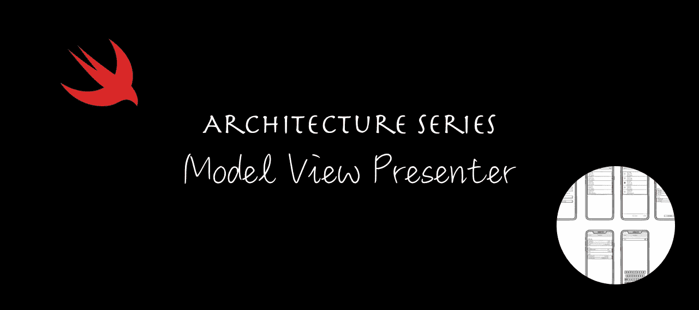
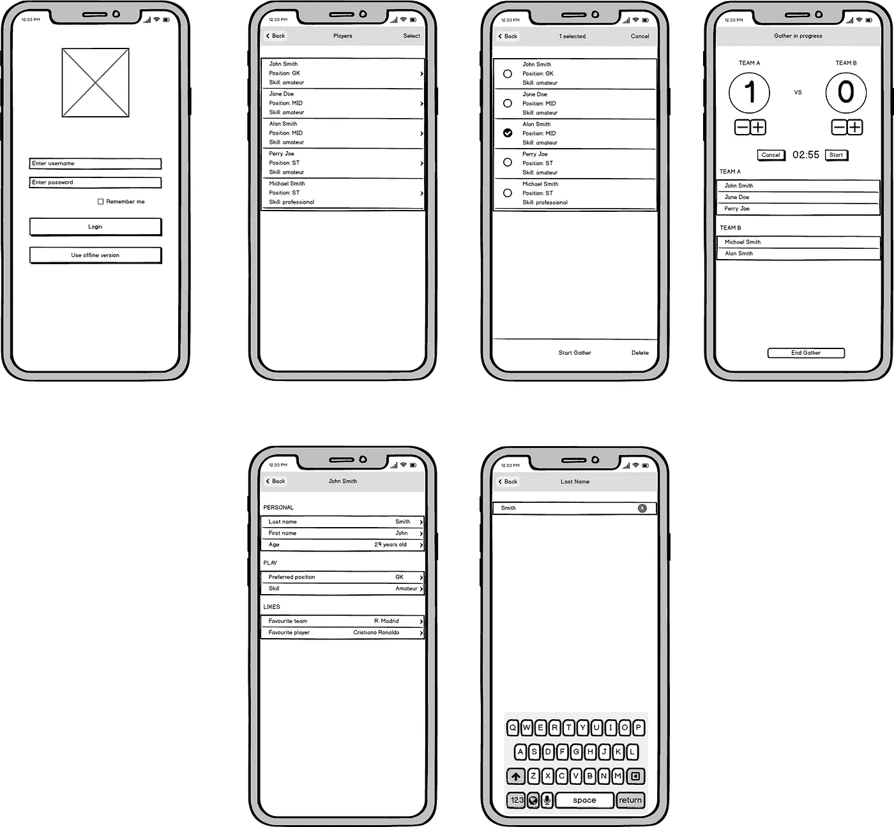

# iOS 架构模式之战:模型视图演示者(MVP)

> 原文：<https://medium.com/geekculture/battle-of-the-ios-architecture-patterns-model-view-presenter-mvp-f693f6efd23e?source=collection_archive---------10----------------------->

Architecture Series — Model View Presenter (MVP)

# 动机

在开始开发一个 iOS 应用之前，我们必须考虑项目的结构。我们需要考虑如何将这些代码添加到一起，以便它们在以后有意义——当我们回来重新访问应用程序的一部分时——以及如何与其他开发人员形成已知的“语言”。

在本系列的第三篇文章中，我们将在 MVP 中改造 MVVM 应用程序。像往常一样，我们将看到如何将模式应用到每个屏幕，看到实际的实现和源代码。最后，我们将展示构建时间，并详细说明与其他架构模式相比，MVP 的一些关键观察结果。

如果你只是想看代码，可以跳过这篇文章。代码可以在 GitHub 上开源获得。

# 为什么你的 iOS 应用需要一个架构模式？

最需要考虑的是要有一个可维护的 app。你知道视图在那里，这个视图控制器应该做 X 而不是 y。更重要的是，其他人也知道。

以下是选择一个好的架构模式的一些优势:

*   更易于维护
*   更容易测试业务逻辑
*   与其他队友发展共同语言
*   分离实体的职责
*   更少的错误

# 定义需求

给定一个有六七个屏幕的 iOS 应用程序，我们将使用 iOS 世界最流行的架构模式来开发它:MVC、MVVM、MVP、VIPER、VIP 和 Coordinators。

该演示应用程序名为 Football Gather，是朋友们跟踪业余足球比赛比分的一种简单方式。

## 主要特征

能够:

*   在应用程序中添加玩家
*   给运动员分配队伍
*   编辑玩家
*   为比赛设置倒计时

## 屏幕模型

Screen mockups of “Football Gather”, the iOS app

## 后端

该应用由在 [Vapor web 框架](https://vapor.codes/)中开发的 web 应用提供支持。可以查看我的 [Vapor 3 初始篇](https://www.radude89.com/blog/vapor.html)和[篇关于迁移到 Vapor 4](https://www.radude89.com/blog/migrate-to-vapor4.html) 的 app。

# 什么是 MVP

MVP 和 MVVM 有些相似，但是有一些关键的地方:

*   您现在有一个演示者层。
*   您可以从演示者层控制视图。

## 模型

*   模型层与其他层完全一样，用于封装业务数据。
*   是负责域数据的接口。

**通讯**

*   当视图层中发生一些事情时，例如当用户发起一个动作时，它会通过表示器传递给模型。
*   当模型改变时，例如，当新的数据变得可用，我们需要更新 UI 时，演示者更新视图。

## 视角

*   视图层与 MVVM 中的相同，但是视图现在缺少更新其状态的责任。演示者拥有视图..

**通信**

*   视图不能直接与模型交流，一切都是通过演示者完成的。

## 提出者

*   负责处理来自视图的事件，并用模型触发适当的事件。
*   将视图与模型连接起来，但不在视图中添加任何逻辑。
*   对视图有 1:1 的映射。

**沟通**

*   可以与模型和视图/视图控制器这两个层通信。
*   视图更新将由演示者完成。
*   当数据改变时，它确保那些改变被传达给用户界面，更新视图。

# 何时使用 MVP

当你觉得 MVC 和 MVVM 不太适合你的用例时，就使用它。你想让你的应用更加模块化，增加你的代码覆盖率。当你是一个初学者或者你没有太多的 iOS 开发经验时，不要使用它。
做好多写代码的准备。

对于我们的应用程序，我们将**视图**层分成两个组件:**视图控制器**和实际的**视图**。
**视图控制器**充当协调器/路由器，并保存对视图的引用，通常设置为`IBOutlet`

## 优势

*   层的分离比在其他模式中更好。
*   我们可以测试大部分业务逻辑。

## 不足之处

*   装配问题在 MVP 中表现得更加突出。最有可能的是，你将不得不引入一个路由器或者一个协调器来处理导航和模块组装。
*   有一个风险是，你的演讲者会变成一个庞大的班级，因为他有更多的责任。

# 适用于我们的准则

我们需要做两大步骤:

1.  逐一浏览视图模型，并让他们成为演示者
2.  将视图与 ViewController 分开

应用的 MVP 模式详述如下:

## `LoginPresenter`

让我们看看`LoginPresenter`是什么样子的:

所有参数将通过初始化器注入。

钥匙圈互动的定义如下:

我们有两种服务:

注册功能与登录功能基本相同:

`LoginView`有以下协议:

大多数**视图控制器**逻辑现在都在**视图**中。

最后，**视图控制器**:

我们一个屏幕接一个屏幕，把现有的 MVVM 建筑变成一个 MVP。

## `PlayerListPresenter`

下一个屏幕是 **PlayerList** ，我们从 web API 调用开始:

现在，对 playe 删除的检查是在**演示器**中进行的，而不是在**视图/视图控制器**中。

如果我们在`PlayerListView`中查看表格视图的数据源方法，我们会发现**呈现者**的行为与**视图模型**完全相同:

`PlayerListViewController`现在更像是编辑、确认和添加屏幕之间的路由器。

**PlayerList** 模块分为以下几个部分。

`PlayerListViewController`职责:

*   正在执行`PlayerListTogglable`协议，以在采集完成时返回到`listView`模式状态(从`GatherViewController`调用)。
*   保持一个`IBOutlet`到`PlayerListView`。
*   它设置演示者、视图代表并告诉视图进行设置。
*   处理导航逻辑，并为编辑、添加和确认屏幕构建模型。
*   执行`PlayerListViewDelegate`并执行以下操作:
*   当视图请求更改标题时更改标题(`func didRequestToChangeTitle(_ title: String`)。
*   添加右侧导航栏按钮项(**选择**或**取消**选择玩家)
*   使用**表示器**中构建的标识符执行适当的序列。
*   显示一个带有标题和消息的简单警报(例如，当服务失败时)
*   显示删除确认警报。
*   通过实现`PlayerDetailViewControllerDelegate`，当一个玩家被编辑时，它告诉**视图**刷新。
*   对于`AddPlayerDelegate`也是如此，这里，它告诉**视图**再次加载玩家列表。

`PlayerListView`职责:

*   公开公共 API，`PlayerListViewProtocol`。这一层要尽量哑，不做复杂的事情。

`PlayerListPresenter`职责:

*   在第一眼看到`PlayerListPresenterProtocol`时，我们注意到它做了很多事情。
*   公开**视图**所需的方法，如`barButtonItemTitle`、`barButtonItemIsEnabled`等。

`PlayerListViewState`职责:

*   我们决定将`ViewState`提取到一个新文件中，保持我们在 MVVM 时的相同功能，使用工厂方法模式来分配`PlayerListView`的不同状态。

## 播放器详细屏幕

继续 **PlayerDetail** 屏幕，我们将**视图**与**视图控制器**分开。

遵循相同的模式，导航到编辑屏幕是通过委托完成的:

*   用户点击与玩家属性对应的一行。**视图**告诉**视图控制器**我们想要编辑那个字段，而**视图控制器**执行正确的序列。在`prepare:for:segue`方法中，我们分配编辑播放器所需的属性。

内部`PlayerDetailViewController`:

`PlayerDetailView`呈现如下:

以及表视图委托和数据源实现:

`PlayerDetailPresenter`:

## 编辑屏幕

对于应用程序的其余屏幕，我们遵循相同的方法。
举例说明下面的`PlayerEdit`功能。`PlayerEditView`类基本上是新的**视图控制器**。

选择器非常简单:

和公共 API:

最后，`UITableViewDataSource`和`UITableViewDelegate`方法:

`PlayerEditPresenter`处理业务逻辑，公开更新 UI 元素的属性。

API 调用详述如下:

**player 添加**，**确认**和**采集**画面遵循相同的方法。

# 测试我们的业务逻辑

测试方法与我们在 MVVM 的测试方法有 90%相同。

此外，我们需要模拟视图，并检查是否调用了适当的方法。例如，当进行服务 API 调用时，检查视图是否重载了它的状态，或者在失败时处理了错误。

以下单元测试`GatherPresenter`:

测试`countdownTimerLabelText`:

切换计时器变得更加有趣:

下面是模拟视图:

我认为测试演示者非常酷。你不需要做什么神奇的事情，而且这些方法非常小，这很有帮助。复杂的是，你需要模拟视图层，并检查一些参数是否在相应地改变。

# 关键指标

## 代码行—视图控制器

## 代码行—视图

## 代码行—演示者

## 代码行—本地模型

## 单元测试

## 构建时间

*测试在 iPhone 8 模拟器中运行，iOS 14.3，使用 Xcode 12.4，并在 i9 MacBook Pro 2019 上运行。*

# 结论

应用程序现在已经从 MVVM 重写为 MVP。方法很简单，我们用 **ViewModel** 代替 **ViewModel** ，并用 **Presenter** 层替换它。

此外，我们在 **ViewController** 之外创建了一个新层——视图，以便更好地分离关注点。代码看起来更干净，视图控制器更精简，类和函数更小，并且集中做一件事，拥抱单一责任原则。

说到用`UIKit`开发的应用程序，我个人更喜欢这种模式，而不是 MVVM。感觉比 MVVM 更自然。

看一下关键指标，我们可以记下以下几点:

*   视图控制器要薄得多，总的来说，我们减少了 1000 多行代码
*   然而，我们为 UI 更新引入了一个新的层—称为视图
*   演示者比视图模型更重要，因为他们承担着管理视图的额外责任
*   按照 MVVM 编写单元测试是相似的，获得了几乎相同的代码覆盖率， **97.2%**
*   有了更多的文件和类，我们对构建时间的影响很小，与 MVVM 相比增加了 **530 ms** ，与 MVC 相比增加了 **400 ms**
*   令人惊讶的是，**的平均单元测试执行时间比 MVVM 快了 1.36 秒**
*   与 MVC 模式相比，涵盖业务逻辑的单元测试更容易编写

真的很酷，我们一起看到了如何将一个在 MVVM 编写的应用程序转换成一种不同的模式，例如 MVP。在我看来，将视图从视图控制器中分离出来的 MVP 比 MVVM 好得多。它为您的层带来了更多的功能，使它们相互解耦，并且更容易使用依赖注入。

谢谢你坚持到最后！像往常一样，下面是一些有用的链接。

# 有用的链接

*   iOS 应用，足球聚会— [GitHub 回购链接](https://github.com/radude89/footballgather-ios/tree/master/FootballGather)
*   用 Vapor 制作的 web 服务器应用程序— [GitHub Repo Link](https://github.com/radude89/footballgather-ws)
*   Vapor 3 后端 API[文章链接](https://radu-ionut-dan.medium.com/using-vapor-and-fluent-to-create-a-rest-api-5f9a0dcffc7b)
*   迁移到蒸汽 4 [文章链接](https://radu-ionut-dan.medium.com/migrating-to-vapor-4-53a821c29203)
*   模型视图控制器(MVC)——[GitHub 回购链接](https://github.com/radude89/footballgather-ios/tree/master/FootballGather/MVC)和[文章链接](https://betterprogramming.pub/battle-of-the-ios-architecture-patterns-model-view-controller-mvc-442241b447f6)
*   模型视图 ViewModel (MVVM) — [GitHub 回购链接](https://github.com/radude89/footballgather-ios/tree/master/FootballGather/MVVM)和[文章链接](https://betterprogramming.pub/battle-of-the-ios-architecture-patterns-a-look-at-model-view-viewmodel-mvvm-bdfd07d9395e)
*   模型视图演示者(MVP) — [GitHub Repo 链接](https://github.com/radude89/footballgather-ios/tree/master/FootballGather/MVP)和[文章链接](/geekculture/battle-of-the-ios-architecture-patterns-model-view-presenter-mvp-f693f6efd23e)
*   协调员模式—带协调员的 MVP(MVP-C)—[GitHub 回购链接](https://github.com/radude89/footballgather-ios/tree/master/FootballGather/MVP-C)和[文章链接](/geekculture/battle-of-the-ios-architecture-patterns-model-view-presenter-with-coordinators-mvp-c-99edf7ab8c36)
*   查看交互者展示者实体路由器(VIPER)——[GitHub Repo 链接](https://github.com/radude89/footballgather-ios/tree/master/FootballGather/VIPER)和[文章链接](/geekculture/battle-of-the-ios-architecture-patterns-view-interactor-presenter-entity-router-viper-8f76f1bdc960)
*   查看互动主持人(VIP)——[GitHub 回购链接](https://github.com/radude89/footballgather-ios/tree/master/FootballGather/VIP)和[文章链接](https://radu-ionut-dan.medium.com/battle-of-the-ios-architecture-patterns-view-interactor-presenter-vip-59ebdae86e84)