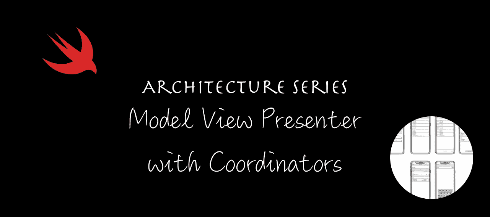
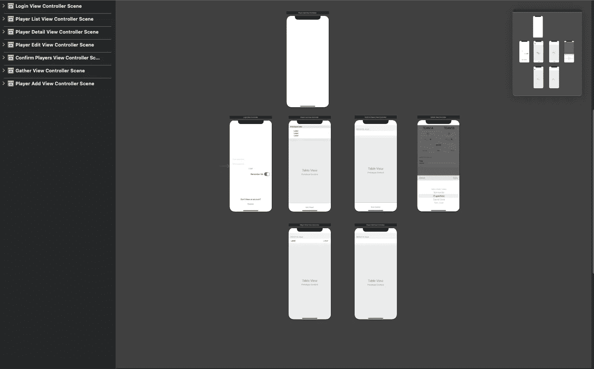

# iOS 架构模式之战:模型视图演示者和协调者(MVP-C)

> 原文：<https://medium.com/geekculture/battle-of-the-ios-architecture-patterns-model-view-presenter-with-coordinators-mvp-c-99edf7ab8c36?source=collection_archive---------10----------------------->



Architecture Series — Model View Presenter with Coordinators (MVP-C)

# 动机

在开始开发一个 iOS 应用之前，我们必须考虑项目的结构。我们需要考虑如何将这些代码添加到一起，以便它们在以后有意义——当我们回来重新访问应用程序的一部分时——以及如何与其他开发人员形成已知的“语言”。

如果你错过了其他文章，你可以在下面找到它们，或者你可以在这篇文章的末尾找到链接。

*   模型视图控制器(MVC)——[链接此处](https://www.radude89.com/blog/mvc.html)
*   模型视图视图模型(MVVM)——[链接此处](https://www.radude89.com/blog/mvvm.html)
*   模特展示者(MVP)——[链接此处](https://www.radude89.com/blog/mvp.html)

我们将探索如何通过在代码中引入协调模式来简化导航。像往常一样，我们将看到如何将模式应用到每个屏幕，看到实际的实现和源代码。最后，我们将展示构建时间，并详细说明与其他架构模式相比，使用协调器的 MVP 的一些关键观察结果。

如果你只是想看代码，可以跳过这篇文章。该代码可以在 [GitHub](https://github.com/radude89/footballgather-ios) 上开源获得。

# 为什么你的 iOS 应用需要一个架构模式？

最需要考虑的是要有一个可维护的 app。你知道视图在那里，这个视图控制器应该做 X 而不是 y。更重要的是，其他人也知道。

以下是选择一个好的架构模式的一些优势:

*   更易于维护
*   更容易测试业务逻辑
*   与其他队友发展共同语言
*   分离实体的职责
*   更少的错误

# 定义需求

给定一个有六七个屏幕的 iOS 应用程序，我们将使用 iOS 世界最流行的架构模式来开发它:MVC、MVVM、MVP、VIPER、VIP 和 Coordinators。

该演示应用程序名为 Football Gather，是朋友们跟踪业余足球比赛比分的一种简单方式。

# 主要特征

能够:

*   在应用程序中添加玩家
*   给运动员分配队伍
*   编辑玩家
*   为比赛设置倒计时

## 屏幕模型


Screen mockups of “Football Gather”, the iOS app

## 后端

该应用由在 [Vapor web 框架](https://vapor.codes/)中开发的 web 应用提供支持。可以查看我的 [Vapor 3 初始篇](https://www.radude89.com/blog/vapor.html)和[关于迁移到 Vapor 4](https://www.radude89.com/blog/migrate-to-vapor4.html) 的文章中的 app。

# 什么是协调员

协调器的概念是由 [Soroush Khanlou 在 2015 年](https://khanlou.com/2015/01/the-coordinator/)首次提出的，作为处理视图控制器中的流逻辑的解决方案。

随着您的应用程序的规模和复杂性的增长，您可能需要在新的地方重用一些视图控制器，而通过在视图控制器中耦合流逻辑很难实现这一点。正如 Soroush 所说，为了很好地执行模式，您需要一个高级或基本的协调者来指导整个应用程序。

将流程提取到协调器中有几个好处:

*   视图控制器可以专注于他们的主要目标，这取决于您在应用程序中使用的架构模式(例如，将模型绑定到视图)。
*   视图控制器的初始化在不同的层中提取。

与协调员一起解决问题:

*   过度填充的应用程序委托:我们倾向于在我们的应用程序委托中添加很多东西，通过使用一个基础应用程序协调器，我们可以将一些代码移到那里。
*   职责太多:视图控制器倾向于做很多事情，尤其是在 MVC 架构中(模型绑定、视图处理、数据获取、数据转换等)。
*   平滑流:导航流现在从视图控制器中移出，并添加到一个协调器中。

你从 app coordinator 开始，解决在`AppDelegate`里做那么多事情的问题。
在这里，您可以分配窗口对象，创建导航控制器并初始化第一个视图控制器。在 [**中，马丁·福勒的企业应用架构**](https://www.amazon.com/Patterns-Enterprise-Application-Architecture-Martin/dp/0321127420) 模式被称为**应用控制器**。

协调器的一个规则是每个协调器拥有一个其子协调器的数组。这样，我们可以防止子协调器被释放。
如果你有一个标签栏 app，每个导航控制器都有自己的协调器。每个协调器由其父协调器分配。

除了流程逻辑之外，协调器还从模型变更的视图控制器那里承担责任。

## 优势

*   每个视图控制器现在都是独立的。
*   视图控制器是可重用。
*   应用程序中的每个任务和子任务都有专门的封装方式。
*   协调者将显示绑定与副作用分开。
*   协调者是完全由你控制的对象。

## 背部问题

当导航控制器在堆栈中向后导航时会发生什么？对于那个特殊的栏按钮项，我们没有太多的控制权。我们可以编写自己的自定义后退按钮，但是当用户向右滑动返回时会发生什么呢？

解决这个问题的一个方法是在视图控制器中保留一个对协调器的引用，并在`viewDidDisappear`中调用它的`didFinish`方法。这对于一个简单的应用程序来说很好，但是我们不能解决这个问题，例如，当我们在子协调器中显示多个视图控制器时。

[正如 Soroush 提到的](https://khanlou.com/2017/05/back-buttons-and-coordinators/)，我们可以实现`UINavigationControllerDelegate`来访问这类事件。

1.  在您的主应用程序协调器中实现`UINavigationControllerDelegate`。我们对实例方法`navigationController:didShowViewController:animated:`感兴趣，这个方法在导航控制器显示一个视图控制器的视图和导航项目属性之后被调用。
    当您得到一个视图控制器从视图堆栈中弹出的触发事件时，您可以释放相关的协调器。
2.  子类`UIViewController`，让你的 it 成为你的流程的一部分。
    在这个特殊的子类中，你将有一个字典来保存你的协调者的条目:
    `private var viewControllersToChildCoordinators: [UIViewController: Coordinator] = [:]`
    你在这个类中实现了`UINavigationControllerDelegate`。当一个视图控制器被弹出并成为字典的一部分时，它将被移除和释放。
    这种方法的缺点和主要缺点是你的特殊子类(是一个`UIViewController`)做的比我们想要的多。

# 适用于我们的准则

我们首先定义我们的应用协调员:

start 函数负责分配视图控制器并将其推入导航控制器堆栈。

我们定义了一个`Coordinatable`项目，我们的视图控制器将实现这个项目，因此它们可以将特定的导航任务委托给它们的协调器(比如返回)。

接下来，我们创建主应用程序协调器:`AppCoordinator`并在`AppDelegate`中初始化它。

`AppDelegate`现在看起来像这样:

我们的第一个屏幕是**登录**。我们做了以下调整，以便它可以支持协调员:

## 登录协调员

`LoginCoordinator`如下所示:

对`Coordinatable`的一种替代方法是使用委托，即创建一个包含方法`navigateToPlayerList`的`LoginViewControllerDelegate`，并使`LoginCoordinator`成为这个类的委托。

而**登录屏幕**的最后一步，是从故事板中移除片段。



Simplified version of the **Main.storyboard**

因为我们要从故事板实例化我们所有的视图控制器，所以让我们定义一个方便的方法来完成它:

我们现在可以通过在指定的故事板中设置故事板 ID 来分配视图控制器，并使用:

**播放器列表**屏幕进行以下调整:

*   我们移除了`PlayerListTogglable`，pop 功能完全由协调员负责。
*   让它实现`Coordinatable`，这样我们就可以引用视图控制器的协调器。
*   从`PlayerDetailViewControllerDelegate`、`AddPlayerDelegate`和`PlayerListTogglable`中移除委托方法。
*   使用在编辑(重新加载数据)、添加和收集完成后需要的方法增强公共 API(`toggleViewState`)。

为了从 **PlayerList** 导航到不同的屏幕(例如，添加或编辑屏幕)，我们在 **Presenter** 中创建了适当的 segue 标识符，并使用 **View** 层将其转发给 **ViewController** 。我们现在反对使用 segue 标识符，所有路由都将使用**协调器**来完成。那么，让我们来实现这些变化:

## PlayerListCoordinator

协调器的实现如下所示:

我们必须对 **PlayerEdit** 和 **PlayerDetail** 屏幕做一些改动。

首先，我们必须让它们实现`Coordinatable`，这样我们就可以引用协调器，就像我们为 **PlayerList** 所做的一样。

在 **PlayerDetails** 中，我们必须公开`setupTitle`方法，因为当我们编辑一个播放器并更改其名称时，我们需要将这一更改传达给 **ViewController** 以便它可以刷新导航标题。标题其实就是玩家名字。

我们对`reloadData()`做了同样的事情，并创建了一个新的函数`updateData(player)`来与玩家改变的**视图**通信。

我们使用`PlayerDetailViewDelegate`来监听**视图**层中发生的变化:

`PlayerDetailViewDelegate`现在已经改变了简单的`didRequestEditView`方法，变成了你上面看到的那个。
这是从`didSelectRow`表格视图的委托中调用的:

## PlayerDetailCoordinator

完整代码如下:

## 播放编辑协调器

实现非常简单:

## PlayerAddCoordinator

添加玩家功能受到了一点影响，因为它非常简单。协调器看起来像这样:

在`PlayerAddViewController`中，我们修改`didAddPlayer`(从**视图**层调用)如下:

## `ConfirmPlayersCoordinator`

在 **ConfirmPlayers** 中，我们获取选定玩家的字典，为他们选择一个团队，最后我们开始集合。

`ConfirmPlayersCoordinator`看起来是这样的:

在`ConfirmPlayersView`中我们改变了方法`didStartGather()`，传递了参数列表中的`GatherModel`:`func didStartGather(_ gather: GatherModel)`。

## `GatherCoordinator`

最后，`GatherCoordinator`详述如下:

`GatherViewController`的`didEndGather`方法从:

收件人:

# 关键指标

## 代码行—协调者

## 代码行—视图控制器

## 代码行—视图

## 代码行—演示者

## 代码行—本地模型

## 单元测试

## 构建时间

*测试在 iPhone 8 模拟器中运行，iOS 14.4，使用 Xcode 12.5.1，在 i9 MacBook Pro 2019 上运行。*

# 结论

又一个失败了。恭喜你。我们已经完成了另一篇**架构系列**实现文章。

我们一起发现了如何将**协调器**模式实现到现有的应用程序中，从而简化**视图控制器**。

首先，我们必须从故事板上去掉所有片段，留下一些悬挂的屏幕。如果我们再次打开`Main.storyboard`，我们将不知道屏幕是如何连接的。我们可以从视图控制器的定位中发现这一点，但这并不是在所有情况下都非常直观。

然后，我们在**应用**级别引入了一些新的类来创建主协调器。

接下来，我们一个模块接一个模块地应用新的模式，简化了事物在屏幕之间传递的方式，以及我们如何开始我们旅程的下一步。我们不再需要执行 segues，在**模型**的**展示器**中保存一个引用，当**视图控制器**准备执行 segues 时，返回到**展示器**(或在**视图控制器**中保存一个引用)以检索我们下一个屏幕需要的**模型**。

最后，我们实现了从孩子到父母协调者的通信委托模式(例如，添加或编辑与玩家列表通信的玩家以刷新屏幕)。

我认为这是一个很好的模式，可以用在所有想要脱离情节和故事板的应用程序中。

通过查看代码行数，我们引入了 **348** 新行。

然而，我们现在在视图控制器中少了 64 个 LOC。

正如我们在`LoginViewController`中看到的，我们用**三个**增加了 LOC。很不寻常...这是为什么呢？！

嗯，视图控制器很简单，当执行 segues 时，它只有一些命令行程序。在采用协调模式时，我们引入了两个新变量:

```
weak var coordinator: Coordinator?private var listCoordinator: PlayerListCoordinator? {
     coordinator as? PlayerListCoordinator
}
```

**视图**和**演示者**保持了几乎相同的 LOC 数量。
在 **PlayerDetail** 模块中有些小的不同，我们在`PlayerDetailView`中引入了 **3** 新 LOC，因为我们引入了三个新变量要传递给**编辑**屏幕(参见`didSelectRowAt`方法)。然而，我们设法将 **7** 锁从`PlayerListPresenter`中移除。

因此，正如所料，这种模式的主要受益者是**视图控制器**。

构建时间增加了一点，可能是因为我们引入了新的文件，编译器需要做更多的事情。每次我们做一个干净的构建并删除派生的数据文件夹时，与没有协调器的 MVP 编码的应用程序相比，我们损失了大约 **2 秒**，当应用程序使用 MVC 时，损失了超过 **5 秒**。

这不是灾难性的，我们通常为此使用 CI 解决方案，我们不需要在本地等待所有测试都通过。

就这样结束了！

# 有用的链接

*   iOS 应用程序，Football Gather — [GitHub 回购链接](https://github.com/radude89/footballgather-ios/tree/master/FootballGather)
*   用 Vapor 制作的 web 服务器应用程序— [GitHub Repo Link](https://github.com/radude89/footballgather-ws)
*   Vapor 3 后端 API[文章链接](https://radu-ionut-dan.medium.com/using-vapor-and-fluent-to-create-a-rest-api-5f9a0dcffc7b)
*   迁移到蒸汽 4 [文章链接](https://radu-ionut-dan.medium.com/migrating-to-vapor-4-53a821c29203)
*   模型视图控制器(MVC) — [GitHub Repo 链接](https://github.com/radude89/footballgather-ios/tree/master/FootballGather/MVC)和[文章链接](https://betterprogramming.pub/battle-of-the-ios-architecture-patterns-model-view-controller-mvc-442241b447f6)
*   模型视图 ViewModel (MVVM) — [GitHub 回购链接](https://github.com/radude89/footballgather-ios/tree/master/FootballGather/MVVM)和[文章链接](https://betterprogramming.pub/battle-of-the-ios-architecture-patterns-a-look-at-model-view-viewmodel-mvvm-bdfd07d9395e)
*   模型视图演示者(MVP) — [GitHub 回购链接](https://github.com/radude89/footballgather-ios/tree/master/FootballGather/MVP)和[文章链接](/geekculture/battle-of-the-ios-architecture-patterns-model-view-presenter-mvp-f693f6efd23e)
*   协调员模式—带协调员的 MVP(MVP-C)—[GitHub 回购链接](https://github.com/radude89/footballgather-ios/tree/master/FootballGather/MVP-C)和[文章链接](/geekculture/battle-of-the-ios-architecture-patterns-model-view-presenter-with-coordinators-mvp-c-99edf7ab8c36)
*   查看交互器演示者实体路由器(VIPER)——[GitHub Repo 链接](https://github.com/radude89/footballgather-ios/tree/master/FootballGather/VIPER)和[文章链接](/geekculture/battle-of-the-ios-architecture-patterns-view-interactor-presenter-entity-router-viper-8f76f1bdc960)
*   查看互动者展示者(VIP)——[GitHub 回购链接](https://github.com/radude89/footballgather-ios/tree/master/FootballGather/VIP)和[文章链接](https://radu-ionut-dan.medium.com/battle-of-the-ios-architecture-patterns-view-interactor-presenter-vip-59ebdae86e84)