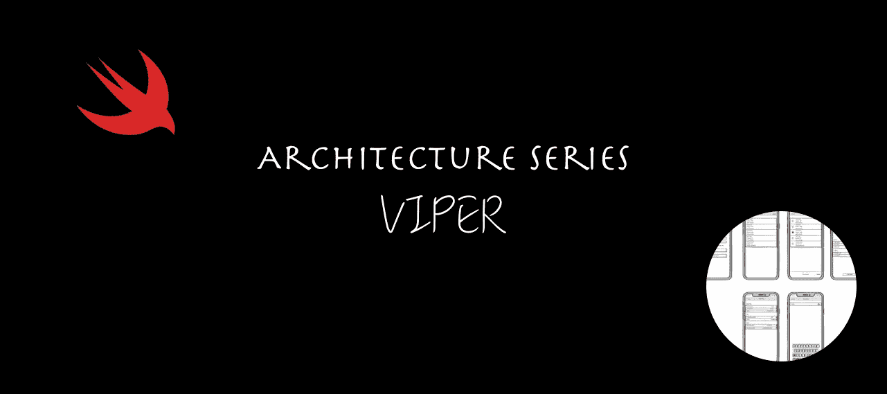
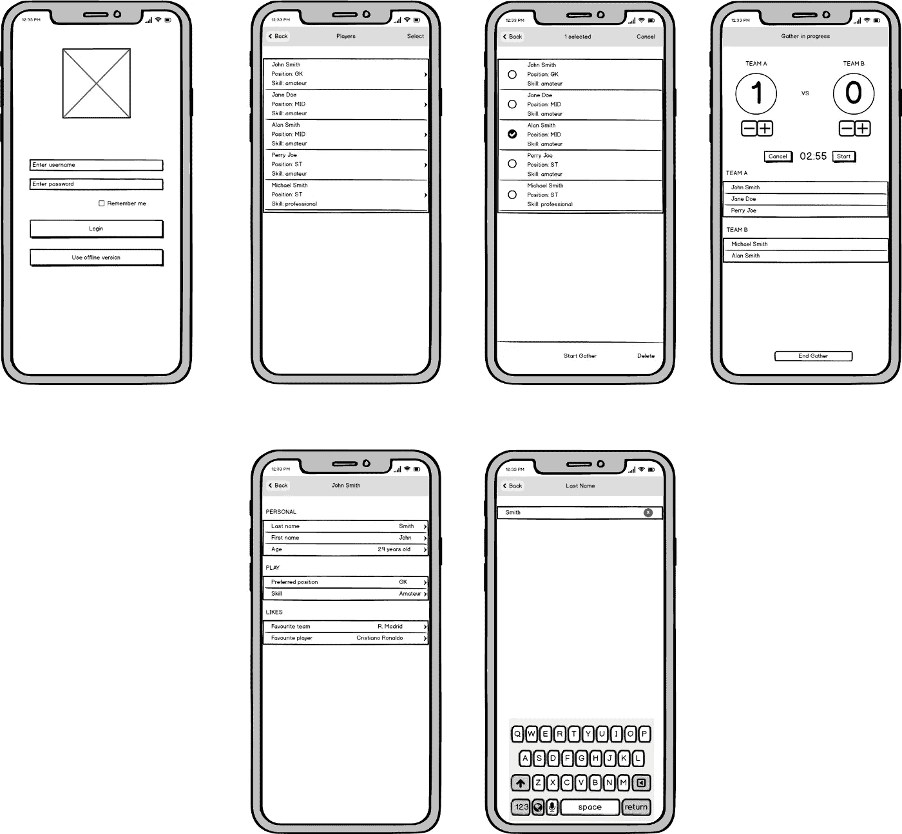

# iOS 架构模式之战:查看交互器演示者实体路由器(VIPER)

> 原文：<https://medium.com/geekculture/battle-of-the-ios-architecture-patterns-view-interactor-presenter-entity-router-viper-8f76f1bdc960?source=collection_archive---------1----------------------->

Architecture Series — View Interactor Presenter Entity Router (VIPER)

# 动机

在开始开发一个 iOS 应用之前，我们必须考虑项目的结构。我们需要考虑如何将这些代码添加到一起，以便它们在以后有意义——当我们回来重新访问应用程序的一部分时——以及如何与其他开发人员形成已知的“语言”。

在这篇实现文章中，我们将把我们的 Football Gather 应用程序转换成一个 VIPER 代码库架构。

如果您错过了其他文章，您可以在下面访问它们，或者您可以在本文末尾找到链接。

*   模型视图控制器(MVC)——[链接此处](https://betterprogramming.pub/battle-of-the-ios-architecture-patterns-model-view-controller-mvc-442241b447f6)
*   模型视图视图模型(MVVM)——[链接此处](https://betterprogramming.pub/battle-of-the-ios-architecture-patterns-a-look-at-model-view-viewmodel-mvvm-bdfd07d9395e)
*   模特展示者(MVP)——[链接此处](/geekculture/battle-of-the-ios-architecture-patterns-model-view-presenter-mvp-f693f6efd23e)
*   带协调员的模型视图演示者(MVP-C) — [链接此处](/geekculture/battle-of-the-ios-architecture-patterns-model-view-presenter-with-coordinators-mvp-c-99edf7ab8c36)

你是不是不耐烦了，只想看看代码？别担心！你可以在 GitHub 上找到它。

按照我们在其他帖子中使用的方法，我们将首先说一些关于这个模式的事情，以及它为什么有用。然后再看实际的实现。
最后，我们将展示一些关于编译和构建时间的数字，检查编写单元测试有多容易，并陈述我们的结论。

# 为什么你的 iOS 应用需要一个架构模式？

最需要考虑的是要有一个可维护的 app。你知道视图在那里，这个视图控制器应该做 X 而不是 y。更重要的是，其他人也知道。

以下是选择一个好的架构模式的一些优势:

*   更易于维护
*   更容易测试业务逻辑
*   与其他队友发展共同语言
*   分离实体的职责
*   更少的错误

# 定义需求

给定一个有六七个屏幕的 iOS 应用程序，我们将使用 iOS 世界最流行的架构模式来开发它:MVC、MVVM、MVP、VIPER、VIP 和 Coordinators。

该演示应用程序名为 Football Gather，是朋友们跟踪业余足球比赛比分的一种简单方式。

## 主要特征

能够:

*   在应用程序中添加玩家
*   给运动员分配队伍
*   编辑玩家
*   为比赛设置倒计时

## 屏幕模型

Screen mockups of “Football Gather”, the iOS app

## 后端

该应用由在 [Vapor web 框架](https://vapor.codes/)中开发的 web 应用提供支持。你可以查看我的 [Vapor 3 初始篇](https://www.radude89.com/blog/vapor.html)和[关于迁移到 Vapor 4](https://www.radude89.com/blog/migrate-to-vapor4.html) 的文章中的 app。

# 伙计，我的毒蛇呢？

**VIPER** 代表视图-交互者-展示者-实体-路由器。

我们在 MVP 中看到了 **Presenter** 层是什么以及它的作用。这一概念也适用于 VIPER，但是它增加了一个新的职责，从**交互器**获取数据，并根据规则更新/配置**视图**。

## 视角

必须尽可能的愚蠢。它将所有事件转发给**呈现者**，并且主要应该做**呈现者**告诉它做的事情，这是被动的。

## 互动者

引入了一个新的层，在这里我们应该放置与业务规则和逻辑相关的所有内容。

## 提出者

负责根据用户的动作从**交互器**获取数据，然后处理**视图**的更新。

## 实体

是**模型**层，用于封装数据。

## 路由器

保存我们应用程序的所有导航逻辑。看起来更像是一个**协调者**，没有业务逻辑。

## 沟通

当视图层中发生一些事情时，例如当用户发起一个动作时，它被传送到**呈现器**。

**展示者**向**互动者**询问用户所需的数据。**交互器**提供数据。

**表示器**应用所需的 UI 转换来显示数据。

当型号/数据改变时，**交互器**将通知**演示器**。

**展示器**将根据其接收到的数据配置或刷新**视图**。

当用户在应用程序的不同屏幕中导航或选择不同的路线来改变流程时，视图会将其传达给**演示者**。

**呈现器**将通知**路由器**加载新的屏幕或加载新的流(例如，推送新的视图控制器)。

## 加长蝰蛇

VIPER 架构模式中有一些常用的概念。

## 模块

将 VIPER 层的创建从路由器中分离出来并引入一个新的模块组装处理程序是一个好主意。这很可能是用工厂方法模式完成的。

我们应用的具体实现是:

我们稍后会看到更多的源代码。

## TimeDivisionDuplex 时分双工

从干净代码的角度来看，这种方法做得很好，您开发的层可以很好地分离关注点，并更好地遵循可靠的原则。

所以，使用 VIPER 很容易实现 TDD。

*   模块被解耦。
*   关注点有明确的分离。
*   从编码的角度来看，模块是整洁干净的。

## 代码生成工具

随着我们向我们的应用程序添加更多的模块、流程和功能，我们会发现我们编写了大量的代码，其中大部分都是重复的。

为您的 VIPER 模块提供一个代码生成器工具是一个好主意。

## 解决背部问题

我们看到，在应用**协调器**模式时，我们在返回堆栈导航到特定的视图控制器时遇到了问题。
在这种情况下，如果我们的应用程序需要在不同的 VIPER 模块之间返回或发送数据，我们需要想一个办法。

这个问题可以通过**代表团**轻松解决。

例如:

我们将在**部分看到更多应用于我们代码**的实际例子。

## 何时使用 VIPER

当你对 Swift 和 iOS 编程有所了解，或者你的团队中有经验丰富或更资深的开发人员时，应该使用 VIPER。

如果你是一个小项目的一部分，那么 VIPER 可能太大了。MVC 应该工作得很好。

当你对模块化和单元测试更感兴趣的时候使用它，这样你就能得到高代码覆盖率。当你是一个初学者或者你没有太多的 iOS 开发经验时，不要使用它。做好写更多代码的准备。

从我的角度来看，VIPER 很棒，我真的很喜欢代码看起来很干净。易于测试，我的类是解耦的，代码确实是可靠的。

对于我们的应用程序，我们将**视图**层分成两个组件:**视图控制器**和实际的**视图**。
**view controller**充当**协调器** / **路由器**并保存对视图的引用，通常设置为`IBOutlet`。

## 优势

*   代码是干净的，SRP 是它的核心。
*   单元测试很容易编写。
*   代码是解耦的。
*   更少的错误，特别是如果你使用 TDD。
*   对于复杂的项目非常有用，它简化了业务逻辑。
*   这些模块可以重复使用。
*   新功能很容易添加。

## 不足之处

*   你可能会写很多样板代码。
*   对小型应用程序来说不太好。
*   你最终会得到一个大的代码库和许多类。
*   根据您的应用程序使用案例，某些组件可能是多余的。
*   App 启动会略有增加。

# 适用于我们的准则

通过应用 VIPER，该应用程序将有重大变化。

我们决定不为**视图**和**视图控制器**保留两个单独的图层，因为其中一个图层会变得很淡，没有多大用处。

所有协调员都将被删除。

首先，我们首先创建一个`AppLoader`，它将加载第一个模块 **Login** 。

我们在`AppDelegate`中分配`AppLoader`,并在应用完成启动时调用函数`build()`。

我们之前看到过，我们如何使用`ModuleFactory`来创建毒蛇模块。我们为所有需要在我们的应用程序中组装的模块提供了一个接口。

我们有一个结构`ModuleFactory`，它是上述协议的具体实现。

让我们看看 **LoginModule** 是如何创建的。

每个模块都有一个功能`assemble()`，在执行`AppModule`协议时需要用到。

在这里，我们创建毒蛇层之间的引用:

*   我们将视图设置为演示者(弱链接)。
*   **主讲人**非常重视**互动者**。
*   **演示者**强烈引用了**路由器**。
*   **交互器**持有对**呈现器**的弱引用。
*   我们的**视图**强烈引用了**演示者**。

当然，我们设置弱引用是为了避免可能导致内存泄漏的保留周期。

我们应用程序中的每个 VIPER 模块都是以相同的方式组装的。

`LoginRouter`有一个简单的工作:在用户登录后呈现球员。

当我们将 MVP 应用到我们的代码时，我们忽略了一个重要的方面，那就是我们没有使我们的**视图**被动。在某些情况下，**主持人**的行为更像是**视图模型**。

让我们纠正这一点，让**的观点**尽可能的被动和愚蠢。

我们做的另一件事是将`LoginViewProtocol`分成多个小协议，以满足特定需求:

我们通过使用协议组合将它们组合在一起，并用一个`typealias`命名它们。我们对所有的 VIPER 协议使用相同的方法。

`LoginViewController`描述如下:

`Loadable`是我们在先前版本的代码库中使用的相同的助手协议。它只是显示和隐藏一个加载视图，这在处理一些网络请求时很方便。对于类型为`UIView`和`UIViewController`的类，它有一个默认的实现(例如:扩展`Loadable where Self: UIViewController`)。

`ErrorHandler`是一个新的助手协议，它有一个方法:

默认实现使用来自`AlertHelper`的静态方法来呈现一个警报控制器。我们用它来显示网络错误。

我们继续下面的**演示者**层:

我们通过初始化器来设置我们的依赖关系。现在，演示者有了两个新的依赖项:**交互器**和**路由器**。

在我们的**视图控制器**完成加载视图后，我们通知**展示者**。我们想让**视图**更加被动，所以我们让**呈现者**指定**视图**如何用我们从**交互者**那里获得的信息配置它的 UI 元素:

登录和注册的服务 API 调用是相似的:

当 API 调用完成后，**交互器**从**展示器**中调用以下方法:

**交互器**现在拥有业务逻辑:

我们在公共 API 中公开了`rememberMe`和`username`的实际值:

服务处理程序比以前的架构模式更轻便:

编辑玩家时，我们使用委托来刷新来自**玩家列表**模块的玩家列表。

## 导航到编辑屏幕

我们通过从`PlayerListPresenter`调用路由器来显示`PlayerDetailsView`:

`PlayerListRouter`如下所示:

现在，我们用同样的方法从**细节**屏幕到**编辑**屏幕:

和路由器:

## 导航回列表屏幕

当用户确认对播放器的更改时，我们称之为演示者代表。

委托人是`PlayerDetailsPresenter`:

最后，我们调用`PlayerDetailDelegate`(分配给`PlayerListPresenter`)并刷新玩家列表:

我们按照同样的方法对**确认**和**添加**模块:

**路由器**类如下所示:

在`PlayerAddPresenter`中实现服务处理器:

最后，代表团成员名单:

在这种架构模式中，我们想让**视图**尽可能被动(这一概念也应该应用于 MVP)。
对于我们为表格行创建的那个，一个`CellViewPresenter`:

具体类别描述如下:

主讲人将更新`CellView`:

在`PlayerViewController`中，我们有`cellForRowAt`方法:

在**表示器**中，我们缓存了现有的单元格表示器:

最后，我们介绍我们的主要应用程序模块，**收集**。

`GatherViewController`简化了，看起来很棒:

我们使用协议`GatherViewConfigurable`公开公共 API:

`GatherViewReloadable`定义了`reloadData`方法。在这里，我们重新加载所有的`picker`组件和`tableView`数据。

我们不再有两个单独的层，**视图控制器**和**视图**。警报控制器演示在**视图**层中完成:

我们可以使用一个单独的层，并为表格和选取器的**数据源**和**委托**创建另一个对象，但是为了我们的练习，我们更喜欢在我们的**视图控制器**中实现这些方法:

我们还实现了`ScoreStepperDelegate`来将团队滑块的 UI 更新传递给演示者。

最后是一些帮助器协议，为我们的自定义单元添加功能，显示和隐藏加载微调器并处理错误。

# 测试我们的业务逻辑

在 VIPER 中，我们有**交互器**来处理我们的业务逻辑。这个要测试。

然而，该架构的核心是**表示器**，它处理对**视图**的更新，并与**路由器**和**交互器**进行通信。这也应该被测试。

## 测试演示者

单元测试演示者的类别是`GatherPresenterTests`:

测试表视图和选取器视图的数据源:

测试步进处理器:

测试`IBActions`:

模拟在一个单独的文件中定义:

测试**互动器**:

我们嘲笑**的主持人**:

# 关键指标

## 代码行—协议

## 代码行—视图控制器和视图

## 代码行—模块

## 代码行—路由器

## 代码行—演示者

## 代码行—交互器

## 代码行—本地模型

## 单元测试

## 构建时间

*测试在 8 核英特尔酷睿 i9，MacBook Pro，2019 上运行。Xcode 版本:12.5.1。大苏尔马科斯。*

# 结论

如果你正在寻找干净的代码，VIPER 是一个很棒的架构。如果我们真的想接受单一责任原则，我们甚至可以更进一步，创造更多的层次。

单元测试很容易编写。

另一方面，我们的项目中有很多文件、协议和类。当某些东西改变或者我们需要更新 UI 中的某些东西时，我们最终会改变很多东西，这需要时间。

具体到我们的应用程序，与其他模式相比，将现有的 MVP-C 架构转换成 VIPER 更难实现。我们必须先合并**视图**和**视图控制器**层，然后我们必须接触几乎所有的类并创建新的类/文件。

功能相当小，大部分集中做一件事。

如果我们想使用静态框架，将模块从主`.xcodeproj`中分离出来，那么协议文件是有用的。

我们注意到 **ViewControllers** 已经减少了很多，它们加起来差不多有 **800** 行代码。这比来自 MVC 的 **ViewControllers** 多一倍，在 MVC 中我们有 **1627** 行代码。

另一方面，我们现在有了新的层次:

*   **协议** —这只是模块的抽象，只包含层的定义。
*   **模块** —蝰蛇层的组装。它是**路由器**的一部分，通常由工厂初始化。
*   **交互器** —包含业务逻辑和网络调用，编排数据变化。

新图层增加了 1903 行代码。

编写单元测试非常有趣。我们让一切脱钩，并很高兴断言不同的条件。我们设法获得了 100%的代码覆盖率。

然而，构建时间是最长的。每次我们删除**派生数据**文件夹的内容并清理构建文件夹，我们都会损失 **10.43** 秒。
这比应用在 MVVM 或 MVC 时多花了将近一秒钟。但是谁知道我们在修复潜在的错误上节省了多少时间呢？！

清理文件夹后执行单元测试，大约需要 **20 秒**。我们有更多的测试，总共 46 次。

更多的文件、类和依赖项会增加编译器的编译时间。

幸运的是，我们不必在每次想要运行单元测试时清理构建和清除派生数据文件夹。我们可以将此职责留给 CI 服务器。

我个人喜欢在不经常改变的大中型应用程序中使用 VIPER，我们在现有的基础上增加新的功能。

然而，当采用 VIPER 时，有一些显著的缺点。首先，你写了很多代码，你可能会想为什么你需要通过三层，而不是仅仅在**视图控制器**中完成。

其次，它对小型应用程序没有意义，我们不需要在简单的任务中添加样板文件，创建多余的文件。

最后，你的 app 编译时间，甚至你的启动时间都会增加。

谢谢你坚持到最后！

# 有用的链接

*   iOS 应用程序，Football Gather — [GitHub 回购链接](https://github.com/radude89/footballgather-ios/tree/master/FootballGather)
*   Vapor 中的 web 服务器应用— [GitHub Repo Link](https://github.com/radude89/footballgather-ws)
*   Vapor 3 后端 API[文章链接](https://radu-ionut-dan.medium.com/using-vapor-and-fluent-to-create-a-rest-api-5f9a0dcffc7b)
*   迁移到 Vapor 4 [文章链接](https://radu-ionut-dan.medium.com/migrating-to-vapor-4-53a821c29203)
*   模型视图控制器(MVC) — [GitHub 回购链接](https://github.com/radude89/footballgather-ios/tree/master/FootballGather/MVC)和[文章链接](https://betterprogramming.pub/battle-of-the-ios-architecture-patterns-model-view-controller-mvc-442241b447f6)
*   模型视图 ViewModel (MVVM) — [GitHub 回购链接](https://github.com/radude89/footballgather-ios/tree/master/FootballGather/MVVM)和[文章链接](https://betterprogramming.pub/battle-of-the-ios-architecture-patterns-a-look-at-model-view-viewmodel-mvvm-bdfd07d9395e)
*   模型视图演示者(MVP)——[GitHub 回购链接](https://github.com/radude89/footballgather-ios/tree/master/FootballGather/MVP)和[文章链接](/geekculture/battle-of-the-ios-architecture-patterns-model-view-presenter-mvp-f693f6efd23e)
*   协调员模式—带协调员的 MVP(MVP-C)—[GitHub 回购链接](https://github.com/radude89/footballgather-ios/tree/master/FootballGather/MVP-C)和[文章链接](/geekculture/battle-of-the-ios-architecture-patterns-model-view-presenter-with-coordinators-mvp-c-99edf7ab8c36)
*   查看交互器演示者实体路由器(VIPER)——[GitHub Repo 链接](https://github.com/radude89/footballgather-ios/tree/master/FootballGather/VIPER)
*   查看互动者展示者(VIP) — [GitHub 回购链接](https://github.com/radude89/footballgather-ios/tree/master/FootballGather/VIP)和[文章链接](https://radu-ionut-dan.medium.com/battle-of-the-ios-architecture-patterns-view-interactor-presenter-vip-59ebdae86e84)