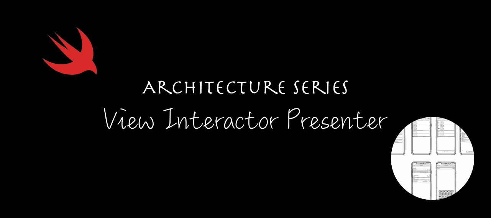

# iOS 架构模式之战:查看交互演示者(VIP)

> 原文：<https://medium.com/geekculture/battle-of-the-ios-architecture-patterns-view-interactor-presenter-vip-59ebdae86e84?source=collection_archive---------5----------------------->

Architecture Series — View Interactor Presenter (VIP)

# 动机

在开始开发一个 iOS 应用之前，我们必须考虑项目的结构。我们需要考虑如何将这些代码添加到一起，以便它们在以后有意义——当我们回来重新访问应用程序的一部分时——以及如何与其他开发人员形成已知的“语言”。

这是“架构模式”系列的最后一篇文章，我们将看到如何将 VIP 实现到 Football Gather 应用程序中。

如果您错过了其他文章，您可以在下面访问它们，或者您可以在本文末尾找到链接。

*   模型视图控制器(MVC)——[链接此处](https://betterprogramming.pub/battle-of-the-ios-architecture-patterns-model-view-controller-mvc-442241b447f6)
*   模型视图视图模型(MVVM)——[链接此处](https://betterprogramming.pub/battle-of-the-ios-architecture-patterns-a-look-at-model-view-viewmodel-mvvm-bdfd07d9395e)
*   模特展示者(MVP)——[链接此处](/geekculture/battle-of-the-ios-architecture-patterns-model-view-presenter-mvp-f693f6efd23e)
*   带协调员的模型视图演示者(MVP-C) — [链接此处](/geekculture/battle-of-the-ios-architecture-patterns-model-view-presenter-with-coordinators-mvp-c-99edf7ab8c36)
*   查看互动者演示者实体路由器(VIPER)——[链接此处](/geekculture/battle-of-the-ios-architecture-patterns-view-interactor-presenter-entity-router-viper-8f76f1bdc960)

你是不是不耐烦了，只想看看代码？别担心！你可以在 GitHub 上找到它[。](https://github.com/radude89/footballgather-ios/tree/master/FootballGather/VIPER)

按照我们在其他帖子中使用的方法，我们将首先说一些关于这个模式的事情，以及它为什么有用。然后再看实际的实现。
最后，我们将展示一些关于编译和构建时间的数字，检查编写单元测试有多容易，并陈述我们的结论。

# 为什么你的 iOS 应用需要一个架构模式？

最需要考虑的是要有一个可维护的 app。你知道视图在那里，这个视图控制器应该做 X 而不是 y。更重要的是，其他人也知道。

以下是选择一个好的架构模式的一些优势:

*   更易于维护
*   更容易测试业务逻辑
*   与其他队友发展共同语言
*   分离实体的职责
*   更少的错误

# 定义需求

给定一个有六七个屏幕的 iOS 应用程序，我们将使用 iOS 世界最流行的架构模式来开发它:MVC、MVVM、MVP、VIPER、VIP 和 Coordinators。

该演示应用程序名为 Football Gather，是朋友们跟踪业余足球比赛比分的一种简单方式。

## 主要特征

能够:

*   在应用程序中添加玩家
*   给运动员分配队伍
*   编辑玩家
*   为比赛设置倒计时

## 屏幕模型

Screen mockups of “Football Gather”, the iOS app

# 后端

该应用由在 [Vapor web 框架](https://vapor.codes/)中开发的 web 应用提供支持。你可以查看我的 [Vapor 3 初始篇](https://www.radude89.com/blog/vapor.html)和关于迁移到 Vapor 4 的[篇中的 app。](https://www.radude89.com/blog/migrate-to-vapor4.html)

# 像贵宾一样清理您的代码

VIP 不是一种常用的架构模式。它已由 Raymond Law 发明，旨在成为应用于 iOS 项目的大叔 Bob Clean Architecture 版本。更多内容请看这里:[https://clean-swift.com/](https://clean-swift.com/)。

VIP 的主要目标是解决 MVC 中的大量视图控制器问题。VIP 还打算为其他架构模式问题提供一个干净的替代方案。例如，VIPER 将演示者放在应用程序的中心。VIP 通过使用单向控制方式简化了流程，使得通过层调用方法变得更加容易。

VIP 将您的应用程序控制转换为 VIP 周期，提供单向控制流。

应用 VIP 的场景示例:

1.  用户点击一个按钮来获取玩家名单。我们在**视图控制器**中。
2.  `IBAction`从**交互器**中调用方法。
3.  **交互器**转换请求，执行一些业务逻辑(从服务器获取玩家列表)并调用**呈现器**以可呈现的方式为用户转换响应。
4.  **主持人**调用**视图控制器**在屏幕上显示玩家。

体系结构组件描述如下。

## 视图/视图控制器

有两个功能:向**交互器**发送请求，并动作和显示来自**演示器**的信息。

## 互动者

**的“新”主讲人**。这一层是 VIP 架构的核心，执行诸如网络调用之类的任务来获取数据、处理错误、计算条目。

## 工人

在足球聚会中，我们用“服务”来命名，但基本上这是一回事。一个**工作器**承担**交互器**的部分职责，并处理网络调用或数据库请求。

## 提出者

处理来自**交互器**的数据，并将它们转换成适合在**视图**中显示的**视图模型**。

## 路由器

与 VIPER 中的角色相同，它负责场景转换。

## 模型

与其他模式类似，**模型**层用于封装数据。

## 沟通

**视图控制器**与**路由器**和**交互器**通信。

**交互器**将数据发送给**展示器**。它也可以发送和接收来自**工作器**的事件。

**呈现器**将来自**交互器**的响应转换成**视图模型**并将其传递给**视图/视图控制器**。

## 优势

*   您不再有 MVC 中的大量视图控制器问题。
*   不正确地使用 MVVM，你可能会得到大量的视图模型。
*   用 VIP 循环解决了毒蛇的控制问题。
*   不正确地使用 VIPER，你可以拥有大量的演示者。
*   作者说它遵循了干净的架构原则。
*   如果您有复杂的业务逻辑，它可以放入一个 **Worker** 组件中。
*   非常容易进行单元测试和使用 TDD。
*   良好的模块化。
*   更容易调试。

## 不足之处

*   层太多，如果不使用代码生成器，过一会儿就会变得很无聊。
*   即使是简单的动作，你也要写很多代码。
*   对小型应用程序来说不是很好。
*   根据您的应用程序使用案例，某些组件可能是多余的。
*   App 启动会略有增加。

## VIP vs 毒蛇

*   在 VIP 中，**交互器**现在是与**视图控制器**交互的层。
*   **视图控制器**保存了对 VIP 中**路由器**的引用。
*   如果使用不当，蝰蛇会变成巨大的**主持人**。
*   VIP 具有单向的控制流。
*   服务人员在 VIP 中被称为**工人**。

# 适用于我们的准则

将应用从 VIPER 转变为 VIP 可能没有你想象的那么容易。我们可以从将我们的**呈现者**转换成**交互者**开始。接下来，我们可以从**表示器**中提取**路由器**，并集成到**视图控制器**中。

我们保留为 VIPER 所做的模块组装逻辑。

## `Login`场景

继续我们的场景。先说**登录**场景。

如你所见，我们不再告诉**演示者**视图已经被加载。我们现在请求**交互器**加载凭证。

`IBActions`已修改如下:

我们启动加载视图，构造对**交互器**的请求，该请求包含用户名、文本字段的密码内容以及用于记住用户名的`UISwitch`的状态。

接下来，通过`LoginViewConfigurable`协议处理`viewDidLoad` UI 更新:

最后，当逻辑服务调用完成时，我们从**表示器**调用以下方法:

**交互器**看起来和 VIPER 架构中的那个一样。它具有相同的依赖关系:

这里的关键是我们现在通过初始化器注入了**表示器**，它不再是一个弱变量。

加载凭据如下所示。我们首先接收来自**视图控制器**的传入请求。我们为演示者创建一个响应，并调用函数`presentCredentials(response: response)`。

登录和注册方法是相同的，除了网络服务( **Worker** )。

**展示者**不持有对**路由器**或**互动者**的引用。我们只保留**视图**的依赖关系，它必须很弱才能完成 VIP 周期，并且没有保留周期。

**表示器**已经被大大简化，公开了公共 API 的两个方法:

**路由器**层保持不变。

我们对**模块**组件进行了一些小的更新:

## `PlayerList`场景

接下来，我们转到`PlayerList`场景。

`ViewController`将会以类似的方式被转换——呈现者**将会被交互者**所取代，我们现在拥有了对**路由器**的引用。****

VIP 中一个有趣的方面是我们可以在 **ViewController** 中拥有一组视图模型:

我们不再告诉**演示者**视图**已经被加载。 **ViewController** 将在初始状态配置其 UI 元素。**

类似于**登录**,`IBActions`将构造一个请求，并将调用**交互器**中的一个方法。

当数据将被获取并准备好显示时，**呈现器**将从**视图控制器**中调用该方法。

表格视图的数据源如下所示:

你可能注意到了，我们的细胞不再需要**展示者**。我们的视图控制器中有所有需要的东西(视图模型的数组)。

**交互器**详述如下:

**细节**、**添加**、**确认**屏幕代表现在从**演示者**移动到**互动者**:

最后，**主持人**:

# 测试我们的业务逻辑

当单元测试`Gather`业务功能时，从 VIPER 切换到 VIP 并不像看起来那么难。
基本上，**互动者**就是新的**展示者**。

我们遵循相同的模拟方法，无论何时调用函数，布尔标志都被设置为 true:

以下是**交互器**的一些单元测试:

和**演示器**单元测试:

# 关键指标

## 代码行—协议

## 代码行—视图控制器和视图

## 代码行—模块

## 代码行—路由器

## 代码行—演示者

## 代码行—交互器

## 代码行—本地模型

## 单元测试

## 构建时间

*测试在 8 核英特尔酷睿 i9，MacBook Pro，2019 上运行。Xcode 版本:12.5.1。大苏尔马科斯。*

# 结论

我们将 VIP 应用到一个用 VIPER 编写的应用程序中，我们可能注意到的第一件事是**演示者**被简化了，更加整洁。如果我们来自一个 MVC 应用程序，视图控制器会因为关注点的分离而大大减少

VIP 通过使用单向控制方式简化了流程，使得通过层调用方法变得更加容易。

平均建造时间与蝰蛇和 MVP 相似，大约 10 秒。
拥有更多的单元测试，会增加测试执行的时间。然而，我们比蝰蛇快一点。

与 VIPER 相比，**演示者**已经大大减少了 **514** 行代码。但是主要的缺点是我们增加了**交互器**中的行数，总体上增加了 **508** 行代码。基本上，我们从**主持人**那里得到的东西，我们放进了**互动者**。

个人比较喜欢蝰蛇。在 VIP 架构中有一些我不喜欢的东西，从我的角度来看，他们并没有像吹嘘叔叔的鲍勃原则那样遵循。

例如，为什么我们需要构造一个请求对象，即使它没有附加任何东西？我的意思是，我们不能这样做，但是如果你打开示例的[repo](https://github.com/Clean-Swift/CleanStore/blob/master/CleanStore/Scenes/ListOrders/ListOrdersViewController.swift#L79-L83)你可以看到大量的空请求对象。

有很多锅炉板代码。

在 **ViewController** 中保存一个视图模型数组会增加复杂性，并且很容易与 **Worker** 模型不同步。

当然，您可以使用自己的 VIP 变体来缓解这些问题。

从积极的方面来说，我喜欢 VIP 循环的概念，以及使用 TDD 是多么容易。然而，遵循层上的严格规则，每个微小的改变都很难实现。应该是软件吧？！

# 有用的链接

*   iOS 应用，足球聚会— [GitHub 回购链接](https://github.com/radude89/footballgather-ios/tree/master/FootballGather)
*   Vapor 制作的 web 服务器应用程序— [GitHub Repo Link](https://github.com/radude89/footballgather-ws)
*   Vapor 3 后端 API[文章链接](https://radu-ionut-dan.medium.com/using-vapor-and-fluent-to-create-a-rest-api-5f9a0dcffc7b)
*   迁移到蒸汽 4 [文章链接](https://radu-ionut-dan.medium.com/migrating-to-vapor-4-53a821c29203)
*   模型视图控制器(MVC) — [GitHub 回购链接](https://github.com/radude89/footballgather-ios/tree/master/FootballGather/MVC)和[文章链接](https://betterprogramming.pub/battle-of-the-ios-architecture-patterns-model-view-controller-mvc-442241b447f6)
*   模型视图 ViewModel (MVVM) — [GitHub 回购链接](https://github.com/radude89/footballgather-ios/tree/master/FootballGather/MVVM)和[文章链接](https://betterprogramming.pub/battle-of-the-ios-architecture-patterns-a-look-at-model-view-viewmodel-mvvm-bdfd07d9395e)
*   模型视图展示者(MVP)——[GitHub 回购链接](https://github.com/radude89/footballgather-ios/tree/master/FootballGather/MVP)和[文章链接](/geekculture/battle-of-the-ios-architecture-patterns-model-view-presenter-mvp-f693f6efd23e)
*   协调员模式—带协调员的 MVP(MVP-C)—[GitHub Repo 链接](https://github.com/radude89/footballgather-ios/tree/master/FootballGather/MVP-C)和[文章链接](/geekculture/battle-of-the-ios-architecture-patterns-model-view-presenter-with-coordinators-mvp-c-99edf7ab8c36)
*   查看交互者展示者实体路由器(VIPER)——[GitHub Repo 链接](https://github.com/radude89/footballgather-ios/tree/master/FootballGather/VIPER)和[文章链接](/geekculture/battle-of-the-ios-architecture-patterns-view-interactor-presenter-entity-router-viper-8f76f1bdc960)
*   查看互动演示者(VIP)——[GitHub 回购链接](https://github.com/radude89/footballgather-ios/tree/master/FootballGather/VIP)