# 用 PyMC3 进行贝叶斯分层 A/B 测试

> 原文：<https://medium.com/geekculture/bayesian-hierarchical-a-b-testing-with-pymc3-f2c6bab14b24?source=collection_archive---------2----------------------->

对于这个产品数据科学项目，我将使用 PyMC3 库探索贝叶斯推理在 A/B 测试中的应用。使用合成数据，项目背后的想法将是测试 4 个新的播放列表算法对当前的算法。该指标将关注在第一首所选歌曲期间的用户交互，并且该指标测量将是跳过率和用户跳过该歌曲所花费的平均时间。

我将尽量简化理论和代码，但请在我的[**GitHub repo**](https://github.com/sam-brady/bayesian-ab)**中查看完整的代码，以及文章后发布的参考资料，以便进一步阅读贝叶斯推理。**

# **概述**

*   **背景和结构**
*   **韵律学**
*   **生成合成数据**
*   **贝叶斯推理**
*   **理论**
*   **共轭先验**
*   **不知情的前科**
*   **PyMC3 采样**
*   **跳跃时间模型**
*   **结果**
*   **跳跃率模型**
*   **结果**
*   **资源**

# **背景和结构**

**对于这个项目，我想探索贝叶斯 A/B 测试如何克服 Frequentist 方法的一些限制。使用贝叶斯推理，您不必校正多重测试(Bonferroni、Tukey 等)，您不必运行长时间的测试来收集足够多的样本(中心极限定理)，可以无忧无虑地处理不平衡的子群，等等。所有这些都是因为贝叶斯推理使用统计分布来模拟先验信念，然后随着更多数据的出现更新这些分布。这些分布很容易取样，因此不需要收集大量样本。**

**正如我之前所说，我想象我为 Spotify 等音乐流媒体公司工作，该公司希望测试 4 种新的播放列表生成算法，以对抗当前运行的算法。测试将被构造为**随机**将这些播放列表分配给 **1000 个用户的每个**。将采取措施确保**独立性**，例如考虑**季节性**和**用户的独特性**。**

# **韵律学**

**在 Spotify 这样以产品为导向的公司，推荐和播放列表在客户满意度方面发挥着巨大作用。他们可能会密切关注各种各样的指标和自定义 KPI。在这个项目中，我将重点衡量顾客对第一首推荐歌曲的反应。首先，我将尝试测量所有用户中与第一首歌曲相关的跳过次数——或**跳过率**。其次是用户跳过该歌曲所花费的时间，如果他们跳过的话，即**跳过时间**。**

**通常情况下，我还想衡量诸如 **DAU** (日活跃用户)、 **WAU** (周活跃用户)等……**份额**，以及一些**护栏指标**，以确保这些新的播放列表算法在表现良好的情况下不会产生任何不良影响。但我在这里只是简单地探讨一下贝叶斯推理。**

# **生成合成数据**

**我最喜欢使用贝叶斯推理的一点是，你可以用分布来模拟真实事件及其统计数据。例如，用户是否跳过一首歌曲可以通过**伯努利**分布来建模，许多用户跳过一首歌曲的概率可以通过**二项式**分布来建模(因为它只是多次伯努利试验)。另一方面，用户跳过一首歌曲所花费的时间可以通过**指数**分布来建模，该分布通常用于建模直到失败的时间。**

**为了创建这个合成数据，我首先使用了来自 **numpy** 的[**random . binomial()**](https://numpy.org/doc/stable/reference/random/generated/numpy.random.binomial.html)函数，它将试验次数和成功概率作为其参数。我给每个测试组分配了他们自己的成功概率来区分他们。我试图根据我认为的与产品的典型交互来创建独特的用户群。然后我从 **numpy** 中使用[**random . exponential()**](https://numpy.org/doc/stable/reference/random/generated/numpy.random.exponential.html)函数生成跳过次数。该函数由比例参数β参数化，该参数仅为 1/λ，其中λ是速率参数，β是平均值或期望值。每当用户跳过这首歌，我就用 NaNs 替换跳过时间值。**

**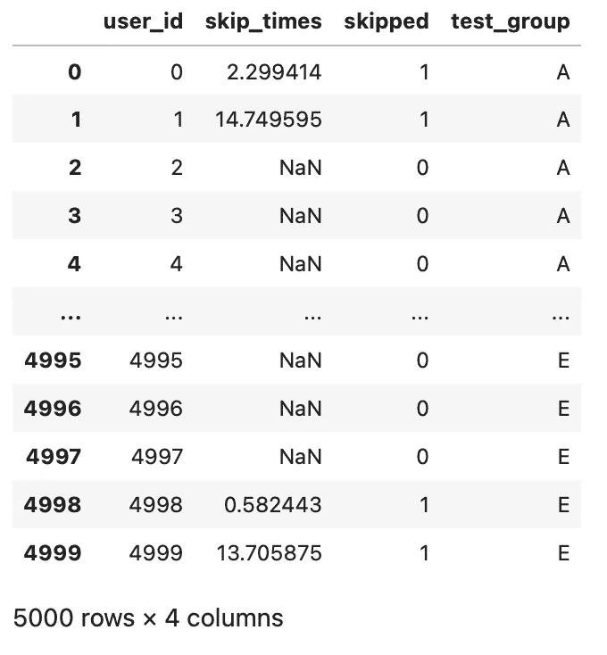**

# **贝叶斯推理**

**现在我将使用 **PyMC3** 来完成所有繁重的计算工作，但是你仍然需要了解一点贝叶斯推理来正确地设置它。首先你需要理解贝叶斯推理背后的数学概念，然后如何选择合适的分布来工作(**共轭先验**)。从那里，PyMC3 可以为您处理所有的采样算法。**

****理论****

**简而言之，基本的数学概念是，你从一个关于参数分布的概念开始，比如跳跃率。这个分布总结了你先前的信念，简称为**先前**分布。然后，将先验乘以**似然**，这是给定参数的数据的条件密度，或者该数据被给定参数值的可能性。这些然后被除以**证据**，证据是独立于参数的观察数据的概率。这导致参数的**后验**分布，它代表更新的信念——或给定观察数据的参数的概率分布。**

**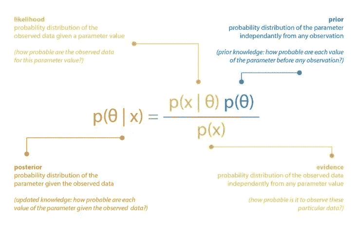**

****共轭先验****

**在上面的等式中，并不是所有的分布都能很好地协同工作。根据您想要建模的参数，您需要在之前专门选择一个**共轭，否则事情会变得棘手。我通常只使用维基百科上的这个表，它告诉我所有我需要知道的关于哪些发行版可以很好地一起工作以及它们各自的参数是什么。在这里你可以看到，因为我想使用二项分布作为我的可能性来模拟跳过的数量，我需要使用贝塔先验分布。这种组合相当受欢迎。****

**[https://en.wikipedia.org/wiki/Conjugate_prior](https://en.wikipedia.org/wiki/Conjugate_prior)**

**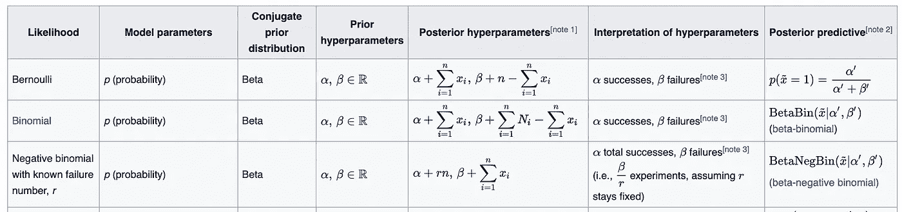**

**由于我想使用指数分布作为我的可能性来模拟用户在跳过之前花费的时间，我需要使用 Gamma 作为我的先验分布。**

**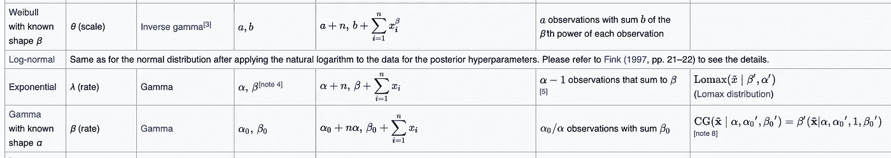**

****不知情的前科****

**根据专家意见或历史数据建立先验知识是相当普遍的。然而，并不是所有的先验都代表先前的知识或信念。使用**不知情先验**是很常见的，它只是对参数分布不做任何假设的分布。一个不知情的先验不会影响后验，而是会尽可能少地影响后验。随着越来越多的数据被采样，后验概率仍然会更新，并最终收敛到一个参数值。在这个项目中，我将使用两种类型的先验。**

****PyMC3 采样****

**贝叶斯推断的真正力量来自于你不需要太多的数据来描绘真实参数的代表性画面。这是因为贝叶斯推理利用抽样技术来生成更多的数据。也被称为**蒙特卡罗方法**，已经开发了许多不同的算法，它们通常通过生成值，然后根据特定标准接受或拒绝这些值来工作。你可以使用 PyMC3 的两个常用算法是 **Metropolis-Hastings** 算法和 **NUTS** 算法。**

# **跳跃时间模型**

**现在我们已经有了基本的东西，我将遍历我的模型来测试用户跳过一首歌所花费的时间。对于这个模型，我使用了指数可能性和伽玛先验。我将使用历史数据来构建我的伽马先验，这意味着我将使用对照组 A 的平均值和标准偏差作为超先验和参数来构建伽马分布。在这个层次模型中，我将一次性测试所有的变量 A/B/C/D/E。需要注意的一点是，这个数据比每个测试组的规模要小得多，因为并非所有用户都跳过了第一首歌。如果我在每组中抽取 1000 名用户，可能只有一半跳过了第一首歌。贝叶斯方法通过采样来处理这个问题。**

**首先，我找到来自控制组 A 的统计数据，并使用这些数据根据伽马分布的**期望值**和**方差**计算**α**和**β**。**

**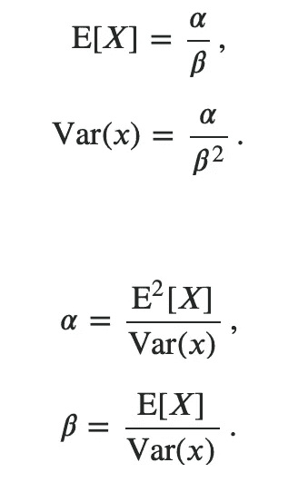**

```
STATISTICS FOR CONTROL GROUP AMean:   4.5091
Std:    4.449
Var:    19.7939
Alpha:  1.0272
Beta:   0.2278
```

**现在，我可以用 PyMC3 构建我的模型，它看起来很简单，但实际上还有很多事情要做。我取 10000 个样本，用 **NUTS** 算法，用 **MAP 估计**推断起始值，把**接受率**提高到 95%。我将在此监控的指标是对照组与每个测试组之间的差异。**

# **结果**

**PyMC3 生成了一些很好的性能图，以确认模型运行正常，并且收敛而不是发散。在确认模型平稳运行后，感兴趣的图是后验分布图。在这里，您可以看到平均值及其 **HDI** (最高密度区间)。HDI 是最短的**可信区间**，是频率主义者置信区间的贝叶斯版本——而且好得多！可信区间和人类发展指数也非常容易解释，例如，我现在可以简单地说:**

> **测试组 C 中的用户有 95%的可能性落在区间[0.26，0.31]内，平均跳过时间为 0.29 秒。**
> 
> **控制组 A 中的用户有 95%的可能性落入区间[0.18，0.21]，平均跳过时间为 0.19 秒。**

****

**为了查看所有的分布，为了更好地控制图表，我选择用 **seaborn** 来绘制数据。现在很容易获得有价值的见解，并能看到下面的内容**

**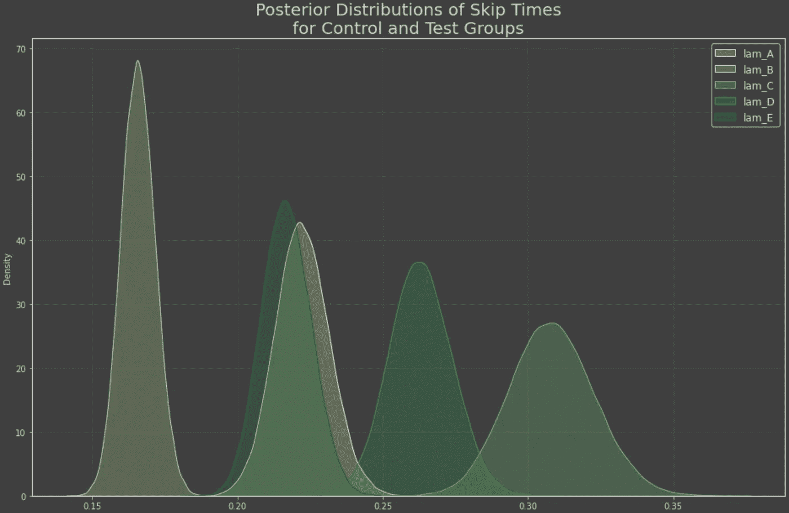**

> **试验组 E 与对照组 A 最为相似**
> 
> **测试组 B 比对照组 A 跳得更快**
> 
> **C & D 测试组跳过这首歌的时间要长得多**

**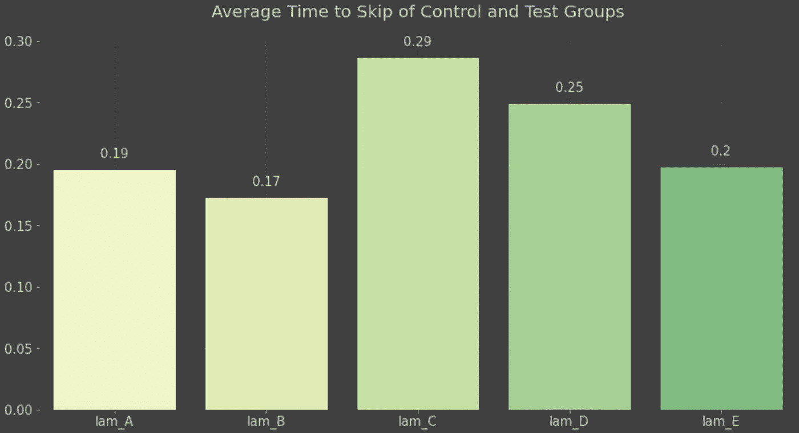**

**请注意，测试组 C 的分布更广。这可能是因为**不平衡数据**导致该测试组的人数较少。这种宽度代表了我的模型对群体的不确定性。不过，这可能是一件好事，意味着跳过这首歌的用户减少了，跳过的用户花了更长的时间。这是对照组与每个测试组的差异。**

**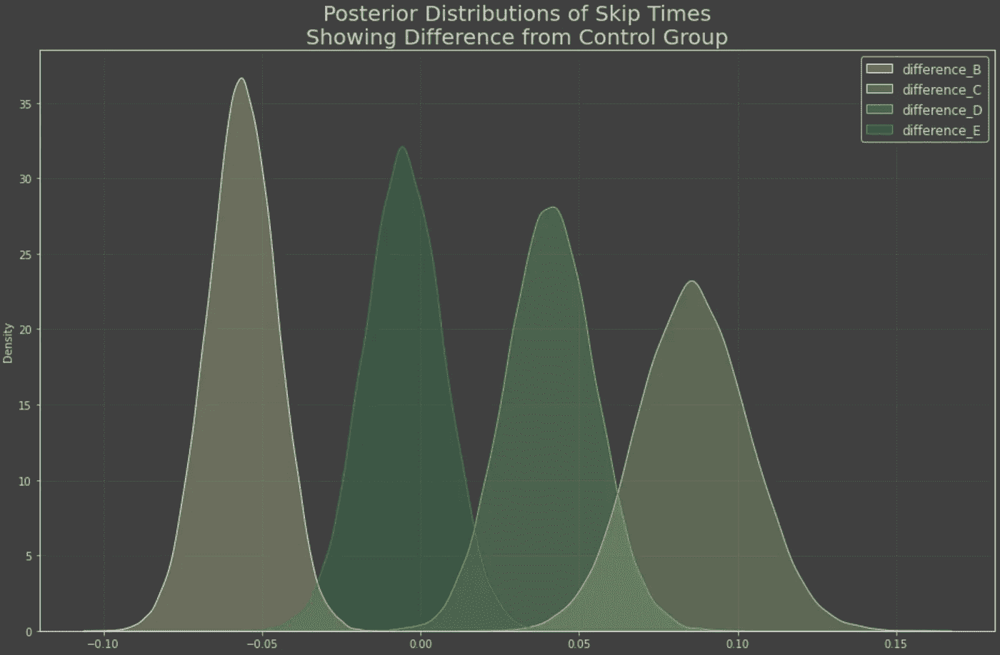****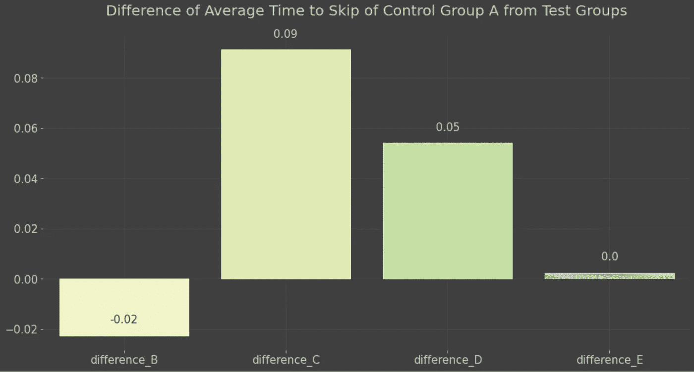**

# **跳跃率模型**

**现在，我将对每个测试组跳过的次数进行建模，而不是对用户跳过第一首歌曲所花费的时间进行建模——即**跳过率**。另外 10，000 个样本，而没有实际测试更多的用户。如前所述，似然性将由二项式分布建模，而先验将是贝塔分布。**

**我将使用一个**不知情的先验，而不是使用历史数据来建立我的先验。**使用均匀分布对α和β进行采样很简单，但是这样做会导致不正确的后验分布。Gelman 在他的书[贝叶斯数据分析](https://www.amazon.com/Bayesian-Analysis-Chapman-Statistical-Science/dp/1439840954/ref=la_B001IGUSKM_1_1?s=books&ie=UTF8&qid=1402860064&sr=1-1)第 109-113 页提出了一个解决方案。他的解决方案是从下面的分布中取样。为此，我必须在 PyMC3 中构建一个自定义函数。**

****

# **结果**

**我将再次绘制后验概率图以获得洞察力。**

**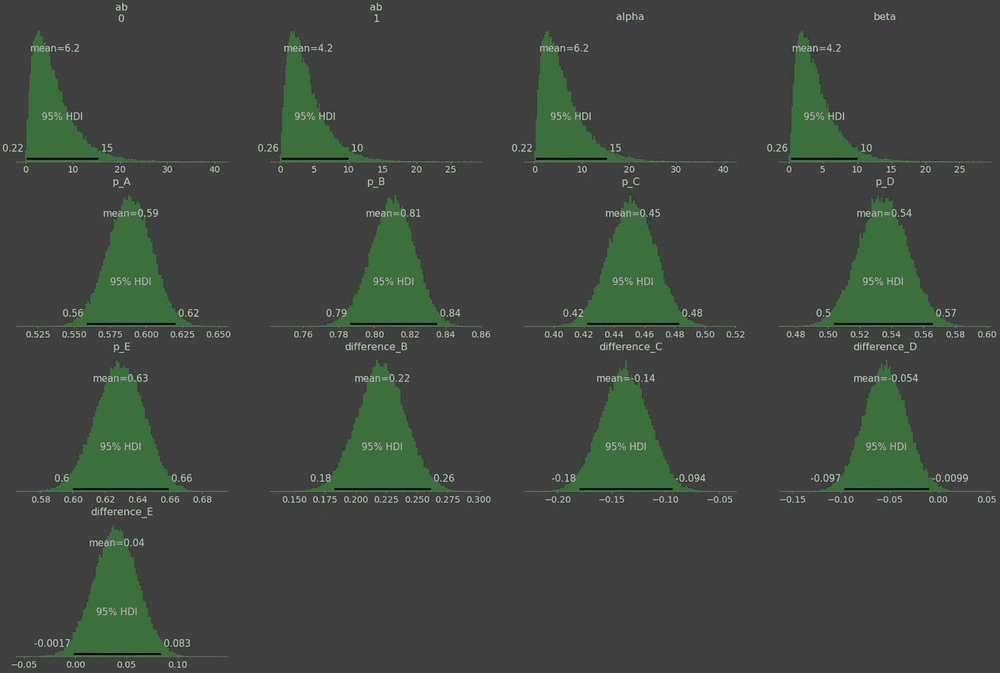**

> **测试组 C 的跳跃率有 95%的可能性在区间[42%，48%]内，平均值为 45%。**
> 
> **对照组 A 的跳跃率有 95%的可能性在区间[56%，62%]内，平均值为 59%。**

**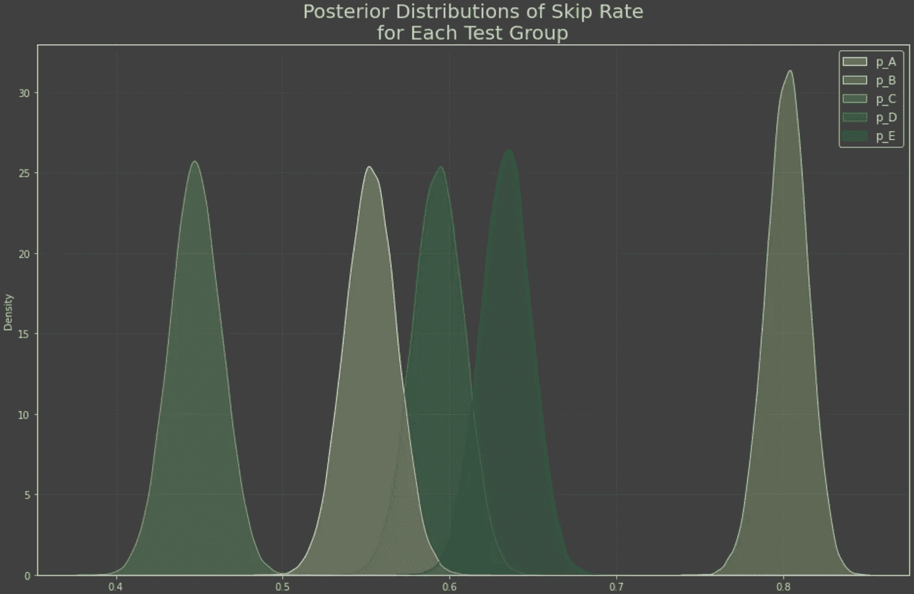****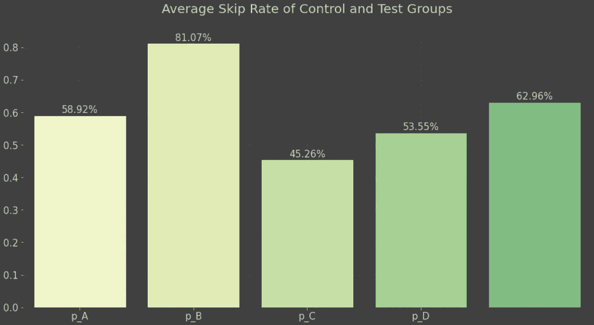**

**以及与对照组 a 相比的差异的分布**

**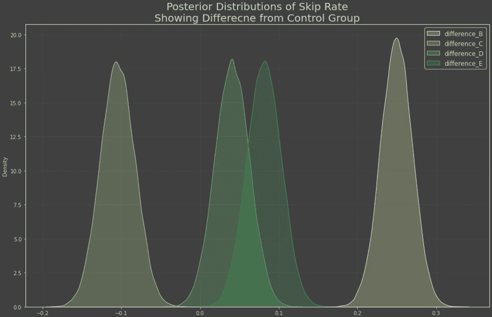****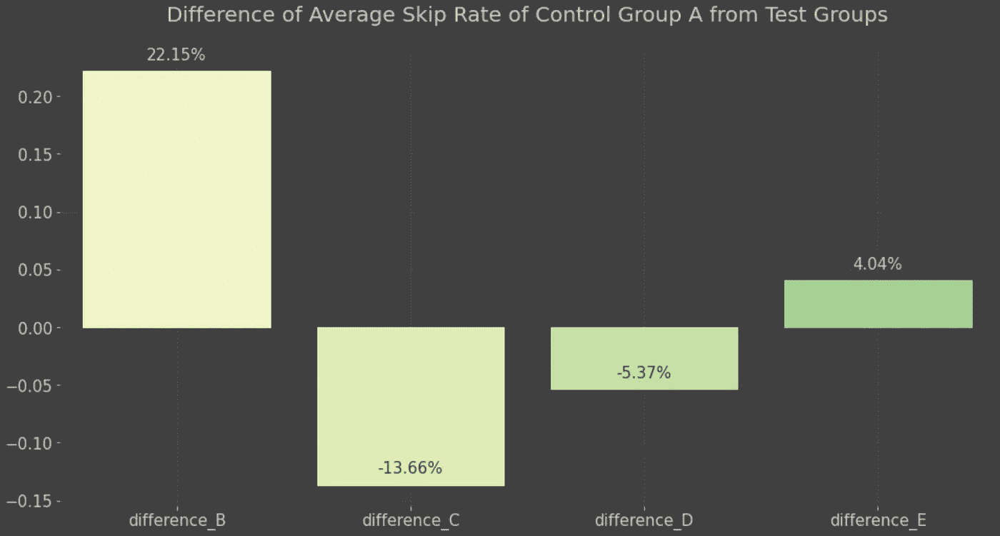**

> **试验组 C 是唯一一个跳级率低于对照组的试验组，平均跳级率为 45%，比对照组 a 低 13.66 个百分点。**

# **资源**

*   **[共轭先验维基百科](https://en.wikipedia.org/wiki/Conjugate_prior)**
*   **[PyMC3 文档](https://docs.pymc.io/en/v3/api/distributions/continuous.html#pymc3.distributions.continuous.Beta)**
*   **【PyMC3 建模简介**
*   **[使用分层模型](http://sl8r000.github.io/ab_testing_statistics/use_a_hierarchical_model/)**
*   **[用 Python 中的层次模型进行 A/B 测试](https://blog.dominodatalab.com/ab-testing-with-hierarchical-models-in-python)**
*   **[贝叶斯统计的有趣方式](https://www.oreilly.com/library/view/bayesian-statistics-the/9781098122492/)**
*   **[贝叶斯推理](https://vioshyvo.github.io/Bayesian_inference/)**
*   **[pymc 3 中的分级 AB 测试](https://discourse.pymc.io/t/hierarchical-ab-testing-in-pymc3/2920)**