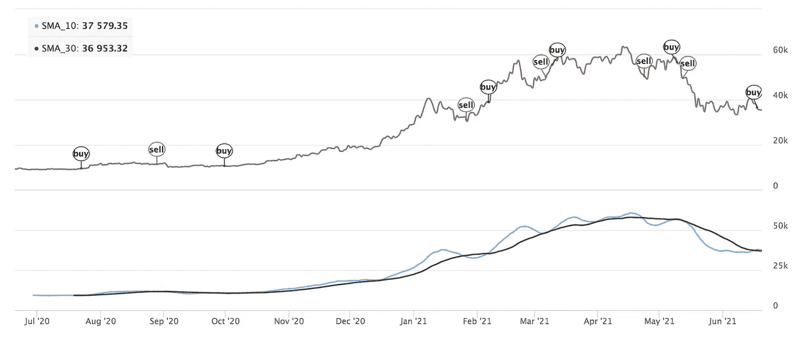
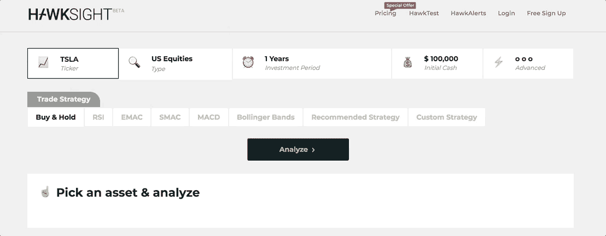
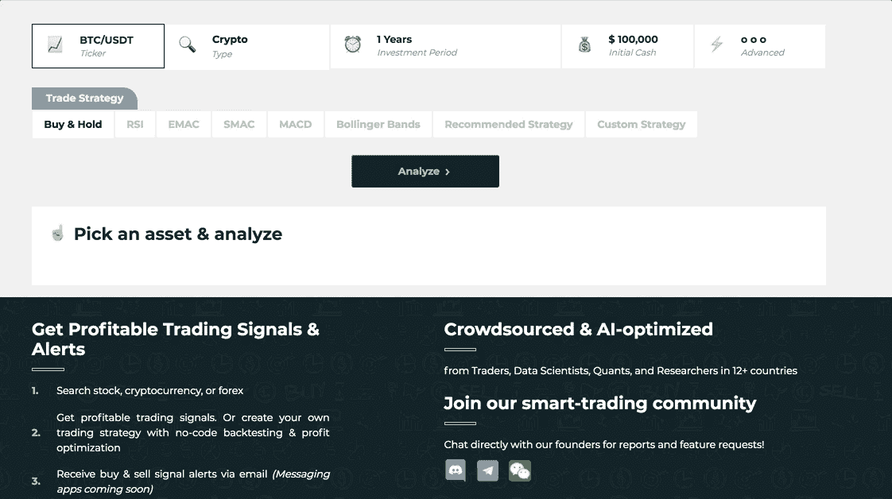
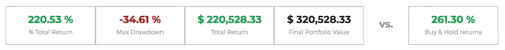
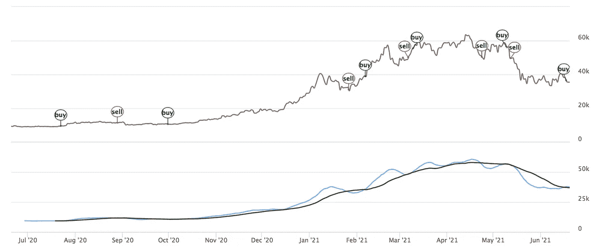
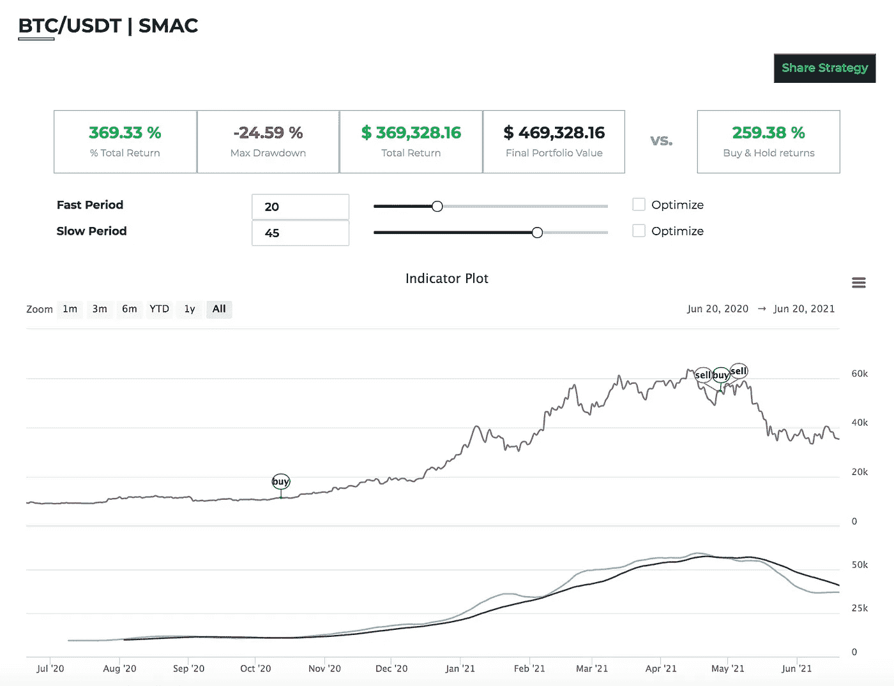
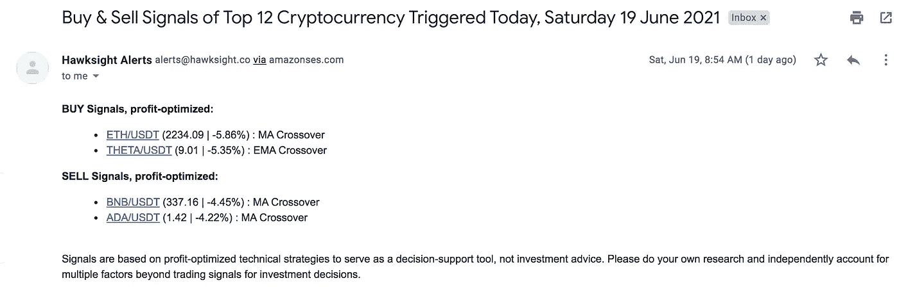

# 做一个数据驱动的投资者，而不必编码

> 原文：<https://medium.com/geekculture/be-a-data-driven-investor-without-having-to-code-3bf1d8cf39bf?source=collection_archive---------29----------------------->

## 介绍 [Hawksight](https://hawksight.co/) ，这是一个面向数据驱动型投资者的简单而强大的投资分析平台

Photo by Martin Adams on [Unsplash](https://unsplash.com/photos/fmCOUAj1QHk)

作为一名数据科学出身的人，我一直认为，如果你想获得可能超过市场的回报，那么投资“数据驱动”是非常重要的。这通常包括执行定量分析，使用算法策略执行交易，算法策略使用 Python 和 r 等编程语言。

数据驱动投资的要点是，你选择交易的策略要有可衡量的证据，证明这些策略在过去确实有效，这样你就能预期它们在未来继续有效。

从历史上看，像复兴科技和两个适马这样的“定量对冲基金”已经在[成功地做到了这一点，他们的交易资金总额高达数千亿美元。](https://www.institutionalinvestor.com/article/b1q3fndg77d0tg/Renaissance-s-Medallion-Fund-Surged-76-in-2020-But-Funds-Open-to-Outsiders-Tanked)

这告诉我们，使用算法和分析进行投资决策是可行的，但这对我们大多数普通人来说是可行的吗？不完全是…

> *对个人来说，数据驱动的投资是可能的，但它仍然局限于那些知道如何编码和理解高级金融数学的人。这就排除了绝大多数不具备必要技术背景的散户。*

为了公平竞争，我和我的联合创始人建立了 [Hawksight](https://hawksight.co/) ，让每个人都可以根据数据进行交易，而无需编写一行代码。这主要是通过让用户只需点击 2 次就可以轻松“回测”他们的交易策略来实现的！

*回溯测试*的理念，以及它对数据驱动投资的重要性在于，它是衡量任何交易策略历史表现的系统方法。换句话说，它回答了这个问题:“如果我对这种资产(比如比特币)采取这种策略，我会赚多少钱？”。

这是一个非常重要的问题，因为当然，你会希望尽可能遵循那些已经被证明有效的策略。使用 [Hawksight](https://hawksight.co/) ，您可以轻松地尝试不同的策略，以便您选择最适合自己的策略！

# 让我们回测一下我们的第一个策略！

对于那些不熟悉的人来说，简单移动平均线交叉(SMAC)策略是一个非常简单但强大的交易策略，它包括根据资产的收盘价绘制两条移动平均线:1)快速移动平均线(在较少的几天内平均)，2)慢速移动平均线(在较多的几天内平均)。

从这里开始，当快速移动平均线(例如 10 天移动平均线)从下方穿越到慢速移动平均线(例如 30 天移动平均线)上方时，就出现了“买入”的信号。类似地，当快速移动平均线从上方穿越到慢速移动平均线下方时，就会发出卖出的信号。

你可以看看下面的折线图(下图)，看看从 2020 年 6 月 19 日到 2021 年 6 月 19 日(1 年)，这些移动平均线会如何看比特币的价格。

你会看到交叉在过去的一年里发生了多次，触发了多次买入和卖出信号(上图)。

现在从这里开始，自然的问题是:“如果我在过去的一年里遵循这个策略，我会得到多少回报？”。要回答这个问题，我们可以使用 Hawksight 的[策略分析器](https://hawksight.co/backtest)(也称为 [HawkTest](https://hawksight.co/backtest) )对这个策略进行回测(如下图)。

如您所见，您可以设置许多选项，但我们将主要关注将*投资类型*更改为*加密*，并将符号更改为 *BTC/USDT* ，这是(本质上)以美元计价的比特币的符号。请注意，截至本文撰写之时，最后一年是 2020 年 6 月 19 日至 2021 年 6 月 19 日，因此要复制该分析，您可以自己将它设置为“自定义日期范围”，也可以通过此[链接](https://hawksight.co/backtest?type=crypto&symbol=BTC/USDT&date=Custom&dateStart=2020-06-20&dateEnd=2021-06-20&strategyName=smac&stratData=%7B%22fast_period%22%3A10%2C%22slow_period%22%3A30%7D)自动运行它。

然后从这里，我们将选择 *SMAC* 策略，它代表“简单移动平均线交叉”，这也是我们想要测试的策略。最后，我们只需点击“分析”即可开始对策略进行回溯测试！

You can view the analysis above automatically through this analysis [link](https://hawksight.co/backtest?type=crypto&symbol=BTC/USDT&date=Custom&dateStart=2020-06-20&dateEnd=2021-06-20&strategyName=smac&stratData=%7B%22fast_period%22%3A10%2C%22slow_period%22%3A30%7D).

现在，您将看到针对该策略运行了分析，结果显示在屏幕上。这些包括策略的表现，以及绘制历史买卖信号、价格和策略中使用的移动平均线的图表。

让我们关注显示在结果顶部的性能指标。

# 分析我们战略的结果

从上面的结果表中，你可以看到如果你遵循你的 SMAC 策略，你去年的总投资回报率为*%*。这意味着，如果你对比特币采取这种策略，去年你将获得 220.53%的收益。你还可以看到绝对指标，如*总回报*，以及*投资组合价值*。

但是，请注意，这是针对我们将 10 万美元作为初始现金的情况。为简单起见，我建议你将该值保持在 100K，因为我们还不支持*分数交易，所以你至少需要这么多才能购买比特币。不过不要担心，我们很快就会支持分数交易！*

*最后，您还可以看到右侧有一个*买入并持有回报率%* ，值为 261.3%。这意味着作为一个基准，这样你就可以立即比较你的进入和退出时机的表现，而不是简单地购买和持有该资产(在这种情况下是比特币)。在我们的案例中，你会发现 SMAC 策略的表现比买入并持有策略稍差。*

*然而，如果你看看历史信号(如下所示)，它会告诉我们在 2021 年 5 月加密市场崩溃之前抛售我们的比特币，这意味着尽管这种策略可能没有类似的好处，但与简单地购买和持有比特币相比，它似乎更有效地避免了大规模的*提款*(价值下降)。*

**

*现在，从这里开始，你可以做更多的事情来试验你正在测试的策略。最简单的尝试是你可以摆弄策略参数(顶部的滑块)，这样你可以尝试不同的“慢速期”和“快速期”的组合，看看这些变化如何影响你的策略的回报率%。注意，“慢周期”指的是“慢移动平均线”的周期，而“快周期”指的是“快移动平均线”的周期。*

*例如，让我们尝试将“快速周期”改为 20，“慢速周期”改为 45(结果如下所示)。你也可以通过这个[分析链接](https://hawksight.co/backtest?type=crypto&symbol=BTC/USDT&date=Custom&dateStart=2020-06-20&dateEnd=2021-06-20&strategyName=smac&stratData=%7B%22fast_period%22%3A20%2C%22slow_period%22%3A45%7D)自己尝试一下！。*

**

*You can view the updated analysis above through this analysis [link](https://hawksight.co/backtest?type=crypto&symbol=BTC/USDT&date=Custom&dateStart=2020-06-20&dateEnd=2021-06-20&strategyName=smac&stratData=%7B%22fast_period%22%3A20%2C%22slow_period%22%3A45%7D)*

*从上面的结果可以看出，回报率实际上从 220.53%上升到了 369.33%。这是因为我们的 SMAC 策略将在最近价格上涨的大部分时间里持有比特币，同时在 2021 年 5 月市场崩盘前抛售比特币。最后，你会注意到，这种策略的表现明显优于简单的买入并持有策略(+369.33%对+259.38%)。相当令人印象深刻！*

# *获得一揽子资产的自动交易信号*

*我想分享的最后一个功能是我们的[信号筛选工具](https://hawksight.co/)，在这里你可以直接在你的收件箱中接收特定资产篮子的每日交易信号。要订阅，你只需进入主页，从[信号筛选程序](https://hawksight.co/)中选择你想要的篮子！*

**

*每日交易信号报告如下所示:*

**

*这些信号是如何产生的？嗯，鹰眼基本上有一个人工智能引擎，为每个篮子中列出的每项资产存储最佳表现策略。这个想法是，你只接收每种资产的最佳表现策略的信号。*

*在解读这些信号时，重要的是要记住，这些信号是基于历史上表现相对良好的策略(例如，在过去的一年中)，但这并不一定意味着这些信号在未来会继续有效。我强烈建议您点击这些符号的链接，这将直接导致作为信号基础的分析。这样，你可以自己判断是否要采取行动。*

*换句话说，把这个作为一个**的起点**，这样你就能知道你现在在市场上可能持有的潜在头寸，并在交易前用这个信息补充你所拥有的关于资产的其他信息。*

# *结论*

*恭喜你！你现在是一名“数据驱动型”投资者，已经对自己的策略进行了回溯测试，同时也在分析其结果。一点也不难，是吗？*

*现在，这是您迈向投资更多数据驱动之旅的良好开端，但请记住，这只是开始。有更多的策略让你去尝试，在这个空间里也有更多的东西可以学习。*

*此外，重要的是要注意回测也有其自身的局限性，例如容易出现过度拟合和前瞻偏差等问题。如果你想了解更多，我在之前的[文章](https://towardsdatascience.com/backtest-your-trading-strategy-with-only-3-lines-of-python-3859b4a4ab44)中有一个章节讨论了这些。*

*请关注未来的文章，我将在其中讨论一些更高级的 [Hawksight](https://hawksight.co/) 特性，比如策略优化、设置自己的警报以及定制策略创建。请确保继续关注我的更多关于数据科学、金融、加密和定义的文章！*

*最后，我们希望你能加入我们在[不和谐](https://discord.com/invite/xPeuTeZaAa)、[电报](https://t.me/joinchat/XAIUa0s3WuZlOTM9)和[脸书](https://www.facebook.com/groups/2736447316469859)的鹰眼社区！如果您想了解每周的产品更新，请加入我们，并随时通过这些渠道提供反馈、功能请求或任何问题。*