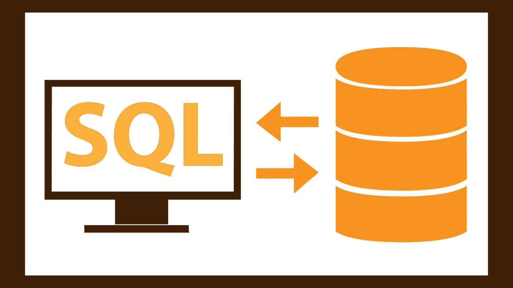
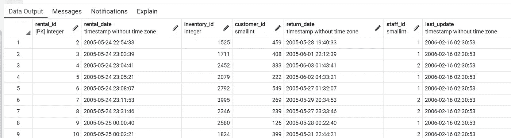
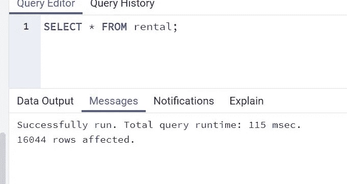
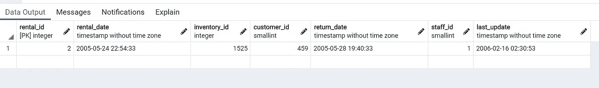
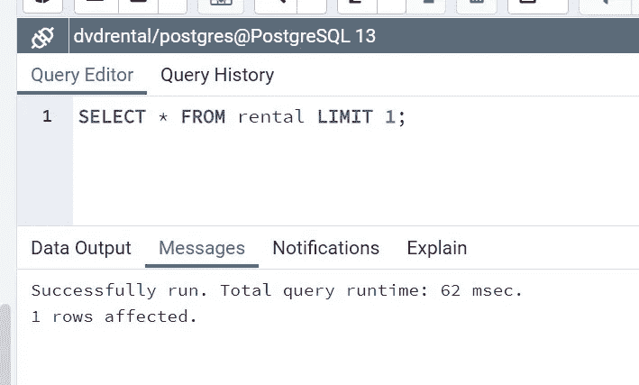
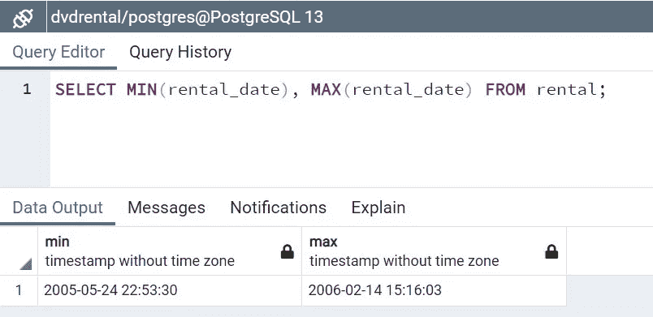
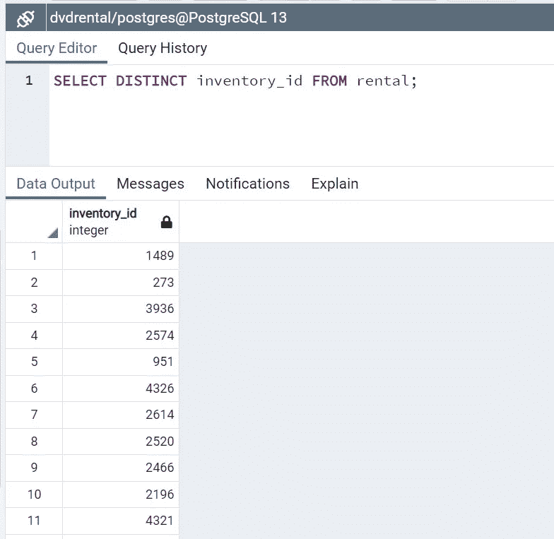
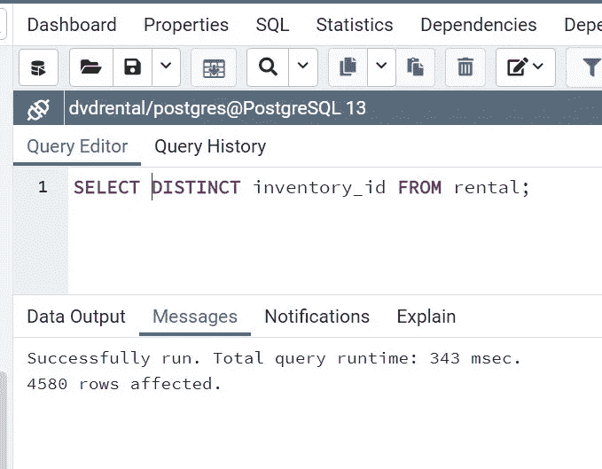
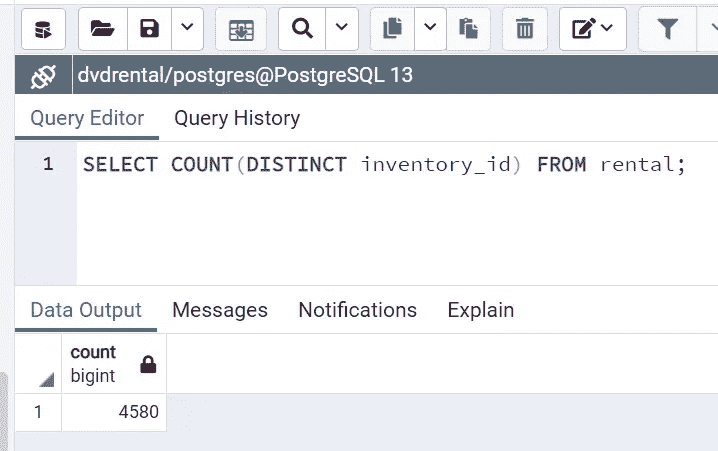
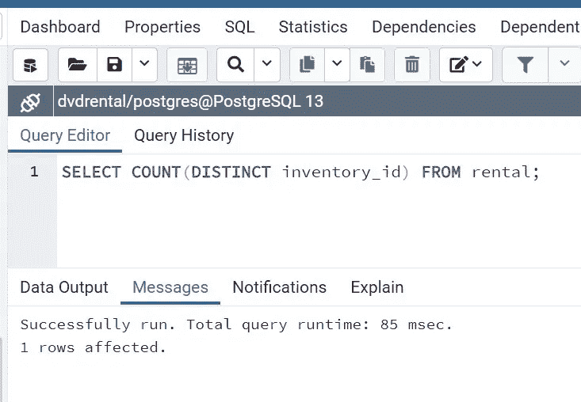

# 具体点！编写 SQL 查询使你的应用程序运行良好的关键

> 原文：<https://medium.com/geekculture/be-specific-the-key-to-writing-sql-queries-that-make-your-app-perform-well-94fdadc19b91?source=collection_archive---------53----------------------->



My editors tell me serious computer-type pics are best above my title

我最近参加了一些 SQL 密集型的面试。这迫使我重新审视我的 SQL，所以本周我开始创建一个快速博客来实践`SELECT`语句。当我整理这篇文章时，我意识到关于编写 SQL 还有更重要的事情要回顾。特异性。这个博客的目标读者仍然是刚刚开始使用 SQL 的读者，但是这个技巧是即使是老程序员也可以忽略的。我仍然是一名初级开发人员，但看起来这一条建议可以决定一个应用程序开发的成败。

## 为成功做好准备

练习 SQL 语句的最好方法是练习数据。在 [PostgreSQL 教程](https://www.postgresqltutorial.com/postgresql-sample-database/)中提供的样本 dvdrental 数据集非常健壮，你可以在这里找到关于如何将其加载到 Postgres 中的[说明。](https://www.postgresqltutorial.com/load-postgresql-sample-database/)

## 为什么选择 PostgreSQL？

我是 PostgreSQL 的粉丝，这是一个行业标准，而且它是开源的，可以免费获得。它足够强大和快速，可以在生产服务器上运行，但也足够容易管理，我从未发现自己在一台新机器上尝试设置 PostgreSQL。另外 [pgAdmin 是一个神奇的 PostgreSQL](https://www.pgadmin.org/)GUI，我在下面使用它。

我在我的机器上设置了 Postgres。如果你想跟着做，[安装 postgres](https://www.postgresql.org/) ，[获取并导入样本数据](https://www.postgresqltutorial.com/load-postgresql-sample-database/)，然后在这里见我。

## Select 语句

你已经有了一些数据和一个数据库来运行你的查询，如果你和我一起编码，你应该很好。为了开始我们对特异性如何增强您的查询的研究，让我们看一下`SELECT`语句。`SELECT`语句的一般形式是:

```
SELECT *
FROM table_name
WHERE condition1 AND / OR condition2
ORDER BY column_name ASC / DESC;
```

SQL 保留字在这里全部大写。`SELECT *`是一个从表中选择*所有*列的查询，我们可以通过指定列名:`SELECT column_name_1, column_name_2`使我们的查询更加精确

使用列名而不是选择所有列(`SELECT *`)编写`SELECT`语句是使查询更具体的一个例子。尽可能具体地组织您的查询是一个好主意。查询越具体，数据库的响应时间就越快。如果你正在为一个应用程序编写查询，编写一个特定的查询可能是一个快速响应的应用程序和一个让客户不耐烦等待的应用程序之间的区别。

我们关注`SELECT`查询的另一种方式是`LIMIT`返回的行。例如，我们可能想知道`dvdrental`中`rental`表的模式，即表`rental`中的列名。如果我们尝试`SELECT * FROM rental;`，我们将会看到模式:



The schema is row across the top: rental_id, rental_date, inventory_id, return_date, staff_id, last_update

在 pgAdmin 中，在 messages 选项卡下，我们可以看到查询运行了 115 毫秒。



115 milliseconds sounds fast!

但是它返回 16044 行！如果我们只看列名，我们不需要所有的数据。与我们运行`SELECT * FROM rental LIMIT 1;`时相比。我们仍然得到这个模式:



We get the schema, but only one row returned

但它只返回一行。当我们在邮件中检查它的性能时:



62 milliseconds is way faster than 115!

我们将执行时间缩短了将近一半！这里的寓意是当你写 SQL 的时候，要具体。让我单独重复一遍。

## 当你写 SQL 的时候，要具体

想想最后的执行时间。即使最终的性能不是一个问题，如果你把考虑速度和编写高效的 SQL 作为一种习惯，你可能会避免一个错误，这个错误可能会在将来浪费客户的时间。

## 数数

Count 是一个很好的功能，可以为您的`SELECT`查询增加特异性。我们的`rental`表包含在商店发生的所有 dvd 租赁。每次顾客租一部电影，就会增加一行。我们可以通过以下方式获得该商店发生的所有租赁的`COUNT`:

```
SELECT COUNT(*)
FROM rental;
```

除非数据集已经被修改，否则您应该得到一个响应`16044`。

## `MIN and MAX`

假设我们想知道第一张 dvd 是什么时候租的，最后一张是什么时候租的。我们可以像这样使用`MIN`和`MAX`:

```
SELECT MIN(rental_date), MAX(rental_date) 
FROM rental;
```



## 明显的

我们可以使用`rental`表上的`DISTINCT`来获取从第一个`rental_date`到最后一个`rental`租借的所有视频的库存数量列表:

```
SELECT DISTINCT inventory_id FROM rental;
```



我们得到了至少被租过一次的`inventory_id`的列表，所有重复的都被删除了。如果我们想要列表，这很好，但是看看它花费的时间:



343 milliseconds

虽然 343 毫秒并不算多，但如果我们只想知道*有多少 dvd 至少被租借过一次*，我们可以通过使用我们的伙伴`COUNT`来节省大量时间。

```
SELECT COUNT(DISTINCT inventory_id) FROM rental;
```



我们最终得到 85 毫秒的响应时间:



85 milliseconds!

再说一次，正是这种特殊性拯救了这一天。如果你所需要的是*计数*，在这种情况下，我们可以通过避免中间步骤，只`SELECT`计数`COUNT`来减少 75%的时间。

Wacky gifs of kittycats have been treasured from time immemorial for their palate cleansing abilities

## 您的查询中的细节很重要。

在这篇博客中，我们研究了如何通过添加 SQL 子句来增加我们的`SELECT`语句的特异性。使用像`COUNT`和`DISTINCT`这样的子句可以将我们的服务器响应时间减少 75%,这对于一个每天预计有数千或数百万用户的网站来说意义重大。要获得更多条款来增强你的选择，请查看 postgres 文档[或](https://www.postgresql.org/docs/9.5/sql-select.html) [w3schools](https://www.w3schools.com/sql/sql_ref_keywords.asp) 。

希望这是一个启发性的阅读。下周见！