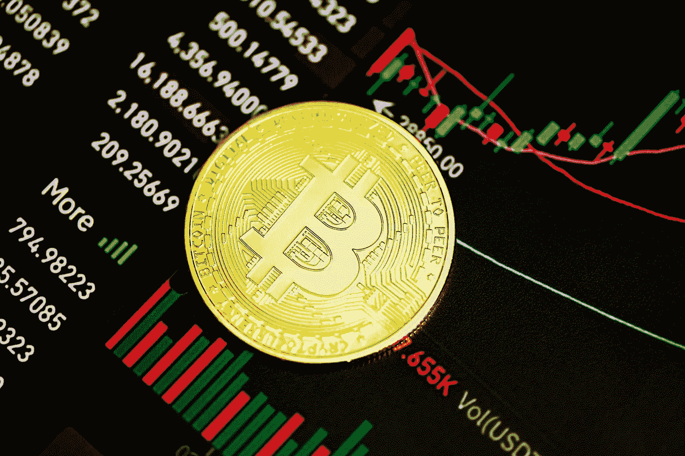
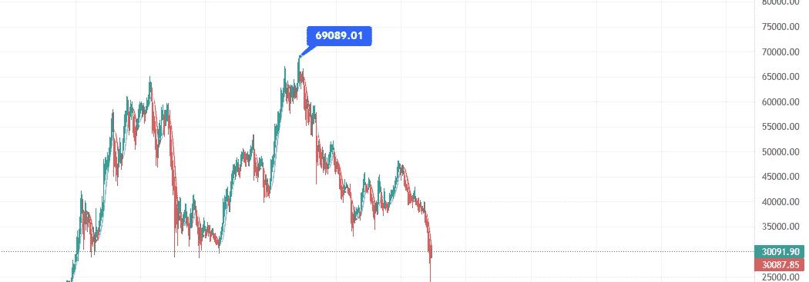
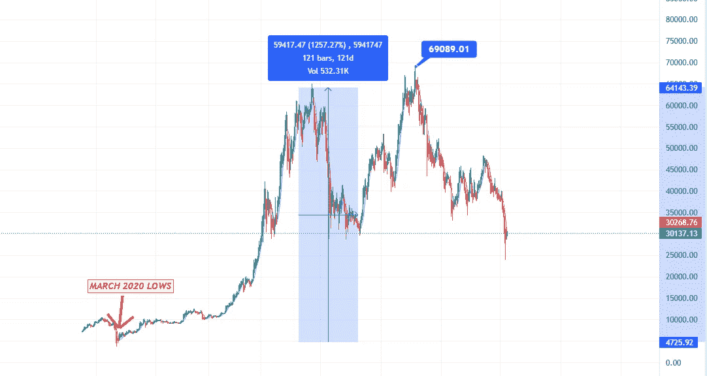
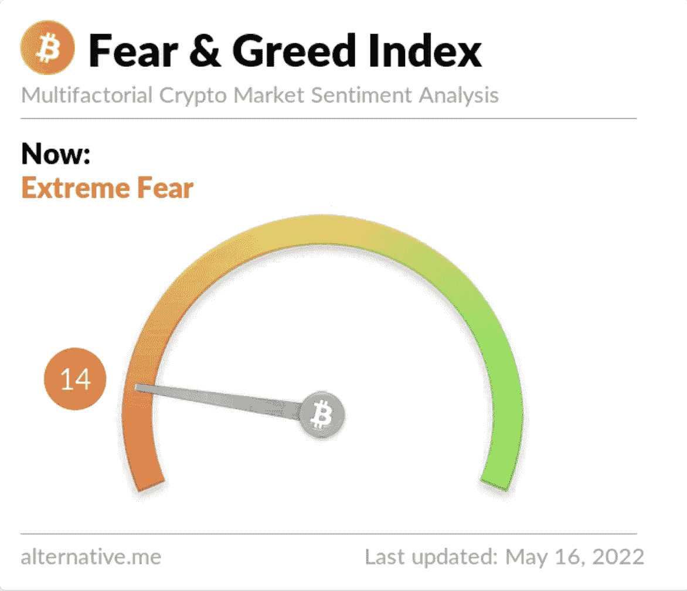

# 熊市是百万富翁诞生的地方

> 原文：<https://medium.com/geekculture/bear-markets-are-where-millionaires-are-made-34c090898bb8?source=collection_archive---------5----------------------->

Image by [Kanchanara](https://unsplash.com/@kanchanara) on [Unsplash](https://unsplash.com/photos/Lta5b8mPytw)

看到加密市场变红并下跌近 2 万亿美元应该是令人担忧和害怕的

但对我来说不是，

对于希望从自己喜爱的项目中积累越来越多代币的交易者和投资者来说，这是最激动人心的时刻，

对某些人来说，圣诞节提前到来了，

对其他人来说，这是一个说“我告诉过你”的机会。

我相信我们正在进入一个加密的黄金阶段，一个让普通人变得非常富有的阶段。

# 熊市是百万富翁诞生的地方

在熊市期间，这是大多数人在密码领域使用的一个非常常见的术语，但坦率地说，这是真的。

熊市给人们带来恐惧，看到他们的投资从历史高点下跌到 100%的反转，让他们失望会让人沮丧和有压力。

聪明的投资者在几个月前就已经离开了他们的头寸，他们意识到由于全球范围内极高的通货膨胀率、Covid19 的影响和极高的房地产市场，我们正处于衰退的边缘。

那些聪明的投资者现在正在以极其便宜的价格购买项目，远低于 2021 年 11 月比特币的历史高点。我们不要忘记，比特币&以太坊是市场的领导者，如果它们的价格下降 50%-60%，altcoins 就会下降 80%-90%。

Screenshot taken from Trading View

# **疯狂三月**

2020 年 3 月绝对疯狂，每个人都有和我们现在一样的感觉。

“加密已死”

这是一个骗局

3 月的暴跌让许多替代币跌至历史低点，比特币极其便宜，只有 5000 美元，但 3 月成为了让加密投资者成为百万富翁的月份。

Screenshot taken from Trading View

一个 5000 美元的比特币在短短 1 年多的时间里很快就变成了超过 64000 美元。

这是一个惊人的投资回报。

任何投资了更实惠的替代硬币的人都会看到他们的钱飙升到数百万。

以下是 2020 年 3 月至 2021 年 3 月期间替代硬币及其上涨情况的列表:

*   阿达——0.03 美元至 1.50 美元
*   BNB——8 美元到 350 美元
*   多吉——0.002 美元至 0.08 美元
*   兽医——0.002 美元至 0.09 美元
*   链接—1.5 美元至 30 美元

重要的是要认识到，成功的投资者不会在散户进入市场时买入，而是在极度贪婪占据上风、所有人都赢了的时候离开。

聪明的投资者会在每个人都受伤的时候买入，当市场波动太大，进入市场风险太大的时候买入。

> **“我会告诉你如何变得富有。当别人贪婪的时候要恐惧。当别人恐惧时，你要贪婪。**

# 【2020 年 3 月又来了？

Screenshot taken from [Alternative.me](https://alternative.me/crypto/fear-and-greed-index/)

如果我告诉你，你有第二次机会以 2020 年的价格购买项目，会怎么样？

你会再冒一次险吗？还是会因为风险太大而放弃？

熊市让散户投资者感到恐惧，但重要的是要看到积极的一面。

大多数另类投资者无法在熊市中存活下来，因为他们很难吸引新的投资者。快速泵和转储将消失，同时为良好的固体项目铺平道路，使固体运行在雷达下。

如果你发现了这些未经加工的钻石，你会看到自己为一些短期的痛苦提供了长期的经济回报。

请记住，有人在 69000 美元时大举投资比特币。截至写这篇文章时，比特币目前为 29000 美元。

问候

欧文

免责声明——永远做你自己的研究，不要投资超过你能承受的损失。请不要与任何人分享任何安全数据。如果有疑问，设置一个止损来保护自己免受任性。