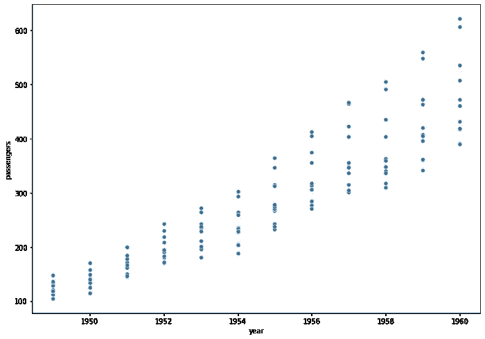
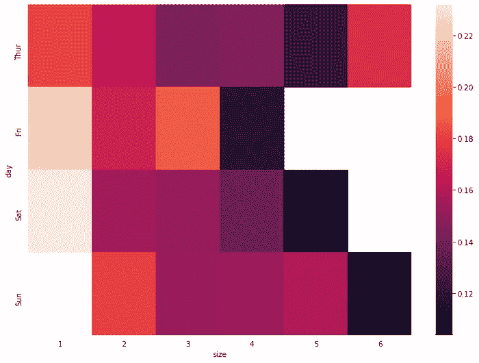

# Seaborn 的美丽情节

> 原文：<https://medium.com/geekculture/beautiful-plots-with-seaborn-100f0ce7a285?source=collection_archive---------17----------------------->

创建情节，让您的可视化之旅开始！


Photo by [Bench Accounting](https://unsplash.com/@benchaccounting?utm_source=unsplash&utm_medium=referral&utm_content=creditCopyText) on [Unsplash](https://unsplash.com/s/photos/online-classes?utm_source=unsplash&utm_medium=referral&utm_content=creditCopyText)

数据可视化技术允许数据科学家将原始数据转换为图表和图形，从而生成有价值的见解，降低数据的复杂性，并使最终用户更容易理解。

[Seaborn](https://seaborn.pydata.org/) 是一个用 Python 制作统计图形的库。它建立在 [matplotlib](https://matplotlib.org/) 之上，并与 [pandas 数据结构](https://livecodestream.dev/post/how-to-work-with-pandas-in-python/)紧密集成。Seaborn design 允许您快速探索和理解您的数据。

```
pipenv install seaborn notebook
```

此外，在开始之前，我们将导入一些模块。

## 散点图

散点图是基于数据集的两个维度显示点的图表。在 seaborn 库中创建散点图非常简单，只需要一行代码。



Scatter Plot

```
sns.scatterplot(data=flights_data, x="year", y="passengers")
```


Bar Plot

## 条形图

这可能是最著名的图表类型，正如您可能已经预料到的，我们可以使用函数`barplot`绘制这种类型的图，就像我们使用函数`barplot`绘制折线图和散点图一样。

```
sns.barplot(data=flights_data, x="year", y="passengers")
```

## 用风格创造美丽的情节

Seaborn 为您提供了更改图形界面的能力，它提供了五种不同的开箱即用的样式:深色网格、白色网格、深色、白色和刻度。


Line plot

```
sns.set_style("darkgrid")
sns.lineplot(data = data, x = "year", y = "passengers")
```

## 热图图表



Heat Map

```
pivot = tips_df.pivot_table(
    index=["day"],
    columns=["size"],
    values="tip_percentage",
    aggfunc=np.average)
sns.heatmap(pivot)
```

如果你卡住了，一定要伸出手来评论！

其他可能感兴趣的文章:

*   [熊猫 10 分钟指南。这将作为一个基本的指南来获得… |由山姆|极客文化| 2022 年 1 月|媒体](/geekculture/pandas-10-minute-guide-31dc26a874f7)
*   [您的 go to Numpy 清单。快速浏览所有重要的… |作者 Sam |极客文化| 2022 年 1 月| Medium](/geekculture/your-go-to-numpy-checklist-96ec1e7cd1c3)
*   [Apache Spark-I 入门|作者 Sam |极客文化| 2022 年 1 月| Medium](/geekculture/getting-started-with-apache-spark-i-5fbbe7b47667)
*   [细流企鹅和帕尔默企鹅。上周在网飞疯狂狂欢… |作者:山姆|极客文化|媒体](/geekculture/streamlit-and-palmer-penguins-92a09004ed45)

干杯，请关注更多此类内容！:)

如果你喜欢它的内容，你现在也可以给我买一杯咖啡！
[samunderscore12 正在创作数据科学内容！(buymeacoffee.com)](https://www.buymeacoffee.com/samunderscore12)