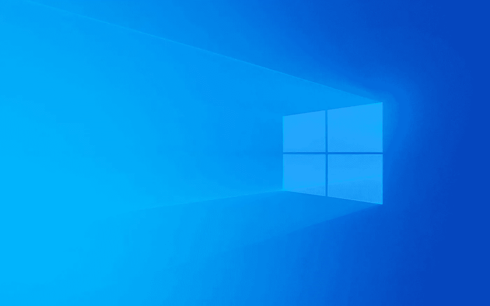

# 因为 Windows 11，Windows 10 现在成了定时炸弹

> 原文：<https://medium.com/geekculture/because-of-windows-11-windows-10-is-now-a-ticking-bomb-121034f45f5?source=collection_archive---------1----------------------->

## 微软还没有考虑清楚这一点，这可能会让 Windows 7 的情况看起来像在公园散步

By setting extremely strict hardware requirements for Windows 11, Microsoft has created a very serious problem for itself and hundreds of millions of consumers. (Image: Microsoft)

有时候，只需要一封简单的两行长的邮件就能把一个人的思想引向某个方向——而这正是几天前在帮助一个…