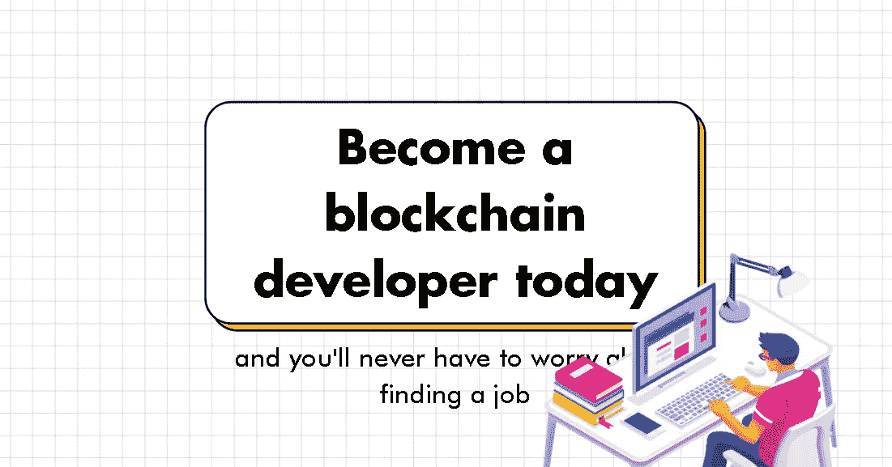
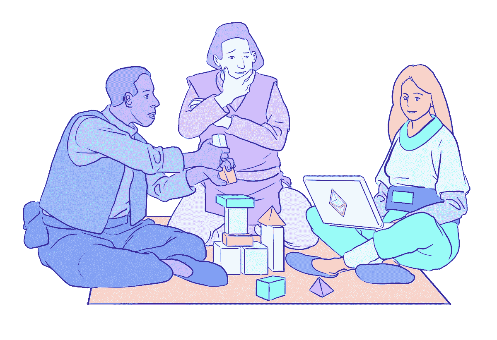
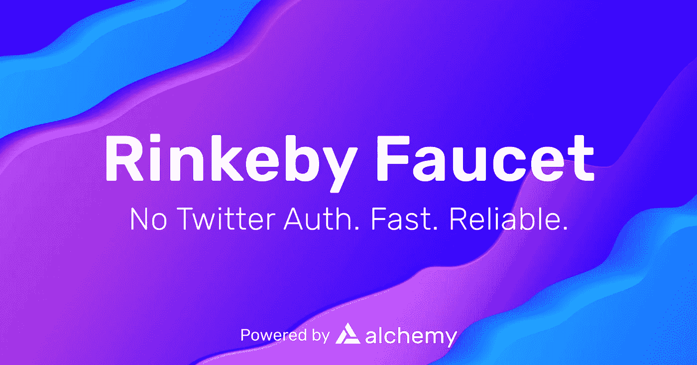

# 今天就成为区块链开发者，你永远不用担心找不到工作

> 原文：<https://medium.com/geekculture/become-a-blockchain-developer-today-5479f8c583f2?source=collection_archive---------18----------------------->

By Me :)

如果你想在一个有很大增长潜力和尖端技术的领域开始你的职业生涯，那么成为一名区块链开发者是一个不错的选择。

认证区块链开发者需求巨大，但数量不多。以下是一些提示、指导性问题和资源，让你开始进入兔子洞:

# 什么是扎实？

*Solidity 是以太坊项目的贡献者于 2014 年发布的一种面向对象的高级编程语言*。它被用来创建智能合同和自动化交易的区块链。这是进入区块链发展必须学习的语言。

FreeCodecamp 为[免费](https://www.freecodecamp.org/news/learn-solidity-blockchain-and-smart-contracts-in-a-free/)提供了一个很棒的课程。但是这里有一些其他的事情你可以很快了解到。

## 坚固是什么样子的？

Solidity 是一种精简的静态类型编程语言，支持继承、库和复杂的用户定义数据。

它类似于 ECMAScript (JavaScript ),带有一些 C++和 Python 的味道。

## Solidity 是怎么跑的？

Solidity 语言本身是一个工具，当编译时，它被翻译成机器级字节码，可以在区块链节点上运行的以太坊虚拟机(EVM)上执行。

另一种能做同样事情的语言是 Serpent。

# 什么是以太坊虚拟机(EVM)？

EVM 不能以人们可能指向云的方式来描述，但它确实作为一个单一的实体存在，由数千台运行以太坊客户端的计算机维护。

在这里阅读更多:

# 以太坊虚拟机是确定性的

给定一个输入，在 EVM 上运行的 Solidity Smart 契约将总是产生相同的输出。

这种确定性的要求就是你在 Solidity 语言中看不到“random()”函数的原因。

## 为什么决定论必不可少？

因为区块链要发挥作用需要所有区块就智能合约的结果达成一致，并达成共识。

随机数之类的东西会改变结果，打破共识，导致网络中断。

# Solidity 在哪里存储数据？

以太坊虚拟机(EVM)让我们可以访问:
-堆栈。
-记忆。
-存储。

让我们简单地探索一下👇

## 在堆栈中存储数据

堆栈是一个内部空间，临时变量存储在 32 位的槽中。

它通常用于值类型函数，以及需要立即处理其值的变量。

## 在存储器中存储数据

内存是一个字节数组，槽大小为 256 位(32 字节)。

用于仅在函数执行期间存储临时数据，之后，数据将被删除。

## 在存储器中存储数据。

存储是一个键值存储，数据永久保存在其中。

存储中的数据写在区块链上，在函数调用和事务之间可用。

将数据写入存储是有成本的。

# 在扎实中发展是有成本的？

是也不是。

部署智能合约时，您有两种选择:
-在 Testnnet 上部署(免费)。
-在主网上部署(费用气体)。

我们来看看有什么区别，有什么气。

# Mainnet vs Testnet

Mainnet(主网络)是实际交易发生的功能区块链

Testnet(测试网络)—是用于测试的替代区块链。Testnet 令牌独立于实际令牌，没有任何价值。

# 坚实的代价——汽油。

在以太坊主网上使用 Solidity 需要支付额外的费用。

有些是基于以太气系统，该系统要求向矿工支付保护区块链网络的费用，以便代码可以在其上安全运行。

## 气体是什么？

实际上，燃气是在以太坊区块链进行交易所需的费用。

以太坊中的每一项操作，无论是交易还是智能合同执行，都需要一定量的 gas。

## 天然气是如何定价的？

天然气价格以 gwei 为单位。

Gwei 是乙醚分数的单位，你可以说你的气体值 1 gwei，而不是说你的气体值 0.000000001 ETH。

天然气价格由区块链的供求关系决定。

# 天然气决定了智能合同的性能。

每使用一个存储槽都要付费，因此在 mainnet cost gas 上可靠地执行操作。

执行许多交易的昂贵的智能合约不太可能被长期使用。

## 我需要支付多少汽油？

这取决于网络的混乱程度。

默认:
-占用一个 256 位存储槽- > 20k 气。
-改变一个已经被占用的槽的值- > 5k 气体。
——写一个字来记忆——>三气。

# 测试网没有气体吗？

号码

你仍然需要付费，但你将使用没有价值的虚拟代币，你可以通过水龙头获得，如:

[rinkebyfaucet.com](https://www.rinkebyfaucet.com/)

# 一般来说，学习 Solidity 和 Web3 的一个好方法是加入一个社区。

Buildspace 是一个很好的工具，也是你能在 Twitter 上找到的任何开发工具。

# 学习 Solidity 的最佳资源之一是游戏化的编程课程

学习如何开发智能合同，同时创建一个僵尸工厂，开始你的世界统治计划。

[cryptozombies.io](https://cryptozombies.io/)

# 结论

学习可靠性和智能联系人是开创性的，可能是你在 2022 年能做的最好的投资。

从小做起，开发项目，持之以恒。

读完这篇文章和保存这里的资源后，你不会学到什么是可靠，但是如果你有开发背景，你可以很快学会，如果你是开发新手，你需要耐心。

# 你有其他区块链发展学习资源或指南吗？

## 👇在那里对它们进行注释，以便其他人可以看到它们

> 👋**在[媒体](/@pooriaarab)—[LinkedIn](https://www.instagram.com/pooria.arab/)—[Twitter](https://twitter.com/pooria_arab)—[insta gram](https://www.instagram.com/pooria.arab/)—[抖音](https://www.tiktok.com/@pooria.arab)**
> 
> 更多关于 Web3，Crypto，NFTs，DeFi 等的好东西…
> 
> 点击获取 NFT 发布战略