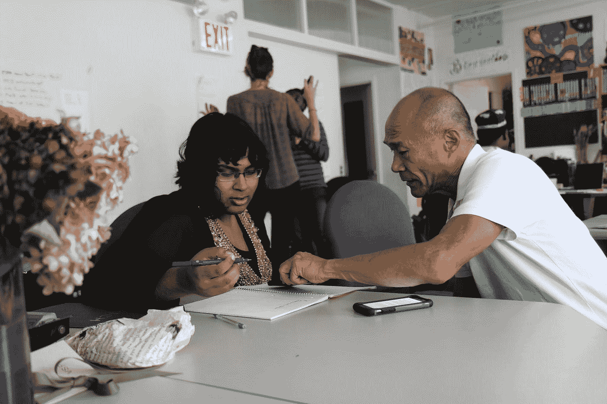

# 成为一名拥有高级思维的高级工程师

> 原文：<https://medium.com/geekculture/become-a-senior-engineer-with-a-senior-mindset-bbc1578b2971?source=collection_archive---------11----------------------->

## 工程是一个需要很多耐心和努力工作的职业，与其他职业相比，它的心态有些不同。

[https://unsplash.com/photos/oc_XTqWezp4](https://unsplash.com/photos/oc_XTqWezp4)

> 所有内容都直接取自瑞士银行的公共简讯，这只是为了展示和讨论他的文章和电子邮件的摘录。