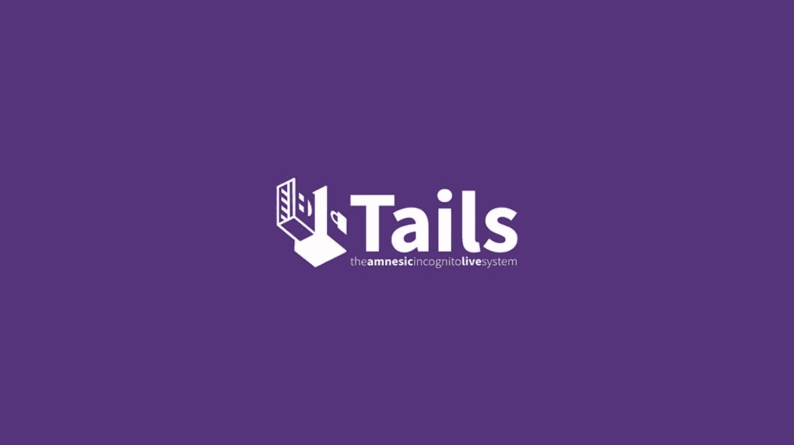

# 使用 tails 操作系统变得匿名和不可追踪

> 原文：<https://medium.com/geekculture/become-anonymous-and-untraceable-with-tails-os-9823ceee4770?source=collection_archive---------5----------------------->

在这篇文章中，我们将讨论什么是 tails 以及如何安装等等。

# 什么是尾巴？

Tails，或称失忆匿名直播系统，是一个基于 Debian 的 Linux 发行版，旨在保护隐私和匿名。它只通过匿名网络 Tor 连接到互联网。该系统被设计为作为一个…