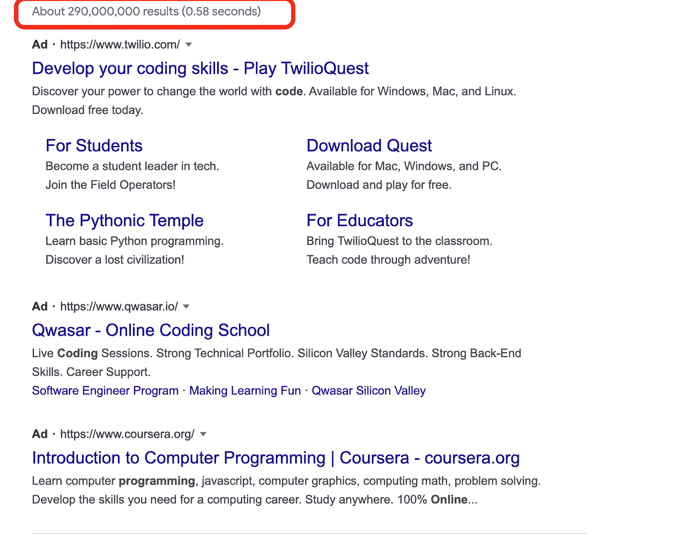

# 在参加编码训练营之前，你需要知道以下几点

> 原文：<https://medium.com/geekculture/before-going-to-coding-bootcamps-here-is-what-you-need-to-know-52744e07851?source=collection_archive---------17----------------------->

www.nerdsplus.net

所以你想学编码？嗯，太好了！如果今天你在谷歌上搜索，猜猜你会得到多少结果。

2.9 亿！！！

与十年前我自学编码的时候相比，在线编码学习资源的数量和质量都要好得多。

许多人想学习如何编码，因为现在工作对它的需求很大。但是在你问编码课程是否是你最好的选择之前，有几件事你需要考虑。

让我们先来看看为什么你应该参加编码课程？

*   它会让你更好地理解材料和编码的概念。
*   它还会让你使用你在编程课程中学到的东西，比如新的工具和语言。
*   当你迷路或不知道如何解决问题时，它会为你提供一个社区来支持你。

在报名参加训练营之前，请三思以下问题。

# **你的最终目标是什么？**

你只是想在小公司有一份工作吗？

或者你真的想进入谷歌/脸书(Meta)/亚马逊——这些大公司…

从小做起不代表失败。它能给你带来耐心。你可以花更多的时间在现实世界中学习和磨练你的技术技能。如果这是你的第一份工作，你刚刚开始你 30 年的职业生涯，没有必要匆忙。

在大型科技公司，[的招聘策略](/nerdsplus/unveil-the-hiring-process-in-high-tech-companies-for-software-engineers-84dd7730e4e0)与中小型科技公司不同。它对解决编码问题有更高的门槛和要求。你需要为此做好准备…

在线课程可以帮助你提高编程语言，但对你学习如何解决算法问题几乎没有帮助。你得从数据结构/算法类/书籍/网上资料里学。对于招聘公司来说，这是一个重要的里程碑，可以将候选人分成不同的层次。

如果你没有计算机系毕业生的能力，不要自责。现实世界的工作不是一纸证书就能表现出来的。而是你利用自己的时间和技能能给公司带来多少价值。

# 你有足够的时间吗？

在参加编码课程之前，应该考虑的最重要的因素是你的**可用性**。如果你全职工作或有其他义务，你将需要确保你有时间奉献给你的课程。学习编码是一个长期的承诺，需要你专注。没有专注，就没有掌握。无论你想学什么技能，都需要专门的练习时间。

> 学习可以快速而机械地进行，但是内化需要时间，很多时间…

尽可能多地编写代码。从错误中吸取教训。

尝试使用不同的解决方案来解决问题。

尽量给自己更多的功能要求。

学习是通过不断的失败。

我花了 6 个月的时间学习 java。

我花了 12 个月学习数据结构，做完 500+ Leetcode 题。

我花了五年时间才获得谷歌高级软件工程师的职位。

所以没什么好急的，我的朋友。

# 开始之前先学习基础知识

语言只不过是一种你可以用来和电脑交流的工具…

尽量不要通过学习 C++或 C 来打击自己，让自己的生活更有挑战性和难度。试着说一些人类可读的语言，先让电脑按照你想要的运行。Javascript 或 Python 可以帮助你开始与计算机对话。它们更容易读和写。并且便于您完成数据分析或 web 开发项目。

有几万多个问题和 bug 有些人之前已经遇到过了。所以我打赌你会在网上找到引人注目的错误或漏洞的答案。你可以节省时间，不用用头撞墙问自己——为什么我错了？

# 终极公式

这是帮助你获得软件工程师职位的终极公式。如果你可以利用网上的免费资源完成所有这些，就没有必要参加任何训练营。

> 语言+数据结构+项目+白板面试练习=工程报价

在面试准备阶段，你可能会跳过一些项目，但你很快就会意识到你没有能力做好这份工作，因为你只知道如何解决算法问题。

没有太多的时间让你在实际工作中提升和学习。你的经理和公司期望一个合格的软件工程师。他们希望你写出高质量的代码，修复 bug。这意味着你可能需要在周末继续学习，直到你对日常工作感到舒适为止。我得到了这些教训。

我不希望我亲爱的读者们，你们，重复十年前我战胜了什么挑战。这就是我写这篇文章的原因。祝你好运！

回头再聊，

书呆子+