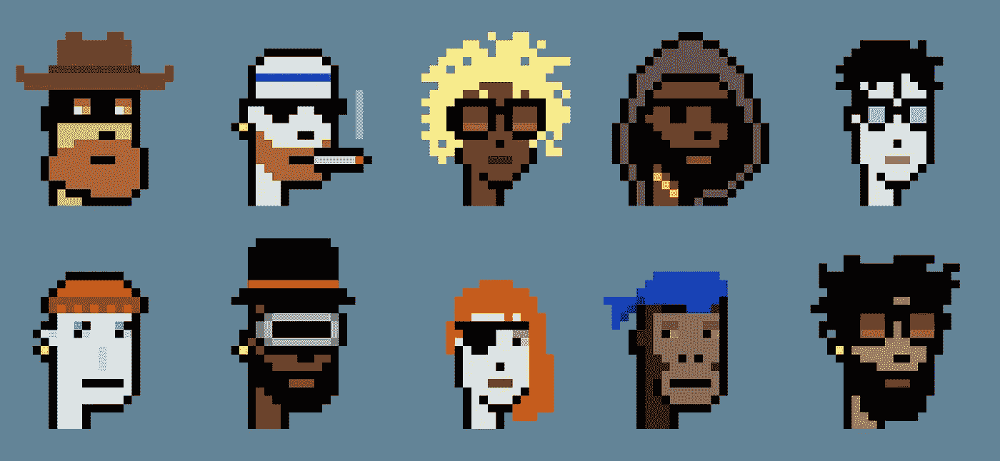

# NFTs 初学者的错误

> 原文：<https://medium.com/geekculture/beginner-mistakes-in-nfts-5d56987addb1?source=collection_archive---------9----------------------->

## 不幸的是，所有初学者现在都在做这些

[Punks](https://www.larvalabs.com/cryptopunks)

如果你一直在关注 NFT 空间，希望你和我一样被灌输了非功能性思维，对你来说也很明显，非功能性思维不是一时的时尚，而是会一直存在下去。如果你还不了解 NFTs，[这篇文章](https://levelup.gitconnected.com/what-are-nfts-and-why-do-billionaires-love-them-153cb199ff89)会有所帮助。每周我们都会听到像史努比·道格、罗根·保罗、吉米·法伦和里奇·基德这样的名人进入…