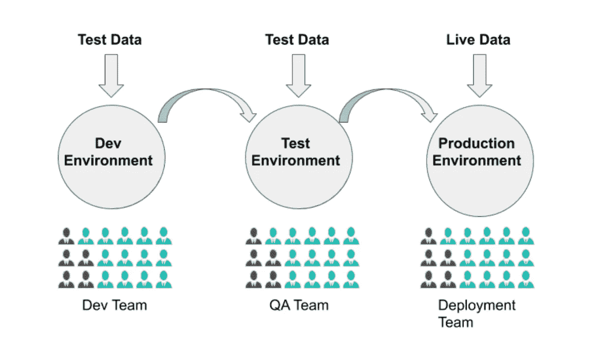

# 初学者指南:数据工程中的开发生命周期

> 原文：<https://medium.com/geekculture/beginners-guide-development-life-cycle-in-data-engineering-dfbc6d3a4392?source=collection_archive---------5----------------------->

写这篇文章的目的是描述数据工程环境中的开发生命周期。我试图描述维护不同环境和部署过程的重要性。

Source: [link](https://docs.workato.com/recipe-development-lifecycle/rdlc-guide-planning.html#defining-environments-promotion-criteria-and-responsibilities)

任何软件或数据工程开发团队都需要一个适当的部署策略来将代码从较低的环境迁移到较高的环境…