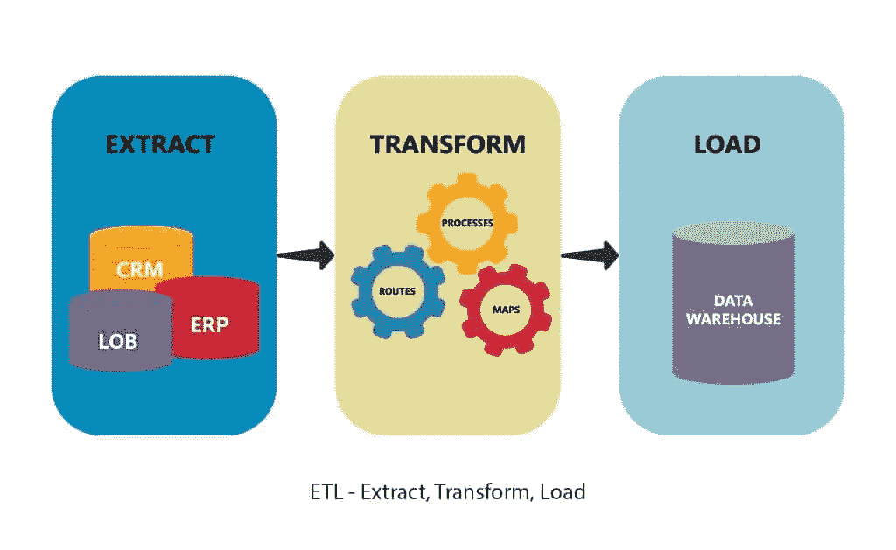

# 初学者指南:提取转换负载(ETL)行动手册—完全和增量负载

> 原文：<https://medium.com/geekculture/beginners-guide-extract-transform-load-etl-playbook-full-and-incremental-load-1c2e2b1ca647?source=collection_archive---------7----------------------->

## *目的:本文的目标是给出一些与数据工程相关的 ETL 基础知识的介绍性指南。*

Reference: [https://www.astera.com/type/blog/etl-vs-elt-whats-the-difference/](https://www.astera.com/type/blog/etl-vs-elt-whats-the-difference/)

数据工程中最重要但经常被忽视的核心方面之一是 ETL 管道的创建。与……