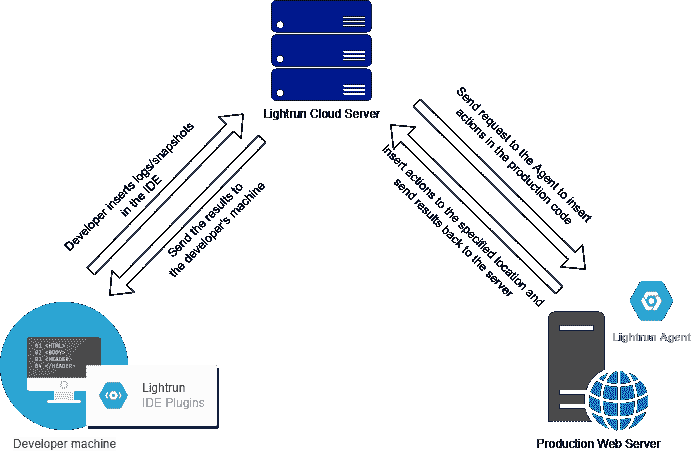
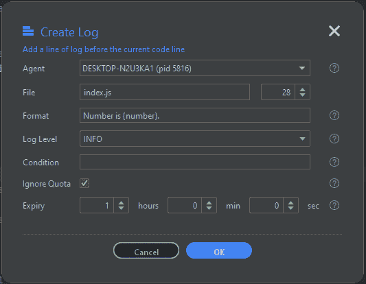
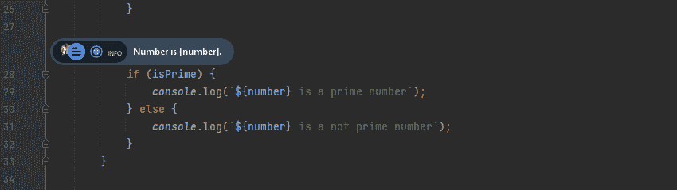
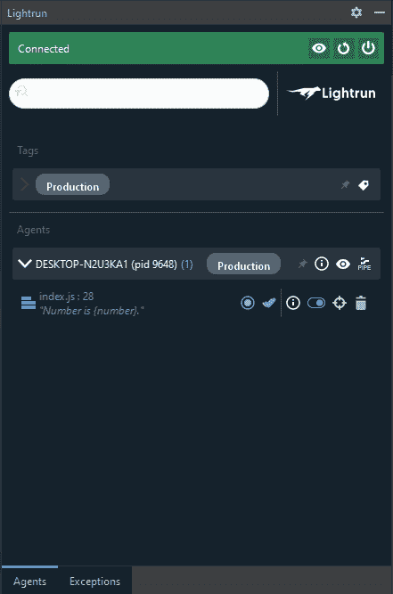
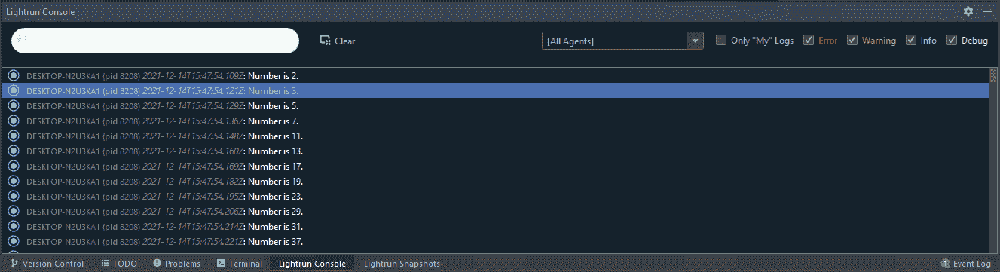
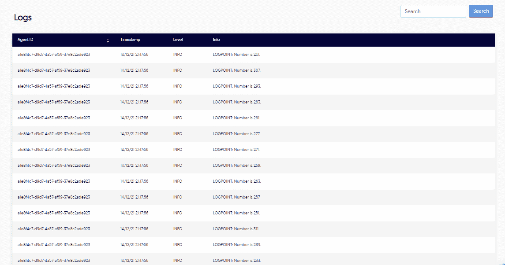
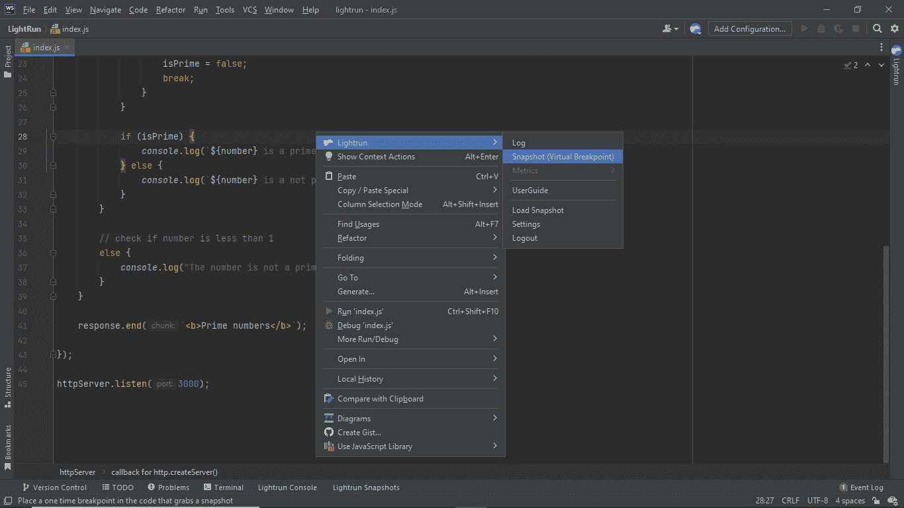
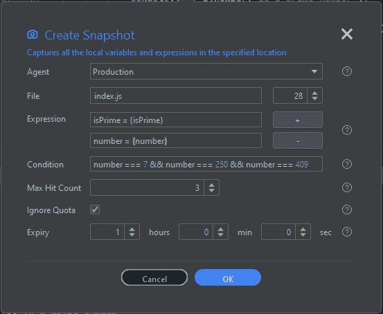
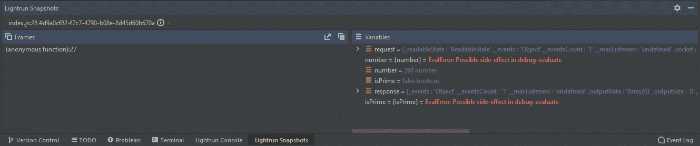
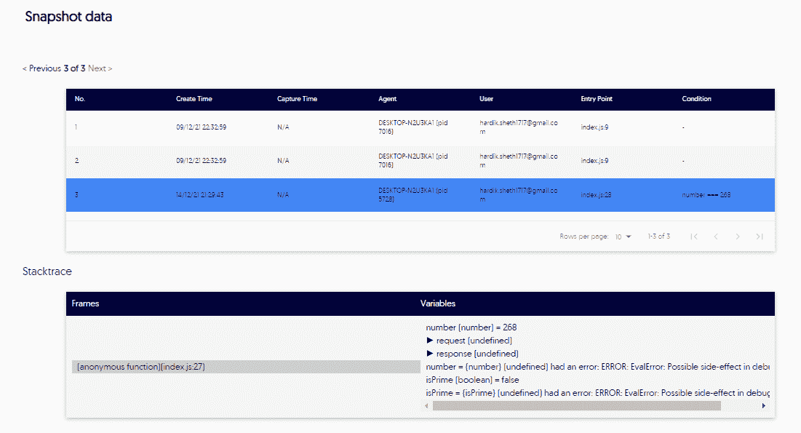

# NodeJS 应用程序调试初学者指南

> 原文：<https://medium.com/geekculture/beginners-guide-to-debugging-in-nodejs-applications-6f2120d9184e?source=collection_archive---------9----------------------->

[Photo](https://unsplash.com/photos/gTs2w7bu3Qo) by [Nubelson Fernandes](https://unsplash.com/@nublson) on Unsplash

作为开发人员，我们理解调试的重要性；我们需要调试来识别代码中的逻辑错误。现在，ide 提供了在本地机器上调试源代码的工具，这非常有用。但是，如果您想调试运行在您的生产或登台环境中的代码，该怎么办呢？我们需要一些工具，如远程调试器，可以远程调试我们的代码。

开发人员在生产中面临许多问题。有时，不进行日志记录或跟踪很难解决这些问题。我们需要在我们的开发环境中重现这个问题。但是我们也可能无法在开发中重现这个问题。那我们能做什么？

我们必须添加日志，这导致重复部署我们的应用程序。虽然这能解决问题，但会浪费我们很多时间。用这种方法解决问题可能需要几个小时到几个星期。

在本文中，我们将使用一个名为 [Lightrun Cloud](https://lightrun.com/cloud/) 的免费工具来介绍 NodeJS 中的调试。

Lightrun 是一个开发者本地的可观察性平台。那么，什么是可观测平台呢？可观察性是一种允许开发人员主动调试他们的应用程序代码的技术。可观察性平台使开发人员能够向应用程序添加日志、指标和跟踪，从而轻松调试他们的应用程序，并克服与安全性和性能相关的问题。

Lightrun 允许我们向应用程序添加日志、指标和跟踪，并提高生产率和代码级的可观察性。我们甚至可以直接从 IDE 中实时地将日志添加到我们的生产环境中。

# Lightrun 的工作原理

每当开发人员向应用程序代码添加日志、指标或快照时，Lightrun 插件或 CLI 都会使用 HTTPS 协议向 Lightrun 管理服务器发送请求。当 Lightrun 管理服务器收到请求时，它会将其发送到 Lightrun 代理。代理通过 Lightrun 沙盒验证更改的稳定性和安全性，并在运行时将操作插入到应用程序中。代理将操作的结果发送回 Lightrun Management Server，Lightrun Management Server 将结果返回给开发人员 IDE。这就是开发人员如何在任何环境(生产/登台)中动态地将动作添加到源代码中。

# 正在调试

这里，我们将创建一个简单的素数应用程序，并在应用程序中插入 Lightrun 操作。我们还将在 Lightrun 管理门户中看到日志。

# 先决条件

*   下载并安装[网络风暴](https://www.jetbrains.com/webstorm/)。
*   在官方网站的[上创建一个新的 **Lightrun Cloud** 账号。](https://lightrun.com/)
*   安装 **Lightrun** **客户端**插件，从 [JetBrains Marketplace](https://docs.lightrun.com/plugin/) 登录 WebStorm。
*   在您的机器上安装 NodeJS。

创建一个简单的素数应用程序并添加 Lightrun 代理

让我们创建一个简单的应用程序来检查数字是否是质数。可以从 [GitHub](https://github.com/HardikSheth1717/node-lightrun-tutorial) 下载源代码。

**Step-1**创建一个新的 NodeJS 应用程序，并向其中添加一个 **index.js** 文件。你的代码中应该有两个文件: **index.js** 和 **package.json** 。

**Step — 2** 将下面的代码复制粘贴到 index.js 文件中。

From [https://carbon.now.sh/](https://carbon.now.sh/)

将以下配置添加到 package.json 文件中。

From [https://carbon.now.sh/](https://carbon.now.sh/)

**步骤 4** 现在，我们可以在 IDE 的终端中使用“**NPM start”**命令，并在浏览器中打开 [http://localhost:3000](http://localhost:3000) 来运行我们的应用程序。我们应该在 IDE 的终端窗口中看到日志语句，我们已经在控制台中记录了这些语句。

现在，我们有了一个正在运行的应用程序。因此，让我们将 Lightrun 代理添加到我们的应用程序中。我们将为 Lightrun 添加一个 NodeJS 代理。我们可以在 WebStorm 的终端窗口中执行以下命令，从 NPM 安装代理。

现在，我们打开 index.js 文件，并在文件顶部添加以下代码。

From [https://carbon.now.sh/](https://carbon.now.sh/)

我们可以从管理门户获得 company 和 lightrunSecret。在门户上，转到主页>安装代理> NodeJS 部分。我们应该看到上面的代码片段与我们的公司和 lightrunSecret。

**添加日志**

我们可以将日志直接添加到正在运行的应用程序中。让我们使用“npm start”命令运行我们的应用程序(不要在浏览器中打开)。现在，我们有了一个正在运行的应用程序。因此，我们可以使用 Lightrun 插件向我们的应用程序添加日志。我们右键单击要添加日志的行。然后，选择 **Lightrun > Log** 上下文菜单。

现在，应该会出现“**创建日志”**弹出窗口。点击“**前进”**按钮，您应该会看到以下弹出窗口。输入如下图所示的详细信息。这里，Format 是我们想要打印到日志中的消息。我们可以指定花括号之间的表达式，就像我们打印一个数字变量的值一样。点击**确定**按钮。

现在，Lightrun 将在指定行插入一个日志。你应该会在这条线上看到一个标记。

Lightrun 插件还会向我们显示关于插入日志的详细信息。

现在，是时候在浏览器中打开我们的应用程序了，这样我们就可以执行应用程序代码并查看日志捕获的详细信息。在浏览器中打开应用程序后，我们应该会在 Lightrun 控制台窗口中看到捕获的日志。

我们还可以在 Lightrun 管理门户上看到这些日志。导航到实体>日志，我们应该能够看到如下图所示的日志。

恭喜你！我们已经使用 Lightrun 向正在运行的应用程序添加了日志。现在我们已经成功地添加了日志，让我们在应用程序中添加一些快照。

**添加快照**

快照是一次性断点，不会破坏我们的应用程序代码。快照在运行时收集堆栈跟踪，而不会中断应用程序。右键单击要添加快照的行，然后选择 Lightrun >快照上下文菜单。

现在，应该会出现“创建快照”弹出窗口。单击“高级”按钮，您应该会看到下面的弹出窗口。输入如下图所示的详细信息。这里，**表达式**是我们想要评估其值的语句/变量，而**条件**指定了我们想要评估表达式的标准。点击**确定**按钮。

我们应该能在这条线上看到一个标记。在浏览器中打开应用程序后，我们应该会在 Lightrun Snapshots 窗口中看到捕获的快照。

我们还可以在 Lightrun 管理门户上看到这些快照。导航到实体>快照数据，您应该会看到如下图所示的快照。

# 结论

我希望你喜欢这篇教程，并且学到一些关于调试的新知识。Lightrun 有助于跟踪生产应用程序中的问题，而无需重新部署源代码。它节省了大量时间来解决生产/试运行环境中的问题。我们还可以将 Lightrun 与诸如 NewRelic 或 DataDog 之类的 APM 集成。