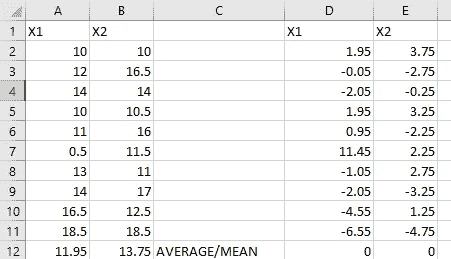
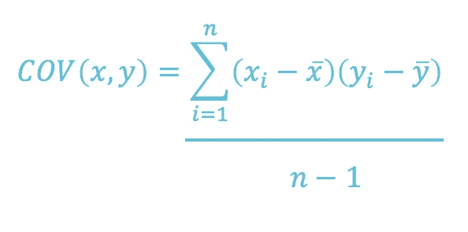
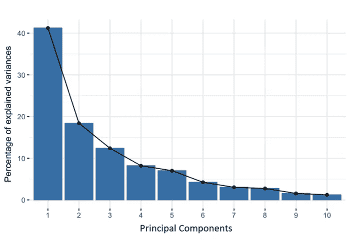
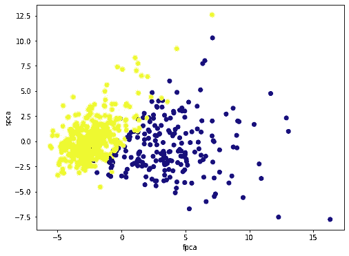

# 主成分分析初学者指南-降维

> 原文：<https://medium.com/geekculture/beginners-guide-to-principal-component-analysis-dimensionality-reduction-109c742d3ff9?source=collection_archive---------24----------------------->


Photo by [Myriam Jessier](https://unsplash.com/@mjessier?utm_source=medium&utm_medium=referral) on [Unsplash](https://unsplash.com?utm_source=medium&utm_medium=referral)

> 对于你的机器学习问题，你是否有太多的变量，并且对如何从这些变量中获得最佳效果感到困惑？

主成分分析可能是你必须考虑的一个。PCA 背后的基本直觉是，你会用数学从一个大的池中提取重要的变量。基本上，它将高度相关的变量组合在一起，形成一个较小的数据集。换句话说，它被称为**“主成分”**，由数据中最大方差的变量组成。

第一步是从每个样本数据(变量)中减去平均值。



Normalized Data

下一步是找出上述数据的协方差矩阵。应用下面的公式



Covariance formula

接下来，我们计算协方差矩阵，最后计算特征向量和特征值。一旦我们得到了本征参数，我们就可以进行重新定向和绘制值。这可以让我们了解变量之间的关系有多密切。

尽管 PCA 被使用并且有时被重新发明，但它本质上是许多学科中的一种统计技术，因此它的大部分发展是由数学家完成的。

这意味着“**保留尽可能多的多样性**”转化为寻找新的变量，这些变量是原始数据集中那些变量的线性函数，连续地**最大化方差，并且彼此不相关。**寻找这样的新变量，主成分(PCs)在求解特征值/特征向量问题时减少。关于主成分分析的最早文献可以追溯到 Pearson [1]和 Hotelling [2]，但是直到几十年后电子计算机变得广泛可用，才使得在不小的数据集上使用主成分分析成为可能。从那时起，它的使用增加了十倍，并且在各种不同的学科中开发了许多变体。关于这个主题已经写了很多书[3，4]。主成分分析的主要用途是描述性的，而不是推断性的；一个例子将说明这一点。

数学太多？我现在将从我的 GitHub 存储库中提供一个 python 笔记本，它对从 [sklearn](https://scikit-learn.org/stable/modules/generated/sklearn.preprocessing.StandardScaler.html) 导入的数据集执行 PCA。



*Percentage of Variance for each by Principal component*

```
dict_keys(['data', 'target', 'frame', 'target_names', 'DESCR', 'feature_names', 'filename'])
```

转换成标准标量并初始化我们需要的组件数量(在本例中，我将变量减少到 2 个)



Correlation between the two variables

# **参考文献**

1.  Pearson K. 1901 关于最接近空间点系统的直线和平面。菲尔。玛格。 **2** ，559–572。([doi:10.1080/14786440109462720](http://dx.doi.org/10.1080/14786440109462720))[交叉引用](https://royalsocietypublishing.org/servlet/linkout?suffix=e_1_3_6_2_2&dbid=16&doi=10.1098%2Frsta.2015.0202&key=10.1080%2F14786440109462720)，[谷歌学术](http://scholar.google.com/scholar_lookup?hl=en&volume=2&publication_year=1901&pages=559-572&journal=Phil.+Mag.&author=K+Pearson&title=On+lines+and+planes+of+closest+fit+to+systems+of+points+in+space)
2.  Hotelling H 将复杂的统计变量分析成主要成分。 *J. Educ。心理学。* **24** ，417–441，498–520。([doi:10.1037/h 0071325](http://dx.doi.org/10.1037/h0071325))[交叉引用](https://royalsocietypublishing.org/servlet/linkout?suffix=e_1_3_6_3_2&dbid=16&doi=10.1098%2Frsta.2015.0202&key=10.1037%2Fh0071325)，[谷歌学术](http://scholar.google.com/scholar_lookup?hl=en&volume=24&publication_year=1933&pages=417-441&journal=J.+Educ.+Psychol.&author=H+Hotelling&title=Analysis+of+a+complex+of+statistical+variables+into+principal+components)
3.  杰克逊·JE。1991 年*主要部件用户指南*。纽约州纽约市:威利。[交叉引用](https://royalsocietypublishing.org/servlet/linkout?suffix=e_1_3_6_4_2&dbid=16&doi=10.1098%2Frsta.2015.0202&key=10.1002%2F0471725331)，[谷歌学术](http://scholar.google.com/scholar_lookup?hl=en&publication_year=1991&author=JE+Jackson&title=A+user%E2%80%99s+guide+to+principal+components)
4.  乔利弗。2002 年*主成分分析*，第二版。纽约州纽约市:斯普林格出版社。[谷歌学术](http://scholar.google.com/scholar_lookup?hl=en&publication_year=2002&author=IT+Jolliffe&title=Principal+component+analysis)