# 算法交易 Python 技术分析初学者指南

> 原文：<https://medium.com/geekculture/beginners-guide-to-technical-analysis-in-python-for-algorithmic-trading-19164fb6149?source=collection_archive---------1----------------------->

# 识别烛台模式&应用技术策略在 Python 中构建交易算法

**CANDLESTICK PATTERNS & TECHNICAL ANALYSIS** (Image Source: [Unsplash](https://unsplash.com/photos/fiXLQXAhCfk))

有两种主要的方法来分析任何股票——基本面分析和技术分析。

基本面分析通过观察各种可能影响股票价格的因素来研究公司过去和现在的表现，如公司的损益表、现金流、资产负债表、管理流程等。另一方面，技术分析只使用过去的价格和交易量来识别股票的模式/趋势。

本文重点介绍在技术分析中应用的一些简单而强大的技术。这里解释的所有概念都适用于任何交易工具(如股票、货币、期权、指数或密码)。

实际上，单独应用这些技术可能不会产生好的结果。在做出买入/卖出/持有决定之前，分析师通常会综合运用这些技巧。使用编程方法，第一级分析可以自动化。

# 放弃

考虑范围内的主题，让我们从免责声明开始。

这篇文章仅用于教育目的。对于任何真实的用例，请自行决定使用它。

# 对你有什么好处？

当你读到这篇文章的结尾时，你应该已经(希望)学会了下面的交易技巧:

*   **如何*取股票数据***
*   **如何实现&分析一些基本的*烛台模式*** -单烛台模式:丸博祖蜡烛、多奇蜡烛
    -多烛台模式:吞没、晨星/暮星模式
*   **如何应用几个流行的*交易指标/策略*使用 Python** -均线策略
    -相对强弱指标(RSI)指标
    -均线收敛发散(MACD)指标
    -布林线
*   **如何用 Python** 实现一个*简单的交易算法*

# 获取数据

这里，我们将重点使用从印度证券交易所，特别是国家证券交易所(NSE)获取的数据。也可以从任何其他交易所获取数据，唯一的标准是数据中应该包含 OHLC(开盘-盘高-盘低-收盘)信息。

在本例中，我们使用 nsepy Python 包获取 2021 年的 HDFC AMC 股票数据。

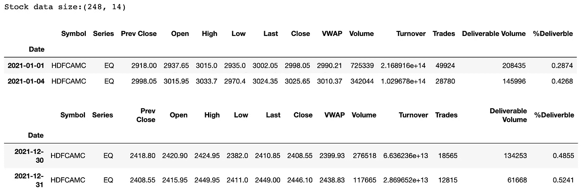

**HDFCAMC — 2021 data peek** (Image by Author)

股票数据适用于 2021 年的 248 个交易日。在本文中，我们将只使用 OHLC 数据来进行技术分析。

# 烛台&烛台图表

股票的开盘价、最高价、最低价和收盘价(OHLC)可以用一个烛台来表示。以下是烛台展示的快速总结:

*   绿色蜡烛:股票的收盘价高于开盘价
*   红烛:股票的收盘价低于开盘价
*   阴影部分:打开和关闭之间的区域(绿色/红色)
*   蜡烛芯:一天的最高点(顶部蜡烛芯)和最低点(底部蜡烛芯)

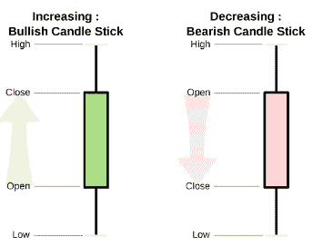

**Candlestick** — source [wiki](https://en.wikipedia.org/wiki/Candlestick_pattern#/media/File:Candlestick_chart_scheme_03-en.svg)

烛台图表是使用 plotly 包中的 graph_objects 绘制的。因为我们已经下载了每日数据，所以图表中的每个蜡烛线代表一天的 OHLC 值。

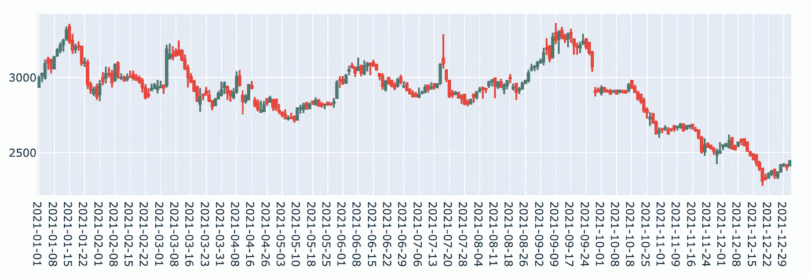

**Candlestick Chart — 2021** (Image by Author)

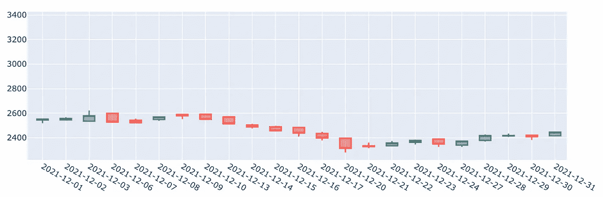

**Candlestick Chart — Dec 2021** (Image by Author)

# 烛台图案

对交易模式的关键见解可以从烛台中得出。用于分析的蜡烛数量从一个烛台到多个烛台不等。

这里我们将使用 [TA-Lib](https://mrjbq7.github.io/ta-lib/index.html) 库来识别烛台模式。

## Marubozu 蜡烛

*   一根灯芯缺失或两根灯芯都缺失的单个烛台
*   它表示股票的强弱(绿色)
*   这并不意味着趋势逆转

样本数据集中的 Marubozu 蜡烛:

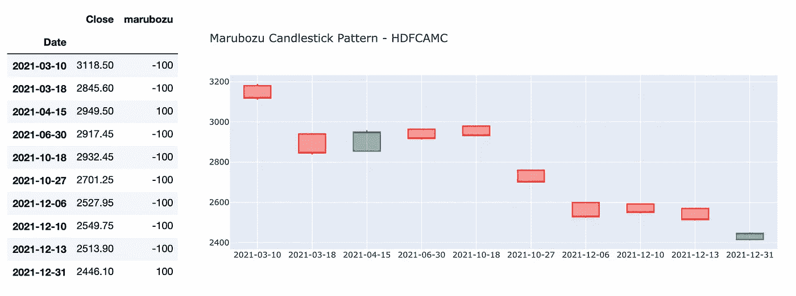

# 多奇蜡烛

*   单烛台有一个非常小的身体(打开和关闭几乎相同的价格)
*   表明犹豫不决——股票既有买家也有卖家
*   它通常表示横向运动

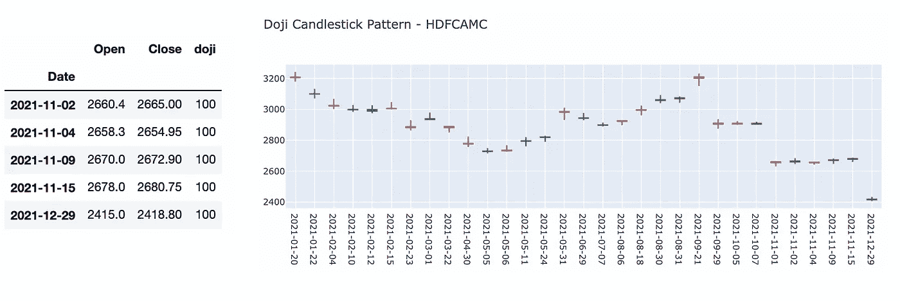

# 吞没烛台图案

*   多烛台模式-考虑两根蜡烛，其中第二根蜡烛比第一根蜡烛稍长，并将其吞没。
*   多头吞没形态→红烛、绿烛→买入信号
*   看跌吞没形态→绿烛、红烛→卖出信号

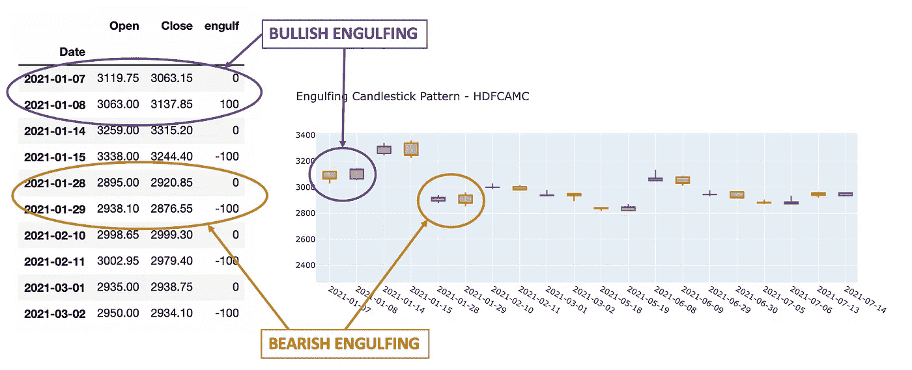

# 晨星/晚星图案

*   多烛台模式—考虑 3 个烛台
*   这些模式表明趋势逆转
*   晨星→红烛、多奇、绿烛→买入信号
*   晚星→绿烛、多奇、红烛→卖出信号

例如:DMART 股票

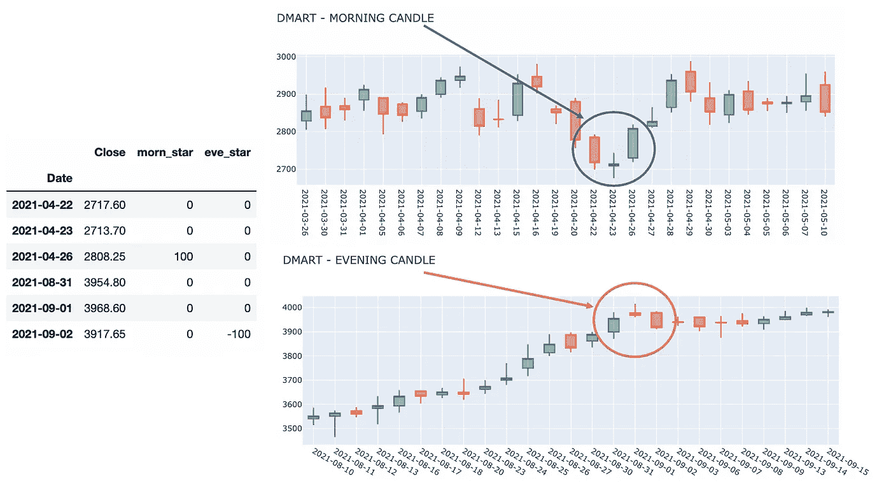

参考此链接，探索 TA-Lib 包中其他几种可用的模式识别器: [TA-Lib 模式识别](https://mrjbq7.github.io/ta-lib/func_groups/pattern_recognition.html)

# 交易策略/指标

除了烛台分析，还有各种其他技术/策略可以应用。下面解释了其中的一些策略。

## 移动平均策略

简单移动平均线(简称 sma)是最近‘n’天的平均股价。通过编程，这可以用一行代码来计算。

**20-day SMA** (Image by Author)

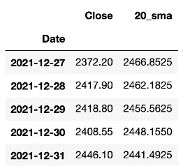

**20-day Simple Moving Average** (Image by Author)

**移动平均线对比策略**

其中一个交易策略是将当前股价与其前 n 天的移动平均线进行比较。通常使用 20 天、50 天和 200 天移动平均线。

> If、
> 当前收盘< 20 日 sma < 50 日 sma < 200 日 sma →买入信号
> 当前收盘> 20 日 sma > 50 日 sma > 200 日 sma →卖出信号

**移动平均交叉策略**

另一种策略被称为均线交叉策略，是绘制一条长期均线(例如:200 天均线)和一条短期均线(例如:20 天均线)。

> 一般来说，
> 如果短期 sma 从下方穿越长期 sma→买入信号
> 如果短期 SMA 从上方穿越长期 SMA→卖出信号

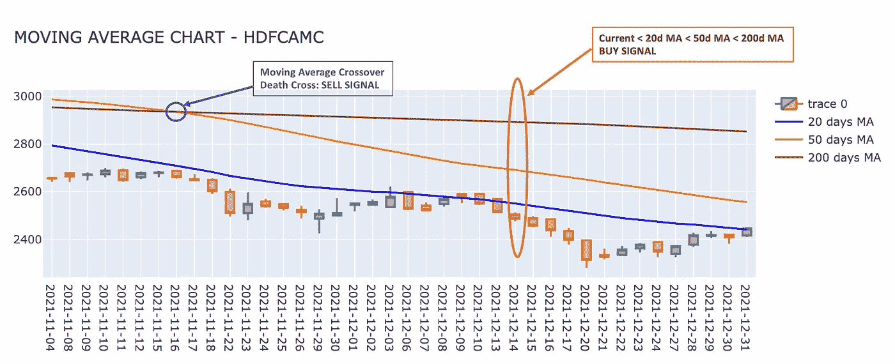

**Simple Moving Average — 20d, 50d, 200d** (Image by Author)

对于 HDFCAMC 股票数据，从 14–12–2021 年起，
收盘价>20-d SMA>50-d SMA>200-d SMA→买入信号。

同样，2021 年 16-11 日，
50 天 sma 从顶部→卖出信号穿越 200 天 sma(也称死亡穿越)。

移动平均值的数量和窗口周期是可配置的。有时会考虑指数移动平均线(EMA)而不是简单移动平均线(SMA)。与窗口期内较旧的日期相比，EMA 给予更接近当前日期的价格更大的权重。

## 相对强度指数(RSI)指示器

RSI 是一个受欢迎的技术分析指标，被许多交易者使用。它被用来分析股票的动量。它比较了最近的收益和损失。它给出了股票超卖或超买的指示。

数学上，RSI 可以计算如下。通常，计算 RS 值时会考虑 14 的窗口周期。

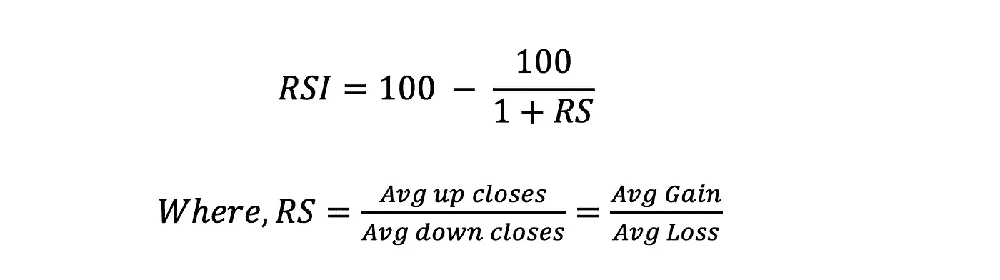

**RSI Formula** (Image by Author)

RSI 的值在 0 到 100 之间。

> **一般经验法则，** RSI < 30 表示超卖状态→买入信号
> RSI > 70 表示超买状态→卖出信号

从程序上讲，可以使用上述公式或 TA-Lib 来计算 RSI。

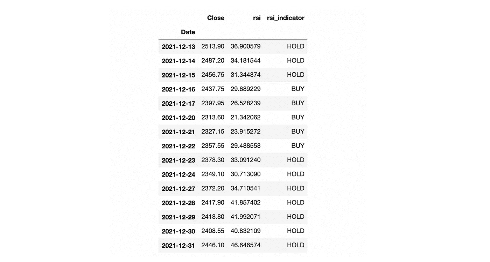

**RSI Indicator** (Image by Author)

通常 RSI 指标与其他指标一起使用，如移动平均线、MACD、交易量等，以达成买入/卖出的决定。

## MACD —移动平均收敛发散

MACD 是另一个简单而流行的动量指标，它可以根据股票的近期趋势提供有用的见解。它显示了两条移动平均线之间的关系。

它主要由 3 部分组成(这里提到的典型值):

*   MACD 线:12 日均线——26 日均线
*   信号线:MACD 线的 9 日均线
*   直方图:MACD 线-信号线

MACD 线会移动得更快，对价格变化更敏感。信号线对价格变化的反应会更慢，因此会更平滑。直方图的大小可以用来确定动量的强度。

通常交易者在 MACD 线和信号线之间使用双线交叉策略。

> 当 MACD 线从下方穿过信号线→买入信号
> 当 MACD 线从上方穿过信号线→卖出信号

如图所示，参数(12、26 和 9)是可配置的，并且可以改变。

下面是印度斯坦联合利华股票的价格图表和 MACD 图表。参考 git repo 获取完整的代码。

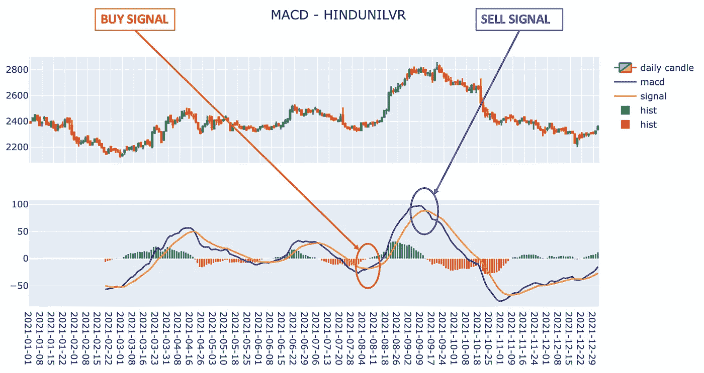

正如这里看到的，交叉点可以被认为是买入/卖出信号。与其他指标类似，在做出买入/卖出决定之前，最好将这些指标与其他策略结合起来。

## 布林线

布林线有助于解释股票的波动性。窄幅波动表明波动性低&宽幅波动表明股价波动性高。

它包括:

*   布林带上轨:移动平均线+ 2 个标准差
*   移动平均线:20 天简单移动平均线
*   布林线下轨:移动平均线— 2 个标准差

下面是使用 pandas 的滚动窗口函数计算布林线的简单实现。使用 TA-Lib 的 BBANDS 函数，这也可以简化为一行代码。

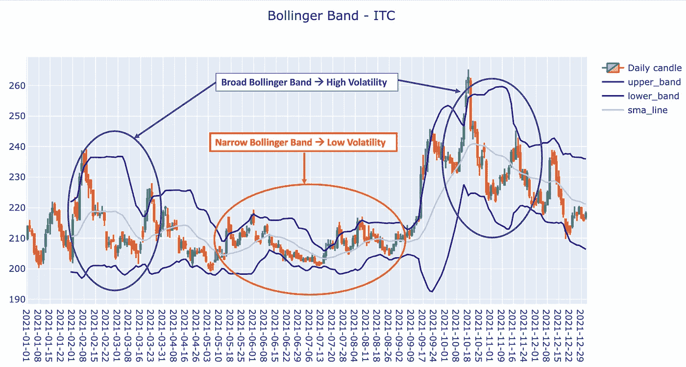

从图表中可以看出，当波段之间的距离较大时，股票价格波动较大(波动较大)，当波段较窄时，波动较小(波动较小)。

在 2 个标准差的情况下，假设所有价格波动的 95%将发生在该范围内(类似于正态分布中 95%的置信水平)。

# 构建一个简单的交易算法

一旦我们理解了如何在数据上应用单独的技术，我们就准备建立一个个性化的交易算法。

举个例子，让我们建立一个交易算法，它基于以下策略:

1.获取买入/卖出/持有指标:均线、MACD、吞没形态
2。对于买入/卖出信号，检查前 3 个时段的 RSI 值。
3。如果策略显示买入，RSI<lower _ threshold(40)→‘买入’
4。如果策略指示卖出且 RSI>upper _ threshold(60)→‘卖出’

为了减少代码混乱，这里只显示了高级代码流。参考 git repo 获取完整的代码。

**观察结果**

*   用这种基本算法，当在局部最小值时发出买入信号，在局部最大值时发出卖出信号时，结果相当不错。
*   买入后可能需要几个月才能发出卖出信号。耐心是关键。
*   在某些情况下，比如印孚瑟斯，2021 年没有买入信号。这是因为使用了较低的 RSI 阈值。
*   可以通过改变参数或添加更多指标来加强算法，从而进一步调整算法。

以下是在不同的 NSE 股票上运行该算法的结果。

**注意**:橙色线表示买入指标，紫色线表示卖出指标

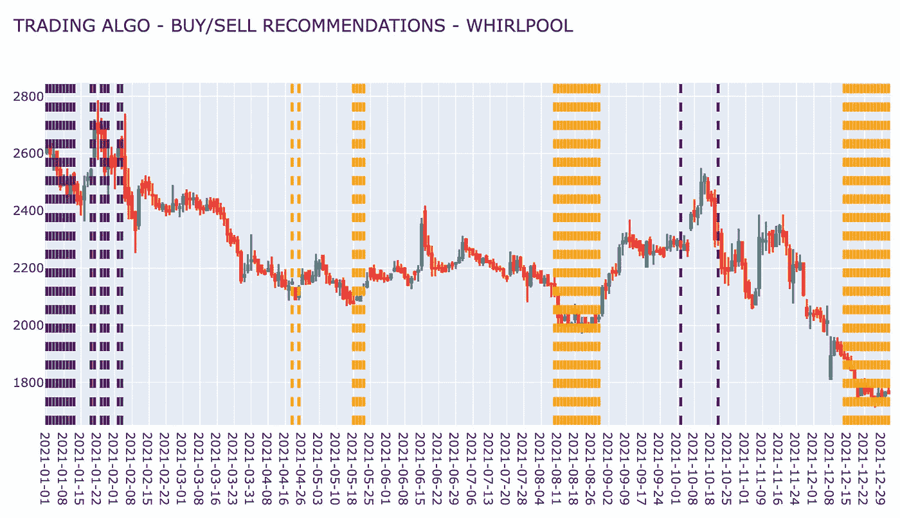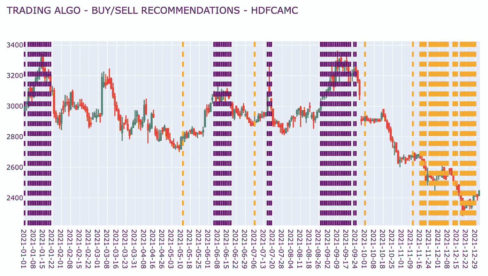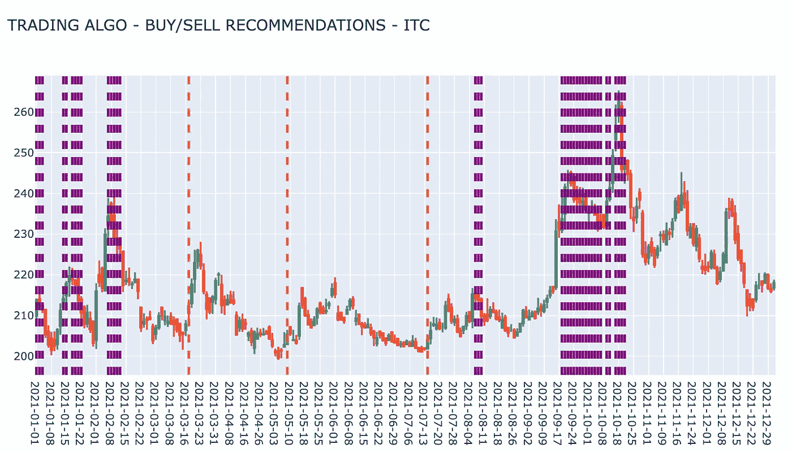

# 代码库

本文中使用的所有代码都可以在下面的 github 资源库中找到:[基础技术分析—代码](https://github.com/Lakshmi-1212/BasicTechnicalAnalysis.git)

对于编码爱好者来说，我希望这能帮助你开始并围绕它建立你自己的策略。

# 结论

没有固定的策略可以适用于所有股票。所有提到的策略和模式标识符只能提供方向指导。还有几个其他的非技术方面可以影响股票价格，但无法编码。

通过代码实现技术模式分析使交易者可以灵活地设计他们自己的算法，并自动执行股票的基本技术分析。

# 接下来呢？

由于大多数交易经纪人提供 API 来执行交易，我们可以创建一个交易机器人，它可以运行算法并自动进行交易。请注意，这可能是有风险的(除非该算法足够安全),并且应该仅出于教育目的进行实验。

另一种方法可以是使用机器学习算法，其中新特征可以从这里解释的技术指标中导出。可以用这些数据训练模型来预测未来。

稍后将详细介绍这一点！！在那之前，再见！！

## 如果“PYTHON+TRADING”让你着迷，那就看看这些吧…

*   *算法交易 Python 技术分析入门指南【你在这里】*
*   [*用 Python 构建一个基本的加密交易机器人*](/geekculture/building-a-basic-crypto-trading-bot-in-python-4f272693c375)

*   [*识别交易模式——交易者行为分析*](/geekculture/identifying-trading-patterns-behavioural-analysis-of-traders-5184dfa0350b)
*   [*股票基本面分析使用 Python*](/geekculture/fundamental-analysis-of-stocks-using-python-d5ad050e6372)